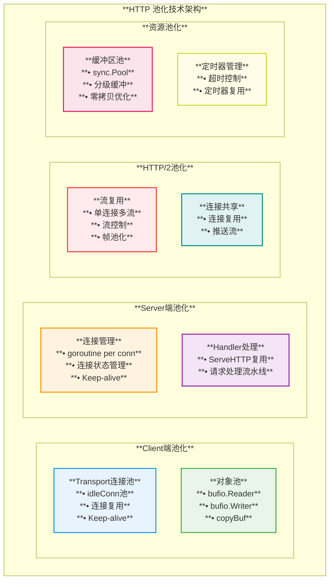
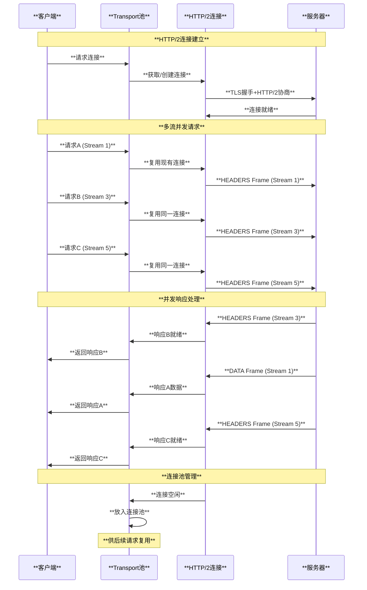
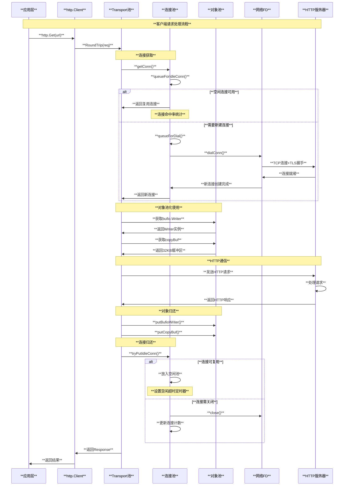

# Go 网络架构与 Netpoll 实现原理

## 概述

Go语言的网络模型采用了高效的事件驱动架构，通过netpoll机制实现了高性能的网络I/O处理。它将阻塞的网络操作转换为非阻塞的事件驱动模式，结合goroutine调度器，实现了对用户透明的异步网络编程模型。

## 网络架构总览

### 1. **Go网络整体架构图**

```text
┌─────────────────────────────────────────────────────────────────┐
│                      **Application Layer**                      │
│  ┌─────────────────┐  ┌─────────────────┐  ┌─────────────────┐ │
│  │  **net.Listen** │  │ **net.Dial**    │  │ **net.Conn**    │ │
│  │                 │  │                 │  │                 │ │
│  │ • **TCP/UDP**   │  │ • **Connect**   │  │ • **Read/Write**│ │
│  │ • **Unix Socket**│ │ • **Timeout**   │  │ • **Close**     │ │
│  │ • **HTTP**      │  │ • **Context**   │  │ • **SetDeadline**│ │
│  └─────────────────┘  └─────────────────┘  └─────────────────┘ │
└─────────────────────┬───────────────────┬───────────────────────┘
                      │                   │
┌─────────────────────▼───────────────────▼───────────────────────┐
│                    **Network Abstraction Layer**               │
│                                                                 │
│  ┌───────────────────────────────────────────────────────────┐ │
│  │                    **netFD Manager**                      │ │
│  │                                                           │ │
│  │  ┌─────────────────┐    ┌─────────────────────────────┐  │ │
│  │  │   **netFD**     │    │      **Address Mgmt**       │  │ │
│  │  │                 │    │                             │  │ │
│  │  │ • **pfd**       │    │ • **Local Addr**            │  │ │
│  │  │ • **family**    │    │ • **Remote Addr**           │  │ │
│  │  │ • **sotype**    │    │ • **DNS Resolution**        │  │ │
│  │  │ • **laddr**     │    │ • **Port Management**       │  │ │
│  │  │ • **raddr**     │    │ • **Interface Selection**   │  │ │
│  │  └─────────────────┘    └─────────────────────────────┘  │ │
│  └───────────────────────────────────────────────────────────┘ │
│                                                                 │
│  ┌───────────────────────────────────────────────────────────┐ │
│  │                 **Poll File Descriptor**                 │ │
│  │                                                           │ │
│  │  ┌─────────────────┐    ┌─────────────────────────────┐  │ │
│  │  │   **poll.FD**   │    │     **Operation State**     │  │ │
│  │  │                 │    │                             │  │ │
│  │  │ • **Sysfd**     │    │ • **rop** (Read Op)        │  │ │
│  │  │ • **pollDesc**  │    │ • **wop** (Write Op)       │  │ │
│  │  │ • **fdMutex**   │    │ • **fdmuR/W** (Mutexes)    │  │ │
│  │  │ • **isBlocking**│    │ • **closing** (State)      │  │ │
│  │  └─────────────────┘    └─────────────────────────────┘  │ │
│  └───────────────────────────────────────────────────────────┘ │
└─────────────────────┬───────────────────┬───────────────────────┘
                      │                   │
┌─────────────────────▼───────────────────▼───────────────────────┐
│                    **Event-Driven Polling Layer**              │
│                                                                 │
│  ┌───────────────────────────────────────────────────────────┐ │
│  │                    **NetPoll Core**                       │ │
│  │                                                           │ │
│  │  ┌─────────────────┐    ┌─────────────────────────────┐  │ │
│  │  │ **pollDesc**    │    │     **Event Multiplexer**   │  │ │
│  │  │                 │    │                             │  │ │
│  │  │ • **rg/wg**     │    │ • **Read Events**           │  │ │
│  │  │ • **rd/wd**     │    │ • **Write Events**          │  │ │
│  │  │ • **rt/wt**     │    │ • **Error Events**          │  │ │
│  │  │ • **seq**       │    │ • **Timer Events**          │  │ │
│  │  └─────────────────┘    └─────────────────────────────┘  │ │
│  │                                                           │ │
│  │  ┌─────────────────┐    ┌─────────────────────────────┐  │ │
│  │  │**Work Stealing**│    │   **Goroutine Parking**     │  │ │
│  │  │                 │    │                             │  │ │
│  │  │ • **Load Balance**  │ • **Park/Unpark**           │  │ │
│  │  │ • **Event Dist** │   │ • **Ready Queue**           │  │ │
│  │  │ • **CPU Affinity**  │ • **Timer Heap**            │  │ │
│  │  └─────────────────┘    └─────────────────────────────┘  │ │
│  └───────────────────────────────────────────────────────────┘ │
└─────────────────────┬───────────────────┬───────────────────────┘
                      │                   │
┌─────────────────────▼───────────────────▼───────────────────────┐
│                  **System I/O Multiplexing**                   │
│                                                                 │
│ ┌─────────────────┐ ┌─────────────────┐ ┌─────────────────┐  │
│ │   **Linux**     │ │   **Darwin**    │ │  **Windows**    │  │
│ │                 │ │                 │ │                 │  │
│ │ • **epoll_wait**│ │ • **kqueue**    │ │ • **IOCP**      │  │
│ │ • **epoll_ctl** │ │ • **kevent**    │ │ • **WSASend**   │  │
│ │ • **EPOLLET**   │ │ • **EV_ADD**    │ │ • **WSARecv**   │  │
│ │ • **EPOLLONESHOT**││ • **EV_DELETE** │ │ • **Overlapped**│  │
│ └─────────────────┘ └─────────────────┘ └─────────────────┘  │
└─────────────────────────────────────────────────────────────────┘
```

### 2. **网络模块关系图**

```text
                    ┌─────────────────────────────┐
                    │        **Client App**       │
                    │      **(User Code)**        │
                    └─────────────┬───────────────┘
                                  │
                                  ▼
                    ┌─────────────────────────────┐
                    │        **net Package**      │
                    │       **(API Layer)**       │
                    │                             │
                    │ • **Listen/Dial**           │
                    │ • **Accept/Connect**        │
                    │ • **Read/Write**            │
                    │ • **Close/SetDeadline**     │
                    └─────────────┬───────────────┘
                                  │
         ┌────────────────────────┼────────────────────────┐
         │                        │                        │
         ▼                        ▼                        ▼
┌──────────────────┐    ┌──────────────────┐    ┌──────────────────┐
│   **TCPConn**    │    │   **UDPConn**    │    │  **UnixConn**    │
│                  │    │                  │    │                  │
│ • **netFD**      │    │ • **netFD**      │    │ • **netFD**      │
│ • **Read/Write** │    │ • **ReadFrom**   │    │ • **ReadMsg**    │
│ • **CloseRead**  │    │ • **WriteTo**    │    │ • **WriteMsg**   │
│ • **SetLinger**  │    │ • **SetBuffer**  │    │ • **SetBuffer**  │
└──────────────────┘    └──────────────────┘    └──────────────────┘
         │                        │                        │
         └────────────────────────┼────────────────────────┘
                                  │
                                  ▼
                    ┌─────────────────────────────┐
                    │         **netFD**           │
                    │    **(FD Abstraction)**     │
                    │                             │
                    │ • **pfd** (poll.FD)        │
                    │ • **family/sotype**        │
                    │ • **laddr/raddr**          │
                    │ • **isConnected**          │
                    └─────────────┬───────────────┘
                                  │
                                  ▼
                    ┌─────────────────────────────┐
                    │        **poll.FD**          │
                    │   **(System FD Wrapper)**   │
                    │                             │
                    │ • **Sysfd** (File Desc)    │
                    │ • **pollDesc** (Poll Info) │
                    │ • **fdMutex** (Sync)       │
                    │ • **operation** (State)    │
                    └─────────────┬───────────────┘
                                  │
                                  ▼
                    ┌─────────────────────────────┐
                    │      **pollDesc**           │
                    │  **(Runtime Integration)**  │
                    │                             │
                    │ • **rg/wg** (Goroutines)   │
                    │ • **rd/wd** (Deadlines)    │
                    │ • **seq** (Sequence)       │
                    └─────────────┬───────────────┘
                                  │
                                  ▼
                    ┌─────────────────────────────┐
                    │       **NetPoller**         │
                    │   **(Event Multiplexer)**   │
                    │                             │
                    │ • **epoll/kqueue/iocp**     │
                    │ • **Event Loop**            │
                    │ • **Goroutine Scheduling**  │
                    └─────────────────────────────┘
```

## netFD 网络文件描述符

### 1. netFD结构

```go
// src/internal/poll/fd.go
type FD struct {
    // 系统文件描述符
    Sysfd int
    
    // 轮询描述符
    pd pollDesc
    
    // 读写锁
    rop operation // 读操作状态
    wop operation // 写操作状态
    
    // 状态标志
    isFile        bool
    isBlocking    bool
    isConnected   bool
    ZeroReadIsEOF bool
    
    // 原子状态
    fdmuR    fdMutex // 读锁
    fdmuW    fdMutex // 写锁
    closing  bool    // 关闭中
}

// 网络特定的文件描述符
type netFD struct {
    pfd poll.FD
    
    // 网络类型
    family int    // AF_INET, AF_INET6
    sotype int    // SOCK_STREAM, SOCK_DGRAM
    net    string // "tcp", "udp", etc
    
    // 地址信息
    laddr Addr // 本地地址
    raddr Addr // 远程地址
    
    // 状态
    isConnected bool
}
```

### 2. netFD创建

```go
// 创建网络FD
func newFD(sysfd, family, sotype int, net string) (*netFD, error) {
    ret := &netFD{
        pfd: poll.FD{
            Sysfd:         sysfd,
            IsStream:      sotype == syscall.SOCK_STREAM,
            ZeroReadIsEOF: sotype != syscall.SOCK_DGRAM && sotype != syscall.SOCK_RAW,
        },
        family: family,
        sotype: sotype,
        net:    net,
    }
    return ret, nil
}

// 初始化FD用于网络操作
func (fd *netFD) init() error {
    // 设置非阻塞模式
    if err := fd.pfd.Init(fd.net, false); err != nil {
        return err
    }
    
    // 设置socket选项
    if fd.family == syscall.AF_INET6 {
        syscall.SetsockoptInt(fd.pfd.Sysfd, syscall.IPPROTO_IPV6, syscall.IPV6_V6ONLY, 0)
    }
    
    return nil
}
```

### 3. 网络读写操作

```go
// 网络读取
func (fd *netFD) Read(p []byte) (n int, err error) {
    n, err = fd.pfd.Read(p)
    runtime.KeepAlive(fd)
    return n, wrapSyscallError(readSyscallName, err)
}

// 网络写入
func (fd *netFD) Write(p []byte) (nn int, err error) {
    nn, err = fd.pfd.Write(p)
    runtime.KeepAlive(fd)
    return nn, wrapSyscallError(writeSyscallName, err)
}

// 底层读取实现
func (fd *FD) Read(p []byte) (int, error) {
    if err := fd.readLock(); err != nil {
        return 0, err
    }
    defer fd.readUnlock()
    
    if len(p) == 0 {
        return 0, nil
    }
    
    // 准备读取
    if err := fd.pd.prepareRead(fd.isFile); err != nil {
        return 0, err
    }
    
    // 限制读取大小
    if fd.IsStream && len(p) > maxRW {
        p = p[:maxRW]
    }
    
    // 执行读取循环
    for {
        n, err := ignoringEINTRIO(syscall.Read, fd.Sysfd, p)
        if err != nil {
            n = 0
            if err == syscall.EAGAIN && fd.pd.pollable() {
                // EAGAIN，等待可读事件
                if err = fd.pd.waitRead(fd.isFile); err == nil {
                    continue
                }
            }
        }
        err = fd.eofError(n, err)
        return n, err
    }
}
```

## pollDesc 轮询描述符

### 1. pollDesc结构

```go
// src/runtime/netpoll.go
type pollDesc struct {
    runtimeCtx uintptr // 运行时上下文，指向runtime中的pollDesc
}

// 运行时pollDesc
type pollDesc struct {
    link *pollDesc      // 链表指针
    
    // 锁保护以下字段
    lock mutex
    
    fd      uintptr     // 文件描述符
    closing bool        // 是否正在关闭
    
    // 读写等待者
    rg uintptr          // 等待读的goroutine
    wg uintptr          // 等待写的goroutine
    rt timer            // 读超时定时器
    wt timer            // 写超时定时器
    
    // 事件状态
    rd int64            // 读就绪时间
    wd int64            // 写就绪时间
}
```

### 2. 轮询操作

```go
// 准备读取
func (pd *pollDesc) prepareRead(isFile bool) error {
    return pd.prepare('r', isFile)
}

// 准备写入
func (pd *pollDesc) prepareWrite(isFile bool) error {
    return pd.prepare('w', isFile)
}

// 通用准备函数
func (pd *pollDesc) prepare(mode int, isFile bool) error {
    if pd.runtimeCtx == 0 {
        return errors.New("operation on I/O-unaware fd")
    }
    res := runtime_pollReset(pd.runtimeCtx, mode)
    return convertErr(res, isFile)
}

// 等待读事件
func (pd *pollDesc) waitRead(isFile bool) error {
    return pd.wait('r', isFile)
}

// 等待写事件
func (pd *pollDesc) waitWrite(isFile bool) error {
    return pd.wait('w', isFile)
}

// 通用等待函数
func (pd *pollDesc) wait(mode int, isFile bool) error {
    if pd.runtimeCtx == 0 {
        return errors.New("waiting for unsupported file type")
    }
    res := runtime_pollWait(pd.runtimeCtx, mode)
    return convertErr(res, isFile)
}
```

## Netpoll 事件驱动核心

### 1. 全局netpoll结构

```go
// src/runtime/netpoll_epoll.go (Linux)
var (
    epfd int32 = -1          // epoll文件描述符
    netpollBreakWr uintptr   // 用于唤醒netpoll的写端
    netpollBreakRd uintptr   // 用于唤醒netpoll的读端
)

// netpoll初始化
func netpollinit() {
    // 创建epoll实例
    epfd = epollcreate1(_EPOLL_CLOEXEC)
    if epfd < 0 {
        println("runtime: epollcreate failed with", -epfd)
        throw("runtime: netpollinit failed")
    }
    
    // 创建管道用于中断netpoll
    r, w, errno := nonblockingPipe()
    if errno != 0 {
        println("runtime: pipe failed with", -errno)
        throw("runtime: pipe failed")
    }
    
    // 将管道读端加入epoll
    ev := epollevent{
        events: _EPOLLIN,
        data:   uintptr(r),
    }
    errno = epollctl(epfd, _EPOLL_CTL_ADD, r, &ev)
    if errno != 0 {
        println("runtime: epollctl failed with", -errno)
        throw("runtime: epollctl failed")
    }
    
    netpollBreakRd = uintptr(r)
    netpollBreakWr = uintptr(w)
}
```

### 2. 描述符注册

```go
// 注册文件描述符到netpoll
func netpollopen(fd uintptr, pd *pollDesc) int32 {
    // 配置epoll事件
    var ev epollevent
    ev.events = _EPOLLIN | _EPOLLOUT | _EPOLLRDHUP | _EPOLLET // 边缘触发
    *(**pollDesc)(unsafe.Pointer(&ev.data)) = pd
    
    // 添加到epoll
    return -epollctl(epfd, _EPOLL_CTL_ADD, int32(fd), &ev)
}

// 关闭netpoll监听
func netpollclose(fd uintptr) int32 {
    var ev epollevent
    return -epollctl(epfd, _EPOLL_CTL_DEL, int32(fd), &ev)
}

// 设置可读
func netpollarm(pd *pollDesc, mode int) {
    // 通过runtime函数更新状态
    runtime_pollArm(pd.runtimeCtx, mode)
}
```

### 3. 事件轮询

```go
// netpoll核心轮询函数
func netpoll(delay int64) gList {
    if epfd == -1 {
        return gList{}
    }
    
    var waitms int32
    if delay < 0 {
        waitms = -1
    } else if delay == 0 {
        waitms = 0
    } else if delay < 1e6 {
        waitms = 1
    } else if delay < 1e15 {
        waitms = int32(delay / 1e6)
    } else {
        waitms = 1e9
    }
    
    // epoll_wait等待事件
    var events [128]epollevent
retry:
    n := epollwait(epfd, &events[0], int32(len(events)), waitms)
    if n < 0 {
        if n != -_EINTR {
            println("runtime: epollwait on fd", epfd, "failed with", -n)
            throw("runtime: netpoll failed")
        }
        // 中断重试
        if waitms > 0 {
            return gList{}
        }
        goto retry
    }
    
    // 处理就绪事件
    var toRun gList
    for i := int32(0); i < n; i++ {
        ev := &events[i]
        
        if ev.data == netpollBreakRd {
            // 这是唤醒事件，读取数据清空管道
            if delay != 0 {
                var tmp [16]byte
                read(int32(netpollBreakRd), noescape(unsafe.Pointer(&tmp[0])), int32(len(tmp)))
                atomic.Store(&netpollWakeSig, 0)
            }
            continue
        }
        
        // 获取pollDesc
        pd := *(**pollDesc)(unsafe.Pointer(&ev.data))
        
        var mode int32
        if ev.events&(_EPOLLIN|_EPOLLRDHUP|_EPOLLHUP|_EPOLLERR) != 0 {
            mode += 'r'
        }
        if ev.events&(_EPOLLOUT|_EPOLLHUP|_EPOLLERR) != 0 {
            mode += 'w'
        }
        
        if mode != 0 {
            // 唤醒等待的goroutine
            netpollready(&toRun, pd, mode)
        }
    }
    
    return toRun
}

// 准备就绪的goroutine
func netpollready(toRun *gList, pd *pollDesc, mode int32) {
    var rg, wg *g
    
    if mode == 'r' || mode == 'r'+'w' {
        rg = netpollunblock(pd, 'r', true)
    }
    if mode == 'w' || mode == 'r'+'w' {
        wg = netpollunblock(pd, 'w', true)
    }
    
    if rg != nil {
        toRun.push(rg)
    }
    if wg != nil {
        toRun.push(wg)
    }
}
```

## 网络连接实现

### 1. TCP连接

```go
// TCP连接结构
type TCPConn struct {
    conn
}

// 通用连接
type conn struct {
    fd *netFD
}

// 实现net.Conn接口
func (c *conn) Read(b []byte) (int, error) {
    if !c.ok() {
        return 0, syscall.EINVAL
    }
    n, err := c.fd.Read(b)
    if err != nil && err != io.EOF {
        err = &OpError{Op: "read", Net: c.fd.net, Source: c.fd.laddr, Addr: c.fd.raddr, Err: err}
    }
    return n, err
}

func (c *conn) Write(b []byte) (int, error) {
    if !c.ok() {
        return 0, syscall.EINVAL
    }
    n, err := c.fd.Write(b)
    if err != nil {
        err = &OpError{Op: "write", Net: c.fd.net, Source: c.fd.laddr, Addr: c.fd.raddr, Err: err}
    }
    return n, err
}
```

### 2. TCP监听器

```go
// TCP监听器
type TCPListener struct {
    fd *netFD
    lc ListenConfig
}

// 接受连接
func (l *TCPListener) Accept() (Conn, error) {
    if !l.ok() {
        return nil, syscall.EINVAL
    }
    c, err := l.accept()
    if err != nil {
        return nil, &OpError{Op: "accept", Net: l.fd.net, Source: nil, Addr: l.fd.laddr, Err: err}
    }
    return c, nil
}

// 底层accept实现
func (l *TCPListener) accept() (*TCPConn, error) {
    fd, err := l.fd.accept()
    if err != nil {
        return nil, err
    }
    tc := &TCPConn{conn{fd}}
    return tc, nil
}

// netFD的accept方法
func (fd *netFD) accept() (netfd *netFD, err error) {
    d, rsa, errcall, err := fd.pfd.Accept()
    if err != nil {
        if errcall != "" {
            err = wrapSyscallError(errcall, err)
        }
        return nil, err
    }
    
    if netfd, err = newFD(d, fd.family, fd.sotype, fd.net); err != nil {
        poll.CloseFunc(d)
        return nil, err
    }
    if err = netfd.init(); err != nil {
        netfd.Close()
        return nil, err
    }
    
    // 设置远程地址
    lsa, _ := syscall.Getsockname(netfd.pfd.Sysfd)
    netfd.setAddr(netfd.addrFunc()(lsa), netfd.addrFunc()(rsa))
    
    return netfd, nil
}
```

### 3. UDP连接

```go
// UDP连接
type UDPConn struct {
    conn
}

// UDP特有的方法：读取带地址信息
func (c *UDPConn) ReadFromUDP(b []byte) (int, *UDPAddr, error) {
    if !c.ok() {
        return 0, nil, syscall.EINVAL
    }
    n, addr, err := c.readFrom(b)
    if err != nil {
        err = &OpError{Op: "read", Net: c.fd.net, Source: c.fd.laddr, Addr: c.fd.raddr, Err: err}
    }
    return n, addr, err
}

// UDP写入带地址信息
func (c *UDPConn) WriteToUDP(b []byte, addr *UDPAddr) (int, error) {
    if !c.ok() {
        return 0, syscall.EINVAL
    }
    n, err := c.writeTo(b, addr)
    if err != nil {
        err = &OpError{Op: "write", Net: c.fd.net, Source: c.fd.laddr, Addr: addr, Err: err}
    }
    return n, err
}
```

## 超时和截止时间

### 1. 截止时间设置

```go
// 设置读写截止时间
func (fd *netFD) SetDeadline(t time.Time) error {
    return setDeadlineImpl(fd, t, 'r'+'w')
}

func (fd *netFD) SetReadDeadline(t time.Time) error {
    return setDeadlineImpl(fd, t, 'r')
}

func (fd *netFD) SetWriteDeadline(t time.Time) error {
    return setDeadlineImpl(fd, t, 'w')
}

// 设置截止时间的通用实现
func setDeadlineImpl(fd *netFD, t time.Time, mode int) error {
    diff := t.Sub(time.Now())
    d := runtimeNano() + diff.Nanoseconds()
    
    if diff < 0 {
        d = aLongTimeAgo
    }
    if mode == 'r' || mode == 'r'+'w' {
        fd.pfd.pd.setReadDeadline(d)
    }
    if mode == 'w' || mode == 'r'+'w' {
        fd.pfd.pd.setWriteDeadline(d)
    }
    return nil
}
```

### 2. 超时处理

```go
// runtime中的超时处理
func runtime_pollSetDeadline(pd *pollDesc, d int64, mode int) {
    lock(&pd.lock)
    
    if pd.closing {
        unlock(&pd.lock)
        return
    }
    
    pd.seq++
    if d > 0 {
        // 设置定时器
        if mode == 'r' || mode == 'r'+'w' {
            if pd.rt.f == nil {
                pd.rt.f = netpollReadDeadline
                pd.rt.arg = pd
            }
            pd.rt.when = d
            addtimer(&pd.rt)
        }
        if mode == 'w' || mode == 'r'+'w' {
            if pd.wt.f == nil {
                pd.wt.f = netpollWriteDeadline
                pd.wt.arg = pd
            }
            pd.wt.when = d
            addtimer(&pd.wt)
        }
    } else {
        // 清除定时器
        if mode == 'r' || mode == 'r'+'w' {
            deltimer(&pd.rt)
        }
        if mode == 'w' || mode == 'r'+'w' {
            deltimer(&pd.wt)
        }
    }
    
    unlock(&pd.lock)
}
```

## 网络轮询器与调度器集成

### 1. 调度器中的netpoll

```go
// 调度器中检查网络事件
func findrunnable() (gp *g, inheritTime bool, tryWakeP bool) {
    // ... 其他逻辑
    
    // 检查网络轮询器
    if netpollinited() && netpollWaiters.Load() > 0 {
        if list, delta := netpoll(0); !list.empty() {
            gp := list.pop()
            injectglist(&list)
            netpollAdjustWaiters(delta)
            casgstatus(gp, _Gwaiting, _Grunnable)
            return gp, false, false
        }
    }
    
    // ... 继续其他逻辑
}

// 系统监控中的网络检查
func sysmon() {
    // ... 其他逻辑
    
    // 非阻塞地检查网络事件
    if netpollinited() && netpollWaiters.Load() > 0 && lastpoll != 0 && lastpoll+10*1000*1000 < now {
        atomic.Cas64(&sched.lastpoll, uint64(lastpoll), uint64(now))
        list, delta := netpoll(0)
        if !list.empty() {
            incidlelocked(-1)
            injectglist(&list)
            incidlelocked(1)
            netpollAdjustWaiters(delta)
        }
    }
}
```

### 2. goroutine阻塞和唤醒

```go
// 网络操作阻塞goroutine
func runtime_pollWait(pd *pollDesc, mode int) int {
    // 快速检查是否已就绪
    for !netpollblock(pd, int32(mode), false) {
        err := netpollcheckerr(pd, int32(mode))
        if err != 0 {
            return err
        }
        
        // 没有准备好，阻塞当前goroutine
        if err := netpollcheckerr(pd, int32(mode)); err != 0 {
            return err
        }
        
        // 设置等待状态并park
        if netpollblock(pd, int32(mode), true) {
            break
        }
    }
    return 0
}

// 阻塞goroutine等待网络事件
func netpollblock(pd *pollDesc, mode int32, waitio bool) bool {
    gpp := &pd.rg
    if mode == 'w' {
        gpp = &pd.wg
    }
    
    // 设置等待者
    for {
        old := *gpp
        if old == pdReady {
            *gpp = 0
            return true
        }
        if old != 0 {
            throw("runtime: double wait")
        }
        if waitio || gpp == &pd.rg {
            gopark(netpollblockcommit, unsafe.Pointer(gpp), waitReasonIOWait, traceEvGoBlockNet, 5)
        }
        
        // 检查是否被唤醒
        old = *gpp
        if old > pdWait {
            return true
        }
    }
}
```

## 性能优化

### 1. 零拷贝优化

```go
// sendfile系统调用支持
func (c *TCPConn) ReadFrom(r io.Reader) (int64, error) {
    if !c.ok() {
        return 0, syscall.EINVAL
    }
    
    // 尝试sendfile优化
    if rf, ok := r.(*os.File); ok {
        return sendFile(c.fd, rf)
    }
    
    // 通用实现
    return genericReadFrom(c, r)
}

// Linux sendfile实现
func sendFile(dstFD *netFD, src *os.File) (written int64, err error) {
    // 获取源文件大小
    fi, err := src.Stat()
    if err != nil {
        return 0, err
    }
    
    remain := fi.Size()
    
    for remain > 0 {
        n, err := syscall.Sendfile(int(dstFD.pfd.Sysfd), int(src.Fd()), nil, int(remain))
        if n > 0 {
            written += int64(n)
            remain -= int64(n)
        }
        if err != nil {
            if err == syscall.EAGAIN {
                if err = dstFD.pfd.waitWrite(); err == nil {
                    continue
                }
            }
            break
        }
        if n == 0 {
            break
        }
    }
    
    return written, err
}
```

### 2. 批量accept优化

```go
// 批量accept连接（某些平台支持）
func (fd *netFD) batchAccept(maxConn int) ([]*netFD, error) {
    var connections []*netFD
    
    for i := 0; i < maxConn; i++ {
        conn, err := fd.accept()
        if err != nil {
            if err == syscall.EAGAIN {
                break // 没有更多连接
            }
            return connections, err
        }
        connections = append(connections, conn)
    }
    
    return connections, nil
}
```

### 3. 连接池

```go
// TCP连接池
type ConnPool struct {
    network string
    address string
    conns   chan *TCPConn
    maxConn int
}

func NewConnPool(network, address string, maxConn int) *ConnPool {
    return &ConnPool{
        network: network,
        address: address,
        conns:   make(chan *TCPConn, maxConn),
        maxConn: maxConn,
    }
}

func (p *ConnPool) Get() (*TCPConn, error) {
    select {
    case conn := <-p.conns:
        // 检查连接是否仍然有效
        if p.isConnAlive(conn) {
            return conn, nil
        }
        conn.Close()
    default:
    }
    
    // 创建新连接
    return DialTCP(p.network, nil, p.address)
}

func (p *ConnPool) Put(conn *TCPConn) {
    select {
    case p.conns <- conn:
    default:
        conn.Close() // 池满了，关闭连接
    }
}

func (p *ConnPool) isConnAlive(conn *TCPConn) bool {
    // 简单的连接存活检查
    conn.SetReadDeadline(time.Now().Add(time.Millisecond))
    defer conn.SetReadDeadline(time.Time{})
    
    var b [1]byte
    n, err := conn.Read(b[:])
    if err != nil && err != syscall.EAGAIN && err != syscall.EWOULDBLOCK {
        return false
    }
    return n == 0
}
```

## **网络I/O操作流程图**

### 1. **TCP连接建立流程**

```text
                        ┌─────────────────┐
                        │  **Client Call**  │
                        │  **net.Dial**   │
                        └─────────┬───────┘
                                  │
                                  ▼
                        ┌─────────────────┐
                        │  **Create Socket** │
                        │  **socket()**    │
                        └─────────┬───────┘
                                  │
                                  ▼
                        ┌─────────────────┐
                        │ **Set NonBlock** │
                        │ **fcntl(O_NONBLOCK)** │
                        └─────────┬───────┘
                                  │
                                  ▼
                        ┌─────────────────┐
                        │ **Initialize FD** │
                        │ **newFD()/init()** │
                        └─────────┬───────┘
                                  │
                                  ▼
                        ┌─────────────────┐      **EINPROGRESS** ┌─────────────────┐
                        │ **Connect Call** │─────────────────────►│ **Add to NetPoll** │
                        │ **connect()**   │                      │ **netpollconnecting** │
                        └─────────┬───────┘                      └─────────┬───────┘
                                  │ **Success**                             │
                                  ▼                                         ▼
                        ┌─────────────────┐                      ┌─────────────────┐
                        │ **Connection**  │                      │ **Park Goroutine** │
                        │ **Established** │                      │ **gopark()**    │
                        └─────────────────┘                      └─────────┬───────┘
                                  │                                         │
                                  └─────────────┬───────────────────────────┘
                                                │ **Event Ready**
                                                ▼
                                  ┌─────────────────────────────┐
                                  │     **Unpark & Resume**     │
                                  │    **goready(goroutine)**   │
                                  └─────────────────────────────┘
```

### 2. **网络读操作流程**

```text
                        ┌─────────────────┐
                        │   **conn.Read** │
                        │   **(User)**    │
                        └─────────┬───────┘
                                  │
                                  ▼
                        ┌─────────────────┐
                        │ **netFD.Read**  │
                        │ **Lock fdmuR**  │
                        └─────────┬───────┘
                                  │
                                  ▼
                        ┌─────────────────┐      **Data Ready**  ┌─────────────────┐
                        │ **syscall.Read**│─────────────────────►│ **Return Data** │
                        │ **read()**      │                      │ **Success**     │
                        └─────────┬───────┘                      └─────────────────┘
                                  │ **EAGAIN**
                                  ▼
                        ┌─────────────────┐
                        │ **Check Deadline** │
                        │ **hasDeadline?** │
                        └─────────┬───────┘
                                  │
                             **Yes**│   **No**
                    ┌─────────────▼────────────────┐
                    │                              │
                    ▼                              ▼
        ┌─────────────────┐            ┌─────────────────┐
        │ **Set Timer**   │            │ **Prepare Poll** │
        │ **addtimer()**  │            │ **pollDesc**    │
        └─────────┬───────┘            └─────────┬───────┘
                  │                              │
                  └──────────────┬───────────────┘
                                 │
                                 ▼
                        ┌─────────────────┐
                        │ **Add to NetPoll** │
                        │ **netpollblock** │
                        └─────────┬───────┘
                                  │
                                  ▼
                        ┌─────────────────┐
                        │ **Park Goroutine** │
                        │ **gopark()**    │
                        └─────────┬───────┘
                                  │
                     ┌────────────┴────────────┐
                     │                         │
                     ▼                         ▼
           ┌─────────────────┐       ┌─────────────────┐
           │ **Data Ready**  │       │ **Timeout**     │
           │ **Event**       │       │ **Timer Fire**  │
           └─────────┬───────┘       └─────────┬───────┘
                     │                         │
                     ▼                         ▼
           ┌─────────────────┐       ┌─────────────────┐
           │ **Unpark &**    │       │ **Unpark &**    │
           │ **Retry Read**  │       │ **Return Error**│
           └─────────────────┘       └─────────────────┘
```

### 3. **事件多路复用流程**

```text
    **Linux (epoll)**          **Darwin (kqueue)**        **Windows (IOCP)**
          │                           │                           │
          ▼                           ▼                           ▼
┌─────────────────┐         ┌─────────────────┐         ┌─────────────────┐
│ **epoll_create**│         │ **kqueue()**    │         │**CreateIOCP()** │
│ **Initialize**  │         │ **Initialize**  │         │ **Initialize**  │
└─────────┬───────┘         └─────────┬───────┘         └─────────┬───────┘
          │                           │                           │
          ▼                           ▼                           ▼
┌─────────────────┐         ┌─────────────────┐         ┌─────────────────┐
│ **epoll_ctl**   │         │ **kevent()**    │         │**WSARecv/Send** │
│ **EPOLL_CTL_ADD**│        │ **EV_ADD**      │         │ **Overlapped**  │
└─────────┬───────┘         └─────────┬───────┘         └─────────┬───────┘
          │                           │                           │
          └─────────────┬─────────────┴─────────────┬─────────────┘
                        │                           │
                        ▼                           ▼
                ┌─────────────────────────────────────┐
                │         **Event Loop**              │
                │                                     │
                │  ┌─────────────────────────────┐   │
                │  │     **epoll_wait**          │   │
                │  │     **kevent**              │   │
                │  │     **GetQueuedCompletion** │   │
                │  └─────────────┬───────────────┘   │
                │                │                   │
                │                ▼                   │
                │  ┌─────────────────────────────┐   │
                │  │   **Process Events**        │   │
                │  │                             │   │
                │  │ • **Read Ready**            │   │
                │  │ • **Write Ready**           │   │
                │  │ • **Error Events**          │   │
                │  │ • **Timer Events**          │   │
                │  └─────────────┬───────────────┘   │
                │                │                   │
                │                ▼                   │
                │  ┌─────────────────────────────┐   │
                │  │  **Wake Goroutines**        │   │
                │  │                             │   │
                │  │ • **netpollready()**        │   │
                │  │ • **goready()**             │   │
                │  │ • **Update Scheduler**      │   │
                │  └─────────────────────────────┘   │
                └─────────────────────────────────────┘
```

## 错误处理

### 1. 网络错误类型

```go
// 网络操作错误
type OpError struct {
    Op     string
    Net    string
    Source Addr
    Addr   Addr
    Err    error
}

func (e *OpError) Error() string {
    if e == nil {
        return "<nil>"
    }
    s := e.Op
    if e.Net != "" {
        s += " " + e.Net
    }
    if e.Source != nil {
        s += " " + e.Source.String()
    }
    if e.Addr != nil {
        if e.Source != nil {
            s += "->"
        } else {
            s += " "
        }
        s += e.Addr.String()
    }
    s += ": " + e.Err.Error()
    return s
}

func (e *OpError) Unwrap() error { return e.Err }
func (e *OpError) Timeout() bool {
    t, ok := e.Err.(timeout)
    return ok && t.Timeout()
}
func (e *OpError) Temporary() bool {
    t, ok := e.Err.(temporary)
    return ok && t.Temporary()
}
```

### 2. 超时错误处理

```go
// 检查是否为超时错误
func isTimeout(err error) bool {
    if e, ok := err.(interface{ Timeout() bool }); ok {
        return e.Timeout()
    }
    return false
}

// 检查是否为临时错误
func isTemporary(err error) bool {
    if e, ok := err.(interface{ Temporary() bool }); ok {
        return e.Temporary()
    }
    return false
}
```

## 监控和调试

### 1. 网络统计

```go
// 网络统计信息
type NetStats struct {
    ActiveConns    int64 // 活跃连接数
    TotalAccept    int64 // 总accept次数
    TotalRead      int64 // 总读取字节数
    TotalWrite     int64 // 总写入字节数
    ReadOps        int64 // 读操作次数
    WriteOps       int64 // 写操作次数
    NetpollWaits   int64 // netpoll等待次数
    NetpollReturns int64 // netpoll返回次数
}

var netStats NetStats

// 更新统计信息
func updateNetStats() {
    atomic.AddInt64(&netStats.NetpollWaits, 1)
}
```

### 2. 连接跟踪

```go
// 连接跟踪器
type ConnTracker struct {
    conns map[string]*ConnInfo
    mutex sync.RWMutex
}

type ConnInfo struct {
    LocalAddr    string
    RemoteAddr   string
    CreateTime   time.Time
    LastActivity time.Time
    BytesRead    int64
    BytesWritten int64
}

func (ct *ConnTracker) TrackConn(conn *TCPConn) {
    ct.mutex.Lock()
    defer ct.mutex.Unlock()
    
    key := conn.LocalAddr().String() + "->" + conn.RemoteAddr().String()
    ct.conns[key] = &ConnInfo{
        LocalAddr:    conn.LocalAddr().String(),
        RemoteAddr:   conn.RemoteAddr().String(),
        CreateTime:   time.Now(),
        LastActivity: time.Now(),
    }
}

func (ct *ConnTracker) UpdateActivity(conn *TCPConn, bytesRead, bytesWritten int64) {
    ct.mutex.Lock()
    defer ct.mutex.Unlock()
    
    key := conn.LocalAddr().String() + "->" + conn.RemoteAddr().String()
    if info, exists := ct.conns[key]; exists {
        info.LastActivity = time.Now()
        info.BytesRead += bytesRead
        info.BytesWritten += bytesWritten
    }
}
```

## 总结

Go的网络架构通过netpoll机制实现了高性能的事件驱动网络编程模型：

1. **统一抽象**: netFD提供了统一的网络文件描述符抽象
2. **事件驱动**: netpoll将阻塞IO转换为事件驱动的异步模型
3. **调度器集成**: 与GMP调度器深度集成，实现高效的goroutine调度
4. **跨平台支持**: 支持epoll、kqueue、iocp等不同平台的IO多路复用
5. **性能优化**: 零拷贝、批量操作、连接池等优化技术

理解网络架构原理有助于：

- 构建高性能网络应用
- 进行网络性能调优
- 解决网络相关的性能问题
- 选择合适的网络编程模式

掌握netpoll机制是Go网络编程优化的关键。

## **Go net/http 包池化技术架构分析**

### **概述**

Go的`net/http`包是一个高性能的HTTP实现，其中大量使用了池化技术来优化性能和资源利用率。这些池化技术包括连接池、对象池、goroutine复用等，为高并发HTTP服务提供了坚实的基础。

### **核心池化架构**

#### **1. HTTP包池化技术总览图**



### **Transport连接池实现**

#### **1. Transport连接池架构**

```go
// src/net/http/transport.go
type Transport struct {
    // 连接池核心数据结构
    idleMu       sync.Mutex
    closeIdle    bool                                // 用户请求关闭所有空闲连接
    idleConn     map[connectMethodKey][]*persistConn // 空闲连接池，最近使用的在末尾
    idleConnWait map[connectMethodKey]wantConnQueue  // 等待空闲连接的队列
    idleLRU      connLRU                             // LRU管理器
    
    // 连接数量控制
    connsPerHostMu   sync.Mutex
    connsPerHost     map[connectMethodKey]int        // 每个host的连接数
    connsPerHostWait map[connectMethodKey]wantConnQueue // 等待连接的队列
    dialsInProgress  wantConnQueue                   // 正在建立的连接
    
    // 配置参数
    MaxIdleConns        int           // 最大空闲连接数 (默认100)
    MaxIdleConnsPerHost int           // 每host最大空闲连接数 (默认2)  
    MaxConnsPerHost     int           // 每host最大连接数
    IdleConnTimeout     time.Duration // 空闲连接超时时间 (默认90s)
    DisableKeepAlives   bool          // 禁用keep-alive
}

// 默认Transport配置
var DefaultTransport RoundTripper = &Transport{
    Proxy: ProxyFromEnvironment,
    DialContext: defaultTransportDialContext(&net.Dialer{
        Timeout:   30 * time.Second,
        KeepAlive: 30 * time.Second,
    }),
    ForceAttemptHTTP2:     true,
    MaxIdleConns:          100,
    IdleConnTimeout:       90 * time.Second,
    TLSHandshakeTimeout:   10 * time.Second,
    ExpectContinueTimeout: 1 * time.Second,
}

// 连接方法键，用于标识不同的连接
type connectMethodKey struct {
    proxy, scheme, addr string
    onlyH1              bool
}
```

#### **2. 连接获取流程**

```go
// 获取连接的核心逻辑
func (t *Transport) getConn(treq *transportRequest, cm connectMethod) (*persistConn, error) {
    req := treq.Request
    trace := treq.trace
    ctx := req.Context()
    
    // 创建连接等待者
    w := &wantConn{
        cm:         cm,
        key:        cm.key(),
        ctx:        dialCtx,
        cancelCtx:  dialCancel,
        result:     make(chan connOrError, 1),
        beforeDial: testHookPrePendingDial,
        afterDial:  testHookPostPendingDial,
    }
    
    // 1. 首先尝试从空闲连接池获取
    if delivered := t.queueForIdleConn(w); !delivered {
        // 2. 空闲池没有，则排队拨号
        t.queueForDial(w)
    }
    
    // 3. 等待连接就绪
    select {
    case r := <-w.result:
        if r.pc != nil && r.pc.alt == nil && trace != nil && trace.GotConn != nil {
            info := httptrace.GotConnInfo{
                Conn:   r.pc.conn,
                Reused: r.pc.isReused(), // 标记是否复用
            }
            if !r.idleAt.IsZero() {
                info.WasIdle = true
                info.IdleTime = time.Since(r.idleAt)
            }
            trace.GotConn(info)
        }
        return r.pc, r.err
    case <-treq.ctx.Done():
        return nil, context.Cause(treq.ctx)
    }
}
```

#### **3. 空闲连接池管理**

```go
// 尝试将连接放入空闲池
func (t *Transport) tryPutIdleConn(pconn *persistConn) error {
    if t.DisableKeepAlives || t.MaxIdleConnsPerHost < 0 {
        return errKeepAlivesDisabled
    }
    if pconn.isBroken() {
        return errConnBroken
    }
    pconn.markReused()
    
    t.idleMu.Lock()
    defer t.idleMu.Unlock()
    
    // HTTP/2连接可以被多个goroutine同时使用
    if pconn.alt != nil && t.idleLRU.m[pconn] != nil {
        return nil
    }
    
    key := pconn.cacheKey
    
    // 1. 优先分发给等待的goroutine
    if q, ok := t.idleConnWait[key]; ok {
        done := false
        if pconn.alt == nil {
            // HTTP/1: 一对一分发
            for q.len() > 0 {
                w := q.popFront()
                if w.tryDeliver(pconn, nil, time.Time{}) {
                    done = true
                    break
                }
            }
        } else {
            // HTTP/2: 一对多分发（连接可共享）
            for q.len() > 0 {
                w := q.popFront()
                w.tryDeliver(pconn, nil, time.Time{})
            }
        }
        if q.len() == 0 {
            delete(t.idleConnWait, key)
        }
        if done {
            return nil
        }
    }
    
    // 2. 放入空闲连接池
    if t.closeIdle {
        return errCloseIdle
    }
    if t.idleConn == nil {
        t.idleConn = make(map[connectMethodKey][]*persistConn)
    }
    
    idles := t.idleConn[key]
    if len(idles) >= t.maxIdleConnsPerHost() {
        return errTooManyIdleHost
    }
    
    t.idleConn[key] = append(idles, pconn)
    t.idleLRU.add(pconn)
    
    // 3. 检查总数限制，LRU清理
    if t.MaxIdleConns != 0 && t.idleLRU.len() > t.MaxIdleConns {
        oldest := t.idleLRU.removeOldest()
        oldest.close(errTooManyIdle)
        t.removeIdleConnLocked(oldest)
    }
    
    // 4. 设置空闲超时定时器 (仅HTTP/1)
    if t.IdleConnTimeout > 0 && pconn.alt == nil {
        if pconn.idleTimer != nil {
            pconn.idleTimer.Reset(t.IdleConnTimeout)
        } else {
            pconn.idleTimer = time.AfterFunc(t.IdleConnTimeout, pconn.closeConnIfStillIdle)
        }
    }
    pconn.idleAt = time.Now()
    return nil
}

// 从空闲连接池获取连接
func (t *Transport) queueForIdleConn(w *wantConn) (delivered bool) {
    if t.DisableKeepAlives {
        return false
    }
    
    t.idleMu.Lock()
    defer t.idleMu.Unlock()
    
    t.closeIdle = false
    
    // 计算可接受的最旧连接时间
    var oldTime time.Time
    if t.IdleConnTimeout > 0 {
        oldTime = time.Now().Add(-t.IdleConnTimeout)
    }
    
    // 查找最近使用的空闲连接（从末尾开始）
    if list, ok := t.idleConn[w.key]; ok {
        for len(list) > 0 {
            pconn := list[len(list)-1]
            
            // 检查连接是否太旧
            tooOld := !oldTime.IsZero() && pconn.idleAt.Round(0).Before(oldTime)
            if tooOld {
                go pconn.closeConnIfStillIdle()
            }
            
            if pconn.isBroken() || tooOld {
                list = list[:len(list)-1]
                continue
            }
            
            delivered = w.tryDeliver(pconn, nil, pconn.idleAt)
            if delivered {
                if pconn.alt != nil {
                    // HTTP/2: 保持在池中供其他客户端使用
                } else {
                    // HTTP/1: 从池中移除
                    t.idleLRU.remove(pconn)
                    list = list[:len(list)-1]
                }
            }
            break
        }
        
        if len(list) > 0 {
            t.idleConn[w.key] = list
        } else {
            delete(t.idleConn, w.key)
        }
        
        if delivered {
            return true
        }
    }
    
    // 没有可用空闲连接，注册等待下一个空闲连接
    if t.idleConnWait == nil {
        t.idleConnWait = make(map[connectMethodKey]wantConnQueue)
    }
    q := t.idleConnWait[w.key]
    q.cleanFrontNotWaiting()
    q.pushBack(w)
    t.idleConnWait[w.key] = q
    return false
}
```

#### **4. 连接数控制与排队**

```go
// 连接拨号排队管理
func (t *Transport) queueForDial(w *wantConn) {
    w.beforeDial()
    
    t.connsPerHostMu.Lock()
    defer t.connsPerHostMu.Unlock()
    
    // 无限制则直接拨号
    if t.MaxConnsPerHost <= 0 {
        t.startDialConnForLocked(w)
        return
    }
    
    // 检查当前连接数
    if n := t.connsPerHost[w.key]; n < t.MaxConnsPerHost {
        if t.connsPerHost == nil {
            t.connsPerHost = make(map[connectMethodKey]int)
        }
        t.connsPerHost[w.key] = n + 1
        t.startDialConnForLocked(w)
        return
    }
    
    // 达到限制，加入等待队列
    if t.connsPerHostWait == nil {
        t.connsPerHostWait = make(map[connectMethodKey]wantConnQueue)
    }
    q := t.connsPerHostWait[w.key]
    q.cleanFrontNotWaiting()
    q.pushBack(w)
    t.connsPerHostWait[w.key] = q
}

// 在新goroutine中拨号
func (t *Transport) startDialConnForLocked(w *wantConn) {
    t.dialsInProgress.cleanFrontCanceled()
    t.dialsInProgress.pushBack(w)
    go func() {
        t.dialConnFor(w)
        t.connsPerHostMu.Lock()
        defer t.connsPerHostMu.Unlock()
        w.cancelCtx = nil
    }()
}

// 执行连接拨号
func (t *Transport) dialConnFor(w *wantConn) {
    defer w.afterDial()
    ctx := w.getCtxForDial()
    if ctx == nil {
        t.decConnsPerHost(w.key)
        return
    }
    
    pc, err := t.dialConn(ctx, w.cm)
    delivered := w.tryDeliver(pc, err, time.Time{})
    if err == nil && (!delivered || pc.alt != nil) {
        // 连接创建成功但未分发，或是HTTP/2连接
        // 放入空闲池供后续使用
        t.putOrCloseIdleConn(pc)
    }
    if err != nil {
        t.decConnsPerHost(w.key)
    }
}
```

### **对象池化技术**

#### **1. bufio对象池**

```go
// src/net/http/server.go
var (
    bufioReaderPool   sync.Pool
    bufioWriter2kPool sync.Pool
    bufioWriter4kPool sync.Pool
)

// 拷贝缓冲区池
const copyBufPoolSize = 32 * 1024
var copyBufPool = sync.Pool{New: func() any { return new([copyBufPoolSize]byte) }}

func getCopyBuf() []byte {
    return copyBufPool.Get().(*[copyBufPoolSize]byte)[:]
}

func putCopyBuf(b []byte) {
    if len(b) != copyBufPoolSize {
        panic("trying to put back buffer of the wrong size in the copyBufPool")
    }
    copyBufPool.Put((*[copyBufPoolSize]byte)(b))
}

// bufio Writer池工厂
func bufioWriterPool(size int) *sync.Pool {
    switch size {
    case 2 << 10: // 2KB
        return &bufioWriter2kPool
    case 4 << 10: // 4KB
        return &bufioWriter4kPool
    }
    return nil
}

// 创建bufio.Reader（从池中获取或新建）
func newBufioReader(r io.Reader) *bufio.Reader {
    if v := bufioReaderPool.Get(); v != nil {
        br := v.(*bufio.Reader)
        br.Reset(r)
        return br
    }
    return bufio.NewReader(r)
}

// 归还bufio.Reader到池中
func putBufioReader(br *bufio.Reader) {
    br.Reset(nil)
    bufioReaderPool.Put(br)
}

// 创建指定大小的bufio.Writer
func newBufioWriterSize(w io.Writer, size int) *bufio.Writer {
    pool := bufioWriterPool(size)
    if pool != nil {
        if v := pool.Get(); v != nil {
            bw := v.(*bufio.Writer)
            bw.Reset(w)
            return bw
        }
    }
    return bufio.NewWriterSize(w, size)
}

// 归还bufio.Writer到相应的池中
func putBufioWriter(bw *bufio.Writer) {
    bw.Reset(nil)
    if pool := bufioWriterPool(bw.Available()); pool != nil {
        pool.Put(bw)
    }
}
```

#### **2. 对象池使用模式**

```go
// HTTP服务中的典型对象池使用模式
func (c *conn) serve(ctx context.Context) {
    defer func() {
        if !c.hijacked() {
            c.close()
            c.setState(c.rwc, StateClosed, runHooks)
        }
    }()
    
    // 从池中获取bufio.Reader
    c.bufr = newBufioReader(c.rwc)
    defer putBufioReader(c.bufr)
    
    // 从池中获取bufio.Writer  
    c.bufw = newBufioWriterSize(checkConnErrorWriter{c}, 4<<10)
    defer putBufioWriter(c.bufw)
    
    // 处理请求循环
    for {
        w, err := c.readRequest(ctx)
        if c.r.remain != c.server.initialReadLimitSize() {
            // ... 处理逻辑
        }
        
        req := w.req
        if requestBodyRemains(req.Body) {
            registerOnHitEOF(req.Body, w.conn.r.startBackgroundRead)
        } else {
            w.conn.r.startBackgroundRead()
        }
        
        // 处理请求
        serverHandler{c.server}.ServeHTTP(w, w.req)
        w.cancelCtx()
        
        if c.hijacked() {
            return
        }
        w.finishRequest()
        
        if !w.shouldReuseConnection() {
            if w.requestBodyLimitHit || w.closedRequestBodyEarly() {
                c.closeWriteAndWait()
            }
            return
        }
        
        c.setState(c.rwc, StateIdle, runHooks)
        c.curReq.Store(nil)
    }
}
```

### **Server端连接管理**

#### **1. goroutine per connection模型**

```go
// HTTP服务器主循环
func (srv *Server) Serve(l net.Listener) error {
    // ... 初始化代码
    
    baseCtx := context.Background()
    if srv.BaseContext != nil {
        baseCtx = srv.BaseContext(origListener)
    }
    
    var tempDelay time.Duration
    ctx := context.WithValue(baseCtx, ServerContextKey, srv)
    
    for {
        // Accept新连接
        rw, err := l.Accept()
        if err != nil {
            // 临时错误处理，指数退避
            if ne, ok := err.(net.Error); ok && ne.Temporary() {
                if tempDelay == 0 {
                    tempDelay = 5 * time.Millisecond
                } else {
                    tempDelay *= 2
                }
                if max := 1 * time.Second; tempDelay > max {
                    tempDelay = max
                }
                srv.logf("http: Accept error: %v; retrying in %v", err, tempDelay)
                time.Sleep(tempDelay)
                continue
            }
            return err
        }
        
        connCtx := ctx
        if cc := srv.ConnContext; cc != nil {
            connCtx = cc(connCtx, rw)
        }
        
        tempDelay = 0
        c := srv.newConn(rw)
        c.setState(c.rwc, StateNew, runHooks)
        
        // 为每个连接启动独立的goroutine处理
        go c.serve(connCtx)
    }
}

// 连接状态管理
type ConnState int

const (
    StateNew      ConnState = iota  // 新连接
    StateActive                     // 活跃处理中
    StateIdle                       // 空闲，等待下一个请求
    StateHijacked                   // 连接被劫持
    StateClosed                     // 连接已关闭
)

// 连接状态转换
func (c *conn) setState(nc net.Conn, state ConnState, runHook bool) {
    srv := c.server
    switch state {
    case StateNew:
        srv.trackConn(c, true)
    case StateClosed:
        srv.trackConn(c, false)
    }
    
    if state > 0xff || state < 0 {
        panic("internal error")
    }
    
    packedState := uint64(time.Now().Unix()<<8) | uint64(state)
    atomic.StoreUint64(&c.curState, packedState)
    
    if !runHook {
        return
    }
    if hook := srv.ConnState; hook != nil {
        hook(nc, state)
    }
}
```

#### **2. Keep-Alive连接复用**

```go
// HTTP/1.1 Keep-Alive处理
func (w *response) shouldReuseConnection() bool {
    if w.closeAfterReply {
        // HTTP响应头指示关闭
        return false
    }
    
    if w.req.Method != "HEAD" && w.contentLength == -1 && !w.handlerDone.Load() && !w.handlerPanic.Load() {
        // 响应体长度未知且handler未完成
        return false
    }
    
    if w.conn.server.disableKeepAlives() {
        return false
    }
    
    if !w.req.ProtoAtLeast(1, 1) {
        return false
    }
    
    return w.req.Header.get("Connection") != "close"
}

// 连接复用循环
func (c *conn) serve(ctx context.Context) {
    // ... 初始化
    
    for {
        w, err := c.readRequest(ctx)
        if err != nil {
            // ... 错误处理
            return
        }
        
        // 处理请求
        serverHandler{c.server}.ServeHTTP(w, w.req)
        
        w.finishRequest()
        
        // 检查是否可以复用连接
        if !w.shouldReuseConnection() {
            if w.requestBodyLimitHit || w.closedRequestBodyEarly() {
                c.closeWriteAndWait()
            }
            return
        }
        
        // 转为空闲状态，等待下一个请求
        c.setState(c.rwc, StateIdle, runHooks)
        c.curReq.Store(nil)
        
        if !c.server.doKeepAlives() {
            return
        }
        
        // 设置空闲超时
        if d := c.server.idleTimeout(); d > 0 {
            c.rwc.SetReadDeadline(time.Now().Add(d))
        } else {
            c.rwc.SetReadDeadline(time.Time{})
        }
        
        // 等待下一个请求的首字节
        if _, err := c.bufr.Peek(4); err != nil {
            return
        }
        
        c.rwc.SetReadDeadline(time.Time{})
    }
}
```

### **HTTP/2连接复用**

#### **1. HTTP/2连接共享机制**

```go
// HTTP/2连接可以被多个并发请求共享
type http2ClientConn struct {
    t         *http2Transport
    tconn     net.Conn
    tlsState  *tls.ConnectionState
    
    // 流管理
    streams          map[uint32]*http2clientStream  // 活跃流
    streamsReserved  int                           // 保留的流数量
    nextStreamID     uint32                        // 下一个流ID
    maxFrameSize     uint32                        // 最大帧大小
    maxConcurrentStreams uint32                    // 最大并发流数
    
    // 窗口控制
    initialWindowSize int32                        // 初始窗口大小
    flow              http2outflow                 // 流量控制
    
    // 写入控制
    wmu       sync.Mutex                          // 写锁
    werr      error                               // 写错误
    
    // 读取控制  
    readLoop  chan struct{}                       // 读循环信号
    
    // 生命周期管理
    idleTimer *time.Timer                         // 空闲定时器
    idleAt    time.Time                           // 空闲开始时间
    
    // 关闭控制
    closing   bool
    closed    bool
    want      map[http2FrameType]uint32           // 期望的帧类型
    goAway    *http2GoAwayFrame                   // GOAWAY帧
}

// HTTP/2流池化
type http2clientStream struct {
    cc        *http2ClientConn
    ID        uint32
    trace     *httptrace.ClientTrace
    ctx       context.Context
    reqCancel <-chan struct{}
    
    // 流状态
    state      http2streamState
    
    // 请求相关
    req        *Request
    reqBody    io.Reader
    reqBodyContentLength int64
    
    // 响应相关
    resTrailer  *Header
    res         *Response
    
    // 流控制
    flow        http2inflow
    inflow      http2inflow
    bytesRemain int64
    
    // 缓冲管理
    respHeaderRecv   chan struct{}
    respHeaderDone   chan struct{}
}
```

#### **2. HTTP/2流复用时序图**



### **连接池性能优化**

#### **1. LRU连接管理**

```go
// 连接LRU管理器
type connLRU struct {
    ll *list.List                    // 双向链表
    m  map[*persistConn]*list.Element // 连接到链表节点的映射
}

func (cl *connLRU) add(pc *persistConn) {
    if cl.ll == nil {
        cl.ll = list.New()
        cl.m = make(map[*persistConn]*list.Element)
    }
    ele := cl.ll.PushFront(pc)
    if cl.m[pc] != nil {
        panic("persistConn was already in LRU")
    }
    cl.m[pc] = ele
}

func (cl *connLRU) remove(pc *persistConn) {
    if ele, ok := cl.m[pc]; ok {
        cl.ll.Remove(ele)
        delete(cl.m, pc)
    }
}

func (cl *connLRU) removeOldest() *persistConn {
    ele := cl.ll.Back()
    if ele == nil {
        return nil
    }
    pc := ele.Value.(*persistConn)
    cl.ll.Remove(ele)
    delete(cl.m, pc)
    return pc
}

func (cl *connLRU) len() int {
    return len(cl.m)
}
```

#### **2. 连接健康检查**

```go
// 持久连接读取循环，负责连接健康监控
func (pc *persistConn) readLoop() {
    closeErr := errReadLoopExiting
    defer func() {
        pc.close(closeErr)
        pc.t.removeIdleConn(pc)
    }()
    
    // 连接放回空闲池的处理函数
    tryPutIdleConn := func(treq *transportRequest) bool {
        trace := treq.trace
        if err := pc.t.tryPutIdleConn(pc); err != nil {
            closeErr = err
            if trace != nil && trace.PutIdleConn != nil && err != errKeepAlivesDisabled {
                trace.PutIdleConn(err)
            }
            return false
        }
        if trace != nil && trace.PutIdleConn != nil {
            trace.PutIdleConn(nil)
        }
        return true
    }
    
    // 主读取循环
    alive := true
    for alive {
        pc.readLimit = pc.maxHeaderResponseSize()
        
        _, err := pc.br.Peek(1) // 阻塞读取，检测连接状态
        
        // ... 处理各种情况的逻辑
        
        if err != nil {
            if pc.readLimit <= 0 {
                closeErr = fmt.Errorf("net/http: server response headers exceeded %d bytes", pc.maxHeaderResponseSize())
            } else {
                closeErr = err
            }
            break
        }
        
        // 处理响应
        rc := <-pc.reqch
        trace := rc.treq.trace
        
        var resp *Response
        if err == nil {
            resp, err = pc.readResponse(rc, trace)
        } else {
            err = transportReadFromServerError{err}
            closeErr = err
        }
        
        if err != nil {
            pc.close(err)
            return
        }
        
        // 检查是否可以复用连接
        bodyWritable := resp.bodyIsWritable()
        hasBody := rc.treq.Request.Method != "HEAD" && resp.ContentLength != 0
        
        if resp.Close || rc.treq.Request.Close || resp.StatusCode <= 199 || bodyWritable {
            alive = false
        }
    }
}

// 空闲连接超时关闭
func (pc *persistConn) closeConnIfStillIdle() {
    t := pc.t
    t.idleMu.Lock()
    defer t.idleMu.Unlock()
    if _, ok := t.idleLRU.m[pc]; !ok {
        // 连接不在LRU中，说明已经被使用或关闭
        return
    }
    t.removeIdleConnLocked(pc)
    pc.close(errIdleConnTimeout)
}
```

### **HTTP池化技术时序交互图**

#### **1. 完整的HTTP请求池化流程**



### **性能监控与调优**

#### **1. 连接池性能指标**

```go
// 连接池统计信息
type TransportStats struct {
    // 连接统计
    IdleConns           int64    // 当前空闲连接数
    IdleConnsPerHost    map[string]int64  // 每个host的空闲连接数
    TotalConns          int64    // 总连接数
    ActiveConns         int64    // 活跃连接数
    
    // 性能指标
    ConnHitRate         float64  // 连接命中率
    AvgConnReuseCount   float64  // 平均连接复用次数
    ConnCreateLatency   time.Duration // 连接创建平均延迟
    
    // 错误统计
    ConnTimeouts        int64    // 连接超时次数
    ConnRefused         int64    // 连接拒绝次数
    IdleConnTimeouts    int64    // 空闲连接超时次数
    
    // HTTP/2统计
    H2Conns             int64    // HTTP/2连接数
    H2Streams           int64    // HTTP/2活跃流数
    H2StreamsPerConn    float64  // 每连接平均流数
}

// 监控连接池状态
func (t *Transport) Stats() TransportStats {
    t.idleMu.Lock()
    defer t.idleMu.Unlock()
    
    stats := TransportStats{
        IdleConnsPerHost: make(map[string]int64),
    }
    
    // 统计空闲连接
    for key, conns := range t.idleConn {
        stats.IdleConns += int64(len(conns))
        stats.IdleConnsPerHost[key.addr] += int64(len(conns))
    }
    
    // 统计总连接数
    t.connsPerHostMu.Lock()
    for _, count := range t.connsPerHost {
        stats.TotalConns += int64(count)
    }
    t.connsPerHostMu.Unlock()
    
    stats.ActiveConns = stats.TotalConns - stats.IdleConns
    
    return stats
}
```

#### **2. 连接池调优建议**

```go
// 连接池优化配置示例
func OptimizedTransport() *Transport {
    return &Transport{
        // 连接管理
        MaxIdleConns:        1000,           // 增加全局空闲连接数
        MaxIdleConnsPerHost: 100,            // 增加每host空闲连接数
        MaxConnsPerHost:     0,              // 不限制每host连接数
        IdleConnTimeout:     30 * time.Second, // 减少空闲超时时间
        
        // 连接建立
        DialContext: (&net.Dialer{
            Timeout:   5 * time.Second,      // 连接超时
            KeepAlive: 30 * time.Second,     // TCP keep-alive
            DualStack: true,                 // 支持IPv4/IPv6双栈
        }).DialContext,
        
        // TLS优化
        TLSHandshakeTimeout: 5 * time.Second,
        TLSClientConfig: &tls.Config{
            ClientSessionCache: tls.NewLRUClientSessionCache(1000), // TLS会话复用
        },
        
        // HTTP/2优化
        ForceAttemptHTTP2:     true,         // 强制尝试HTTP/2
        MaxResponseHeaderBytes: 4 << 20,    // 4MB响应头限制
        
        // 超时控制
        ResponseHeaderTimeout: 5 * time.Second,
        ExpectContinueTimeout: 1 * time.Second,
        
        // 不禁用压缩和keep-alive
        DisableCompression: false,
        DisableKeepAlives:  false,
    }
}

// 连接池监控和告警
type ConnectionPoolMonitor struct {
    transport *Transport
    ticker    *time.Ticker
    done      chan struct{}
}

func NewConnectionPoolMonitor(t *Transport) *ConnectionPoolMonitor {
    return &ConnectionPoolMonitor{
        transport: t,
        ticker:    time.NewTicker(10 * time.Second),
        done:      make(chan struct{}),
    }
}

func (m *ConnectionPoolMonitor) Start() {
    go func() {
        for {
            select {
            case <-m.ticker.C:
                stats := m.transport.Stats()
                m.checkAndAlert(stats)
            case <-m.done:
                return
            }
        }
    }()
}

func (m *ConnectionPoolMonitor) checkAndAlert(stats TransportStats) {
    // 连接数告警
    if stats.ActiveConns > 5000 {
        log.Printf("WARNING: High active connections: %d", stats.ActiveConns)
    }
    
    // 命中率告警
    if stats.ConnHitRate < 0.8 {
        log.Printf("WARNING: Low connection hit rate: %.2f", stats.ConnHitRate)
    }
    
    // 空闲连接告警
    if stats.IdleConns < 10 {
        log.Printf("WARNING: Too few idle connections: %d", stats.IdleConns)
    }
    
    // 记录统计信息
    log.Printf("Connection Pool Stats - Active: %d, Idle: %d, Hit Rate: %.2f", 
        stats.ActiveConns, stats.IdleConns, stats.ConnHitRate)
}
```

### **总结**

Go的`net/http`包通过多层次的池化技术实现了高性能的HTTP处理：

#### **📊 核心池化技术对比**

| **池化类型** | **实现方式** | **优势** | **使用场景** |
|------------|------------|---------|------------|
| **连接池** | idleConn + LRU | 连接复用，减少握手开销 | HTTP/1.1 Keep-Alive |
| **对象池** | sync.Pool | 减少GC压力，对象复用 | bufio.Reader/Writer |
| **流复用** | HTTP/2多路复用 | 单连接多请求 | HTTP/2协议 |
| **Goroutine** | 每连接一协程 | 并发处理，隔离性好 | 服务端连接处理 |

#### **🚀 性能优化要点**

1. **连接复用**：通过Keep-Alive和连接池最大化连接利用率
2. **对象复用**：使用sync.Pool减少内存分配和GC压力  
3. **协议升级**：HTTP/2的多路复用提高单连接效率
4. **智能调度**：LRU算法优化连接池管理
5. **监控告警**：实时监控池化指标，及时调优

#### **⚡ 最佳实践**

- **合理配置连接池参数**：根据业务特点调整MaxIdleConns等参数
- **启用HTTP/2**：充分利用多路复用特性
- **监控连接池状态**：定期检查连接命中率和活跃连接数
- **避免连接泄漏**：确保及时关闭Response.Body
- **TLS会话复用**：配置ClientSessionCache减少握手开销

Go HTTP包的池化设计为构建高性能HTTP服务奠定了坚实基础！
