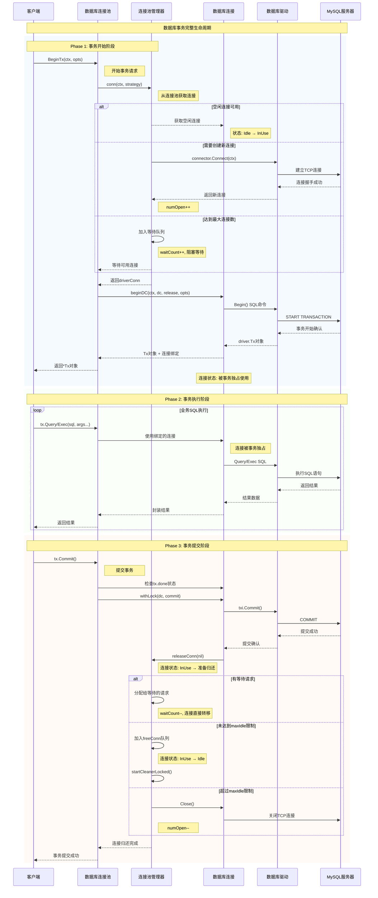
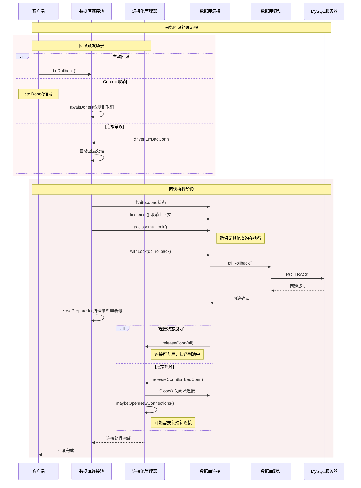
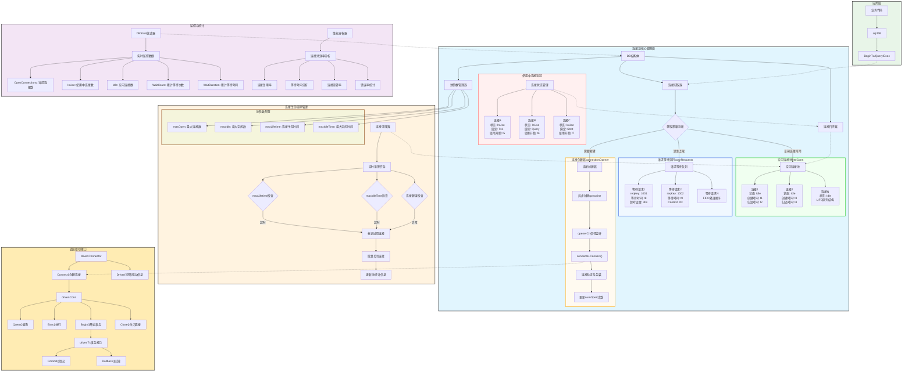
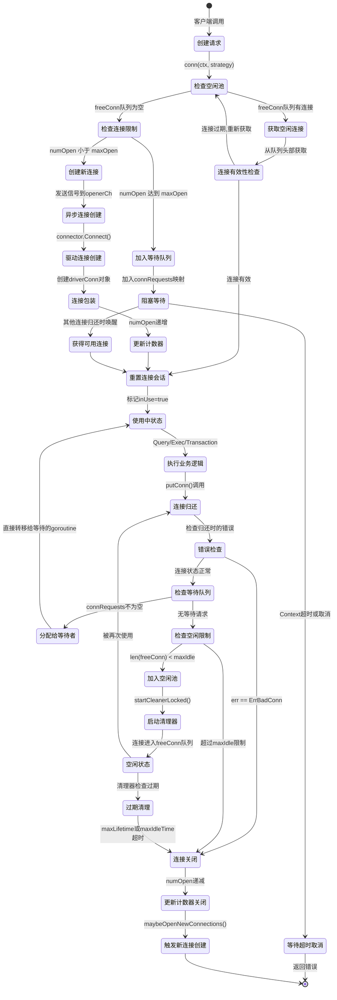
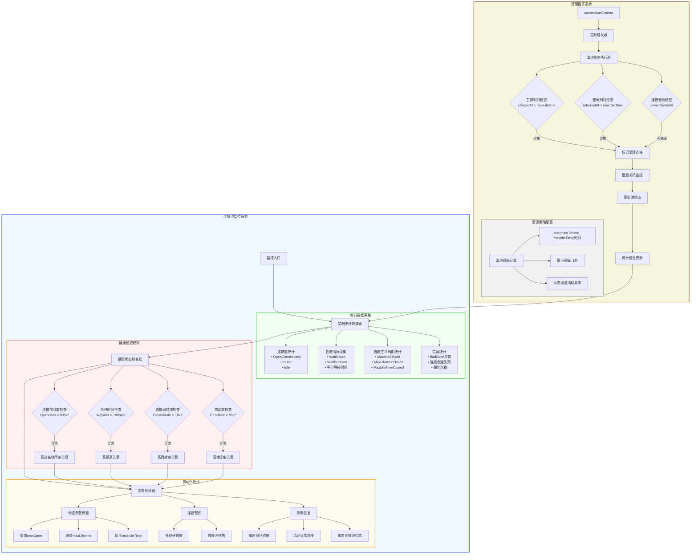

# Go 数据库连接池实现原理

## 概述

Go的database/sql包实现了一个功能完整、高性能的数据库连接池。它提供了连接复用、并发安全、自动回收、健康检查等特性，能够有效管理数据库连接的生命周期，提高应用程序的数据库访问性能。

## 核心架构

### 1. 整体架构图

```text
┌─────────────────────────────────────────────────────────────────┐
│                        Application Layer                        │
│  ┌─────────────────┐  ┌─────────────────┐  ┌─────────────────┐ │
│  │   sql.Open()    │  │   db.Query()    │  │   db.Exec()     │ │
│  └─────────────────┘  └─────────────────┘  └─────────────────┘ │
└─────────────────────┬───────────────────┬───────────────────────┘
                      │                   │
┌─────────────────────▼───────────────────▼───────────────────────┐
│                      database/sql Package                       │
│                                                                 │
│  ┌───────────────────────────────────────────────────────────┐ │
│  │                    DB (连接池管理器)                     │ │
│  │                                                           │ │
│  │  ┌─────────────────┐    ┌─────────────────────────────┐  │ │
│  │  │  Connection     │    │      Pool Management        │  │ │
│  │  │  Lifecycle      │    │                             │  │ │
│  │  │                 │    │  • maxOpen (最大连接数)     │  │ │
│  │  │ • Created       │    │  • maxIdle (最大空闲数)     │  │ │
│  │  │ • InUse         │    │  • maxLifetime (生存时间)   │  │ │
│  │  │ • Idle          │    │  • maxIdleTime (空闲时间)   │  │ │
│  │  │ • Closed        │    │  • connectionCleaner        │  │ │
│  │  └─────────────────┘    └─────────────────────────────┘  │ │
│  │                                                           │ │
│  │  ┌─────────────────┐    ┌─────────────────────────────┐  │ │
│  │  │   Free Pool     │    │     Request Queue           │  │ │
│  │  │                 │    │                             │  │ │
│  │  │ []*driverConn   │◄──►│ map[uint64]chan connRequest │  │ │
│  │  │                 │    │                             │  │ │
│  │  │ • LIFO队列      │    │ • 等待连接的请求            │  │ │
│  │  │ • 快速获取      │    │ • 支持取消操作              │  │ │
│  │  └─────────────────┘    └─────────────────────────────┘  │ │
│  └───────────────────────────────────────────────────────────┘ │
│                                                                 │
│  ┌───────────────────────────────────────────────────────────┐ │
│  │                 Connection Opener                         │ │
│  │                                                           │ │
│  │  ┌─────────────────┐    ┌─────────────────────────────┐  │ │
│  │  │   Opener        │    │    Connection Cleaner        │  │ │
│  │  │   Goroutine     │    │      Goroutine               │  │ │
│  │  │                 │    │                             │  │ │
│  │  │ • 异步创建连接   │    │ • 定期清理过期连接          │  │ │
│  │  │ • 监听openerCh  │    │ • maxLifetime检查           │  │ │
│  │  │ • 限流控制      │    │ • maxIdleTime检查           │  │ │
│  │  └─────────────────┘    └─────────────────────────────┘  │ │
│  └───────────────────────────────────────────────────────────┘ │
└─────────────────────┬───────────────────┬───────────────────────┘
                      │                   │
┌─────────────────────▼───────────────────▼───────────────────────┐
│                     Driver Interface                            │
│                                                                 │
│  ┌─────────────────┐  ┌─────────────────┐  ┌─────────────────┐ │
│  │   Connector     │  │   Connection    │  │   Transaction   │ │
│  │                 │  │                 │  │                 │ │
│  │ • Connect()     │  │ • Query()       │  │ • Commit()      │ │
│  │ • Driver()      │  │ • Exec()        │  │ • Rollback()    │ │
│  └─────────────────┘  └─────────────────┘  └─────────────────┘ │
└─────────────────────┬───────────────────┬───────────────────────┘
                      │                   │
┌─────────────────────▼───────────────────▼───────────────────────┐
│                    Database Server                              │
│                 (MySQL/PostgreSQL/etc.)                        │
└─────────────────────────────────────────────────────────────────┘
```

### 2. 连接池模块关系图

```text
                    ┌─────────────────────────────┐
                    │         Client              │
                    │    (Application Code)       │
                    └─────────────┬───────────────┘
                                  │
                                  ▼
                    ┌─────────────────────────────┐
                    │           DB                │
                    │     (连接池入口)            │
                    │                             │
                    │ • conn() - 获取连接         │
                    │ • putConn() - 归还连接      │
                    │ • SetMaxOpenConns()         │
                    │ • SetMaxIdleConns()         │
                    └─────────────┬───────────────┘
                                  │
         ┌────────────────────────┼────────────────────────┐
         │                        │                        │
         ▼                        ▼                        ▼
┌──────────────────┐    ┌──────────────────┐    ┌──────────────────┐
│   Connection     │    │   Pool Manager   │    │   Lifecycle      │
│   Provider       │    │                  │    │   Manager        │
│                  │    │ • freeConn[]     │    │                  │
│ • connectionOpener│    │ • connRequests   │    │ • cleaner        │
│ • openNewConn    │    │ • maxOpen        │    │ • expired()      │
│ • connector      │    │ • maxIdle        │    │ • resetSession() │
└──────────────────┘    └──────────────────┘    └──────────────────┘
         │                        │                        │
         └────────────────────────┼────────────────────────┘
                                  │
                                  ▼
                    ┌─────────────────────────────┐
                    │      driverConn             │
                    │   (连接包装器)              │
                    │                             │
                    │ • ci (driver.Conn)          │
                    │ • createdAt                 │
                    │ • returnedAt                │
                    │ • inUse                     │
                    │ • closed                    │
                    └─────────────┬───────────────┘
                                  │
                                  ▼
                    ┌─────────────────────────────┐
                    │      driver.Conn            │
                    │    (底层数据库连接)         │
                    │                             │
                    │ • Query()                   │
                    │ • Exec()                    │
                    │ • Begin()                   │
                    │ • Close()                   │
                    └─────────────────────────────┘
```

### 2. 核心数据结构

```go
// src/database/sql/sql.go
type DB struct {
    // 数据库驱动相关
    connector driver.Connector
    driver    driver.Driver
    dsn       string
    
    // 连接池配置
    mu                sync.RWMutex // 保护以下字段
    freeConn          []*driverConn // 空闲连接列表
    connRequests      map[uint64]chan connRequest // 连接请求映射
    nextRequestKey    uint64 // 下一个请求key
    numOpen           int    // 已打开连接数
    openerCh          chan struct{} // 开启器channel
    closed            bool
    dep               map[finalCloser]depSet
    lastPut           map[*driverConn]string
    maxIdleCount      int           // 最大空闲连接数
    maxOpen           int           // 最大打开连接数
    maxLifetime       time.Duration // 连接最大生存时间
    maxIdleTime       time.Duration // 连接最大空闲时间
    cleanerCh         chan struct{} // 清理器channel
    waitCount         int64         // 等待连接的请求数
    waitDuration      time.Duration // 累计等待时间
    
    // 停止信号
    stop func()
}

// 驱动连接包装
type driverConn struct {
    db        *DB
    createdAt time.Time    // 创建时间
    returnedAt time.Time   // 归还时间
    ci        driver.Conn  // 底层连接
    
    // 状态
    mu      sync.Mutex
    closed  bool
    finalTx *Tx  // 当前事务
    openStmt map[*Stmt]bool // 打开的语句
    
    // 生命周期
    lastErr error
    inUse   bool
    dbmuReason string
}
```

## 连接池管理

### 1. 连接池初始化

```go
// 打开数据库连接
func Open(driverName, dataSourceName string) (*DB, error) {
    driveri, ok := drivers[driverName]
    if !ok {
        return nil, fmt.Errorf("sql: unknown driver %q", driverName)
    }
    
    if driverCtx, ok := driveri.(driver.DriverContext); ok {
        connector, err := driverCtx.OpenConnector(dataSourceName)
        if err != nil {
            return nil, err
        }
        return OpenDB(connector), nil
    }
    
    return OpenDB(dsnConnector{dsn: dataSourceName, driver: driveri}), nil
}

// 通过连接器创建DB
func OpenDB(c driver.Connector) *DB {
    ctx, cancel := context.WithCancel(context.Background())
    db := &DB{
        connector:    c,
        openerCh:     make(chan struct{}, connectionRequestQueueSize),
        lastPut:      make(map[*driverConn]string),
        connRequests: make(map[uint64]chan connRequest),
        stop:         cancel,
    }
    
    // 启动连接开启器
    go db.connectionOpener(ctx)
    
    return db
}

// 连接开启器goroutine
func (db *DB) connectionOpener(ctx context.Context) {
    for {
        select {
        case <-ctx.Done():
            return
        case <-db.openerCh:
            db.openNewConnection(ctx)
        }
    }
}
```

### 2. 连接获取

```go
// 获取连接
func (db *DB) conn(ctx context.Context, strategy connReuseStrategy) (*driverConn, error) {
    db.mu.Lock()
    if db.closed {
        db.mu.Unlock()
        return nil, errDBClosed
    }
    
    // 检查context是否已取消
    select {
    default:
    case <-ctx.Done():
        db.mu.Unlock()
        return nil, ctx.Err()
    }
    
    lifetime := db.maxLifetime
    
    // 从空闲连接中获取
    numFree := len(db.freeConn)
    if strategy == cachedOrNewConn && numFree > 0 {
        conn := db.freeConn[0]
        copy(db.freeConn, db.freeConn[1:])
        db.freeConn = db.freeConn[:numFree-1]
        conn.inUse = true
        
        if conn.expired(lifetime) {
            db.maxIdleConnsLocked--
            db.mu.Unlock()
            conn.Close()
            return db.conn(ctx, strategy)
        }
        
        db.mu.Unlock()
        
        // 重置连接
        if err := conn.resetSession(ctx); err != nil {
            conn.Close()
            return db.conn(ctx, strategy)
        }
        
        return conn, nil
    }
    
    // 检查是否可以创建新连接
    if db.maxOpen > 0 && db.numOpen >= db.maxOpen {
        // 达到最大连接数，等待
        return db.waitForConn(ctx, strategy)
    }
    
    // 创建新连接
    db.numOpen++
    db.mu.Unlock()
    
    ci, err := db.connector.Connect(ctx)
    if err != nil {
        db.mu.Lock()
        db.numOpen--
        db.maybeOpenNewConnections()
        db.mu.Unlock()
        return nil, err
    }
    
    dc := &driverConn{
        db:        db,
        createdAt: time.Now(),
        returnedAt: time.Now(),
        ci:        ci,
        inUse:     true,
    }
    
    return dc, nil
}

// 等待连接
func (db *DB) waitForConn(ctx context.Context, strategy connReuseStrategy) (*driverConn, error) {
    waitStart := time.Now()
    
    // 创建连接请求
    reqKey := db.nextRequestKeyLocked()
    req := make(chan connRequest, 1)
    db.connRequests[reqKey] = req
    db.waitCount++
    db.mu.Unlock()
    
    waitCount := atomic.LoadInt64(&db.waitCount)
    
    select {
    case <-ctx.Done():
        // 请求被取消
        db.mu.Lock()
        delete(db.connRequests, reqKey)
        db.mu.Unlock()
        
        atomic.AddInt64(&db.waitCount, -1)
        
        select {
        default:
        case ret, ok := <-req:
            if ok && ret.conn != nil {
                db.putConn(ret.conn, ret.err, false)
            }
        }
        return nil, ctx.Err()
        
    case ret, ok := <-req:
        atomic.AddInt64(&db.waitCount, -1)
        atomic.AddInt64(&db.waitDuration, int64(time.Since(waitStart)))
        
        if !ok {
            return nil, errDBClosed
        }
        
        if ret.err == nil && ret.conn.expired(db.maxLifetime) {
            db.mu.Lock()
            db.maxIdleConnsLocked--
            db.mu.Unlock()
            ret.conn.Close()
            return db.conn(ctx, strategy)
        }
        
        if ret.conn != nil && ret.err == nil {
            if err := ret.conn.resetSession(ctx); err != nil {
                ret.conn.Close()
                return db.conn(ctx, strategy)
            }
        }
        
        return ret.conn, ret.err
    }
}
```

### 3. 连接归还

```go
// 归还连接
func (db *DB) putConn(dc *driverConn, err error, resetSession bool) {
    if err == driver.ErrBadConn {
        // 坏连接，直接关闭
        db.maybeOpenNewConnections()
        dc.Close()
        return
    }
    if err == errConnClosed {
        return
    }
    
    db.mu.Lock()
    defer db.mu.Unlock()
    
    if !dc.inUse {
        panic("sql: connection returned that was never out")
    }
    
    if err != nil {
        db.maybeOpenNewConnections()
        dc.Close()
        return
    }
    
    dc.inUse = false
    dc.returnedAt = time.Now()
    
    added := db.putConnHook(dc)
    if added {
        return
    }
    
    // 优先处理等待的请求
    if c := len(db.connRequests); c > 0 {
        var req chan connRequest
        var reqKey uint64
        
        for reqKey, req = range db.connRequests {
            break
        }
        delete(db.connRequests, reqKey)
        
        if resetSession {
            err := dc.resetSession(context.Background())
            if err == driver.ErrBadConn {
                dc.Close()
                req <- connRequest{nil, err}
                db.maybeOpenNewConnections()
                return
            }
        }
        
        dc.inUse = true
        req <- connRequest{dc, err}
        return
    } else if err == nil && !db.closed {
        // 放入空闲队列
        if db.maxIdleConnsLocked() > len(db.freeConn) {
            db.freeConn = append(db.freeConn, dc)
            db.startCleanerLocked()
            return
        }
    }
    
    // 连接无法复用，关闭
    dc.Close()
}

// 清理器勾子
func (db *DB) putConnHook(dc *driverConn) bool {
    if db.putConnHook != nil {
        return db.putConnHook(dc)
    }
    return false
}
```

## 连接生命周期管理

### 1. 连接健康检查

```go
// 检查连接是否过期
func (dc *driverConn) expired(timeout time.Duration) bool {
    if timeout <= 0 {
        return false
    }
    return dc.createdAt.Add(timeout).Before(time.Now())
}

// 验证连接
func (dc *driverConn) validateConnection(needsReset bool) error {
    if needsReset {
        if err := dc.resetSession(context.Background()); err != nil {
            if err == driver.ErrBadConn {
                return driver.ErrBadConn
            }
            return err
        }
    }
    
    if cv, ok := dc.ci.(driver.Validator); ok {
        return cv.IsValid()
    }
    
    return nil
}

// 重置会话
func (dc *driverConn) resetSession(ctx context.Context) error {
    if !dc.needReset {
        return nil
    }
    
    if cr, ok := dc.ci.(driver.SessionResetter); ok {
        return cr.ResetSession(ctx)
    }
    
    return nil
}
```

### 2. 连接清理器

```go
// 启动连接清理器
func (db *DB) startCleanerLocked() {
    if (db.maxLifetime > 0 || db.maxIdleTime > 0) && db.cleanerCh == nil {
        db.cleanerCh = make(chan struct{}, 1)
        go db.connectionCleaner()
    }
}

// 连接清理器goroutine
func (db *DB) connectionCleaner() {
    const minInterval = time.Minute
    
    d := db.maxLifetime
    if d < db.maxIdleTime {
        d = db.maxIdleTime
    }
    if d < minInterval {
        d = minInterval
    }
    
    t := time.NewTimer(d)
    defer t.Stop()
    
    for {
        select {
        case <-t.C:
        case <-db.cleanerCh:
        }
        
        db.mu.Lock()
        d = db.maxLifetime
        if d < db.maxIdleTime {
            d = db.maxIdleTime
        }
        if d < minInterval {
            d = minInterval
        }
        
        closing := db.connectionCleanerRunLocked()
        db.mu.Unlock()
        
        for _, c := range closing {
            c.Close()
        }
        
        t.Reset(d)
    }
}

// 执行清理逻辑
func (db *DB) connectionCleanerRunLocked() (closing []*driverConn) {
    if db.closed || db.numOpen == 0 || (db.maxLifetime <= 0 && db.maxIdleTime <= 0) {
        return nil
    }
    
    expiredSince := time.Now().Add(-db.maxLifetime)
    idleSince := time.Now().Add(-db.maxIdleTime)
    
    var expiredCount int
    for i := 0; i < len(db.freeConn); i++ {
        c := db.freeConn[i]
        
        // 检查生存时间
        if db.maxLifetime > 0 && c.createdAt.Before(expiredSince) {
            closing = append(closing, c)
            expiredCount++
            continue
        }
        
        // 检查空闲时间
        if db.maxIdleTime > 0 && c.returnedAt.Before(idleSince) {
            closing = append(closing, c)
            expiredCount++
            continue
        }
        
        // 保留有效连接
        if expiredCount > 0 {
            db.freeConn[i-expiredCount] = c
        }
    }
    
    db.freeConn = db.freeConn[:len(db.freeConn)-expiredCount]
    db.maxIdleConnsLocked -= expiredCount
    db.numOpen -= expiredCount
    
    return closing
}
```

## 事务管理

### 1. 事务结构

```go
// 事务结构
type Tx struct {
    db          *DB
    dc          *driverConn
    releaseConn func(error)
    txi         driver.Tx
    cancel      func()
    ctx         context.Context
    
    // 状态
    done bool
}

// 开始事务
func (db *DB) BeginTx(ctx context.Context, opts *TxOptions) (*Tx, error) {
    var tx *Tx
    var err error
    
    for i := 0; i < maxBadConnRetries; i++ {
        tx, err = db.begin(ctx, opts, cachedOrNewConn)
        if err != driver.ErrBadConn {
            break
        }
    }
    
    if err == driver.ErrBadConn {
        return db.begin(ctx, opts, alwaysNewConn)
    }
    return tx, err
}

// 内部begin实现
func (db *DB) begin(ctx context.Context, opts *TxOptions, strategy connReuseStrategy) (tx *Tx, err error) {
    dc, err := db.conn(ctx, strategy)
    if err != nil {
        return nil, err
    }
    
    return db.beginDC(ctx, dc, dc.releaseConn, opts)
}

// 在指定连接上开始事务
func (db *DB) beginDC(ctx context.Context, dc *driverConn, release func(error), opts *TxOptions) (tx *Tx, err error) {
    var txi driver.Tx
    keepConnOnRollback := false
    
    withLock(dc, func() {
        _, hasSessionResetter := dc.ci.(driver.SessionResetter)
        _, hasConnectionValidator := dc.ci.(driver.Validator)
        keepConnOnRollback = hasSessionResetter && hasConnectionValidator
        txi, err = ctxDriverBegin(ctx, opts, dc.ci)
    })
    
    if err != nil {
        release(err)
        return nil, err
    }
    
    // 创建事务对象
    ctx, cancel := context.WithCancel(ctx)
    tx = &Tx{
        db:          db,
        dc:          dc,
        releaseConn: release,
        txi:         txi,
        cancel:      cancel,
        ctx:         ctx,
    }
    
    // 设置终结器
    if !keepConnOnRollback {
        tx.releaseConn = func(err error) {
            release(err)
            if err != nil {
                tx.db.putConn(dc, err, false)
            }
        }
    }
    
    return tx, nil
}
```

### 2. 事务提交和回滚

```go
// 提交事务
func (tx *Tx) Commit() error {
    return tx.commit(context.Background())
}

func (tx *Tx) commit(ctx context.Context) (err error) {
    if tx.done {
        return ErrTxDone
    }
    defer close(tx)
    
    select {
    case <-ctx.Done():
        return ctx.Err()
    default:
    }
    
    // 执行提交
    withLock(tx.dc, func() {
        err = tx.txi.Commit()
    })
    
    if err != driver.ErrBadConn {
        tx.releaseConn(nil)
    }
    return err
}

// 回滚事务
func (tx *Tx) Rollback() error {
    return tx.rollback(context.Background())
}

func (tx *Tx) rollback(ctx context.Context) (err error) {
    if tx.done {
        return ErrTxDone
    }
    defer close(tx)
    
    select {
    case <-ctx.Done():
        return ctx.Err()
    default:
    }
    
    // 执行回滚
    withLock(tx.dc, func() {
        err = tx.txi.Rollback()
    })
    
    tx.releaseConn(err)
    return err
}

// 关闭事务
func (tx *Tx) close(err error) {
    tx.cancel()
    
    tx.db.mu.Lock()
    tx.done = true
    tx.db.mu.Unlock()
}
```

## 语句管理

### 1. 预处理语句

```go
// 语句结构
type Stmt struct {
    db          *DB           // 所属数据库
    query       string        // SQL查询
    stickyErr   error        // 持续错误
    closemu     sync.RWMutex // 关闭锁
    
    // 语句缓存
    mu     sync.Mutex
    closed bool
    csi    map[*driverConn]*driverStmt
}

// 驱动语句
type driverStmt struct {
    si      driver.Stmt
    closed  bool
    closeAt time.Time
}

// 准备语句
func (db *DB) Prepare(query string) (*Stmt, error) {
    return db.PrepareContext(context.Background(), query)
}

func (db *DB) PrepareContext(ctx context.Context, query string) (*Stmt, error) {
    var stmt *Stmt
    var err error
    
    for i := 0; i < maxBadConnRetries; i++ {
        stmt, err = db.prepare(ctx, query, cachedOrNewConn)
        if err != driver.ErrBadConn {
            break
        }
    }
    
    if err == driver.ErrBadConn {
        return db.prepare(ctx, query, alwaysNewConn)
    }
    return stmt, err
}

// 内部prepare实现
func (db *DB) prepare(ctx context.Context, query string, strategy connReuseStrategy) (*Stmt, error) {
    dc, err := db.conn(ctx, strategy)
    if err != nil {
        return nil, err
    }
    
    return db.prepareDC(ctx, dc, dc.releaseConn, query)
}

// 在指定连接上准备语句
func (db *DB) prepareDC(ctx context.Context, dc *driverConn, release func(error), query string) (*Stmt, error) {
    var si driver.Stmt
    var err error
    
    withLock(dc, func() {
        si, err = ctxDriverPrepare(ctx, dc.ci, query)
    })
    
    if err != nil {
        release(err)
        return nil, err
    }
    
    stmt := &Stmt{
        db:    db,
        query: query,
        csi:   make(map[*driverConn]*driverStmt),
    }
    
    stmt.csi[dc] = &driverStmt{si: si}
    
    // 设置终结器
    stmt.finClose = func() {
        stmt.mu.Lock()
        if len(stmt.csi) > 0 {
            dc.removeOpenStmt(stmt)
            for _, dsi := range stmt.csi {
                dsi.si.Close()
            }
            stmt.csi = nil
        }
        stmt.mu.Unlock()
    }
    
    release(nil)
    return stmt, nil
}
```

### 2. 语句执行

```go
// 执行查询
func (s *Stmt) QueryContext(ctx context.Context, args ...any) (*Rows, error) {
    s.closemu.RLock()
    defer s.closemu.RUnlock()
    
    var rows *Rows
    var err error
    
    for i := 0; i < maxBadConnRetries; i++ {
        rows, err = s.query(ctx, args, cachedOrNewConn)
        if err != driver.ErrBadConn {
            break
        }
    }
    
    if err == driver.ErrBadConn {
        return s.query(ctx, args, alwaysNewConn)
    }
    return rows, err
}

// 内部query实现
func (s *Stmt) query(ctx context.Context, args []any, strategy connReuseStrategy) (*Rows, error) {
    dc, releaseConn, ds, err := s.connStmt(ctx, strategy)
    if err != nil {
        return nil, err
    }
    
    return s.queryDC(ctx, dc, releaseConn, ds, args)
}

// 在指定连接上执行查询
func (s *Stmt) queryDC(ctx context.Context, dc *driverConn, releaseConn func(error), ds *driverStmt, args []any) (*Rows, error) {
    rowsi, err := s.queryStmt(ctx, ds.si, args)
    if err != nil {
        releaseConn(err)
        return nil, err
    }
    
    rows := &Rows{
        dc:          dc,
        releaseConn: releaseConn,
        rowsi:       rowsi,
        closeStmt:   ds,
    }
    
    rows.initContextClose(ctx)
    return rows, nil
}
```

## 连接池配置和调优

### 1. 连接池参数

```go
// 设置最大打开连接数
func (db *DB) SetMaxOpenConns(n int) {
    db.mu.Lock()
    db.maxOpen = n
    if n < 0 {
        db.maxOpen = 0
    }
    
    syncMaxIdle := db.maxOpen > 0 && db.maxIdleConnsLocked > db.maxOpen
    db.mu.Unlock()
    
    if syncMaxIdle {
        db.SetMaxIdleConns(n)
    }
}

// 设置最大空闲连接数
func (db *DB) SetMaxIdleConns(n int) {
    db.mu.Lock()
    if n > 0 {
        db.maxIdle = n
    } else {
        db.maxIdle = defaultMaxIdleConns
    }
    
    if db.maxOpen > 0 && db.maxIdleConnsLocked > db.maxOpen {
        db.maxIdleConnsLocked = db.maxOpen
    }
    
    var closing []*driverConn
    idleCount := len(db.freeConn)
    maxIdle := db.maxIdleConnsLocked
    if idleCount > maxIdle {
        closing = db.freeConn[maxIdle:]
        db.freeConn = db.freeConn[:maxIdle]
    }
    db.maxIdleConnsLocked = maxIdle
    db.mu.Unlock()
    
    for _, c := range closing {
        c.Close()
    }
}

// 设置连接最大生存时间
func (db *DB) SetConnMaxLifetime(d time.Duration) {
    if d < 0 {
        d = 0
    }
    
    db.mu.Lock()
    db.maxLifetime = d
    db.startCleanerLocked()
    db.mu.Unlock()
}

// 设置连接最大空闲时间
func (db *DB) SetConnMaxIdleTime(d time.Duration) {
    if d < 0 {
        d = 0
    }
    
    db.mu.Lock()
    db.maxIdleTime = d
    db.startCleanerLocked()
    db.mu.Unlock()
}
```

### 2. 连接池统计

```go
// 数据库统计信息
type DBStats struct {
    MaxOpenConnections int // 最大打开连接数
    
    // 连接池统计
    OpenConnections  int // 当前打开连接数
    InUse            int // 使用中的连接数
    Idle             int // 空闲连接数
    
    // 累计统计
    WaitCount         int64         // 总等待次数
    WaitDuration      time.Duration // 累计等待时间
    MaxIdleClosed     int64         // 因超过最大空闲数关闭的连接
    MaxIdleTimeClosed int64         // 因空闲超时关闭的连接
    MaxLifetimeClosed int64         // 因生存时间超时关闭的连接
}

// 获取统计信息
func (db *DB) Stats() DBStats {
    wait := atomic.LoadInt64(&db.waitDuration)
    
    db.mu.RLock()
    defer db.mu.RUnlock()
    
    stats := DBStats{
        MaxOpenConnections: db.maxOpen,
        
        Idle:            len(db.freeConn),
        OpenConnections: db.numOpen,
        InUse:           db.numOpen - len(db.freeConn),
        
        WaitCount:         db.waitCount,
        WaitDuration:      time.Duration(wait),
        MaxIdleClosed:     db.maxIdleClosed,
        MaxIdleTimeClosed: db.maxIdleTimeClosed,
        MaxLifetimeClosed: db.maxLifetimeClosed,
    }
    return stats
}
```

## 错误处理与重试

### 1. 坏连接处理

```go
// 检查是否为坏连接错误
func isBadConnError(err error) bool {
    return err == driver.ErrBadConn
}

// 坏连接重试逻辑
const maxBadConnRetries = 2

func (db *DB) retry(f func() error) error {
    var err error
    for i := 0; i < maxBadConnRetries; i++ {
        err = f()
        if !isBadConnError(err) {
            break
        }
    }
    return err
}

// 带重试的执行
func (db *DB) execDC(ctx context.Context, dc *driverConn, release func(error), query string, args []any) (res Result, err error) {
    defer func() {
        if err == driver.ErrBadConn {
            release(err)
        } else {
            release(nil)
        }
    }()
    
    execer, ok := dc.ci.(driver.Execer)
    if ok {
        var resi driver.Result
        withLock(dc, func() {
            resi, err = ctxDriverExec(ctx, execer, query, args)
        })
        
        if err != driver.ErrSkip {
            if err != nil {
                return nil, err
            }
            return driverResult{resi}, nil
        }
    }
    
    // 回退到prepare+execute
    si, err := ctxDriverPrepare(ctx, dc.ci, query)
    if err != nil {
        return nil, err
    }
    defer si.Close()
    
    return resultFromStatement(ctx, dc.ci, si, args...)
}
```

### 2. 超时处理

```go
// 带超时的操作
func (db *DB) execTimeout(ctx context.Context, query string, args []any) (Result, error) {
    if ctx == nil {
        ctx = context.Background()
    }
    
    // 检查超时
    select {
    case <-ctx.Done():
        return nil, ctx.Err()
    default:
    }
    
    return db.exec(ctx, query, args, cachedOrNewConn)
}

// 上下文取消处理
func (dc *driverConn) prepareLocked(ctx context.Context, cg stmtConnGrabber, query string) (*Stmt, error) {
    si, err := ctxDriverPrepare(ctx, dc.ci, query)
    if err != nil {
        return nil, err
    }
    
    // 检查上下文取消
    select {
    case <-ctx.Done():
        si.Close()
        return nil, ctx.Err()
    default:
    }
    
    return &Stmt{
        db:    dc.db,
        query: query,
        csi:   map[*driverConn]*driverStmt{dc: {si: si}},
    }, nil
}
```

## 监控与调试

### 1. 连接池监控

```go
// 连接池监控器
type PoolMonitor struct {
    db       *DB
    interval time.Duration
    metrics  chan DBStats
}

func NewPoolMonitor(db *DB, interval time.Duration) *PoolMonitor {
    return &PoolMonitor{
        db:       db,
        interval: interval,
        metrics:  make(chan DBStats, 100),
    }
}

func (pm *PoolMonitor) Start() {
    ticker := time.NewTicker(pm.interval)
    defer ticker.Stop()
    
    for range ticker.C {
        stats := pm.db.Stats()
        
        select {
        case pm.metrics <- stats:
        default:
            // 缓冲区满，跳过
        }
        
        // 检查连接池健康状况
        pm.checkHealth(stats)
    }
}

func (pm *PoolMonitor) checkHealth(stats DBStats) {
    // 连接数过多告警
    if stats.OpenConnections > stats.MaxOpenConnections*8/10 {
        log.Warn("High connection usage", 
            "open", stats.OpenConnections,
            "max", stats.MaxOpenConnections)
    }
    
    // 等待时间过长告警
    if stats.WaitCount > 0 {
        avgWait := stats.WaitDuration / time.Duration(stats.WaitCount)
        if avgWait > 100*time.Millisecond {
            log.Warn("High connection wait time",
                "avg_wait", avgWait,
                "wait_count", stats.WaitCount)
        }
    }
    
    // 连接关闭过多告警
    totalClosed := stats.MaxIdleClosed + stats.MaxIdleTimeClosed + stats.MaxLifetimeClosed
    if totalClosed > int64(stats.MaxOpenConnections)*10 {
        log.Warn("High connection turnover",
            "closed", totalClosed,
            "max_open", stats.MaxOpenConnections)
    }
}
```

### 2. 性能分析

```go
// 连接池性能分析
func AnalyzePoolPerformance(db *DB, duration time.Duration) {
    start := time.Now()
    initialStats := db.Stats()
    
    time.Sleep(duration)
    
    finalStats := db.Stats()
    elapsed := time.Since(start)
    
    // 计算差值
    deltaWaitCount := finalStats.WaitCount - initialStats.WaitCount
    deltaWaitDuration := finalStats.WaitDuration - initialStats.WaitDuration
    
    log.Info("Pool performance analysis",
        "duration", elapsed,
        "avg_open_conns", (initialStats.OpenConnections+finalStats.OpenConnections)/2,
        "avg_idle_conns", (initialStats.Idle+finalStats.Idle)/2,
        "wait_rate", float64(deltaWaitCount)/elapsed.Seconds(),
        "avg_wait_time", deltaWaitDuration/time.Duration(max(deltaWaitCount, 1)),
        "connection_efficiency", float64(finalStats.InUse)/float64(max(finalStats.OpenConnections, 1)))
}

func max(a, b int64) int64 {
    if a > b {
        return a
    }
    return b
}
```

## 最佳实践

### 1. 连接池配置

```go
// 生产环境连接池配置
func ConfigureProductionPool(db *DB) {
    // 根据应用特点设置连接数
    maxOpen := runtime.NumCPU() * 4  // 通常是CPU核数的2-4倍
    maxIdle := runtime.NumCPU() * 2  // 空闲连接数为最大连接数的一半
    
    db.SetMaxOpenConns(maxOpen)
    db.SetMaxIdleConns(maxIdle)
    
    // 设置连接生存期，避免长连接问题
    db.SetConnMaxLifetime(30 * time.Minute)
    db.SetConnMaxIdleTime(5 * time.Minute)
}

// 高并发场景配置
func ConfigureHighConcurrencyPool(db *DB) {
    // 更大的连接数
    db.SetMaxOpenConns(100)
    db.SetMaxIdleConns(50)
    
    // 较短的连接生存时间
    db.SetConnMaxLifetime(10 * time.Minute)
    db.SetConnMaxIdleTime(2 * time.Minute)
}
```

### 2. 错误处理

```go
// 带重试的数据库操作
func ExecuteWithRetry(db *DB, ctx context.Context, query string, args ...any) (sql.Result, error) {
    var result sql.Result
    var err error
    
    for attempts := 0; attempts < 3; attempts++ {
        result, err = db.ExecContext(ctx, query, args...)
        
        if err == nil {
            return result, nil
        }
        
        // 检查是否为可重试的错误
        if !isRetryableError(err) {
            return nil, err
        }
        
        // 指数退避
        backoff := time.Duration(attempts) * 100 * time.Millisecond
        time.Sleep(backoff)
    }
    
    return nil, fmt.Errorf("operation failed after retries: %w", err)
}

func isRetryableError(err error) bool {
    if err == driver.ErrBadConn {
        return true
    }
    
    // 检查网络错误、超时等
    if netErr, ok := err.(net.Error); ok {
        return netErr.Temporary() || netErr.Timeout()
    }
    
    return false
}
```

## MySQL连接存活时间深度分析

### 1. 连接存活时间控制机制

基于Go源码分析，MySQL连接在连接池中的存活时间由两个关键参数控制：

#### 1.1 核心参数

```go
type DB struct {
    // 连接生存时间相关参数
    maxLifetime       time.Duration // 连接最大生存时间
    maxIdleTime       time.Duration // 连接最大空闲时间
}

type driverConn struct {
    createdAt  time.Time // 连接创建时间
    returnedAt time.Time // 连接归还时间（最后一次使用完毕的时间）
}
```

#### 1.2 存活时间判定逻辑

```go
// 源码: src/database/sql/sql.go:587-592
func (dc *driverConn) expired(timeout time.Duration) bool {
    if timeout <= 0 {
        return false
    }
    return dc.createdAt.Add(timeout).Before(nowFunc())
}

// 源码: src/database/sql/sql.go:1171-1192  
// 在connectionCleanerRunLocked中的清理逻辑
if db.maxLifetime > 0 {
    expiredSince := nowFunc().Add(-db.maxLifetime)
    for i := 0; i < len(db.freeConn); i++ {
        c := db.freeConn[i]
        // 检查连接创建时间是否超过maxLifetime
        if c.createdAt.Before(expiredSince) {
            closing = append(closing, c)
            // 标记为需要关闭的连接
        }
    }
}

if db.maxIdleTime > 0 {
    idleSince := nowFunc().Add(-db.maxIdleTime)
    for i := last; i >= 0; i-- {
        c := db.freeConn[i]
        // 检查连接归还时间是否超过maxIdleTime
        if c.returnedAt.Before(idleSince) {
            // 标记为需要关闭的连接
        }
    }
}
```

### 2. 参数设置方法

```go
// 源码: src/database/sql/sql.go:1047-1062
// 设置连接最大生存时间
func (db *DB) SetConnMaxLifetime(d time.Duration) {
    if d < 0 {
        d = 0
    }
    db.mu.Lock()
    // 如果缩短了生存时间，立即唤醒清理器
    if d > 0 && d < db.maxLifetime && db.cleanerCh != nil {
        select {
        case db.cleanerCh <- struct{}{}:
        default:
        }
    }
    db.maxLifetime = d
    db.startCleanerLocked()
    db.mu.Unlock()
}

// 源码: src/database/sql/sql.go:1069-1085
// 设置连接最大空闲时间
func (db *DB) SetConnMaxIdleTime(d time.Duration) {
    if d < 0 {
        d = 0
    }
    db.mu.Lock()
    defer db.mu.Unlock()
    
    // 如果缩短了空闲时间，立即唤醒清理器
    if d > 0 && d < db.maxIdleTime && db.cleanerCh != nil {
        select {
        case db.cleanerCh <- struct{}{}:
        default:
        }
    }
    db.maxIdleTime = d
    db.startCleanerLocked()
}
```

### 3. 连接清理机制

#### 3.1 清理器启动条件

```go
// 源码: src/database/sql/sql.go:1088-1093
func (db *DB) startCleanerLocked() {
    // 只有在设置了maxLifetime或maxIdleTime，且有连接存在时才启动清理器
    if (db.maxLifetime > 0 || db.maxIdleTime > 0) && db.numOpen > 0 && db.cleanerCh == nil {
        db.cleanerCh = make(chan struct{}, 1)
        go db.connectionCleaner(db.shortestIdleTimeLocked())
    }
}
```

#### 3.2 清理器执行频率

```go
// 源码: src/database/sql/sql.go:1095-1136
func (db *DB) connectionCleaner(d time.Duration) {
    const minInterval = time.Second // 最小清理间隔1秒
    
    if d < minInterval {
        d = minInterval
    }
    t := time.NewTimer(d)
    
    for {
        select {
        case <-t.C:           // 定时器触发
        case <-db.cleanerCh:  // 参数变更触发
        }
        
        // 执行清理逻辑...
        d, closing := db.connectionCleanerRunLocked(d)
        
        // 关闭过期连接
        for _, c := range closing {
            c.Close()
        }
        
        // 重置定时器，使用较短的清理间隔
        if d < minInterval {
            d = minInterval
        }
        t.Reset(d)
    }
}
```

### 4. 连接存活时间结论

#### 4.1 存活时间计算

**对于一个正常存在的MySQL连接，其在连接池中的存活时间由以下规则决定：**

1. **基于创建时间的限制**：
   - 连接从 `createdAt` 开始计时
   - 最多存活 `maxLifetime` 时间
   - 超过后无论是否在使用都会被标记为过期

2. **基于空闲时间的限制**：
   - 连接从 `returnedAt` 开始计时（归还到空闲队列的时间）
   - 最多空闲 `maxIdleTime` 时间
   - 只对空闲连接生效

3. **实际存活时间**：

   
```text
   实际存活时间 = min(maxLifetime - 已存活时间, maxIdleTime - 已空闲时间)
   
```

#### 4.2 关键时间节点

```go
// 连接生命周期关键时间点
type ConnectionLifecycle struct {
    CreatedAt  time.Time // 连接创建时间（影响maxLifetime判断）
    ReturnedAt time.Time // 最后归还时间（影响maxIdleTime判断）
    
    // 过期检查点
    MaxLifetimeExpiry time.Time // createdAt + maxLifetime
    MaxIdleExpiry     time.Time // returnedAt + maxIdleTime
}

func (cl *ConnectionLifecycle) IsExpired(now time.Time) bool {
    // 任一条件满足都会过期
    lifetimeExpired := now.After(cl.MaxLifetimeExpiry)
    idleExpired := now.After(cl.MaxIdleExpiry)
    
    return lifetimeExpired || idleExpired
}
```

#### 4.3 默认值和推荐设置

```go
// 默认情况（未设置时）
// maxLifetime = 0  // 永不过期
// maxIdleTime = 0  // 永不因空闲过期

// 生产环境推荐设置
func RecommendedSettings() {
    db.SetConnMaxLifetime(30 * time.Minute)  // 30分钟最大生存时间
    db.SetConnMaxIdleTime(5 * time.Minute)   // 5分钟最大空闲时间
    
    // 这样配置的连接：
    // - 创建后最多存活30分钟
    // - 空闲状态最多持续5分钟
    // - 实际存活时间取决于使用模式和两个参数的限制
}
```

#### 4.4 存活时间实例分析

```go
// 场景1：频繁使用的连接
// 创建时间：10:00:00
// 设置：maxLifetime=30min, maxIdleTime=5min
// 如果连接一直被频繁使用，每次使用后立即归还
// 结果：在10:30:00时因maxLifetime过期，无论是否空闲

// 场景2：偶尔使用的连接  
// 创建时间：10:00:00，最后使用：10:10:00
// 设置：maxLifetime=30min, maxIdleTime=5min
// 结果：在10:15:00时因maxIdleTime过期（空闲5分钟）

// 场景3：未设置任何限制
// maxLifetime=0, maxIdleTime=0
// 结果：连接永不自动过期（直到数据库端超时或网络断开）
```

**总结：MySQL连接的存活时间由 `maxLifetime` 和 `maxIdleTime` 两个参数共同控制，实际存活时间取决于更严格的那个限制条件。**

## 连接状态转换图

### 1. 连接生命周期状态

```text
                    ┌─────────────────┐
                    │    Initial      │
                    │   (初始状态)    │
                    └─────────┬───────┘
                              │ connector.Connect()
                              ▼
                    ┌─────────────────┐
                    │    Created      │
                    │   (已创建)      │
                    └─────────┬───────┘
                              │ conn()
                              ▼
     ┌──────────────┐  ┌─────────────────┐  ┌──────────────┐
     │    Error     │  │     InUse       │  │   Expired    │
     │   (错误)     │◄─│   (使用中)      │─►│   (已过期)   │
     └──────┬───────┘  └─────────┬───────┘  └──────┬───────┘
            │                    │ putConn()       │
            │                    ▼                 │
            │          ┌─────────────────┐         │
            │          │      Idle       │         │
            │          │     (空闲)      │         │
            │          └─────────┬───────┘         │
            │                    │                 │
            │                    │ expired()       │
            │                    ▼                 │
            │          ┌─────────────────┐         │
            │          │    Closing      │         │
            │          │   (关闭中)      │         │
            │          └─────────┬───────┘         │
            │                    │                 │
            └────────────────────┼─────────────────┘
                                 │ Close()
                                 ▼
                    ┌─────────────────┐
                    │     Closed      │
                    │    (已关闭)     │
                    └─────────────────┘
```

### 2. 连接获取流程图

```text
                        ┌─────────────────┐
                        │   Client Call   │
                        │   db.conn()     │
                        └─────────┬───────┘
                                  │
                                  ▼
                        ┌─────────────────┐
                        │  Check Context  │
                        │   ctx.Done()?   │
                        └─────────┬───────┘
                                  │ No
                                  ▼
                        ┌─────────────────┐      Yes    ┌─────────────────┐
                        │ Check freeConn  │─────────────►│  Get from Pool  │
                        │   len > 0?      │              │                 │
                        └─────────┬───────┘              └─────────┬───────┘
                                  │ No                             │
                                  ▼                                ▼
                        ┌─────────────────┐                ┌─────────────────┐
                        │ Check maxOpen   │                │ Check Expired   │
                        │ numOpen < max?  │                │   expired()?    │
                        └─────────┬───────┘                └─────────┬───────┘
                                  │                                  │
                         No       │       Yes                 Yes    │    No
                    ┌─────────────▼───────────────┐                  │
                    │                             │                  ▼
                    ▼                             ▼        ┌─────────────────┐
        ┌─────────────────┐            ┌─────────────────┐ │ Reset Session   │
        │  Wait for Conn  │            │  Create New     │ │  Return Conn    │
        │                 │            │  Connection     │ └─────────┬───────┘
        │ • Add to queue  │            └─────────┬───────┘           │
        │ • Block/Cancel  │                      │                   │
        └─────────┬───────┘                      │                   │
                  │                              │                   │
                  └──────────────┬───────────────┘                   │
                                 │                                   │
                                 └───────────────┬───────────────────┘
                                                 │
                                                 ▼
                                   ┌─────────────────┐
                                   │ Return driverConn│
                                   │   to Client     │
                                   └─────────────────┘
```

### 3. 连接归还流程图

```text
                        ┌─────────────────┐
                        │   Client Call   │
                        │  putConn(dc)    │
                        └─────────┬───────┘
                                  │
                                  ▼
                        ┌─────────────────┐
                        │  Check Error    │
                        │  err != nil?    │
                        └─────────┬───────┘
                                  │
                             Yes  │   No
                    ┌─────────────▼────────────────┐
                    │                              │
                    ▼                              ▼
        ┌─────────────────┐            ┌─────────────────┐
        │  Check BadConn  │            │ Set returnedAt  │
        │ ErrBadConn?     │            │   time.Now()    │
        └─────────┬───────┘            └─────────┬───────┘
                  │                              │
             Yes  │   No                         ▼
        ┌─────────▼───────┐            ┌─────────────────┐
        │  Close & Open   │            │ Check Requests  │
        │  New Connection │            │  len(queue)>0?  │
        └─────────────────┘            └─────────┬───────┘
                                                 │
                                            Yes  │   No
                                   ┌─────────────▼────────────────┐
                                   │                              │
                                   ▼                              ▼
                         ┌─────────────────┐            ┌─────────────────┐
                         │  Assign to      │            │ Check Idle Limit│
                         │  Waiting Client │            │maxIdle reached? │
                         └─────────────────┘            └─────────┬───────┘
                                                                  │
                                                             No   │   Yes
                                                    ┌─────────────▼───────┐
                                                    │                      │
                                                    ▼                      ▼
                                          ┌─────────────────┐    ┌─────────────────┐
                                          │ Add to freeConn │    │   Close Conn    │
                                          │     Pool        │    │                 │
                                          └─────────────────┘    └─────────────────┘
```

### 4. 连接清理运行图

```text
                        ┌─────────────────┐
                        │ Cleaner Timer   │
                        │   Triggered     │
                        └─────────┬───────┘
                                  │
                                  ▼
                        ┌─────────────────┐
                        │ Lock freeConn   │
                        │     Pool        │
                        └─────────┬───────┘
                                  │
                                  ▼
                        ┌─────────────────┐
                        │ Iterate Each    │
                        │   Connection    │
                        └─────────┬───────┘
                                  │
                                  ▼
                        ┌─────────────────┐
                        │ Check Lifetime  │
                        │ createdAt +     │
                        │ maxLifetime     │
                        └─────────┬───────┘
                                  │
                             Yes  │   No
                    ┌─────────────▼───────────────┐
                    │                             │
                    ▼                             ▼
        ┌─────────────────┐            ┌─────────────────┐
        │ Mark for Close  │            │ Check IdleTime  │
        │                 │            │ returnedAt +    │
        └─────────┬───────┘            │ maxIdleTime     │
                  │                    └─────────┬───────┘
                  │                              │
                  │                         Yes  │   No
                  │                ┌─────────────▼───────┐
                  │                │                     │
                  │                ▼                     ▼
                  │    ┌─────────────────┐     ┌─────────────────┐
                  │    │ Mark for Close  │     │   Keep Alive    │
                  │    │                 │     │                 │
                  │    └─────────┬───────┘     └─────────────────┘
                  │              │
                  └──────────────┼──────────────┘
                                 │
                                 ▼
                        ┌─────────────────┐
                        │ Close Marked    │
                        │  Connections    │
                        └─────────┬───────┘
                                  │
                                  ▼
                        ┌─────────────────┐
                        │ Update Pool     │
                        │   Statistics    │
                        └─────────┬───────┘
                                  │
                                  ▼
                        ┌─────────────────┐
                        │ Reset Timer     │
                        │  Next Round     │
                        └─────────────────┘
```

## 事务完整时序图

### 1. 事务从开始到提交的完整流程



### 2. 事务回滚场景时序图



## 数据库连接池完整架构图

### 1. 连接池核心架构与管理功能



### 2. 连接状态转换与池管理流程



### 3. 连接池监控与健康检查架构



## 总结

Go的database/sql连接池实现了一个完整而高效的数据库连接管理系统：

1. **智能连接管理**: 自动处理连接创建、复用、回收
2. **并发安全**: 完善的锁机制保证多goroutine安全访问
3. **生命周期控制**: 支持连接超时、空闲超时等策略
4. **错误恢复**: 自动检测坏连接并重试
5. **性能优化**: 连接池、语句缓存、批量操作等优化
6. **事务支持**: 完整的事务生命周期管理与连接绑定
7. **监控与诊断**: 全面的统计信息和健康检查机制

理解连接池原理有助于：

- 正确配置连接池参数
- 诊断数据库性能问题
- 优化应用数据库访问模式
- 实现高性能数据库应用
- 设计可靠的事务处理逻辑

掌握连接池机制是Go数据库编程的重要技能。
