# Go 数据库连接池实现原理

## 概述

Go的database/sql包实现了一个功能完整、高性能的数据库连接池。它提供了连接复用、并发安全、自动回收、健康检查等特性，能够有效管理数据库连接的生命周期，提高应用程序的数据库访问性能。

## 核心架构

### 1. 整体架构图

```text
┌─────────────────────────────────────────────────────────────────┐
│                        Application Layer                        │
│  ┌─────────────────┐  ┌─────────────────┐  ┌─────────────────┐ │
│  │   sql.Open()    │  │   db.Query()    │  │   db.Exec()     │ │
│  └─────────────────┘  └─────────────────┘  └─────────────────┘ │
└─────────────────────┬───────────────────┬───────────────────────┘
                      │                   │
┌─────────────────────▼───────────────────▼───────────────────────┐
│                      database/sql Package                       │
│                                                                 │
│  ┌───────────────────────────────────────────────────────────┐ │
│  │                    DB (连接池管理器)                     │ │
│  │                                                           │ │
│  │  ┌─────────────────┐    ┌─────────────────────────────┐  │ │
│  │  │  Connection     │    │      Pool Management        │  │ │
│  │  │  Lifecycle      │    │                             │  │ │
│  │  │                 │    │  • maxOpen (最大连接数)     │  │ │
│  │  │ • Created       │    │  • maxIdle (最大空闲数)     │  │ │
│  │  │ • InUse         │    │  • maxLifetime (生存时间)   │  │ │
│  │  │ • Idle          │    │  • maxIdleTime (空闲时间)   │  │ │
│  │  │ • Closed        │    │  • connectionCleaner        │  │ │
│  │  └─────────────────┘    └─────────────────────────────┘  │ │
│  │                                                           │ │
│  │  ┌─────────────────┐    ┌─────────────────────────────┐  │ │
│  │  │   Free Pool     │    │     Request Queue           │  │ │
│  │  │                 │    │                             │  │ │
│  │  │ []*driverConn   │◄──►│ map[uint64]chan connRequest │  │ │
│  │  │                 │    │                             │  │ │
│  │  │ • LIFO队列      │    │ • 等待连接的请求            │  │ │
│  │  │ • 快速获取      │    │ • 支持取消操作              │  │ │
│  │  └─────────────────┘    └─────────────────────────────┘  │ │
│  └───────────────────────────────────────────────────────────┘ │
│                                                                 │
│  ┌───────────────────────────────────────────────────────────┐ │
│  │                 Connection Opener                         │ │
│  │                                                           │ │
│  │  ┌─────────────────┐    ┌─────────────────────────────┐  │ │
│  │  │   Opener        │    │    Connection Cleaner        │  │ │
│  │  │   Goroutine     │    │      Goroutine               │  │ │
│  │  │                 │    │                             │  │ │
│  │  │ • 异步创建连接   │    │ • 定期清理过期连接          │  │ │
│  │  │ • 监听openerCh  │    │ • maxLifetime检查           │  │ │
│  │  │ • 限流控制      │    │ • maxIdleTime检查           │  │ │
│  │  └─────────────────┘    └─────────────────────────────┘  │ │
│  └───────────────────────────────────────────────────────────┘ │
└─────────────────────┬───────────────────┬───────────────────────┘
                      │                   │
┌─────────────────────▼───────────────────▼───────────────────────┐
│                     Driver Interface                            │
│                                                                 │
│  ┌─────────────────┐  ┌─────────────────┐  ┌─────────────────┐ │
│  │   Connector     │  │   Connection    │  │   Transaction   │ │
│  │                 │  │                 │  │                 │ │
│  │ • Connect()     │  │ • Query()       │  │ • Commit()      │ │
│  │ • Driver()      │  │ • Exec()        │  │ • Rollback()    │ │
│  └─────────────────┘  └─────────────────┘  └─────────────────┘ │
└─────────────────────┬───────────────────┬───────────────────────┘
                      │                   │
┌─────────────────────▼───────────────────▼───────────────────────┐
│                    Database Server                              │
│                 (MySQL/PostgreSQL/etc.)                        │
└─────────────────────────────────────────────────────────────────┘
```

### 2. 连接池模块关系图

```text
                    ┌─────────────────────────────┐
                    │         Client              │
                    │    (Application Code)       │
                    └─────────────┬───────────────┘
                                  │
                                  ▼
                    ┌─────────────────────────────┐
                    │           DB                │
                    │     (连接池入口)            │
                    │                             │
                    │ • conn() - 获取连接         │
                    │ • putConn() - 归还连接      │
                    │ • SetMaxOpenConns()         │
                    │ • SetMaxIdleConns()         │
                    └─────────────┬───────────────┘
                                  │
         ┌────────────────────────┼────────────────────────┐
         │                        │                        │
         ▼                        ▼                        ▼
┌──────────────────┐    ┌──────────────────┐    ┌──────────────────┐
│   Connection     │    │   Pool Manager   │    │   Lifecycle      │
│   Provider       │    │                  │    │   Manager        │
│                  │    │ • freeConn[]     │    │                  │
│ • connectionOpener│    │ • connRequests   │    │ • cleaner        │
│ • openNewConn    │    │ • maxOpen        │    │ • expired()      │
│ • connector      │    │ • maxIdle        │    │ • resetSession() │
└──────────────────┘    └──────────────────┘    └──────────────────┘
         │                        │                        │
         └────────────────────────┼────────────────────────┘
                                  │
                                  ▼
                    ┌─────────────────────────────┐
                    │      driverConn             │
                    │   (连接包装器)              │
                    │                             │
                    │ • ci (driver.Conn)          │
                    │ • createdAt                 │
                    │ • returnedAt                │
                    │ • inUse                     │
                    │ • closed                    │
                    └─────────────┬───────────────┘
                                  │
                                  ▼
                    ┌─────────────────────────────┐
                    │      driver.Conn            │
                    │    (底层数据库连接)         │
                    │                             │
                    │ • Query()                   │
                    │ • Exec()                    │
                    │ • Begin()                   │
                    │ • Close()                   │
                    └─────────────────────────────┘
```

### 2. 核心数据结构

```go
// src/database/sql/sql.go
type DB struct {
    // 数据库驱动相关
    connector driver.Connector
    driver    driver.Driver
    dsn       string
    
    // 连接池配置
    mu                sync.RWMutex // 保护以下字段
    freeConn          []*driverConn // 空闲连接列表
    connRequests      map[uint64]chan connRequest // 连接请求映射
    nextRequestKey    uint64 // 下一个请求key
    numOpen           int    // 已打开连接数
    openerCh          chan struct{} // 开启器channel
    closed            bool
    dep               map[finalCloser]depSet
    lastPut           map[*driverConn]string
    maxIdleCount      int           // 最大空闲连接数
    maxOpen           int           // 最大打开连接数
    maxLifetime       time.Duration // 连接最大生存时间
    maxIdleTime       time.Duration // 连接最大空闲时间
    cleanerCh         chan struct{} // 清理器channel
    waitCount         int64         // 等待连接的请求数
    waitDuration      time.Duration // 累计等待时间
    
    // 停止信号
    stop func()
}

// 驱动连接包装
type driverConn struct {
    db        *DB
    createdAt time.Time    // 创建时间
    returnedAt time.Time   // 归还时间
    ci        driver.Conn  // 底层连接
    
    // 状态
    mu      sync.Mutex
    closed  bool
    finalTx *Tx  // 当前事务
    openStmt map[*Stmt]bool // 打开的语句
    
    // 生命周期
    lastErr error
    inUse   bool
    dbmuReason string
}
```

## 连接池管理

### 1. 连接池初始化

```go
// 打开数据库连接
func Open(driverName, dataSourceName string) (*DB, error) {
    driveri, ok := drivers[driverName]
    if !ok {
        return nil, fmt.Errorf("sql: unknown driver %q", driverName)
    }
    
    if driverCtx, ok := driveri.(driver.DriverContext); ok {
        connector, err := driverCtx.OpenConnector(dataSourceName)
        if err != nil {
            return nil, err
        }
        return OpenDB(connector), nil
    }
    
    return OpenDB(dsnConnector{dsn: dataSourceName, driver: driveri}), nil
}

// 通过连接器创建DB
func OpenDB(c driver.Connector) *DB {
    ctx, cancel := context.WithCancel(context.Background())
    db := &DB{
        connector:    c,
        openerCh:     make(chan struct{}, connectionRequestQueueSize),
        lastPut:      make(map[*driverConn]string),
        connRequests: make(map[uint64]chan connRequest),
        stop:         cancel,
    }
    
    // 启动连接开启器
    go db.connectionOpener(ctx)
    
    return db
}

// 连接开启器goroutine
func (db *DB) connectionOpener(ctx context.Context) {
    for {
        select {
        case <-ctx.Done():
            return
        case <-db.openerCh:
            db.openNewConnection(ctx)
        }
    }
}
```

### 2. 连接获取

```go
// 获取连接
func (db *DB) conn(ctx context.Context, strategy connReuseStrategy) (*driverConn, error) {
    db.mu.Lock()
    if db.closed {
        db.mu.Unlock()
        return nil, errDBClosed
    }
    
    // 检查context是否已取消
    select {
    default:
    case <-ctx.Done():
        db.mu.Unlock()
        return nil, ctx.Err()
    }
    
    lifetime := db.maxLifetime
    
    // 从空闲连接中获取
    numFree := len(db.freeConn)
    if strategy == cachedOrNewConn && numFree > 0 {
        conn := db.freeConn[0]
        copy(db.freeConn, db.freeConn[1:])
        db.freeConn = db.freeConn[:numFree-1]
        conn.inUse = true
        
        if conn.expired(lifetime) {
            db.maxIdleConnsLocked--
            db.mu.Unlock()
            conn.Close()
            return db.conn(ctx, strategy)
        }
        
        db.mu.Unlock()
        
        // 重置连接
        if err := conn.resetSession(ctx); err != nil {
            conn.Close()
            return db.conn(ctx, strategy)
        }
        
        return conn, nil
    }
    
    // 检查是否可以创建新连接
    if db.maxOpen > 0 && db.numOpen >= db.maxOpen {
        // 达到最大连接数，等待
        return db.waitForConn(ctx, strategy)
    }
    
    // 创建新连接
    db.numOpen++
    db.mu.Unlock()
    
    ci, err := db.connector.Connect(ctx)
    if err != nil {
        db.mu.Lock()
        db.numOpen--
        db.maybeOpenNewConnections()
        db.mu.Unlock()
        return nil, err
    }
    
    dc := &driverConn{
        db:        db,
        createdAt: time.Now(),
        returnedAt: time.Now(),
        ci:        ci,
        inUse:     true,
    }
    
    return dc, nil
}

// 等待连接
func (db *DB) waitForConn(ctx context.Context, strategy connReuseStrategy) (*driverConn, error) {
    waitStart := time.Now()
    
    // 创建连接请求
    reqKey := db.nextRequestKeyLocked()
    req := make(chan connRequest, 1)
    db.connRequests[reqKey] = req
    db.waitCount++
    db.mu.Unlock()
    
    waitCount := atomic.LoadInt64(&db.waitCount)
    
    select {
    case <-ctx.Done():
        // 请求被取消
        db.mu.Lock()
        delete(db.connRequests, reqKey)
        db.mu.Unlock()
        
        atomic.AddInt64(&db.waitCount, -1)
        
        select {
        default:
        case ret, ok := <-req:
            if ok && ret.conn != nil {
                db.putConn(ret.conn, ret.err, false)
            }
        }
        return nil, ctx.Err()
        
    case ret, ok := <-req:
        atomic.AddInt64(&db.waitCount, -1)
        atomic.AddInt64(&db.waitDuration, int64(time.Since(waitStart)))
        
        if !ok {
            return nil, errDBClosed
        }
        
        if ret.err == nil && ret.conn.expired(db.maxLifetime) {
            db.mu.Lock()
            db.maxIdleConnsLocked--
            db.mu.Unlock()
            ret.conn.Close()
            return db.conn(ctx, strategy)
        }
        
        if ret.conn != nil && ret.err == nil {
            if err := ret.conn.resetSession(ctx); err != nil {
                ret.conn.Close()
                return db.conn(ctx, strategy)
            }
        }
        
        return ret.conn, ret.err
    }
}
```

### 3. 连接归还

```go
// 归还连接
func (db *DB) putConn(dc *driverConn, err error, resetSession bool) {
    if err == driver.ErrBadConn {
        // 坏连接，直接关闭
        db.maybeOpenNewConnections()
        dc.Close()
        return
    }
    if err == errConnClosed {
        return
    }
    
    db.mu.Lock()
    defer db.mu.Unlock()
    
    if !dc.inUse {
        panic("sql: connection returned that was never out")
    }
    
    if err != nil {
        db.maybeOpenNewConnections()
        dc.Close()
        return
    }
    
    dc.inUse = false
    dc.returnedAt = time.Now()
    
    added := db.putConnHook(dc)
    if added {
        return
    }
    
    // 优先处理等待的请求
    if c := len(db.connRequests); c > 0 {
        var req chan connRequest
        var reqKey uint64
        
        for reqKey, req = range db.connRequests {
            break
        }
        delete(db.connRequests, reqKey)
        
        if resetSession {
            err := dc.resetSession(context.Background())
            if err == driver.ErrBadConn {
                dc.Close()
                req <- connRequest{nil, err}
                db.maybeOpenNewConnections()
                return
            }
        }
        
        dc.inUse = true
        req <- connRequest{dc, err}
        return
    } else if err == nil && !db.closed {
        // 放入空闲队列
        if db.maxIdleConnsLocked() > len(db.freeConn) {
            db.freeConn = append(db.freeConn, dc)
            db.startCleanerLocked()
            return
        }
    }
    
    // 连接无法复用，关闭
    dc.Close()
}

// 清理器勾子
func (db *DB) putConnHook(dc *driverConn) bool {
    if db.putConnHook != nil {
        return db.putConnHook(dc)
    }
    return false
}
```

## 连接生命周期管理

### 1. 连接健康检查

```go
// 检查连接是否过期
func (dc *driverConn) expired(timeout time.Duration) bool {
    if timeout <= 0 {
        return false
    }
    return dc.createdAt.Add(timeout).Before(time.Now())
}

// 验证连接
func (dc *driverConn) validateConnection(needsReset bool) error {
    if needsReset {
        if err := dc.resetSession(context.Background()); err != nil {
            if err == driver.ErrBadConn {
                return driver.ErrBadConn
            }
            return err
        }
    }
    
    if cv, ok := dc.ci.(driver.Validator); ok {
        return cv.IsValid()
    }
    
    return nil
}

// 重置会话
func (dc *driverConn) resetSession(ctx context.Context) error {
    if !dc.needReset {
        return nil
    }
    
    if cr, ok := dc.ci.(driver.SessionResetter); ok {
        return cr.ResetSession(ctx)
    }
    
    return nil
}
```

### 2. 连接清理器

```go
// 启动连接清理器
func (db *DB) startCleanerLocked() {
    if (db.maxLifetime > 0 || db.maxIdleTime > 0) && db.cleanerCh == nil {
        db.cleanerCh = make(chan struct{}, 1)
        go db.connectionCleaner()
    }
}

// 连接清理器goroutine
func (db *DB) connectionCleaner() {
    const minInterval = time.Minute
    
    d := db.maxLifetime
    if d < db.maxIdleTime {
        d = db.maxIdleTime
    }
    if d < minInterval {
        d = minInterval
    }
    
    t := time.NewTimer(d)
    defer t.Stop()
    
    for {
        select {
        case <-t.C:
        case <-db.cleanerCh:
        }
        
        db.mu.Lock()
        d = db.maxLifetime
        if d < db.maxIdleTime {
            d = db.maxIdleTime
        }
        if d < minInterval {
            d = minInterval
        }
        
        closing := db.connectionCleanerRunLocked()
        db.mu.Unlock()
        
        for _, c := range closing {
            c.Close()
        }
        
        t.Reset(d)
    }
}

// 执行清理逻辑
func (db *DB) connectionCleanerRunLocked() (closing []*driverConn) {
    if db.closed || db.numOpen == 0 || (db.maxLifetime <= 0 && db.maxIdleTime <= 0) {
        return nil
    }
    
    expiredSince := time.Now().Add(-db.maxLifetime)
    idleSince := time.Now().Add(-db.maxIdleTime)
    
    var expiredCount int
    for i := 0; i < len(db.freeConn); i++ {
        c := db.freeConn[i]
        
        // 检查生存时间
        if db.maxLifetime > 0 && c.createdAt.Before(expiredSince) {
            closing = append(closing, c)
            expiredCount++
            continue
        }
        
        // 检查空闲时间
        if db.maxIdleTime > 0 && c.returnedAt.Before(idleSince) {
            closing = append(closing, c)
            expiredCount++
            continue
        }
        
        // 保留有效连接
        if expiredCount > 0 {
            db.freeConn[i-expiredCount] = c
        }
    }
    
    db.freeConn = db.freeConn[:len(db.freeConn)-expiredCount]
    db.maxIdleConnsLocked -= expiredCount
    db.numOpen -= expiredCount
    
    return closing
}
```

## 事务管理

### 1. 事务结构

```go
// 事务结构
type Tx struct {
    db          *DB
    dc          *driverConn
    releaseConn func(error)
    txi         driver.Tx
    cancel      func()
    ctx         context.Context
    
    // 状态
    done bool
}

// 开始事务
func (db *DB) BeginTx(ctx context.Context, opts *TxOptions) (*Tx, error) {
    var tx *Tx
    var err error
    
    for i := 0; i < maxBadConnRetries; i++ {
        tx, err = db.begin(ctx, opts, cachedOrNewConn)
        if err != driver.ErrBadConn {
            break
        }
    }
    
    if err == driver.ErrBadConn {
        return db.begin(ctx, opts, alwaysNewConn)
    }
    return tx, err
}

// 内部begin实现
func (db *DB) begin(ctx context.Context, opts *TxOptions, strategy connReuseStrategy) (tx *Tx, err error) {
    dc, err := db.conn(ctx, strategy)
    if err != nil {
        return nil, err
    }
    
    return db.beginDC(ctx, dc, dc.releaseConn, opts)
}

// 在指定连接上开始事务
func (db *DB) beginDC(ctx context.Context, dc *driverConn, release func(error), opts *TxOptions) (tx *Tx, err error) {
    var txi driver.Tx
    keepConnOnRollback := false
    
    withLock(dc, func() {
        _, hasSessionResetter := dc.ci.(driver.SessionResetter)
        _, hasConnectionValidator := dc.ci.(driver.Validator)
        keepConnOnRollback = hasSessionResetter && hasConnectionValidator
        txi, err = ctxDriverBegin(ctx, opts, dc.ci)
    })
    
    if err != nil {
        release(err)
        return nil, err
    }
    
    // 创建事务对象
    ctx, cancel := context.WithCancel(ctx)
    tx = &Tx{
        db:          db,
        dc:          dc,
        releaseConn: release,
        txi:         txi,
        cancel:      cancel,
        ctx:         ctx,
    }
    
    // 设置终结器
    if !keepConnOnRollback {
        tx.releaseConn = func(err error) {
            release(err)
            if err != nil {
                tx.db.putConn(dc, err, false)
            }
        }
    }
    
    return tx, nil
}
```

### 2. 事务提交和回滚

```go
// 提交事务
func (tx *Tx) Commit() error {
    return tx.commit(context.Background())
}

func (tx *Tx) commit(ctx context.Context) (err error) {
    if tx.done {
        return ErrTxDone
    }
    defer close(tx)
    
    select {
    case <-ctx.Done():
        return ctx.Err()
    default:
    }
    
    // 执行提交
    withLock(tx.dc, func() {
        err = tx.txi.Commit()
    })
    
    if err != driver.ErrBadConn {
        tx.releaseConn(nil)
    }
    return err
}

// 回滚事务
func (tx *Tx) Rollback() error {
    return tx.rollback(context.Background())
}

func (tx *Tx) rollback(ctx context.Context) (err error) {
    if tx.done {
        return ErrTxDone
    }
    defer close(tx)
    
    select {
    case <-ctx.Done():
        return ctx.Err()
    default:
    }
    
    // 执行回滚
    withLock(tx.dc, func() {
        err = tx.txi.Rollback()
    })
    
    tx.releaseConn(err)
    return err
}

// 关闭事务
func (tx *Tx) close(err error) {
    tx.cancel()
    
    tx.db.mu.Lock()
    tx.done = true
    tx.db.mu.Unlock()
}
```

## 语句管理

### 1. 预处理语句

```go
// 语句结构
type Stmt struct {
    db          *DB           // 所属数据库
    query       string        // SQL查询
    stickyErr   error        // 持续错误
    closemu     sync.RWMutex // 关闭锁
    
    // 语句缓存
    mu     sync.Mutex
    closed bool
    csi    map[*driverConn]*driverStmt
}

// 驱动语句
type driverStmt struct {
    si      driver.Stmt
    closed  bool
    closeAt time.Time
}

// 准备语句
func (db *DB) Prepare(query string) (*Stmt, error) {
    return db.PrepareContext(context.Background(), query)
}

func (db *DB) PrepareContext(ctx context.Context, query string) (*Stmt, error) {
    var stmt *Stmt
    var err error
    
    for i := 0; i < maxBadConnRetries; i++ {
        stmt, err = db.prepare(ctx, query, cachedOrNewConn)
        if err != driver.ErrBadConn {
            break
        }
    }
    
    if err == driver.ErrBadConn {
        return db.prepare(ctx, query, alwaysNewConn)
    }
    return stmt, err
}

// 内部prepare实现
func (db *DB) prepare(ctx context.Context, query string, strategy connReuseStrategy) (*Stmt, error) {
    dc, err := db.conn(ctx, strategy)
    if err != nil {
        return nil, err
    }
    
    return db.prepareDC(ctx, dc, dc.releaseConn, query)
}

// 在指定连接上准备语句
func (db *DB) prepareDC(ctx context.Context, dc *driverConn, release func(error), query string) (*Stmt, error) {
    var si driver.Stmt
    var err error
    
    withLock(dc, func() {
        si, err = ctxDriverPrepare(ctx, dc.ci, query)
    })
    
    if err != nil {
        release(err)
        return nil, err
    }
    
    stmt := &Stmt{
        db:    db,
        query: query,
        csi:   make(map[*driverConn]*driverStmt),
    }
    
    stmt.csi[dc] = &driverStmt{si: si}
    
    // 设置终结器
    stmt.finClose = func() {
        stmt.mu.Lock()
        if len(stmt.csi) > 0 {
            dc.removeOpenStmt(stmt)
            for _, dsi := range stmt.csi {
                dsi.si.Close()
            }
            stmt.csi = nil
        }
        stmt.mu.Unlock()
    }
    
    release(nil)
    return stmt, nil
}
```

### 2. 语句执行

```go
// 执行查询
func (s *Stmt) QueryContext(ctx context.Context, args ...any) (*Rows, error) {
    s.closemu.RLock()
    defer s.closemu.RUnlock()
    
    var rows *Rows
    var err error
    
    for i := 0; i < maxBadConnRetries; i++ {
        rows, err = s.query(ctx, args, cachedOrNewConn)
        if err != driver.ErrBadConn {
            break
        }
    }
    
    if err == driver.ErrBadConn {
        return s.query(ctx, args, alwaysNewConn)
    }
    return rows, err
}

// 内部query实现
func (s *Stmt) query(ctx context.Context, args []any, strategy connReuseStrategy) (*Rows, error) {
    dc, releaseConn, ds, err := s.connStmt(ctx, strategy)
    if err != nil {
        return nil, err
    }
    
    return s.queryDC(ctx, dc, releaseConn, ds, args)
}

// 在指定连接上执行查询
func (s *Stmt) queryDC(ctx context.Context, dc *driverConn, releaseConn func(error), ds *driverStmt, args []any) (*Rows, error) {
    rowsi, err := s.queryStmt(ctx, ds.si, args)
    if err != nil {
        releaseConn(err)
        return nil, err
    }
    
    rows := &Rows{
        dc:          dc,
        releaseConn: releaseConn,
        rowsi:       rowsi,
        closeStmt:   ds,
    }
    
    rows.initContextClose(ctx)
    return rows, nil
}
```

## 连接池配置和调优

### 1. 连接池参数

```go
// 设置最大打开连接数
func (db *DB) SetMaxOpenConns(n int) {
    db.mu.Lock()
    db.maxOpen = n
    if n < 0 {
        db.maxOpen = 0
    }
    
    syncMaxIdle := db.maxOpen > 0 && db.maxIdleConnsLocked > db.maxOpen
    db.mu.Unlock()
    
    if syncMaxIdle {
        db.SetMaxIdleConns(n)
    }
}

// 设置最大空闲连接数
func (db *DB) SetMaxIdleConns(n int) {
    db.mu.Lock()
    if n > 0 {
        db.maxIdle = n
    } else {
        db.maxIdle = defaultMaxIdleConns
    }
    
    if db.maxOpen > 0 && db.maxIdleConnsLocked > db.maxOpen {
        db.maxIdleConnsLocked = db.maxOpen
    }
    
    var closing []*driverConn
    idleCount := len(db.freeConn)
    maxIdle := db.maxIdleConnsLocked
    if idleCount > maxIdle {
        closing = db.freeConn[maxIdle:]
        db.freeConn = db.freeConn[:maxIdle]
    }
    db.maxIdleConnsLocked = maxIdle
    db.mu.Unlock()
    
    for _, c := range closing {
        c.Close()
    }
}

// 设置连接最大生存时间
func (db *DB) SetConnMaxLifetime(d time.Duration) {
    if d < 0 {
        d = 0
    }
    
    db.mu.Lock()
    db.maxLifetime = d
    db.startCleanerLocked()
    db.mu.Unlock()
}

// 设置连接最大空闲时间
func (db *DB) SetConnMaxIdleTime(d time.Duration) {
    if d < 0 {
        d = 0
    }
    
    db.mu.Lock()
    db.maxIdleTime = d
    db.startCleanerLocked()
    db.mu.Unlock()
}
```

### 2. 连接池统计

```go
// 数据库统计信息
type DBStats struct {
    MaxOpenConnections int // 最大打开连接数
    
    // 连接池统计
    OpenConnections  int // 当前打开连接数
    InUse            int // 使用中的连接数
    Idle             int // 空闲连接数
    
    // 累计统计
    WaitCount         int64         // 总等待次数
    WaitDuration      time.Duration // 累计等待时间
    MaxIdleClosed     int64         // 因超过最大空闲数关闭的连接
    MaxIdleTimeClosed int64         // 因空闲超时关闭的连接
    MaxLifetimeClosed int64         // 因生存时间超时关闭的连接
}

// 获取统计信息
func (db *DB) Stats() DBStats {
    wait := atomic.LoadInt64(&db.waitDuration)
    
    db.mu.RLock()
    defer db.mu.RUnlock()
    
    stats := DBStats{
        MaxOpenConnections: db.maxOpen,
        
        Idle:            len(db.freeConn),
        OpenConnections: db.numOpen,
        InUse:           db.numOpen - len(db.freeConn),
        
        WaitCount:         db.waitCount,
        WaitDuration:      time.Duration(wait),
        MaxIdleClosed:     db.maxIdleClosed,
        MaxIdleTimeClosed: db.maxIdleTimeClosed,
        MaxLifetimeClosed: db.maxLifetimeClosed,
    }
    return stats
}
```

## 错误处理与重试

### 1. 坏连接处理

```go
// 检查是否为坏连接错误
func isBadConnError(err error) bool {
    return err == driver.ErrBadConn
}

// 坏连接重试逻辑
const maxBadConnRetries = 2

func (db *DB) retry(f func() error) error {
    var err error
    for i := 0; i < maxBadConnRetries; i++ {
        err = f()
        if !isBadConnError(err) {
            break
        }
    }
    return err
}

// 带重试的执行
func (db *DB) execDC(ctx context.Context, dc *driverConn, release func(error), query string, args []any) (res Result, err error) {
    defer func() {
        if err == driver.ErrBadConn {
            release(err)
        } else {
            release(nil)
        }
    }()
    
    execer, ok := dc.ci.(driver.Execer)
    if ok {
        var resi driver.Result
        withLock(dc, func() {
            resi, err = ctxDriverExec(ctx, execer, query, args)
        })
        
        if err != driver.ErrSkip {
            if err != nil {
                return nil, err
            }
            return driverResult{resi}, nil
        }
    }
    
    // 回退到prepare+execute
    si, err := ctxDriverPrepare(ctx, dc.ci, query)
    if err != nil {
        return nil, err
    }
    defer si.Close()
    
    return resultFromStatement(ctx, dc.ci, si, args...)
}
```

### 2. 超时处理

```go
// 带超时的操作
func (db *DB) execTimeout(ctx context.Context, query string, args []any) (Result, error) {
    if ctx == nil {
        ctx = context.Background()
    }
    
    // 检查超时
    select {
    case <-ctx.Done():
        return nil, ctx.Err()
    default:
    }
    
    return db.exec(ctx, query, args, cachedOrNewConn)
}

// 上下文取消处理
func (dc *driverConn) prepareLocked(ctx context.Context, cg stmtConnGrabber, query string) (*Stmt, error) {
    si, err := ctxDriverPrepare(ctx, dc.ci, query)
    if err != nil {
        return nil, err
    }
    
    // 检查上下文取消
    select {
    case <-ctx.Done():
        si.Close()
        return nil, ctx.Err()
    default:
    }
    
    return &Stmt{
        db:    dc.db,
        query: query,
        csi:   map[*driverConn]*driverStmt{dc: {si: si}},
    }, nil
}
```

## 监控与调试

### 1. 连接池监控

```go
// 连接池监控器
type PoolMonitor struct {
    db       *DB
    interval time.Duration
    metrics  chan DBStats
}

func NewPoolMonitor(db *DB, interval time.Duration) *PoolMonitor {
    return &PoolMonitor{
        db:       db,
        interval: interval,
        metrics:  make(chan DBStats, 100),
    }
}

func (pm *PoolMonitor) Start() {
    ticker := time.NewTicker(pm.interval)
    defer ticker.Stop()
    
    for range ticker.C {
        stats := pm.db.Stats()
        
        select {
        case pm.metrics <- stats:
        default:
            // 缓冲区满，跳过
        }
        
        // 检查连接池健康状况
        pm.checkHealth(stats)
    }
}

func (pm *PoolMonitor) checkHealth(stats DBStats) {
    // 连接数过多告警
    if stats.OpenConnections > stats.MaxOpenConnections*8/10 {
        log.Warn("High connection usage", 
            "open", stats.OpenConnections,
            "max", stats.MaxOpenConnections)
    }
    
    // 等待时间过长告警
    if stats.WaitCount > 0 {
        avgWait := stats.WaitDuration / time.Duration(stats.WaitCount)
        if avgWait > 100*time.Millisecond {
            log.Warn("High connection wait time",
                "avg_wait", avgWait,
                "wait_count", stats.WaitCount)
        }
    }
    
    // 连接关闭过多告警
    totalClosed := stats.MaxIdleClosed + stats.MaxIdleTimeClosed + stats.MaxLifetimeClosed
    if totalClosed > int64(stats.MaxOpenConnections)*10 {
        log.Warn("High connection turnover",
            "closed", totalClosed,
            "max_open", stats.MaxOpenConnections)
    }
}
```

### 2. 性能分析

```go
// 连接池性能分析
func AnalyzePoolPerformance(db *DB, duration time.Duration) {
    start := time.Now()
    initialStats := db.Stats()
    
    time.Sleep(duration)
    
    finalStats := db.Stats()
    elapsed := time.Since(start)
    
    // 计算差值
    deltaWaitCount := finalStats.WaitCount - initialStats.WaitCount
    deltaWaitDuration := finalStats.WaitDuration - initialStats.WaitDuration
    
    log.Info("Pool performance analysis",
        "duration", elapsed,
        "avg_open_conns", (initialStats.OpenConnections+finalStats.OpenConnections)/2,
        "avg_idle_conns", (initialStats.Idle+finalStats.Idle)/2,
        "wait_rate", float64(deltaWaitCount)/elapsed.Seconds(),
        "avg_wait_time", deltaWaitDuration/time.Duration(max(deltaWaitCount, 1)),
        "connection_efficiency", float64(finalStats.InUse)/float64(max(finalStats.OpenConnections, 1)))
}

func max(a, b int64) int64 {
    if a > b {
        return a
    }
    return b
}
```

## 最佳实践

### 1. 连接池配置

```go
// 生产环境连接池配置
func ConfigureProductionPool(db *DB) {
    // 根据应用特点设置连接数
    maxOpen := runtime.NumCPU() * 4  // 通常是CPU核数的2-4倍
    maxIdle := runtime.NumCPU() * 2  // 空闲连接数为最大连接数的一半
    
    db.SetMaxOpenConns(maxOpen)
    db.SetMaxIdleConns(maxIdle)
    
    // 设置连接生存期，避免长连接问题
    db.SetConnMaxLifetime(30 * time.Minute)
    db.SetConnMaxIdleTime(5 * time.Minute)
}

// 高并发场景配置
func ConfigureHighConcurrencyPool(db *DB) {
    // 更大的连接数
    db.SetMaxOpenConns(100)
    db.SetMaxIdleConns(50)
    
    // 较短的连接生存时间
    db.SetConnMaxLifetime(10 * time.Minute)
    db.SetConnMaxIdleTime(2 * time.Minute)
}
```

### 2. 错误处理

```go
// 带重试的数据库操作
func ExecuteWithRetry(db *DB, ctx context.Context, query string, args ...any) (sql.Result, error) {
    var result sql.Result
    var err error
    
    for attempts := 0; attempts < 3; attempts++ {
        result, err = db.ExecContext(ctx, query, args...)
        
        if err == nil {
            return result, nil
        }
        
        // 检查是否为可重试的错误
        if !isRetryableError(err) {
            return nil, err
        }
        
        // 指数退避
        backoff := time.Duration(attempts) * 100 * time.Millisecond
        time.Sleep(backoff)
    }
    
    return nil, fmt.Errorf("operation failed after retries: %w", err)
}

func isRetryableError(err error) bool {
    if err == driver.ErrBadConn {
        return true
    }
    
    // 检查网络错误、超时等
    if netErr, ok := err.(net.Error); ok {
        return netErr.Temporary() || netErr.Timeout()
    }
    
    return false
}
```

## MySQL连接存活时间深度分析

### 1. 连接存活时间控制机制

基于Go源码分析，MySQL连接在连接池中的存活时间由两个关键参数控制：

#### 1.1 核心参数

```go
type DB struct {
    // 连接生存时间相关参数
    maxLifetime       time.Duration // 连接最大生存时间
    maxIdleTime       time.Duration // 连接最大空闲时间
}

type driverConn struct {
    createdAt  time.Time // 连接创建时间
    returnedAt time.Time // 连接归还时间（最后一次使用完毕的时间）
}
```

#### 1.2 存活时间判定逻辑

```go
// 源码: src/database/sql/sql.go:587-592
func (dc *driverConn) expired(timeout time.Duration) bool {
    if timeout <= 0 {
        return false
    }
    return dc.createdAt.Add(timeout).Before(nowFunc())
}

// 源码: src/database/sql/sql.go:1171-1192  
// 在connectionCleanerRunLocked中的清理逻辑
if db.maxLifetime > 0 {
    expiredSince := nowFunc().Add(-db.maxLifetime)
    for i := 0; i < len(db.freeConn); i++ {
        c := db.freeConn[i]
        // 检查连接创建时间是否超过maxLifetime
        if c.createdAt.Before(expiredSince) {
            closing = append(closing, c)
            // 标记为需要关闭的连接
        }
    }
}

if db.maxIdleTime > 0 {
    idleSince := nowFunc().Add(-db.maxIdleTime)
    for i := last; i >= 0; i-- {
        c := db.freeConn[i]
        // 检查连接归还时间是否超过maxIdleTime
        if c.returnedAt.Before(idleSince) {
            // 标记为需要关闭的连接
        }
    }
}
```

### 2. 参数设置方法

```go
// 源码: src/database/sql/sql.go:1047-1062
// 设置连接最大生存时间
func (db *DB) SetConnMaxLifetime(d time.Duration) {
    if d < 0 {
        d = 0
    }
    db.mu.Lock()
    // 如果缩短了生存时间，立即唤醒清理器
    if d > 0 && d < db.maxLifetime && db.cleanerCh != nil {
        select {
        case db.cleanerCh <- struct{}{}:
        default:
        }
    }
    db.maxLifetime = d
    db.startCleanerLocked()
    db.mu.Unlock()
}

// 源码: src/database/sql/sql.go:1069-1085
// 设置连接最大空闲时间
func (db *DB) SetConnMaxIdleTime(d time.Duration) {
    if d < 0 {
        d = 0
    }
    db.mu.Lock()
    defer db.mu.Unlock()
    
    // 如果缩短了空闲时间，立即唤醒清理器
    if d > 0 && d < db.maxIdleTime && db.cleanerCh != nil {
        select {
        case db.cleanerCh <- struct{}{}:
        default:
        }
    }
    db.maxIdleTime = d
    db.startCleanerLocked()
}
```

### 3. 连接清理机制

#### 3.1 清理器启动条件

```go
// 源码: src/database/sql/sql.go:1088-1093
func (db *DB) startCleanerLocked() {
    // 只有在设置了maxLifetime或maxIdleTime，且有连接存在时才启动清理器
    if (db.maxLifetime > 0 || db.maxIdleTime > 0) && db.numOpen > 0 && db.cleanerCh == nil {
        db.cleanerCh = make(chan struct{}, 1)
        go db.connectionCleaner(db.shortestIdleTimeLocked())
    }
}
```

#### 3.2 清理器执行频率

```go
// 源码: src/database/sql/sql.go:1095-1136
func (db *DB) connectionCleaner(d time.Duration) {
    const minInterval = time.Second // 最小清理间隔1秒
    
    if d < minInterval {
        d = minInterval
    }
    t := time.NewTimer(d)
    
    for {
        select {
        case <-t.C:           // 定时器触发
        case <-db.cleanerCh:  // 参数变更触发
        }
        
        // 执行清理逻辑...
        d, closing := db.connectionCleanerRunLocked(d)
        
        // 关闭过期连接
        for _, c := range closing {
            c.Close()
        }
        
        // 重置定时器，使用较短的清理间隔
        if d < minInterval {
            d = minInterval
        }
        t.Reset(d)
    }
}
```

### 4. 连接存活时间结论

#### 4.1 存活时间计算

**对于一个正常存在的MySQL连接，其在连接池中的存活时间由以下规则决定：**

1. **基于创建时间的限制**：
   - 连接从 `createdAt` 开始计时
   - 最多存活 `maxLifetime` 时间
   - 超过后无论是否在使用都会被标记为过期

2. **基于空闲时间的限制**：
   - 连接从 `returnedAt` 开始计时（归还到空闲队列的时间）
   - 最多空闲 `maxIdleTime` 时间
   - 只对空闲连接生效

3. **实际存活时间**：

```text
   实际存活时间 = min(maxLifetime - 已存活时间, maxIdleTime - 已空闲时间)
   
```

#### 4.2 关键时间节点

```go
// 连接生命周期关键时间点
type ConnectionLifecycle struct {
    CreatedAt  time.Time // 连接创建时间（影响maxLifetime判断）
    ReturnedAt time.Time // 最后归还时间（影响maxIdleTime判断）
    
    // 过期检查点
    MaxLifetimeExpiry time.Time // createdAt + maxLifetime
    MaxIdleExpiry     time.Time // returnedAt + maxIdleTime
}

func (cl *ConnectionLifecycle) IsExpired(now time.Time) bool {
    // 任一条件满足都会过期
    lifetimeExpired := now.After(cl.MaxLifetimeExpiry)
    idleExpired := now.After(cl.MaxIdleExpiry)
    
    return lifetimeExpired || idleExpired
}
```

#### 4.3 默认值和推荐设置

```go
// 默认情况（未设置时）
// maxLifetime = 0  // 永不过期
// maxIdleTime = 0  // 永不因空闲过期

// 生产环境推荐设置
func RecommendedSettings() {
    db.SetConnMaxLifetime(30 * time.Minute)  // 30分钟最大生存时间
    db.SetConnMaxIdleTime(5 * time.Minute)   // 5分钟最大空闲时间
    
    // 这样配置的连接：
    // - 创建后最多存活30分钟
    // - 空闲状态最多持续5分钟
    // - 实际存活时间取决于使用模式和两个参数的限制
}
```

#### 4.4 存活时间实例分析

```go
// 场景1：频繁使用的连接
// 创建时间：10:00:00
// 设置：maxLifetime=30min, maxIdleTime=5min
// 如果连接一直被频繁使用，每次使用后立即归还
// 结果：在10:30:00时因maxLifetime过期，无论是否空闲

// 场景2：偶尔使用的连接  
// 创建时间：10:00:00，最后使用：10:10:00
// 设置：maxLifetime=30min, maxIdleTime=5min
// 结果：在10:15:00时因maxIdleTime过期（空闲5分钟）

// 场景3：未设置任何限制
// maxLifetime=0, maxIdleTime=0
// 结果：连接永不自动过期（直到数据库端超时或网络断开）
```

**总结：MySQL连接的存活时间由 `maxLifetime` 和 `maxIdleTime` 两个参数共同控制，实际存活时间取决于更严格的那个限制条件。**

## 连接状态转换图

### 1. 连接生命周期状态

```text
                    ┌─────────────────┐
                    │    Initial      │
                    │   (初始状态)    │
                    └─────────┬───────┘
                              │ connector.Connect()
                              ▼
                    ┌─────────────────┐
                    │    Created      │
                    │   (已创建)      │
                    └─────────┬───────┘
                              │ conn()
                              ▼
     ┌──────────────┐  ┌─────────────────┐  ┌──────────────┐
     │    Error     │  │     InUse       │  │   Expired    │
     │   (错误)     │◄─│   (使用中)      │─►│   (已过期)   │
     └──────┬───────┘  └─────────┬───────┘  └──────┬───────┘
            │                    │ putConn()       │
            │                    ▼                 │
            │          ┌─────────────────┐         │
            │          │      Idle       │         │
            │          │     (空闲)      │         │
            │          └─────────┬───────┘         │
            │                    │                 │
            │                    │ expired()       │
            │                    ▼                 │
            │          ┌─────────────────┐         │
            │          │    Closing      │         │
            │          │   (关闭中)      │         │
            │          └─────────┬───────┘         │
            │                    │                 │
            └────────────────────┼─────────────────┘
                                 │ Close()
                                 ▼
                    ┌─────────────────┐
                    │     Closed      │
                    │    (已关闭)     │
                    └─────────────────┘
```

### 2. 连接获取流程图

```text
                        ┌─────────────────┐
                        │   Client Call   │
                        │   db.conn()     │
                        └─────────┬───────┘
                                  │
                                  ▼
                        ┌─────────────────┐
                        │  Check Context  │
                        │   ctx.Done()?   │
                        └─────────┬───────┘
                                  │ No
                                  ▼
                        ┌─────────────────┐      Yes    ┌─────────────────┐
                        │ Check freeConn  │─────────────►│  Get from Pool  │
                        │   len > 0?      │              │                 │
                        └─────────┬───────┘              └─────────┬───────┘
                                  │ No                             │
                                  ▼                                ▼
                        ┌─────────────────┐                ┌─────────────────┐
                        │ Check maxOpen   │                │ Check Expired   │
                        │ numOpen < max?  │                │   expired()?    │
                        └─────────┬───────┘                └─────────┬───────┘
                                  │                                  │
                         No       │       Yes                 Yes    │    No
                    ┌─────────────▼───────────────┐                  │
                    │                             │                  ▼
                    ▼                             ▼        ┌─────────────────┐
        ┌─────────────────┐            ┌─────────────────┐ │ Reset Session   │
        │  Wait for Conn  │            │  Create New     │ │  Return Conn    │
        │                 │            │  Connection     │ └─────────┬───────┘
        │ • Add to queue  │            └─────────┬───────┘           │
        │ • Block/Cancel  │                      │                   │
        └─────────┬───────┘                      │                   │
                  │                              │                   │
                  └──────────────┬───────────────┘                   │
                                 │                                   │
                                 └───────────────┬───────────────────┘
                                                 │
                                                 ▼
                                   ┌─────────────────┐
                                   │ Return driverConn│
                                   │   to Client     │
                                   └─────────────────┘
```

### 3. 连接归还流程图

```text
                        ┌─────────────────┐
                        │   Client Call   │
                        │  putConn(dc)    │
                        └─────────┬───────┘
                                  │
                                  ▼
                        ┌─────────────────┐
                        │  Check Error    │
                        │  err != nil?    │
                        └─────────┬───────┘
                                  │
                             Yes  │   No
                    ┌─────────────▼────────────────┐
                    │                              │
                    ▼                              ▼
        ┌─────────────────┐            ┌─────────────────┐
        │  Check BadConn  │            │ Set returnedAt  │
        │ ErrBadConn?     │            │   time.Now()    │
        └─────────┬───────┘            └─────────┬───────┘
                  │                              │
             Yes  │   No                         ▼
        ┌─────────▼───────┐            ┌─────────────────┐
        │  Close & Open   │            │ Check Requests  │
        │  New Connection │            │  len(queue)>0?  │
        └─────────────────┘            └─────────┬───────┘
                                                 │
                                            Yes  │   No
                                   ┌─────────────▼────────────────┐
                                   │                              │
                                   ▼                              ▼
                         ┌─────────────────┐            ┌─────────────────┐
                         │  Assign to      │            │ Check Idle Limit│
                         │  Waiting Client │            │maxIdle reached? │
                         └─────────────────┘            └─────────┬───────┘
                                                                  │
                                                             No   │   Yes
                                                    ┌─────────────▼───────┐
                                                    │                      │
                                                    ▼                      ▼
                                          ┌─────────────────┐    ┌─────────────────┐
                                          │ Add to freeConn │    │   Close Conn    │
                                          │     Pool        │    │                 │
                                          └─────────────────┘    └─────────────────┘
```

### 4. 连接清理运行图

```text
                        ┌─────────────────┐
                        │ Cleaner Timer   │
                        │   Triggered     │
                        └─────────┬───────┘
                                  │
                                  ▼
                        ┌─────────────────┐
                        │ Lock freeConn   │
                        │     Pool        │
                        └─────────┬───────┘
                                  │
                                  ▼
                        ┌─────────────────┐
                        │ Iterate Each    │
                        │   Connection    │
                        └─────────┬───────┘
                                  │
                                  ▼
                        ┌─────────────────┐
                        │ Check Lifetime  │
                        │ createdAt +     │
                        │ maxLifetime     │
                        └─────────┬───────┘
                                  │
                             Yes  │   No
                    ┌─────────────▼───────────────┐
                    │                             │
                    ▼                             ▼
        ┌─────────────────┐            ┌─────────────────┐
        │ Mark for Close  │            │ Check IdleTime  │
        │                 │            │ returnedAt +    │
        └─────────┬───────┘            │ maxIdleTime     │
                  │                    └─────────┬───────┘
                  │                              │
                  │                         Yes  │   No
                  │                ┌─────────────▼───────┐
                  │                │                     │
                  │                ▼                     ▼
                  │    ┌─────────────────┐     ┌─────────────────┐
                  │    │ Mark for Close  │     │   Keep Alive    │
                  │    │                 │     │                 │
                  │    └─────────┬───────┘     └─────────────────┘
                  │              │
                  └──────────────┼──────────────┘
                                 │
                                 ▼
                        ┌─────────────────┐
                        │ Close Marked    │
                        │  Connections    │
                        └─────────┬───────┘
                                  │
                                  ▼
                        ┌─────────────────┐
                        │ Update Pool     │
                        │   Statistics    │
                        └─────────┬───────┘
                                  │
                                  ▼
                        ┌─────────────────┐
                        │ Reset Timer     │
                        │  Next Round     │
                        └─────────────────┘
```

## 事务完整时序图

### 1. 事务从开始到提交的完整流程

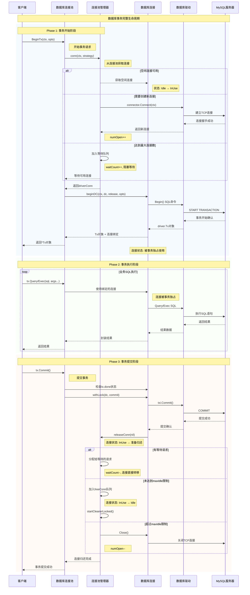
```mermaid
sequenceDiagram
    participant Client as 客户端
    participant DB as 数据库连接池
    participant Pool as 连接池管理器
    participant Conn as 数据库连接
    participant Driver as 数据库驱动
    participant MySQL as MySQL服务器
    
    Note over Client,MySQL: 数据库事务完整生命周期
    
    rect rgb(245, 250, 255)
        Note over Client,Pool: Phase 1: 事务开始阶段
        
        Client->>DB: BeginTx(ctx, opts)
        Note right of DB: 开始事务请求
        
        DB->>Pool: conn(ctx, strategy)
        Note right of Pool: 从连接池获取连接
        
        alt 空闲连接可用
            Pool-->>Conn: 获取空闲连接
            Note right of Conn: 状态: Idle → InUse
        else 需要创建新连接
            Pool->>Driver: connector.Connect(ctx)
            Driver->>MySQL: 建立TCP连接
            MySQL-->>Driver: 连接握手成功
            Driver-->>Pool: 返回新连接
            Note right of Pool: numOpen++
        else 达到最大连接数
            Pool->>Pool: 加入等待队列
            Note right of Pool: waitCount++, 阻塞等待
            Pool-->>DB: 等待可用连接
        end
        
        Pool-->>DB: 返回driverConn
        
        DB->>Conn: beginDC(ctx, dc, release, opts)
        Conn->>Driver: Begin() SQL命令
        Driver->>MySQL: START TRANSACTION
        MySQL-->>Driver: 事务开始确认
        Driver-->>Conn: driver.Tx对象
        
        Conn-->>DB: Tx对象 + 连接绑定
        DB-->>Client: 返回*Tx对象
        
        Note over Conn: 连接状态: 被事务独占使用
    end
    
    rect rgb(250, 255, 250)
        Note over Client,MySQL: Phase 2: 事务执行阶段
        
        loop 业务SQL执行
            Client->>DB: tx.Query/Exec(sql, args...)
            DB->>Conn: 使用绑定的连接
            Note right of Conn: 连接被事务独占
            Conn->>Driver: Query/Exec SQL
            Driver->>MySQL: 执行SQL语句
            MySQL-->>Driver: 返回结果
            Driver-->>Conn: 结果数据
            Conn-->>DB: 封装结果
            DB-->>Client: 返回结果
        end
    end
    
    rect rgb(255, 250, 245)
        Note over Client,MySQL: Phase 3: 事务提交阶段
        
        Client->>DB: tx.Commit()
        Note right of DB: 提交事务
        
        DB->>Conn: 检查tx.done状态
        DB->>Conn: withLock(dc, commit)
        Conn->>Driver: txi.Commit()
        Driver->>MySQL: COMMIT
        MySQL-->>Driver: 提交成功
        Driver-->>Conn: 提交确认
        
        Conn->>Pool: releaseConn(nil)
        Note right of Pool: 连接状态: InUse → 准备归还
        
        alt 有等待请求
            Pool->>Pool: 分配给等待的请求
            Note right of Pool: waitCount--, 连接直接转移
        else 未达到maxIdle限制
            Pool->>Pool: 加入freeConn队列
            Note right of Pool: 连接状态: InUse → Idle
            Pool->>Pool: startCleanerLocked()
        else 超过maxIdle限制
            Pool->>Conn: Close()
            Conn->>MySQL: 关闭TCP连接
            Note right of Pool: numOpen--
        end
        
        Pool-->>DB: 连接归还完成
        DB-->>Client: 事务提交成功
    end
```

### 2. 事务回滚场景时序图

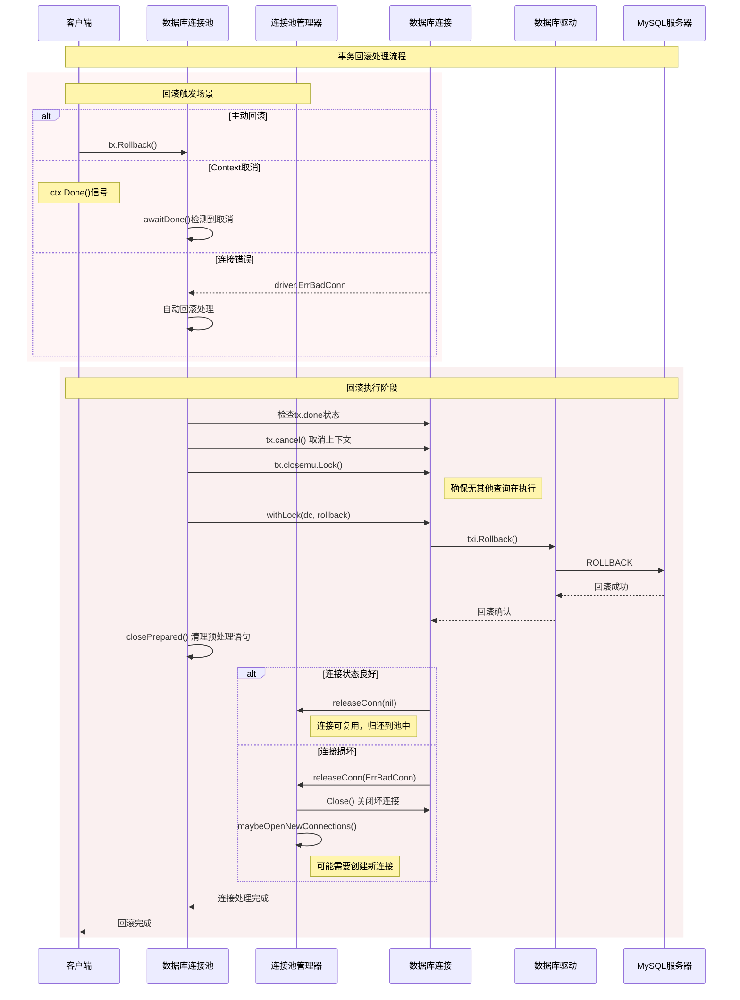
```mermaid
sequenceDiagram
    participant Client as 客户端
    participant DB as 数据库连接池  
    participant Pool as 连接池管理器
    participant Conn as 数据库连接
    participant Driver as 数据库驱动
    participant MySQL as MySQL服务器
    
    Note over Client,MySQL: 事务回滚处理流程
    
    rect rgb(255, 245, 245)
        Note over Client,Pool: 回滚触发场景
        
        alt 主动回滚
            Client->>DB: tx.Rollback()
        else Context取消
            Note over Client: ctx.Done()信号
            DB->>DB: awaitDone()检测到取消
        else 连接错误
            Conn-->>DB: driver.ErrBadConn
            DB->>DB: 自动回滚处理
        end
    end
    
    rect rgb(250, 240, 240)
        Note over Client,MySQL: 回滚执行阶段
        
        DB->>Conn: 检查tx.done状态
        DB->>Conn: tx.cancel() 取消上下文
        
        DB->>Conn: tx.closemu.Lock()
        Note right of Conn: 确保无其他查询在执行
        
        DB->>Conn: withLock(dc, rollback)
        Conn->>Driver: txi.Rollback()
        Driver->>MySQL: ROLLBACK
        MySQL-->>Driver: 回滚成功
        Driver-->>Conn: 回滚确认
        
        DB->>DB: closePrepared() 清理预处理语句
        
        alt 连接状态良好
            Conn->>Pool: releaseConn(nil)
            Note right of Pool: 连接可复用，归还到池中
        else 连接损坏
            Conn->>Pool: releaseConn(ErrBadConn)
            Pool->>Conn: Close() 关闭坏连接
            Pool->>Pool: maybeOpenNewConnections()
            Note right of Pool: 可能需要创建新连接
        end
        
        Pool-->>DB: 连接处理完成
        DB-->>Client: 回滚完成
    end
```

## 数据库连接池完整架构图

### 1. 连接池核心架构与管理功能

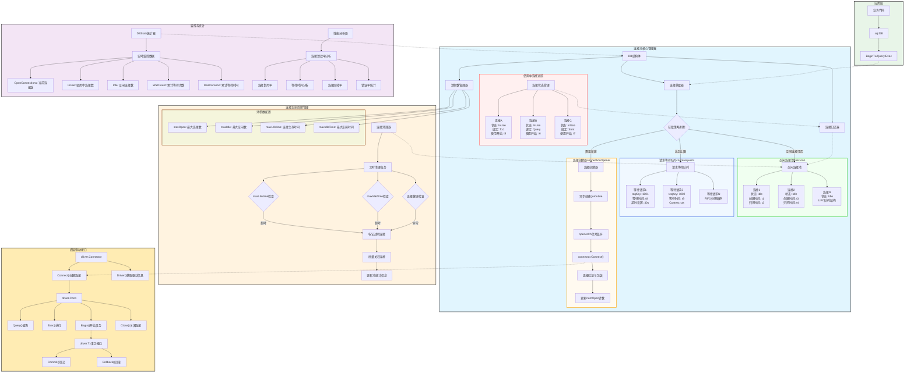
```mermaid
graph TB
    subgraph APP_LAYER ["应用层"]
        A["业务代码"] --> B["sql.DB"]
        B --> C["BeginTx/Query/Exec"]
    end
    
    subgraph POOL_MANAGER ["连接池核心管理器"]
        D["DB结构体"] --> E["连接获取器"]
        D --> F["连接归还器"]
        D --> G["池参数管理器"]
        
        E --> H{"获取策略判断"}
        H -->|"空闲连接可用"| I["空闲连接池"]
        H -->|"需要新建"| J["连接创建器"]
        H -->|"达到上限"| K["请求等待队列"]
        
        subgraph FREE_POOL ["空闲连接池freeConn"]
            I --> I1["连接1<br/>状态: Idle<br/>创建时间: t1<br/>归还时间: t2"]
            I --> I2["连接2<br/>状态: Idle<br/>创建时间: t3<br/>归还时间: t4"]
            I --> I3["连接N<br/>状态: Idle<br/>LIFO队列结构"]
        end
        
        subgraph IN_USE_TRACK ["使用中连接追踪"]
            L["连接状态管理"]
            L --> L1["连接A<br/>状态: InUse<br/>绑定: Tx1<br/>使用开始: t5"]
            L --> L2["连接B<br/>状态: InUse<br/>绑定: Query<br/>使用开始: t6"]
            L --> L3["连接C<br/>状态: InUse<br/>绑定: Stmt<br/>使用开始: t7"]
        end
        
        subgraph WAIT_QUEUE ["请求等待队列connRequests"]
            K --> K1["等待请求1<br/>reqKey: 1001<br/>等待时间: t8<br/>超时设置: 30s"]
            K --> K2["等待请求2<br/>reqKey: 1002<br/>等待时间: t9<br/>Context: ctx"]
            K --> K3["等待请求N<br/>FIFO处理顺序"]
        end
        
        subgraph CONN_OPENER ["连接创建器connectionOpener"]
            J --> J1["异步创建goroutine"]
            J1 --> J2["openerCh信号监听"]
            J2 --> J3["connector.Connect()"]
            J3 --> J4["连接验证与包装"]
            J4 --> J5["更新numOpen计数"]
        end
    end
    
    subgraph LIFECYCLE ["连接生命周期管理"]
        M["连接清理器"] --> N["定时清理任务"]
        N --> N1{"maxLifetime检查"}
        N --> N2{"maxIdleTime检查"}
        N --> N3{"连接健康检查"}
        
        N1 -->|"超时"| O["标记过期连接"]
        N2 -->|"超时"| O
        N3 -->|"异常"| O
        O --> P["批量关闭连接"]
        P --> Q["更新池统计信息"]
        
        subgraph POOL_CONFIG ["池参数配置"]
            G --> G1["maxOpen: 最大连接数"]
            G --> G2["maxIdle: 最大空闲数"] 
            G --> G3["maxLifetime: 连接生存时间"]
            G --> G4["maxIdleTime: 最大空闲时间"]
        end
    end
    
    subgraph MONITORING ["监控与统计"]
        R["DBStats统计器"] --> S["实时监控数据"]
        S --> S1["OpenConnections: 当前连接数"]
        S --> S2["InUse: 使用中连接数"]
        S --> S3["Idle: 空闲连接数"]
        S --> S4["WaitCount: 累计等待次数"]
        S --> S5["WaitDuration: 累计等待时间"]
        
        T["性能分析器"] --> U["连接池效率分析"]
        U --> U1["连接复用率"]
        U --> U2["等待时间分析"]
        U --> U3["连接周转率"]
        U --> U4["错误率统计"]
    end
    
    subgraph DRIVER_INTERFACE ["底层驱动接口"]
        V["driver.Connector"] --> W["Connect()创建连接"]
        V --> X["Driver()获取驱动信息"]
        
        W --> Y["driver.Conn"]
        Y --> Y1["Query()查询"]
        Y --> Y2["Exec()执行"]
        Y --> Y3["Begin()开始事务"]
        Y --> Y4["Close()关闭连接"]
        
        Z["driver.Tx事务接口"]
        Z --> Z1["Commit()提交"]
        Z --> Z2["Rollback()回滚"]
    end
    
    C -.-> E
    F -.-> I
    L -.-> F
    M -.-> I
    R -.-> D
    J3 -.-> W
    Y3 -.-> Z
    
    style APP_LAYER fill:#e8f5e8,stroke:#333,stroke-width:2px
    
    style POOL_MANAGER fill:#e1f5fe,stroke:#333,stroke-width:2px
    
    style LIFECYCLE fill:#fff3e0,stroke:#333,stroke-width:2px
    
    style MONITORING fill:#f3e5f5,stroke:#333,stroke-width:2px
    
    style DRIVER_INTERFACE fill:#ffecb3,stroke:#333,stroke-width:2px
    
    style FREE_POOL fill:#f0fff0,stroke:#32cd32,stroke-width:2px
    
    style IN_USE_TRACK fill:#fff0f0,stroke:#ff6b6b,stroke-width:2px
    
    style WAIT_QUEUE fill:#f0f8ff,stroke:#4169e1,stroke-width:2px
    
    style CONN_OPENER fill:#fffaf0,stroke:#ffa500,stroke-width:2px
    
    style POOL_CONFIG fill:#f5f5dc,stroke:#8b4513,stroke-width:2px
```

### 2. 连接状态转换与池管理流程

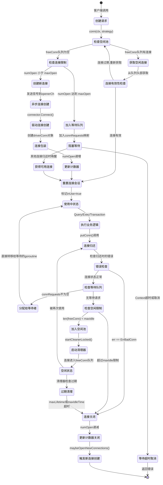
```mermaid
stateDiagram-v2
    [*] --> 创建请求: 客户端调用
    
    创建请求 --> 检查空闲池: conn(ctx, strategy)
    
    检查空闲池 --> 获取空闲连接: freeConn队列有连接
    检查空闲池 --> 检查连接限制: freeConn队列为空
    
    获取空闲连接 --> 连接有效性检查: 从队列头部获取
    连接有效性检查 --> 重置连接会话: 连接有效
    连接有效性检查 --> 检查空闲池: 连接过期,重新获取
    
    检查连接限制 --> 创建新连接: numOpen 小于 maxOpen
    检查连接限制 --> 加入等待队列: numOpen 达到 maxOpen
    
    创建新连接 --> 异步连接创建: 发送信号到openerCh
    异步连接创建 --> 驱动连接创建: connector.Connect()
    驱动连接创建 --> 连接包装: 创建driverConn对象
    连接包装 --> 更新计数器: numOpen递增
    更新计数器 --> 重置连接会话
    
    加入等待队列 --> 阻塞等待: 加入connRequests映射
    阻塞等待 --> 获得可用连接: 其他连接归还时唤醒
    阻塞等待 --> 等待超时取消: Context超时或取消
    获得可用连接 --> 重置连接会话
    
    重置连接会话 --> 使用中状态: 标记inUse=true
    使用中状态 --> 执行业务逻辑: Query/Exec/Transaction
    
    执行业务逻辑 --> 连接归还: putConn()调用
    等待超时取消 --> [*]: 返回错误
    
    连接归还 --> 错误检查: 检查归还时的错误
    错误检查 --> 连接关闭: err == ErrBadConn
    错误检查 --> 检查等待队列: 连接状态正常
    
    连接关闭 --> 更新计数器关闭: numOpen递减
    更新计数器关闭 --> 触发新连接创建: maybeOpenNewConnections()
    触发新连接创建 --> [*]
    
    检查等待队列 --> 分配给等待者: connRequests不为空
    检查等待队列 --> 检查空闲限制: 无等待请求
    
    分配给等待者 --> 使用中状态: 直接转移给等待的goroutine
    
    检查空闲限制 --> 加入空闲池: len(freeConn) < maxIdle
    检查空闲限制 --> 连接关闭: 超过maxIdle限制
    
    加入空闲池 --> 启动清理器: startCleanerLocked()
    启动清理器 --> 空闲状态: 连接进入freeConn队列
    
    空闲状态 --> 连接归还: 被再次使用
    空闲状态 --> 过期清理: 清理器检查过期
    
    过期清理 --> 连接关闭: maxLifetime或maxIdleTime超时
```

### 3. 连接池监控与健康检查架构

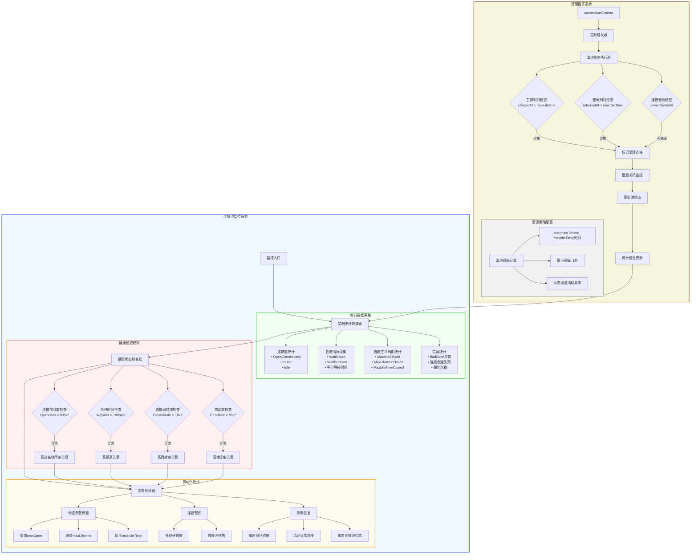
```mermaid
graph TB
    subgraph MONITOR_SYS ["连接池监控系统"]
        A["监控入口"] --> B["实时统计收集器"]
        B --> C["健康状态检查器"]
        C --> D["告警处理器"]
        
        subgraph STATS_COLLECTION ["统计数据采集"]
            B --> B1["连接数统计<br/>• OpenConnections<br/>• InUse<br/>• Idle"]
            
            B --> B2["性能指标采集<br/>• WaitCount<br/>• WaitDuration<br/>• 平均等待时间"]
            
            B --> B3["连接生命周期统计<br/>• MaxIdleClosed<br/>• MaxLifetimeClosed<br/>• MaxIdleTimeClosed"]
            
            B --> B4["错误统计<br/>• BadConn次数<br/>• 连接创建失败<br/>• 超时次数"]
        end
        
        subgraph HEALTH_RULES ["健康检查规则"]
            C --> C1{"连接使用率检查<br/>Open/Max > 80%?"}
            C --> C2{"等待时间检查<br/>AvgWait > 100ms?"}
            C --> C3{"连接周转率检查<br/>ClosedRate > 10x?"}
            C --> C4{"错误率检查<br/>ErrorRate > 5%?"}
            
            C1 -->|"异常"| E["高连接使用率告警"]
            C2 -->|"异常"| F["高延迟告警"]
            C3 -->|"异常"| G["高周转率告警"] 
            C4 -->|"异常"| H["高错误率告警"]
        end
        
        subgraph AUTO_HANDLE ["自动化处理"]
            D --> D1["动态参数调整"]
            D --> D2["连接预热"]
            D --> D3["故障恢复"]
            
            D1 --> D11["增加maxOpen"]
            D1 --> D12["调整maxLifetime"]
            D1 --> D13["优化maxIdleTime"]
            
            D2 --> D21["预创建连接"]
            D2 --> D22["连接池预热"]
            
            D3 --> D31["重建损坏连接"]
            D3 --> D32["清理异常连接"]
            D3 --> D33["重置连接池状态"]
        end
    end
    
    subgraph CLEANER_SYS ["清理器子系统"]
        I["connectionCleaner"] --> J["定时触发器"]
        J --> K["清理策略执行器"]
        
        K --> K1{"生存时间检查<br/>createdAt + maxLifetime"}
        K --> K2{"空闲时间检查<br/>returnedAt + maxIdleTime"}
        K --> K3{"连接健康检查<br/>driver.Validator"}
        
        K1 -->|"过期"| L["标记清理连接"]
        K2 -->|"过期"| L
        K3 -->|"不健康"| L
        
        L --> M["批量关闭连接"]
        M --> N["更新池状态"]
        N --> O["统计信息更新"]
        
        subgraph CLEAN_CONFIG ["清理策略配置"]
            P["清理间隔计算"]
            P --> P1["min(maxLifetime, maxIdleTime)时间"]
            P --> P2["最小间隔: 1秒"]
            P --> P3["动态调整清理频率"]
        end
    end
    
    E --> D
    F --> D  
    G --> D
    H --> D
    
    O --> B
    
    style MONITOR_SYS fill:#f0f8ff,stroke:#4169e1,stroke-width:2px
    
    style STATS_COLLECTION fill:#f0fff0,stroke:#32cd32,stroke-width:2px
    
    style HEALTH_RULES fill:#fff0f0,stroke:#ff6b6b,stroke-width:2px
    
    style AUTO_HANDLE fill:#fffaf0,stroke:#ffa500,stroke-width:2px
    
    style CLEANER_SYS fill:#f5f5dc,stroke:#8b4513,stroke-width:2px
    
    style CLEAN_CONFIG fill:#f0f0f0,stroke:#666,stroke-width:1px
```

## 总结

Go的database/sql连接池实现了一个完整而高效的数据库连接管理系统：

1. **智能连接管理**: 自动处理连接创建、复用、回收
2. **并发安全**: 完善的锁机制保证多goroutine安全访问
3. **生命周期控制**: 支持连接超时、空闲超时等策略
4. **错误恢复**: 自动检测坏连接并重试
5. **性能优化**: 连接池、语句缓存、批量操作等优化
6. **事务支持**: 完整的事务生命周期管理与连接绑定
7. **监控与诊断**: 全面的统计信息和健康检查机制

理解连接池原理有助于：

- 正确配置连接池参数
- 诊断数据库性能问题
- 优化应用数据库访问模式
- 实现高性能数据库应用
- 设计可靠的事务处理逻辑

掌握连接池机制是Go数据库编程的重要技能。

## **数据库连接池协程分析**

### **1. 数据库连接池的协程使用模式**

每个`*sql.DB`实例会创建固定数量的后台协程来管理连接池：

#### **1.1 核心协程架构**

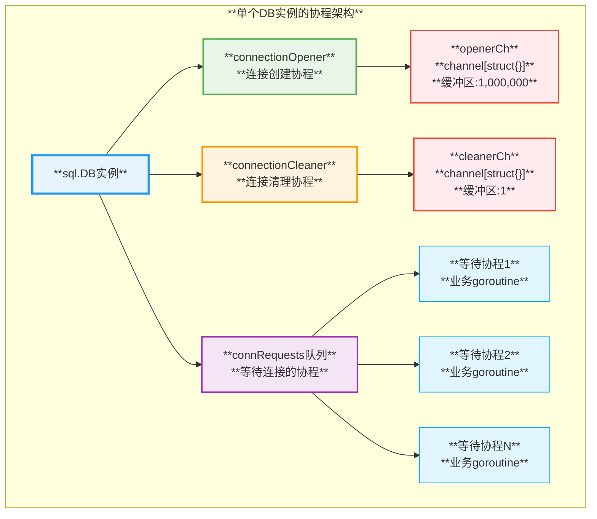
```mermaid
graph TB
    subgraph DB_INSTANCE ["**单个DB实例的协程架构**"]
        DB["**sql.DB实例**"] --> CO["**connectionOpener**<br/>**连接创建协程**"]
        DB --> CC["**connectionCleaner**<br/>**连接清理协程**"]
        DB --> CR["**connRequests队列**<br/>**等待连接的协程**"]
        
        CO --> OPENER_CHANNEL["**openerCh**<br/>**channel[struct{}]**<br/>**缓冲区:1,000,000**"]
        CC --> CLEANER_CHANNEL["**cleanerCh**<br/>**channel[struct{}]**<br/>**缓冲区:1**"]
        
        CR --> WAITING_GO1["**等待协程1**<br/>**业务goroutine**"]
        CR --> WAITING_GO2["**等待协程2**<br/>**业务goroutine**"]
        CR --> WAITING_GON["**等待协程N**<br/>**业务goroutine**"]
        
        style DB fill:#E8F4FD,stroke:#2196F3,stroke-width:3px
        style CO fill:#E8F5E8,stroke:#4CAF50,stroke-width:2px
        style CC fill:#FFF3E0,stroke:#FF9800,stroke-width:2px
        style CR fill:#F3E5F5,stroke:#9C27B0,stroke-width:2px
        style OPENER_CHANNEL fill:#FFEBEE,stroke:#F44336,stroke-width:2px
        style CLEANER_CHANNEL fill:#FFEBEE,stroke:#F44336,stroke-width:2px
        style WAITING_GO1 fill:#E1F5FE,stroke:#03A9F4,stroke-width:1px
        style WAITING_GO2 fill:#E1F5FE,stroke:#03A9F4,stroke-width:1px
        style WAITING_GON fill:#E1F5FE,stroke:#03A9F4,stroke-width:1px
    end
```

#### **1.2 协程数量分析**

**每个DB实例的固定协程开销：**

```go
// 来自src/database/sql/sql.go
func OpenDB(c driver.Connector) *DB {
    ctx, cancel := context.WithCancel(context.Background())
    db := &DB{
        connector: c,
        openerCh:  make(chan struct{}, connectionRequestQueueSize), // 1,000,000缓冲
        // ...
        stop:      cancel,
    }
    
    go db.connectionOpener(ctx)  // 启动1个connectionOpener协程
    
    return db
}

// connectionCleaner在需要时启动
func (db *DB) startCleanerLocked() {
    if (db.maxLifetime > 0 || db.maxIdleTime > 0) && db.numOpen > 0 && db.cleanerCh == nil {
        db.cleanerCh = make(chan struct{}, 1)
        go db.connectionCleaner(db.shortestIdleTimeLocked()) // 启动1个cleaner协程
    }
}
```

**协程开销总结：**

- **固定协程**: 每个DB实例 = **2个协程**
  - 1个 `connectionOpener`
  - 1个 `connectionCleaner`（按需启动）
- **等待协程**: 动态数量，取决于并发请求数

### **2. 数据库连接池协程工作流图**

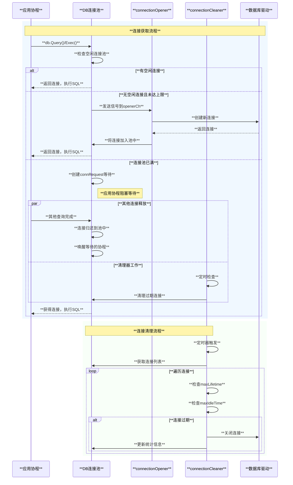
```mermaid
sequenceDiagram
    participant APP as **应用协程**
    participant DB as **DB连接池**
    participant CO as **connectionOpener**
    participant CC as **connectionCleaner**
    participant DRIVER as **数据库驱动**
    
    rect rgb(240, 248, 255)
        Note over APP,DRIVER: **连接获取流程**
        
        APP->>DB: **db.Query()/Exec()**
        DB->>DB: **检查空闲连接池**
        
        alt **有空闲连接**
            DB-->>APP: **返回连接，执行SQL**
        else **无空闲连接且未达上限**
            DB->>CO: **发送信号到openerCh**
            CO->>DRIVER: **创建新连接**
            DRIVER-->>CO: **返回连接**
            CO->>DB: **将连接加入池中**
            DB-->>APP: **返回连接，执行SQL**
        else **连接池已满**
            DB->>DB: **创建connRequest等待**
            Note right of DB: **应用协程阻塞等待**
            
            par **其他连接释放**
                APP->>DB: **其他查询完成**
                DB->>DB: **连接归还到池中**
                DB->>DB: **唤醒等待的协程**
            and **清理器工作**
                CC->>CC: **定时检查**
                CC->>DB: **清理过期连接**
            end
            
            DB-->>APP: **获得连接，执行SQL**
        end
    end
    
    rect rgb(248, 255, 248)
        Note over CC,DB: **连接清理流程**
        
        CC->>CC: **定时器触发**
        CC->>DB: **获取连接列表**
        
        loop **遍历连接**
            CC->>CC: **检查maxLifetime**
            CC->>CC: **检查maxIdleTime**
            
            alt **连接过期**
                CC->>DRIVER: **关闭连接**
                CC->>DB: **更新统计信息**
            end
        end
    end
```

### **3. 大规模数据库访问的协程开销分析**

#### **3.1 访问上万个数据库的协程计算**

假设一个Go程序需要访问**10,000个不同的数据库**：

```go
// 示例：多数据库访问场景
type MultiDBManager struct {
    databases map[string]*sql.DB
}

func (m *MultiDBManager) InitializeDatabases() {
    m.databases = make(map[string]*sql.DB)
    
    for i := 0; i < 10000; i++ {
        dbName := fmt.Sprintf("database_%d", i)
        dsn := fmt.Sprintf("user:pass@tcp(host%d:3306)/%s", i, dbName)
        
        db, err := sql.Open("mysql", dsn)
        if err != nil {
            continue
        }
        
        // 配置连接池
        db.SetMaxOpenConns(100)    // 最大100个连接
        db.SetMaxIdleConns(10)     // 最大10个空闲连接
        db.SetConnMaxLifetime(1 * time.Hour)
        
        m.databases[dbName] = db
    }
}
```

**协程开销计算：**

| **组件** | **单DB协程数** | **10,000个DB** | **总协程数** |
|---------|----------------|----------------|-------------|
| **connectionOpener** | **1** | **×10,000** | **10,000** |
| **connectionCleaner** | **1** | **×10,000** | **10,000** |
| **基础协程小计** | **2** | **×10,000** | **20,000** |
| **等待协程(峰值)** | **0-1000+** | **×10,000** | **0-10,000,000+** |
| **总计(最小)** | **2** | **×10,000** | **≥20,000** |

#### **3.2 协程开销内存分析**

```go
// 每个协程的内存开销（Go 1.21+）
const (
    GoroutineStackSize = 2048  // 初始栈大小: 2KB
    GoroutineHeader    = 128   // 协程控制结构: ~128B  
    ChannelOverhead    = 96    // channel开销: ~96B
)

// 10,000个数据库的内存开销
func CalculateMemoryOverhead() {
    basicGoroutines := 20000 // connectionOpener + connectionCleaner
    
    stackMemory := basicGoroutines * GoroutineStackSize    // 40MB
    headerMemory := basicGoroutines * GoroutineHeader      // 2.5MB
    channelMemory := 20000 * ChannelOverhead              // 1.9MB
    
    totalBasicOverhead := stackMemory + headerMemory + channelMemory // ~44.4MB
    
    fmt.Printf("基础协程内存开销: %.2f MB\n", float64(totalBasicOverhead)/1024/1024)
    
    // 业务协程(峰值并发1000万时)
    if maxConcurrentQueries := 10000000; maxConcurrentQueries > 0 {
        businessGoroutines := maxConcurrentQueries
        businessMemory := businessGoroutines * (GoroutineStackSize + GoroutineHeader)
        
        fmt.Printf("业务协程内存开销(峰值): %.2f GB\n", 
            float64(businessMemory)/1024/1024/1024)
    }
}
```

### **4. 性能瓶颈分析**

#### **4.1 主要性能瓶颈**

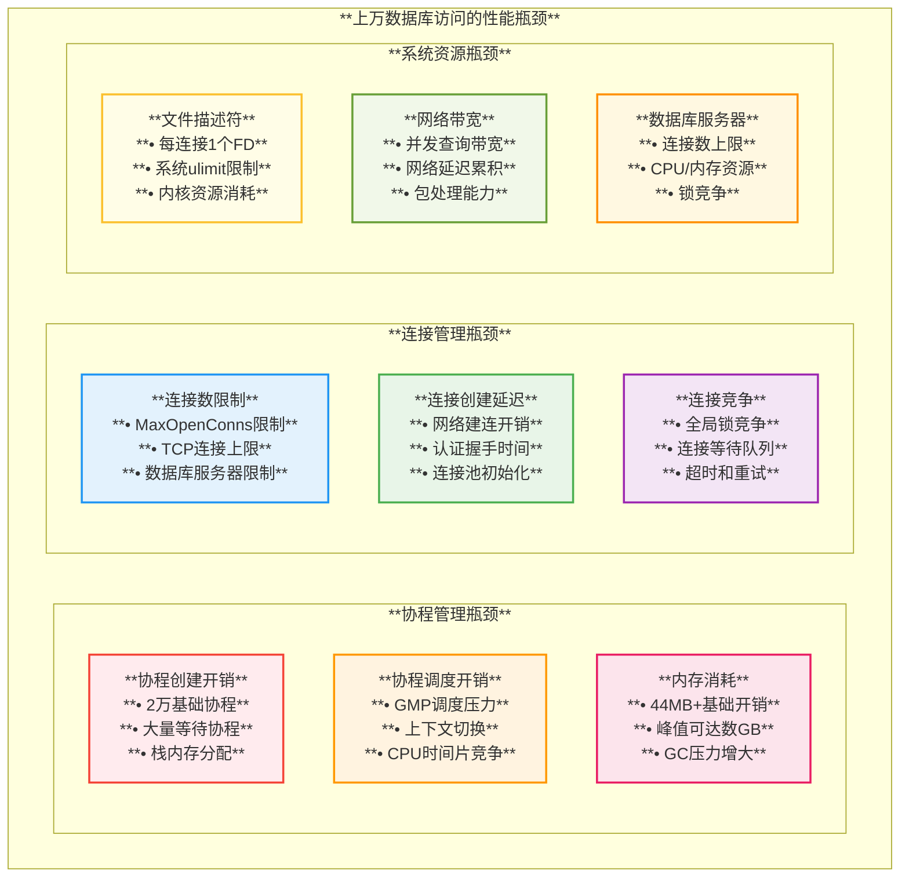
```mermaid
graph TB
    subgraph BOTTLENECKS ["**上万数据库访问的性能瓶颈**"]
        
        subgraph GOROUTINE_BOTTLENECK ["**协程管理瓶颈**"]
            GB1["**协程创建开销**<br/>**• 2万基础协程**<br/>**• 大量等待协程**<br/>**• 栈内存分配**"]
            GB2["**协程调度开销**<br/>**• GMP调度压力**<br/>**• 上下文切换**<br/>**• CPU时间片竞争**"]
            GB3["**内存消耗**<br/>**• 44MB+基础开销**<br/>**• 峰值可达数GB**<br/>**• GC压力增大**"]
            
            style GB1 fill:#FFEBEE,stroke:#F44336,stroke-width:2px
            style GB2 fill:#FFF3E0,stroke:#FF9800,stroke-width:2px
            style GB3 fill:#FCE4EC,stroke:#E91E63,stroke-width:2px
        end
        
        subgraph CONNECTION_BOTTLENECK ["**连接管理瓶颈**"]
            CB1["**连接数限制**<br/>**• MaxOpenConns限制**<br/>**• TCP连接上限**<br/>**• 数据库服务器限制**"]
            CB2["**连接创建延迟**<br/>**• 网络建连开销**<br/>**• 认证握手时间**<br/>**• 连接池初始化**"]
            CB3["**连接竞争**<br/>**• 全局锁竞争**<br/>**• 连接等待队列**<br/>**• 超时和重试**"]
            
            style CB1 fill:#E3F2FD,stroke:#2196F3,stroke-width:2px
            style CB2 fill:#E8F5E8,stroke:#4CAF50,stroke-width:2px
            style CB3 fill:#F3E5F5,stroke:#9C27B0,stroke-width:2px
        end
        
        subgraph SYSTEM_BOTTLENECK ["**系统资源瓶颈**"]
            SB1["**文件描述符**<br/>**• 每连接1个FD**<br/>**• 系统ulimit限制**<br/>**• 内核资源消耗**"]
            SB2["**网络带宽**<br/>**• 并发查询带宽**<br/>**• 网络延迟累积**<br/>**• 包处理能力**"]
            SB3["**数据库服务器**<br/>**• 连接数上限**<br/>**• CPU/内存资源**<br/>**• 锁竞争**"]
            
            style SB1 fill:#FFFDE7,stroke:#FBC02D,stroke-width:2px
            style SB2 fill:#F1F8E9,stroke:#689F38,stroke-width:2px
            style SB3 fill:#FFF8E1,stroke:#FF8F00,stroke-width:2px
        end
    end
```

#### **4.2 性能优化策略**

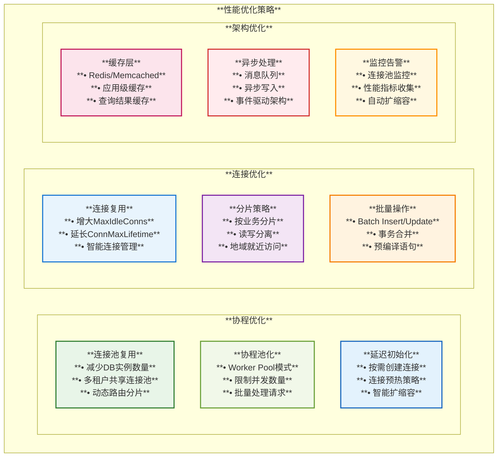
```mermaid
graph TB
    subgraph OPTIMIZATION ["**性能优化策略**"]
        
        subgraph GOROUTINE_OPT ["**协程优化**"]
            GO1["**连接池复用**<br/>**• 减少DB实例数量**<br/>**• 多租户共享连接池**<br/>**• 动态路由分片**"]
            GO2["**协程池化**<br/>**• Worker Pool模式**<br/>**• 限制并发数量**<br/>**• 批量处理请求**"]
            GO3["**延迟初始化**<br/>**• 按需创建连接**<br/>**• 连接预热策略**<br/>**• 智能扩缩容**"]
            
            style GO1 fill:#E8F5E8,stroke:#2E7D32,stroke-width:2px
            style GO2 fill:#F1F8E9,stroke:#689F38,stroke-width:2px
            style GO3 fill:#E3F2FD,stroke:#1565C0,stroke-width:2px
        end
        
        subgraph CONNECTION_OPT ["**连接优化**"]
            CO1["**连接复用**<br/>**• 增大MaxIdleConns**<br/>**• 延长ConnMaxLifetime**<br/>**• 智能连接管理**"]
            CO2["**分片策略**<br/>**• 按业务分片**<br/>**• 读写分离**<br/>**• 地域就近访问**"]
            CO3["**批量操作**<br/>**• Batch Insert/Update**<br/>**• 事务合并**<br/>**• 预编译语句**"]
            
            style CO1 fill:#E8F4FD,stroke:#1976D2,stroke-width:2px
            style CO2 fill:#F3E5F5,stroke:#7B1FA2,stroke-width:2px
            style CO3 fill:#FFF3E0,stroke:#F57C00,stroke-width:2px
        end
        
        subgraph ARCHITECTURE_OPT ["**架构优化**"]
            AO1["**缓存层**<br/>**• Redis/Memcached**<br/>**• 应用级缓存**<br/>**• 查询结果缓存**"]
            AO2["**异步处理**<br/>**• 消息队列**<br/>**• 异步写入**<br/>**• 事件驱动架构**"]
            AO3["**监控告警**<br/>**• 连接池监控**<br/>**• 性能指标收集**<br/>**• 自动扩缩容**"]
            
            style AO1 fill:#FCE4EC,stroke:#C2185B,stroke-width:2px
            style AO2 fill:#FFEBEE,stroke:#D32F2F,stroke-width:2px
            style AO3 fill:#FFF8E1,stroke:#FF8F00,stroke-width:2px
        end
    end
```

### **5. 实际应用建议**

#### **5.1 合理的数据库访问架构**

```go
// 推荐：分层数据库管理架构
type DBManager struct {
    // 按业务分片，而非按数据库分片
    shards map[string]*DBShard
    
    // 连接池复用
    poolManager *ConnectionPoolManager
    
    // 路由器
    router *DatabaseRouter
}

type DBShard struct {
    // 每个分片包含多个数据库的连接
    databases []*sql.DB
    
    // 负载均衡器
    loadBalancer LoadBalancer
    
    // 连接池配置
    config *PoolConfig
}

// 建议配置
type PoolConfig struct {
    MaxOpenConns    int `default:"20"`     // 降低单DB连接数
    MaxIdleConns    int `default:"5"`      // 适中的空闲连接数
    ConnMaxLifetime time.Duration `default:"1h"`
    ConnMaxIdleTime time.Duration `default:"15m"`
}
```

#### **5.2 性能监控指标**

```go
type PerformanceMetrics struct {
    // 协程监控
    ActiveGoroutines    int64   // 活跃协程数
    WaitingGoroutines   int64   // 等待协程数
    GoroutineCreated    int64   // 累计创建协程数
    
    // 连接监控  
    TotalDBInstances    int     // DB实例总数
    ActiveConnections   int     // 活跃连接数
    IdleConnections     int     // 空闲连接数
    ConnectionWaitTime  time.Duration // 平均等待时间
    
    // 系统资源监控
    MemoryUsage         uint64  // 内存使用量
    FileDescriptors     int     // 文件描述符数量
    NetworkConnections  int     // 网络连接数
}

func (m *DBManager) MonitorPerformance() *PerformanceMetrics {
    metrics := &PerformanceMetrics{}
    
    // 收集协程信息
    metrics.ActiveGoroutines = int64(runtime.NumGoroutine())
    
    // 收集连接池信息
    for _, shard := range m.shards {
        for _, db := range shard.databases {
            stats := db.Stats()
            metrics.ActiveConnections += stats.InUse
            metrics.IdleConnections += stats.Idle
            metrics.ConnectionWaitTime += stats.WaitDuration
        }
    }
    
    return metrics
}
```

### **协程使用要点总结**

- **每个DB实例固定消耗2个协程**：connectionOpener + connectionCleaner
- **访问10,000个数据库将产生20,000个基础协程**，内存开销约44MB
- **主要瓶颈在于大量等待协程和系统资源限制**
- **通过连接池复用、分片策略、批量操作等手段可大幅优化性能**

## **池化技术通用设计抽象**

基于数据库连接池的深入分析，我们可以抽象出池化技术的通用设计原则和核心功能点。池化技术是一种重要的资源管理模式，适用于任何需要复用昂贵资源的场景。

### **1. 池化技术核心概念**

#### **1.1 池化技术定义**

**池化技术**是一种资源管理模式，通过预创建、复用和统一管理一组昂贵资源来提高系统性能，避免频繁的资源创建和销毁开销。

#### **1.2 池化适用场景**

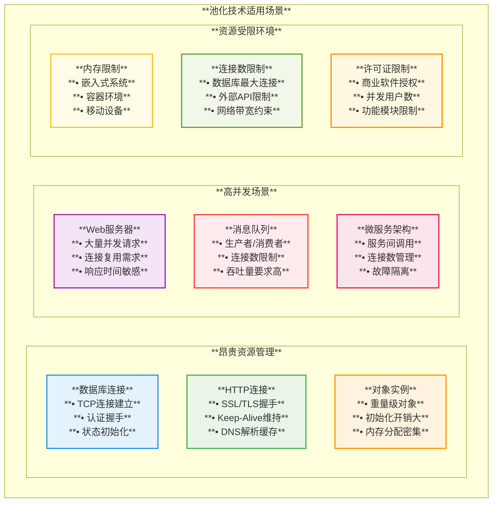
```mermaid
graph TB
    subgraph SCENARIOS ["**池化技术适用场景**"]
        
        subgraph EXPENSIVE_RESOURCES ["**昂贵资源管理**"]
            ER1["**数据库连接**<br/>**• TCP连接建立**<br/>**• 认证握手**<br/>**• 状态初始化**"]
            ER2["**HTTP连接**<br/>**• SSL/TLS握手**<br/>**• Keep-Alive维持**<br/>**• DNS解析缓存**"]
            ER3["**对象实例**<br/>**• 重量级对象**<br/>**• 初始化开销大**<br/>**• 内存分配密集**"]
            
            style ER1 fill:#E3F2FD,stroke:#2196F3,stroke-width:2px
            style ER2 fill:#E8F5E8,stroke:#4CAF50,stroke-width:2px
            style ER3 fill:#FFF3E0,stroke:#FF9800,stroke-width:2px
        end
        
        subgraph HIGH_CONCURRENCY ["**高并发场景**"]
            HC1["**Web服务器**<br/>**• 大量并发请求**<br/>**• 连接复用需求**<br/>**• 响应时间敏感**"]
            HC2["**消息队列**<br/>**• 生产者/消费者**<br/>**• 连接数限制**<br/>**• 吞吐量要求高**"]
            HC3["**微服务架构**<br/>**• 服务间调用**<br/>**• 连接数管理**<br/>**• 故障隔离**"]
            
            style HC1 fill:#F3E5F5,stroke:#9C27B0,stroke-width:2px
            style HC2 fill:#FFEBEE,stroke:#F44336,stroke-width:2px
            style HC3 fill:#FCE4EC,stroke:#E91E63,stroke-width:2px
        end
        
        subgraph RESOURCE_LIMITED ["**资源受限环境**"]
            RL1["**内存限制**<br/>**• 嵌入式系统**<br/>**• 容器环境**<br/>**• 移动设备**"]
            RL2["**连接数限制**<br/>**• 数据库最大连接**<br/>**• 外部API限制**<br/>**• 网络带宽约束**"]
            RL3["**许可证限制**<br/>**• 商业软件授权**<br/>**• 并发用户数**<br/>**• 功能模块限制**"]
            
            style RL1 fill:#FFFDE7,stroke:#FBC02D,stroke-width:2px
            style RL2 fill:#F1F8E9,stroke:#689F38,stroke-width:2px
            style RL3 fill:#FFF8E1,stroke:#FF8F00,stroke-width:2px
        end
    end
```

### **2. 池化技术通用架构**

#### **2.1 核心组件架构**

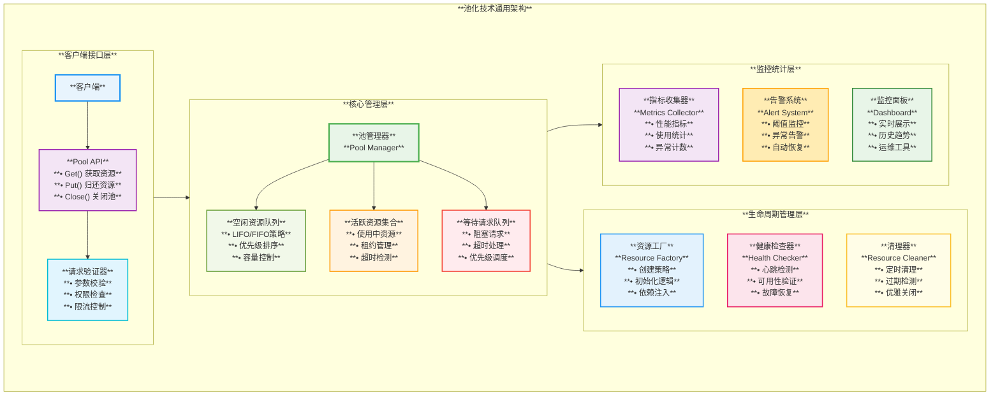
```mermaid
graph TB
    subgraph POOL_ARCHITECTURE ["**池化技术通用架构**"]
        
        subgraph CLIENT_LAYER ["**客户端接口层**"]
            CLIENT["**客户端**"] --> API["**Pool API**<br/>**• Get() 获取资源**<br/>**• Put() 归还资源**<br/>**• Close() 关闭池**"]
            API --> VALIDATOR["**请求验证器**<br/>**• 参数校验**<br/>**• 权限检查**<br/>**• 限流控制**"]
            
            style CLIENT fill:#E8F4FD,stroke:#2196F3,stroke-width:3px
            style API fill:#F3E5F5,stroke:#9C27B0,stroke-width:2px
            style VALIDATOR fill:#E1F5FE,stroke:#00BCD4,stroke-width:2px
        end
        
        subgraph CORE_MANAGEMENT ["**核心管理层**"]
            POOL_MANAGER["**池管理器**<br/>**Pool Manager**"] --> IDLE_QUEUE["**空闲资源队列**<br/>**• LIFO/FIFO策略**<br/>**• 优先级排序**<br/>**• 容量控制**"]
            POOL_MANAGER --> ACTIVE_SET["**活跃资源集合**<br/>**• 使用中资源**<br/>**• 租约管理**<br/>**• 超时检测**"]
            POOL_MANAGER --> WAIT_QUEUE["**等待请求队列**<br/>**• 阻塞请求**<br/>**• 超时处理**<br/>**• 优先级调度**"]
            
            style POOL_MANAGER fill:#E8F5E8,stroke:#4CAF50,stroke-width:3px
            style IDLE_QUEUE fill:#F1F8E9,stroke:#689F38,stroke-width:2px
            style ACTIVE_SET fill:#FFF3E0,stroke:#FF9800,stroke-width:2px
            style WAIT_QUEUE fill:#FFEBEE,stroke:#F44336,stroke-width:2px
        end
        
        subgraph LIFECYCLE_MANAGEMENT ["**生命周期管理层**"]
            FACTORY["**资源工厂**<br/>**Resource Factory**<br/>**• 创建策略**<br/>**• 初始化逻辑**<br/>**• 依赖注入**"]
            VALIDATOR_LC["**健康检查器**<br/>**Health Checker**<br/>**• 心跳检测**<br/>**• 可用性验证**<br/>**• 故障恢复**"]
            CLEANER["**清理器**<br/>**Resource Cleaner**<br/>**• 定时清理**<br/>**• 过期检测**<br/>**• 优雅关闭**"]
            
            style FACTORY fill:#E3F2FD,stroke:#2196F3,stroke-width:2px
            style VALIDATOR_LC fill:#FCE4EC,stroke:#E91E63,stroke-width:2px
            style CLEANER fill:#FFFDE7,stroke:#FBC02D,stroke-width:2px
        end
        
        subgraph MONITORING_LAYER ["**监控统计层**"]
            METRICS["**指标收集器**<br/>**Metrics Collector**<br/>**• 性能指标**<br/>**• 使用统计**<br/>**• 异常计数**"]
            ALERTING["**告警系统**<br/>**Alert System**<br/>**• 阈值监控**<br/>**• 异常告警**<br/>**• 自动恢复**"]
            DASHBOARD["**监控面板**<br/>**Dashboard**<br/>**• 实时展示**<br/>**• 历史趋势**<br/>**• 运维工具**"]
            
            style METRICS fill:#F3E5F5,stroke:#9C27B0,stroke-width:2px
            style ALERTING fill:#FFECB3,stroke:#FFA000,stroke-width:2px
            style DASHBOARD fill:#E8F5E8,stroke:#388E3C,stroke-width:2px
        end
        
        CLIENT_LAYER --> CORE_MANAGEMENT
        CORE_MANAGEMENT --> LIFECYCLE_MANAGEMENT
        CORE_MANAGEMENT --> MONITORING_LAYER
    end
```

#### **2.2 资源状态流转**

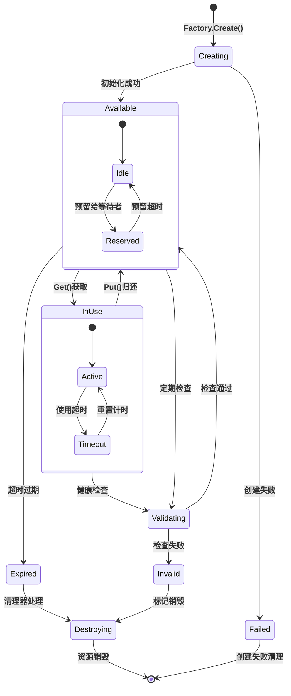
```mermaid
stateDiagram-v2
    [*] --> Creating: **Factory.Create()**
    Creating --> Available: **初始化成功**
    Creating --> Failed: **创建失败**
    
    Available --> InUse: **Get()获取**
    InUse --> Available: **Put()归还**
    InUse --> Validating: **健康检查**
    
    Available --> Validating: **定期检查**
    Validating --> Available: **检查通过**
    Validating --> Invalid: **检查失败**
    
    Available --> Expired: **超时过期**
    Expired --> Destroying: **清理器处理**
    Invalid --> Destroying: **标记销毁**
    
    Destroying --> [*]: **资源销毁**
    Failed --> [*]: **创建失败清理**
    
    state Available {
        [*] --> Idle
        Idle --> Reserved: **预留给等待者**
        Reserved --> Idle: **预留超时**
    }
    
    state InUse {
        [*] --> Active
        Active --> Timeout: **使用超时**
        Timeout --> Active: **重置计时**
    }
```

### **3. 池化技术核心功能点**

#### **3.1 资源管理功能**

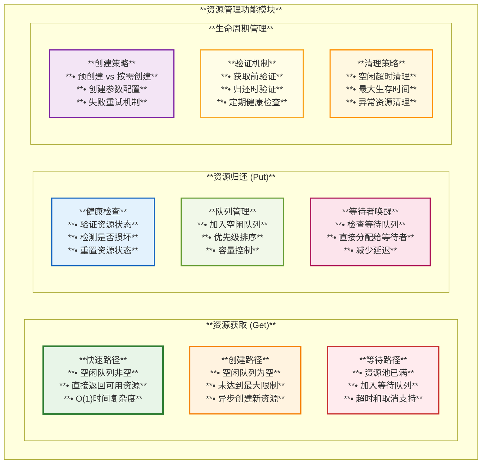
```mermaid
graph TB
    subgraph RESOURCE_MANAGEMENT ["**资源管理功能模块**"]
        
        subgraph ACQUISITION ["**资源获取 (Get)**"]
            GET1["**快速路径**<br/>**• 空闲队列非空**<br/>**• 直接返回可用资源**<br/>**• O(1)时间复杂度**"]
            GET2["**创建路径**<br/>**• 空闲队列为空**<br/>**• 未达到最大限制**<br/>**• 异步创建新资源**"]
            GET3["**等待路径**<br/>**• 资源池已满**<br/>**• 加入等待队列**<br/>**• 超时和取消支持**"]
            
            style GET1 fill:#E8F5E8,stroke:#2E7D32,stroke-width:3px
            style GET2 fill:#FFF3E0,stroke:#F57C00,stroke-width:2px
            style GET3 fill:#FFEBEE,stroke:#C62828,stroke-width:2px
        end
        
        subgraph RETURN ["**资源归还 (Put)**"]
            PUT1["**健康检查**<br/>**• 验证资源状态**<br/>**• 检测是否损坏**<br/>**• 重置资源状态**"]
            PUT2["**队列管理**<br/>**• 加入空闲队列**<br/>**• 优先级排序**<br/>**• 容量控制**"]
            PUT3["**等待者唤醒**<br/>**• 检查等待队列**<br/>**• 直接分配给等待者**<br/>**• 减少延迟**"]
            
            style PUT1 fill:#E3F2FD,stroke:#1565C0,stroke-width:2px
            style PUT2 fill:#F1F8E9,stroke:#689F38,stroke-width:2px
            style PUT3 fill:#FCE4EC,stroke:#AD1457,stroke-width:2px
        end
        
        subgraph LIFECYCLE ["**生命周期管理**"]
            LC1["**创建策略**<br/>**• 预创建 vs 按需创建**<br/>**• 创建参数配置**<br/>**• 失败重试机制**"]
            LC2["**验证机制**<br/>**• 获取前验证**<br/>**• 归还时验证**<br/>**• 定期健康检查**"]
            LC3["**清理策略**<br/>**• 空闲超时清理**<br/>**• 最大生存时间**<br/>**• 异常资源清理**"]
            
            style LC1 fill:#F3E5F5,stroke:#7B1FA2,stroke-width:2px
            style LC2 fill:#FFFDE7,stroke:#F9A825,stroke-width:2px
            style LC3 fill:#FFF8E1,stroke:#FF8F00,stroke-width:2px
        end
    end
```

#### **3.2 并发控制功能**

| **功能类别** | **功能点** | **实现要点** | **适用场景** |
|-------------|-----------|-------------|-------------|
| **线程安全** | **无锁设计** | **CAS操作、原子变量、Lock-free队列** | **高并发、低延迟场景** |
| | **读写锁** | **读多写少场景优化** | **配置更新、状态查询** |
| | **分段锁** | **降低锁粒度、提高并发度** | **大规模池、热点分散** |
| **流量控制** | **限流器** | **令牌桶、滑动窗口、计数器** | **API访问限制** |
| | **背压机制** | **队列满时拒绝服务** | **系统过载保护** |
| | **优先级队列** | **VIP用户、紧急任务优先** | **差异化服务** |
| **超时处理** | **获取超时** | **Context取消、定时器清理** | **防止长时间等待** |
| | **租约机制** | **资源使用时间限制** | **防止资源泄漏** |
| | **心跳检测** | **定期验证资源可用性** | **故障快速发现** |

#### **3.3 性能优化功能**

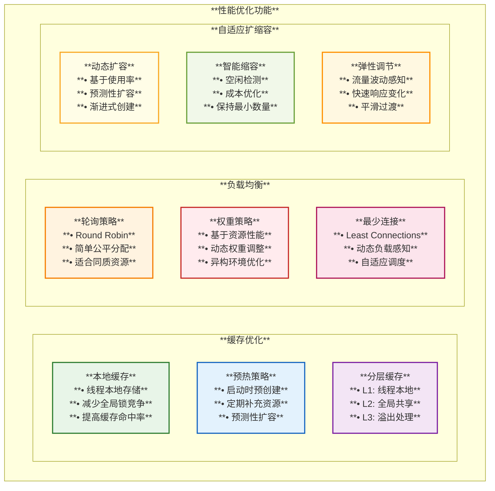
```mermaid
graph TB
    subgraph PERFORMANCE_OPTIMIZATION ["**性能优化功能**"]
        
        subgraph CACHE_OPTIMIZATION ["**缓存优化**"]
            CACHE1["**本地缓存**<br/>**• 线程本地存储**<br/>**• 减少全局锁竞争**<br/>**• 提高缓存命中率**"]
            CACHE2["**预热策略**<br/>**• 启动时预创建**<br/>**• 定期补充资源**<br/>**• 预测性扩容**"]
            CACHE3["**分层缓存**<br/>**• L1: 线程本地**<br/>**• L2: 全局共享**<br/>**• L3: 溢出处理**"]
            
            style CACHE1 fill:#E8F5E8,stroke:#2E7D32,stroke-width:2px
            style CACHE2 fill:#E3F2FD,stroke:#1565C0,stroke-width:2px
            style CACHE3 fill:#F3E5F5,stroke:#7B1FA2,stroke-width:2px
        end
        
        subgraph LOAD_BALANCING ["**负载均衡**"]
            LB1["**轮询策略**<br/>**• Round Robin**<br/>**• 简单公平分配**<br/>**• 适合同质资源**"]
            LB2["**权重策略**<br/>**• 基于资源性能**<br/>**• 动态权重调整**<br/>**• 异构环境优化**"]
            LB3["**最少连接**<br/>**• Least Connections**<br/>**• 动态负载感知**<br/>**• 自适应调度**"]
            
            style LB1 fill:#FFF3E0,stroke:#F57C00,stroke-width:2px
            style LB2 fill:#FFEBEE,stroke:#C62828,stroke-width:2px
            style LB3 fill:#FCE4EC,stroke:#AD1457,stroke-width:2px
        end
        
        subgraph ADAPTIVE_SCALING ["**自适应扩缩容**"]
            AS1["**动态扩容**<br/>**• 基于使用率**<br/>**• 预测性扩容**<br/>**• 渐进式创建**"]
            AS2["**智能缩容**<br/>**• 空闲检测**<br/>**• 成本优化**<br/>**• 保持最小数量**"]
            AS3["**弹性调节**<br/>**• 流量波动感知**<br/>**• 快速响应变化**<br/>**• 平滑过渡**"]
            
            style AS1 fill:#FFFDE7,stroke:#F9A825,stroke-width:2px
            style AS2 fill:#F1F8E9,stroke:#689F38,stroke-width:2px
            style AS3 fill:#FFF8E1,stroke:#FF8F00,stroke-width:2px
        end
    end
```

### **4. 池化技术设计模式**

#### **4.1 创建型模式**

##### **4.1.1 抽象工厂模式**

```go
// 资源工厂接口
type ResourceFactory[T any] interface {
    Create(ctx context.Context) (T, error)
    Validate(resource T) error
    Destroy(resource T) error
    Reset(resource T) error
}

// 数据库连接工厂
type DBConnectionFactory struct {
    dsn    string
    config *Config
}

func (f *DBConnectionFactory) Create(ctx context.Context) (*sql.DB, error) {
    db, err := sql.Open(f.config.Driver, f.dsn)
    if err != nil {
        return nil, err
    }
    
    // 配置连接池参数
    db.SetMaxOpenConns(f.config.MaxOpen)
    db.SetMaxIdleConns(f.config.MaxIdle)
    db.SetConnMaxLifetime(f.config.MaxLifetime)
    
    // 验证连接可用性
    if err := db.PingContext(ctx); err != nil {
        db.Close()
        return nil, err
    }
    
    return db, nil
}

// HTTP客户端工厂
type HTTPClientFactory struct {
    transport *http.Transport
    timeout   time.Duration
}

func (f *HTTPClientFactory) Create(ctx context.Context) (*http.Client, error) {
    client := &http.Client{
        Transport: f.transport,
        Timeout:   f.timeout,
    }
    return client, nil
}
```

##### **4.1.2 建造者模式**

```go
// 池配置建造者
type PoolBuilder[T any] struct {
    factory        ResourceFactory[T]
    minSize        int
    maxSize        int
    maxIdleTime    time.Duration
    maxLifetime    time.Duration
    validator      func(T) error
    healthChecker  func(T) error
    onCreate       func(T)
    onDestroy      func(T)
    onBorrow       func(T)
    onReturn       func(T)
}

func NewPoolBuilder[T any](factory ResourceFactory[T]) *PoolBuilder[T] {
    return &PoolBuilder[T]{
        factory:     factory,
        minSize:     5,
        maxSize:     100,
        maxIdleTime: 15 * time.Minute,
        maxLifetime: time.Hour,
    }
}

func (b *PoolBuilder[T]) MinSize(size int) *PoolBuilder[T] {
    b.minSize = size
    return b
}

func (b *PoolBuilder[T]) MaxSize(size int) *PoolBuilder[T] {
    b.maxSize = size
    return b
}

func (b *PoolBuilder[T]) HealthChecker(checker func(T) error) *PoolBuilder[T] {
    b.healthChecker = checker
    return b
}

func (b *PoolBuilder[T]) Build() *GenericPool[T] {
    return &GenericPool[T]{
        factory:       b.factory,
        config:        b.buildConfig(),
        idle:          make(chan T, b.maxSize),
        healthChecker: b.healthChecker,
        // ... 其他初始化
    }
}
```

#### **4.2 结构型模式**

##### **4.2.1 装饰器模式**

```go
// 基础池接口
type Pool[T any] interface {
    Get(ctx context.Context) (T, error)
    Put(resource T) error
    Close() error
    Stats() PoolStats
}

// 监控装饰器
type MonitoringPool[T any] struct {
    pool    Pool[T]
    metrics *PoolMetrics
}

func (p *MonitoringPool[T]) Get(ctx context.Context) (T, error) {
    start := time.Now()
    defer func() {
        p.metrics.GetDuration.Observe(time.Since(start).Seconds())
        p.metrics.GetTotal.Inc()
    }()
    
    resource, err := p.pool.Get(ctx)
    if err != nil {
        p.metrics.GetErrors.Inc()
        return resource, err
    }
    
    p.metrics.ActiveResources.Inc()
    return resource, nil
}

// 限流装饰器
type RateLimitedPool[T any] struct {
    pool    Pool[T]
    limiter *rate.Limiter
}

func (p *RateLimitedPool[T]) Get(ctx context.Context) (T, error) {
    if err := p.limiter.Wait(ctx); err != nil {
        var zero T
        return zero, err
    }
    return p.pool.Get(ctx)
}

// 重试装饰器
type RetryPool[T any] struct {
    pool       Pool[T]
    maxRetries int
    backoff    backoff.BackOff
}

func (p *RetryPool[T]) Get(ctx context.Context) (T, error) {
    var lastErr error
    for i := 0; i < p.maxRetries; i++ {
        resource, err := p.pool.Get(ctx)
        if err == nil {
            return resource, nil
        }
        
        lastErr = err
        select {
        case <-ctx.Done():
            return resource, ctx.Err()
        case <-time.After(p.backoff.NextBackOff()):
            continue
        }
    }
    
    var zero T
    return zero, fmt.Errorf("max retries exceeded: %w", lastErr)
}
```

##### **4.2.2 适配器模式**

```go
// 通用池接口适配不同的资源类型
type ResourceAdapter[T any] interface {
    Adapt(resource any) (T, error)
    GetResourceType() string
}

// 数据库连接适配器
type DBConnectionAdapter struct{}

func (a *DBConnectionAdapter) Adapt(resource any) (*sql.DB, error) {
    if db, ok := resource.(*sql.DB); ok {
        return db, nil
    }
    return nil, fmt.Errorf("invalid resource type, expected *sql.DB")
}

// HTTP客户端适配器
type HTTPClientAdapter struct{}

func (a *HTTPClientAdapter) Adapt(resource any) (*http.Client, error) {
    if client, ok := resource.(*http.Client); ok {
        return client, nil
    }
    return nil, fmt.Errorf("invalid resource type, expected *http.Client")
}

// 适配器池
type AdapterPool[T any] struct {
    pool    Pool[any]
    adapter ResourceAdapter[T]
}

func (p *AdapterPool[T]) Get(ctx context.Context) (T, error) {
    resource, err := p.pool.Get(ctx)
    if err != nil {
        var zero T
        return zero, err
    }
    
    return p.adapter.Adapt(resource)
}
```

#### **4.3 行为型模式**

##### **4.3.1 策略模式**

```go
// 资源选择策略
type ResourceSelectionStrategy[T any] interface {
    Select(resources []T) (T, error)
    Name() string
}

// 轮询策略
type RoundRobinStrategy[T any] struct {
    counter uint64
}

func (s *RoundRobinStrategy[T]) Select(resources []T) (T, error) {
    if len(resources) == 0 {
        var zero T
        return zero, ErrNoResourcesAvailable
    }
    
    index := atomic.AddUint64(&s.counter, 1) % uint64(len(resources))
    return resources[index], nil
}

// 随机策略
type RandomStrategy[T any] struct {
    rand *rand.Rand
    mu   sync.Mutex
}

func (s *RandomStrategy[T]) Select(resources []T) (T, error) {
    if len(resources) == 0 {
        var zero T
        return zero, ErrNoResourcesAvailable
    }
    
    s.mu.Lock()
    index := s.rand.Intn(len(resources))
    s.mu.Unlock()
    
    return resources[index], nil
}

// 最少使用策略
type LeastUsedStrategy[T any] struct {
    usage map[T]int64
    mu    sync.RWMutex
}

func (s *LeastUsedStrategy[T]) Select(resources []T) (T, error) {
    if len(resources) == 0 {
        var zero T
        return zero, ErrNoResourcesAvailable
    }
    
    s.mu.RLock()
    defer s.mu.RUnlock()
    
    minUsage := int64(math.MaxInt64)
    var selected T
    
    for _, resource := range resources {
        usage := s.usage[resource]
        if usage < minUsage {
            minUsage = usage
            selected = resource
        }
    }
    
    return selected, nil
}

// 策略池
type StrategyPool[T any] struct {
    BasePool[T]
    strategy ResourceSelectionStrategy[T]
}

func (p *StrategyPool[T]) Get(ctx context.Context) (T, error) {
    p.mu.Lock()
    defer p.mu.Unlock()
    
    if len(p.idle) == 0 {
        return p.createNewResource(ctx)
    }
    
    // 使用策略选择资源
    return p.strategy.Select(p.idle)
}
```

##### **4.3.2 观察者模式**

```go
// 池事件类型
type PoolEventType int

const (
    ResourceCreated PoolEventType = iota
    ResourceDestroyed
    ResourceBorrowed
    ResourceReturned
    PoolExhausted
    HealthCheckFailed
)

// 池事件
type PoolEvent[T any] struct {
    Type      PoolEventType
    Resource  T
    Timestamp time.Time
    Error     error
    Metadata  map[string]any
}

// 事件监听器
type PoolEventListener[T any] interface {
    OnEvent(event PoolEvent[T])
    GetName() string
}

// 指标收集监听器
type MetricsListener[T any] struct {
    metrics *PoolMetrics
}

func (l *MetricsListener[T]) OnEvent(event PoolEvent[T]) {
    switch event.Type {
    case ResourceCreated:
        l.metrics.ResourcesCreated.Inc()
    case ResourceDestroyed:
        l.metrics.ResourcesDestroyed.Inc()
    case ResourceBorrowed:
        l.metrics.ResourcesBorrowed.Inc()
    case ResourceReturned:
        l.metrics.ResourcesReturned.Inc()
    case PoolExhausted:
        l.metrics.PoolExhausted.Inc()
    case HealthCheckFailed:
        l.metrics.HealthCheckFailures.Inc()
    }
}

// 日志监听器
type LoggingListener[T any] struct {
    logger *slog.Logger
}

func (l *LoggingListener[T]) OnEvent(event PoolEvent[T]) {
    l.logger.Info("Pool event occurred",
        "type", event.Type,
        "timestamp", event.Timestamp,
        "error", event.Error,
        "metadata", event.Metadata)
}

// 告警监听器
type AlertListener[T any] struct {
    alertManager AlertManager
    thresholds   map[PoolEventType]int
}

func (l *AlertListener[T]) OnEvent(event PoolEvent[T]) {
    if event.Type == PoolExhausted || event.Type == HealthCheckFailed {
        alert := Alert{
            Level:       "warning",
            Title:       fmt.Sprintf("Pool %s event", event.Type),
            Description: fmt.Sprintf("Pool event occurred: %v", event),
            Timestamp:   event.Timestamp,
        }
        l.alertManager.SendAlert(alert)
    }
}

// 可观察的池
type ObservablePool[T any] struct {
    BasePool[T]
    listeners []PoolEventListener[T]
    mu        sync.RWMutex
}

func (p *ObservablePool[T]) AddListener(listener PoolEventListener[T]) {
    p.mu.Lock()
    defer p.mu.Unlock()
    p.listeners = append(p.listeners, listener)
}

func (p *ObservablePool[T]) notifyListeners(event PoolEvent[T]) {
    p.mu.RLock()
    defer p.mu.RUnlock()
    
    for _, listener := range p.listeners {
        go listener.OnEvent(event) // 异步通知，避免阻塞
    }
}

func (p *ObservablePool[T]) Get(ctx context.Context) (T, error) {
    resource, err := p.BasePool.Get(ctx)
    
    event := PoolEvent[T]{
        Type:      ResourceBorrowed,
        Resource:  resource,
        Timestamp: time.Now(),
        Error:     err,
    }
    
    p.notifyListeners(event)
    return resource, err
}
```

### **5. 池化技术实现框架**

#### **5.1 通用池实现框架**

```go
// 通用池配置
type PoolConfig struct {
    // 容量配置
    MinSize     int           `json:"min_size" yaml:"min_size"`         // 最小资源数
    MaxSize     int           `json:"max_size" yaml:"max_size"`         // 最大资源数
    InitialSize int           `json:"initial_size" yaml:"initial_size"` // 初始资源数
    
    // 超时配置
    GetTimeout      time.Duration `json:"get_timeout" yaml:"get_timeout"`           // 获取超时
    IdleTimeout     time.Duration `json:"idle_timeout" yaml:"idle_timeout"`         // 空闲超时
    MaxLifetime     time.Duration `json:"max_lifetime" yaml:"max_lifetime"`         // 最大生存时间
    ValidationDelay time.Duration `json:"validation_delay" yaml:"validation_delay"` // 验证间隔
    
    // 行为配置
    TestOnBorrow     bool   `json:"test_on_borrow" yaml:"test_on_borrow"`         // 借出时验证
    TestOnReturn     bool   `json:"test_on_return" yaml:"test_on_return"`         // 归还时验证
    TestWhileIdle    bool   `json:"test_while_idle" yaml:"test_while_idle"`       // 空闲时验证
    BlockWhenEmpty   bool   `json:"block_when_empty" yaml:"block_when_empty"`     // 空时阻塞
    FairQueue        bool   `json:"fair_queue" yaml:"fair_queue"`                 // 公平队列
    LIFO             bool   `json:"lifo" yaml:"lifo"`                             // LIFO策略
    
    // 扩展配置
    MetricsEnabled   bool   `json:"metrics_enabled" yaml:"metrics_enabled"`       // 启用指标
    LoggingEnabled   bool   `json:"logging_enabled" yaml:"logging_enabled"`       // 启用日志
    AlertingEnabled  bool   `json:"alerting_enabled" yaml:"alerting_enabled"`     // 启用告警
}

// 通用池实现
type GenericPool[T any] struct {
    // 核心组件
    factory       ResourceFactory[T]
    config        *PoolConfig
    
    // 资源管理
    idle          chan T                    // 空闲资源队列
    active        sync.Map                  // 活跃资源集合 map[T]*ResourceInfo
    waiting       chan chan T               // 等待请求队列
    
    // 状态管理
    closed        atomic.Bool               // 关闭状态
    mu            sync.RWMutex              // 保护共享状态
    
    // 统计信息
    stats         PoolStats                 // 池统计信息
    
    // 扩展组件
    healthChecker func(T) error             // 健康检查器
    listeners     []PoolEventListener[T]    // 事件监听器
    metrics       *PoolMetrics              // 指标收集器
    cleaner       *ResourceCleaner[T]       // 资源清理器
    
    // 控制通道
    cleanupCh     chan struct{}             // 清理信号
    stopCh        chan struct{}             // 停止信号
}

// 资源信息
type ResourceInfo struct {
    CreatedAt   time.Time     // 创建时间
    LastUsedAt  time.Time     // 最后使用时间
    UsageCount  int64         // 使用次数
    State       ResourceState // 资源状态
}

// 资源状态
type ResourceState int

const (
    StateIdle ResourceState = iota
    StateActive
    StateValidating
    StateExpired
    StateInvalid
)

// 池统计信息
type PoolStats struct {
    // 容量统计
    MaxSize     int `json:"max_size"`
    MinSize     int `json:"min_size"`
    ActiveCount int `json:"active_count"`
    IdleCount   int `json:"idle_count"`
    
    // 使用统计
    TotalRequests   int64         `json:"total_requests"`
    SuccessfulGets  int64         `json:"successful_gets"`
    FailedGets      int64         `json:"failed_gets"`
    TimeoutGets     int64         `json:"timeout_gets"`
    
    // 时间统计
    AvgGetTime      time.Duration `json:"avg_get_time"`
    MaxGetTime      time.Duration `json:"max_get_time"`
    AvgActiveTime   time.Duration `json:"avg_active_time"`
    
    // 资源统计
    CreatedCount    int64         `json:"created_count"`
    DestroyedCount  int64         `json:"destroyed_count"`
    ValidationCount int64         `json:"validation_count"`
    FailedValidation int64        `json:"failed_validation"`
}

// 创建池
func NewGenericPool[T any](factory ResourceFactory[T], config *PoolConfig) *GenericPool[T] {
    pool := &GenericPool[T]{
        factory:   factory,
        config:    config,
        idle:      make(chan T, config.MaxSize),
        waiting:   make(chan chan T, config.MaxSize),
        cleanupCh: make(chan struct{}, 1),
        stopCh:    make(chan struct{}),
    }
    
    // 启动后台任务
    go pool.maintenanceLoop()
    
    // 预创建资源
    pool.warmUp(context.Background())
    
    return pool
}

// 获取资源
func (p *GenericPool[T]) Get(ctx context.Context) (T, error) {
    if p.closed.Load() {
        var zero T
        return zero, ErrPoolClosed
    }
    
    start := time.Now()
    defer func() {
        p.stats.AvgGetTime = time.Since(start)
        atomic.AddInt64(&p.stats.TotalRequests, 1)
    }()
    
    // 快速路径：直接从空闲队列获取
    select {
    case resource := <-p.idle:
        if p.config.TestOnBorrow && p.healthChecker != nil {
            if err := p.healthChecker(resource); err != nil {
                p.destroyResource(resource)
                return p.Get(ctx) // 递归重试
            }
        }
        
        p.activateResource(resource)
        atomic.AddInt64(&p.stats.SuccessfulGets, 1)
        return resource, nil
    default:
        // 空闲队列为空，尝试其他路径
    }
    
    // 尝试创建新资源
    if p.canCreateMore() {
        resource, err := p.createResource(ctx)
        if err == nil {
            p.activateResource(resource)
            atomic.AddInt64(&p.stats.SuccessfulGets, 1)
            return resource, nil
        }
    }
    
    // 资源池满，等待或阻塞
    if !p.config.BlockWhenEmpty {
        atomic.AddInt64(&p.stats.FailedGets, 1)
        var zero T
        return zero, ErrPoolExhausted
    }
    
    // 创建等待通道
    waitCh := make(chan T, 1)
    
    select {
    case p.waiting <- waitCh:
        // 成功加入等待队列
    default:
        // 等待队列满
        atomic.AddInt64(&p.stats.FailedGets, 1)
        var zero T
        return zero, ErrTooManyWaiters
    }
    
    // 等待资源或超时
    timeout := p.config.GetTimeout
    if deadline, ok := ctx.Deadline(); ok {
        if remaining := time.Until(deadline); remaining < timeout {
            timeout = remaining
        }
    }
    
    select {
    case resource := <-waitCh:
        p.activateResource(resource)
        atomic.AddInt64(&p.stats.SuccessfulGets, 1)
        return resource, nil
    case <-time.After(timeout):
        atomic.AddInt64(&p.stats.TimeoutGets, 1)
        var zero T
        return zero, ErrGetTimeout
    case <-ctx.Done():
        atomic.AddInt64(&p.stats.FailedGets, 1)
        var zero T
        return zero, ctx.Err()
    }
}

// 归还资源
func (p *GenericPool[T]) Put(resource T) error {
    if p.closed.Load() {
        p.destroyResource(resource)
        return ErrPoolClosed
    }
    
    // 验证资源
    if p.config.TestOnReturn && p.healthChecker != nil {
        if err := p.healthChecker(resource); err != nil {
            p.destroyResource(resource)
            return err
        }
    }
    
    // 重置资源状态
    if err := p.factory.Reset(resource); err != nil {
        p.destroyResource(resource)
        return err
    }
    
    p.deactivateResource(resource)
    
    // 优先分配给等待者
    select {
    case waitCh := <-p.waiting:
        waitCh <- resource
        return nil
    default:
        // 没有等待者，放回空闲队列
    }
    
    // 检查容量限制
    if len(p.idle) >= p.config.MaxSize {
        p.destroyResource(resource)
        return nil
    }
    
    // 放回空闲队列
    select {
    case p.idle <- resource:
        return nil
    default:
        // 队列满，销毁资源
        p.destroyResource(resource)
        return nil
    }
}

// 关闭池
func (p *GenericPool[T]) Close() error {
    if !p.closed.CompareAndSwap(false, true) {
        return ErrPoolClosed
    }
    
    close(p.stopCh)
    
    // 清空空闲队列
    for {
        select {
        case resource := <-p.idle:
            p.destroyResource(resource)
        default:
            goto cleanup
        }
    }
    
cleanup:
    // 清空等待队列
    close(p.waiting)
    for waitCh := range p.waiting {
        close(waitCh)
    }
    
    return nil
}

// 维护循环
func (p *GenericPool[T]) maintenanceLoop() {
    ticker := time.NewTicker(p.config.ValidationDelay)
    defer ticker.Stop()
    
    for {
        select {
        case <-ticker.C:
            p.performMaintenance()
        case <-p.cleanupCh:
            p.performMaintenance()
        case <-p.stopCh:
            return
        }
    }
}

// 执行维护任务
func (p *GenericPool[T]) performMaintenance() {
    // 健康检查
    if p.config.TestWhileIdle {
        p.validateIdleResources()
    }
    
    // 清理过期资源
    p.cleanupExpiredResources()
    
    // 动态调整大小
    p.adjustPoolSize()
}
```

### **6. 池化技术最佳实践**

#### **6.1 配置优化建议**

| **配置项** | **推荐值** | **适用场景** | **注意事项** |
|-----------|-----------|-------------|-------------|
| **MinSize** | **CPU核数** | **Web应用** | **保证基础并发能力** |
| | **连接数/10** | **数据库连接池** | **避免资源浪费** |
| | **2-5** | **HTTP客户端池** | **降低启动开销** |
| **MaxSize** | **CPU核数×4** | **CPU密集型** | **避免上下文切换开销** |
| | **数据库最大连接数×0.8** | **数据库连接池** | **预留缓冲空间** |
| | **50-200** | **通用对象池** | **根据内存容量调整** |
| **IdleTimeout** | **15分钟** | **数据库连接** | **平衡性能与资源** |
| | **5分钟** | **HTTP连接** | **快速释放网络资源** |
| | **30秒** | **内存对象** | **及时回收内存** |
| **MaxLifetime** | **1小时** | **长连接** | **定期刷新避免问题** |
| | **30分钟** | **中等生命周期** | **平衡稳定性与性能** |
| | **不限制** | **纯内存对象** | **减少创建开销** |

#### **6.2 性能调优策略**

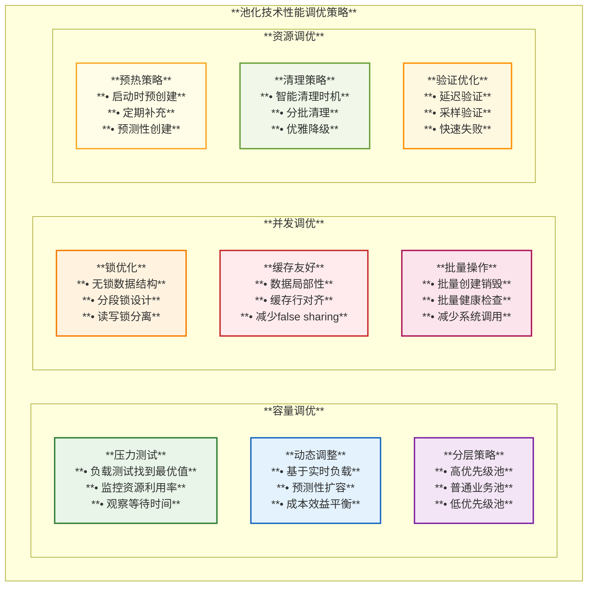
```mermaid
graph TB
    subgraph TUNING_STRATEGIES ["**池化技术性能调优策略**"]
        
        subgraph CAPACITY_TUNING ["**容量调优**"]
            CT1["**压力测试**<br/>**• 负载测试找到最优值**<br/>**• 监控资源利用率**<br/>**• 观察等待时间**"]
            CT2["**动态调整**<br/>**• 基于实时负载**<br/>**• 预测性扩容**<br/>**• 成本效益平衡**"]
            CT3["**分层策略**<br/>**• 高优先级池**<br/>**• 普通业务池**<br/>**• 低优先级池**"]
            
            style CT1 fill:#E8F5E8,stroke:#2E7D32,stroke-width:2px
            style CT2 fill:#E3F2FD,stroke:#1565C0,stroke-width:2px
            style CT3 fill:#F3E5F5,stroke:#7B1FA2,stroke-width:2px
        end
        
        subgraph CONCURRENCY_TUNING ["**并发调优**"]
            COT1["**锁优化**<br/>**• 无锁数据结构**<br/>**• 分段锁设计**<br/>**• 读写锁分离**"]
            COT2["**缓存友好**<br/>**• 数据局部性**<br/>**• 缓存行对齐**<br/>**• 减少false sharing**"]
            COT3["**批量操作**<br/>**• 批量创建销毁**<br/>**• 批量健康检查**<br/>**• 减少系统调用**"]
            
            style COT1 fill:#FFF3E0,stroke:#F57C00,stroke-width:2px
            style COT2 fill:#FFEBEE,stroke:#C62828,stroke-width:2px
            style COT3 fill:#FCE4EC,stroke:#AD1457,stroke-width:2px
        end
        
        subgraph RESOURCE_TUNING ["**资源调优**"]
            RT1["**预热策略**<br/>**• 启动时预创建**<br/>**• 定期补充**<br/>**• 预测性创建**"]
            RT2["**清理策略**<br/>**• 智能清理时机**<br/>**• 分批清理**<br/>**• 优雅降级**"]
            RT3["**验证优化**<br/>**• 延迟验证**<br/>**• 采样验证**<br/>**• 快速失败**"]
            
            style RT1 fill:#FFFDE7,stroke:#F9A825,stroke-width:2px
            style RT2 fill:#F1F8E9,stroke:#689F38,stroke-width:2px
            style RT3 fill:#FFF8E1,stroke:#FF8F00,stroke-width:2px
        end
    end
```

#### **6.3 监控和故障诊断**

```go
// 池监控指标
type PoolMetrics struct {
    // 容量指标
    MaxCapacity        prometheus.Gauge
    CurrentCapacity    prometheus.Gauge
    ActiveCount        prometheus.Gauge
    IdleCount          prometheus.Gauge
    WaitingCount       prometheus.Gauge
    
    // 使用指标
    GetRequests        prometheus.Counter
    GetSuccesses       prometheus.Counter
    GetFailures        prometheus.Counter
    GetTimeouts        prometheus.Counter
    GetDuration        prometheus.Histogram
    
    // 资源指标
    ResourceCreated    prometheus.Counter
    ResourceDestroyed  prometheus.Counter
    ResourceValidation prometheus.Counter
    ValidationFailures prometheus.Counter
    
    // 健康指标
    HealthChecks       prometheus.Counter
    HealthCheckFailures prometheus.Counter
    HealthCheckDuration prometheus.Histogram
    
    // 错误指标
    Errors             prometheus.Counter
    ErrorsByType       *prometheus.CounterVec
}

// 故障诊断工具
type PoolDiagnostics[T any] struct {
    pool    *GenericPool[T]
    logger  *slog.Logger
    tracer  trace.Tracer
}

func (d *PoolDiagnostics[T]) DiagnosePerformance() *DiagnosisReport {
    stats := d.pool.Stats()
    
    report := &DiagnosisReport{
        Timestamp: time.Now(),
        PoolID:    d.pool.ID(),
    }
    
    // 容量诊断
    if stats.ActiveCount+stats.IdleCount >= stats.MaxSize*8/10 {
        report.AddIssue("HIGH_UTILIZATION", 
            "Pool utilization is above 80%, consider increasing max size")
    }
    
    // 等待时间诊断
    if stats.AvgGetTime > 100*time.Millisecond {
        report.AddIssue("HIGH_LATENCY", 
            "Average get time is above 100ms, check resource creation performance")
    }
    
    // 失败率诊断
    failureRate := float64(stats.FailedGets) / float64(stats.TotalRequests)
    if failureRate > 0.05 {
        report.AddIssue("HIGH_FAILURE_RATE", 
            fmt.Sprintf("Failure rate is %.2f%%, investigate resource health", failureRate*100))
    }
    
    // 健康检查诊断
    if stats.FailedValidation > stats.ValidationCount/10 {
        report.AddIssue("VALIDATION_ISSUES", 
            "High validation failure rate, check resource quality")
    }
    
    return report
}

// 性能分析器
type PoolProfiler[T any] struct {
    pool     *GenericPool[T]
    profiler *pprof.Profiler
}

func (p *PoolProfiler[T]) StartProfiling(duration time.Duration) {
    // CPU profiling
    go func() {
        f, _ := os.Create("pool_cpu.prof")
        defer f.Close()
        pprof.StartCPUProfile(f)
        time.Sleep(duration)
        pprof.StopCPUProfile()
    }()
    
    // Memory profiling
    go func() {
        time.Sleep(duration)
        f, _ := os.Create("pool_mem.prof")
        defer f.Close()
        pprof.WriteHeapProfile(f)
    }()
    
    // Goroutine profiling
    go func() {
        time.Sleep(duration)
        f, _ := os.Create("pool_goroutine.prof")
        defer f.Close()
        pprof.Lookup("goroutine").WriteTo(f, 0)
    }()
}
```

### **7. 池化技术总结**

池化技术作为一种重要的资源管理模式，通过以下核心要素实现高效的资源复用：

#### **7.1 核心设计原则**

- **资源预分配**：提前创建和管理资源，避免临时分配开销
- **生命周期管理**：统一管理资源的创建、使用、验证和销毁
- **并发安全**：保证多线程/协程环境下的安全访问
- **弹性伸缩**：根据负载动态调整池大小
- **故障隔离**：异常资源的识别和隔离机制
- **监控可观测**：全面的指标收集和故障诊断

#### **7.2 关键功能模块**

- **资源工厂**：负责资源的创建和初始化
- **池管理器**：核心调度和资源分配逻辑
- **健康检查器**：资源可用性验证和故障检测
- **清理器**：过期和异常资源的清理回收
- **监控系统**：性能指标收集和故障告警
- **配置管理**：动态配置和参数调优

#### **7.3 实施建议**

- **根据业务场景选择合适的池化策略**
- **通过压力测试确定最优配置参数**
- **建立完善的监控和告警机制**
- **实现优雅的故障处理和恢复**
- **持续优化和调优池性能**

池化技术的合理应用可以显著提升系统性能，降低资源消耗，是构建高性能应用的重要技术手段。

## **driver.ErrBadConn 错误处理机制深度分析**

当数据库驱动返回 `driver.ErrBadConn` 错误时，Go的数据库连接池会启动一套完整的错误恢复机制。这个机制确保了应用在遇到坏连接时能够自动恢复，不会影响业务逻辑的正常执行。

### **1. driver.ErrBadConn 错误定义**

#### **1.1 错误定义和作用**

```go
// 来自 src/database/sql/driver/driver.go:151-163
// ErrBadConn should be returned by a driver to signal to the database/sql
// package that a driver.Conn is in a bad state (such as the server
// having earlier closed the connection) and the database/sql package should
// retry on a new connection.
//
// To prevent duplicate operations, ErrBadConn should NOT be returned
// if there's a possibility that the database server might have
// performed the operation. Even if the server sends back an error,
// you shouldn't return ErrBadConn.
//
// Errors will be checked using errors.Is. An error may
// wrap ErrBadConn or implement the Is(error) bool method.
var ErrBadConn = errors.New("driver: bad connection")
```

**关键特性：**

- **信号作用**：通知连接池该连接处于不可用状态
- **重试触发**：连接池会自动重试操作
- **安全约束**：只有在确认数据库未执行操作时才能返回此错误
- **错误检查**：使用 `errors.Is()` 进行检查，支持错误包装

#### **1.2 ErrBadConn 触发场景**

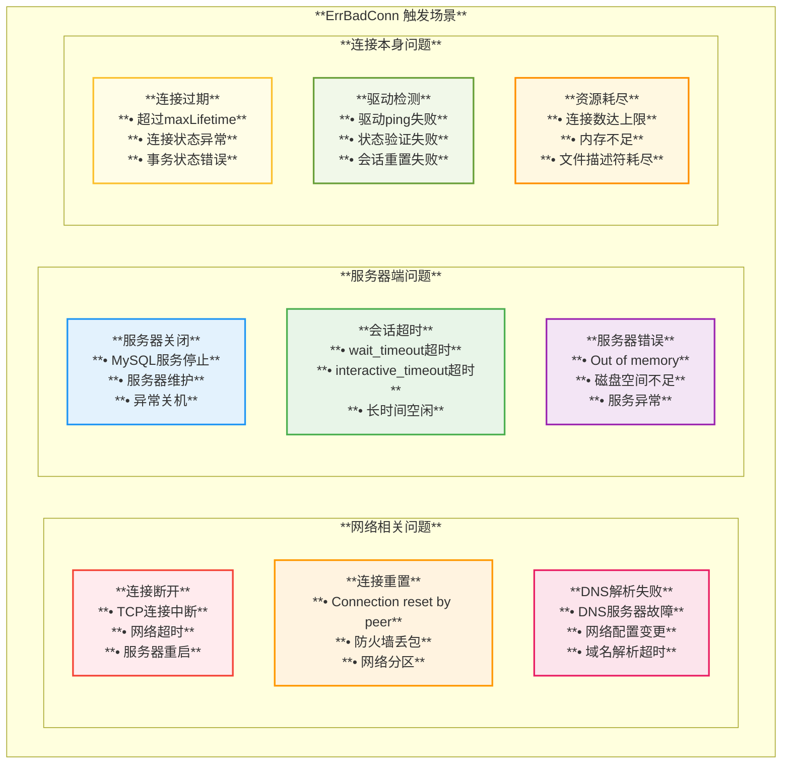
```mermaid
graph TB
    subgraph SCENARIOS ["**ErrBadConn 触发场景**"]
        
        subgraph NETWORK_ISSUES ["**网络相关问题**"]
            N1["**连接断开**<br/>**• TCP连接中断**<br/>**• 网络超时**<br/>**• 服务器重启**"]
            N2["**连接重置**<br/>**• Connection reset by peer**<br/>**• 防火墙丢包**<br/>**• 网络分区**"]
            N3["**DNS解析失败**<br/>**• DNS服务器故障**<br/>**• 网络配置变更**<br/>**• 域名解析超时**"]
            
            style N1 fill:#FFEBEE,stroke:#F44336,stroke-width:2px
            style N2 fill:#FFF3E0,stroke:#FF9800,stroke-width:2px
            style N3 fill:#FCE4EC,stroke:#E91E63,stroke-width:2px
        end
        
        subgraph SERVER_ISSUES ["**服务器端问题**"]
            S1["**服务器关闭**<br/>**• MySQL服务停止**<br/>**• 服务器维护**<br/>**• 异常关机**"]
            S2["**会话超时**<br/>**• wait_timeout超时**<br/>**• interactive_timeout超时**<br/>**• 长时间空闲**"]
            S3["**服务器错误**<br/>**• Out of memory**<br/>**• 磁盘空间不足**<br/>**• 服务异常**"]
            
            style S1 fill:#E3F2FD,stroke:#2196F3,stroke-width:2px
            style S2 fill:#E8F5E8,stroke:#4CAF50,stroke-width:2px
            style S3 fill:#F3E5F5,stroke:#9C27B0,stroke-width:2px
        end
        
        subgraph CONNECTION_ISSUES ["**连接本身问题**"]
            C1["**连接过期**<br/>**• 超过maxLifetime**<br/>**• 连接状态异常**<br/>**• 事务状态错误**"]
            C2["**驱动检测**<br/>**• 驱动ping失败**<br/>**• 状态验证失败**<br/>**• 会话重置失败**"]
            C3["**资源耗尽**<br/>**• 连接数达上限**<br/>**• 内存不足**<br/>**• 文件描述符耗尽**"]
            
            style C1 fill:#FFFDE7,stroke:#FBC02D,stroke-width:2px
            style C2 fill:#F1F8E9,stroke:#689F38,stroke-width:2px
            style C3 fill:#FFF8E1,stroke:#FF8F00,stroke-width:2px
        end
    end
```

### **2. 连接池的 ErrBadConn 检测机制**

#### **2.1 检测时机和位置**

连接池在多个关键节点检测 `ErrBadConn`：

```go
// 1. 连接获取时的过期检查 (src/database/sql/sql.go:1339-1344)
if conn.expired(lifetime) {
    db.maxLifetimeClosed++
    db.mu.Unlock()
    conn.Close()
    return nil, driver.ErrBadConn  // 直接返回ErrBadConn
}

// 2. 会话重置时的检查 (src/database/sql/sql.go:1347-1351)
// Reset the session if required.
if err := conn.resetSession(ctx); errors.Is(err, driver.ErrBadConn) {
    conn.Close()
    return nil, err  // 传播ErrBadConn错误
}

// 3. 连接归还时的验证检查 (src/database/sql/sql.go:1482-1486)
func (db *DB) putConn(dc *driverConn, err error, resetSession bool) {
    if !errors.Is(err, driver.ErrBadConn) {
        if !dc.validateConnection(resetSession) {
            err = driver.ErrBadConn  // 验证失败时标记为坏连接
        }
    }
    
// 4. 连接过期检查 (src/database/sql/sql.go:1496-1499)
    if !errors.Is(err, driver.ErrBadConn) && dc.expired(db.maxLifetime) {
        db.maxLifetimeClosed++
        err = driver.ErrBadConn  // 过期连接标记为坏连接
    }
```

#### **2.2 检测流程图**

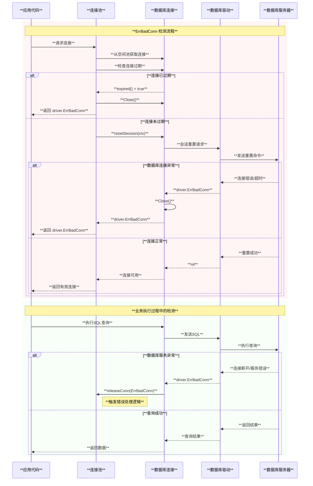
```mermaid
sequenceDiagram
    participant APP as **应用代码**
    participant POOL as **连接池**
    participant CONN as **数据库连接**
    participant DRIVER as **数据库驱动**
    participant DB as **数据库服务器**
    
    rect rgb(255, 245, 245)
        Note over APP,DB: **ErrBadConn 检测流程**
        
        APP->>POOL: **请求连接**
        POOL->>CONN: **从空闲池获取连接**
        
        POOL->>CONN: **检查连接过期**
        alt **连接已过期**
            CONN-->>POOL: **expired() = true**
            POOL->>CONN: **Close()**
            POOL-->>APP: **返回 driver.ErrBadConn**
        else **连接未过期**
            POOL->>CONN: **resetSession(ctx)**
            CONN->>DRIVER: **会话重置请求**
            DRIVER->>DB: **发送重置命令**
            
            alt **数据库连接异常**
                DB-->>DRIVER: **连接错误/超时**
                DRIVER-->>CONN: **driver.ErrBadConn**
                CONN->>CONN: **Close()**
                CONN-->>POOL: **driver.ErrBadConn**
                POOL-->>APP: **返回 driver.ErrBadConn**
            else **连接正常**
                DB-->>DRIVER: **重置成功**
                DRIVER-->>CONN: **nil**
                CONN-->>POOL: **连接可用**
                POOL-->>APP: **返回有效连接**
            end
        end
    end
    
    rect rgb(248, 255, 248)
        Note over APP,DB: **业务执行过程中的检测**
        
        APP->>CONN: **执行SQL查询**
        CONN->>DRIVER: **发送SQL**
        DRIVER->>DB: **执行查询**
        
        alt **数据库服务异常**
            DB-->>DRIVER: **连接断开/服务错误**
            DRIVER-->>CONN: **driver.ErrBadConn**
            CONN->>POOL: **releaseConn(ErrBadConn)**
            Note right of POOL: **触发错误处理逻辑**
        else **查询成功**
            DB-->>DRIVER: **返回结果**
            DRIVER-->>CONN: **查询结果**
            CONN-->>APP: **返回数据**
        end
    end
```

### **3. ErrBadConn 处理逻辑详解**

#### **3.1 putConn 中的坏连接处理**

```go
// 来自 src/database/sql/sql.go:1479-1531
func (db *DB) putConn(dc *driverConn, err error, resetSession bool) {
    // 1. 连接验证阶段
    if !errors.Is(err, driver.ErrBadConn) {
        if !dc.validateConnection(resetSession) {
            err = driver.ErrBadConn  // 验证失败，标记为坏连接
        }
    }
    
    db.mu.Lock()
    // 2. 状态检查
    if !dc.inUse {
        db.mu.Unlock()
        panic("sql: connection returned that was never out")
    }

    // 3. 过期检查
    if !errors.Is(err, driver.ErrBadConn) && dc.expired(db.maxLifetime) {
        db.maxLifetimeClosed++
        err = driver.ErrBadConn  // 过期连接标记为坏连接
    }
    
    dc.inUse = false
    dc.returnedAt = nowFunc()

    // 4. 处理待执行任务
    for _, fn := range dc.onPut {
        fn()
    }
    dc.onPut = nil

    // 5. 核心：坏连接处理逻辑
    if errors.Is(err, driver.ErrBadConn) {
        // 不复用坏连接
        // 由于连接被认为是坏的并被丢弃，将其视为已关闭
        // 不在这里减少打开计数，finalClose会处理
        db.maybeOpenNewConnections()  // 关键：触发新连接创建
        db.mu.Unlock()
        dc.Close()  // 关闭坏连接
        return
    }
    // ... 正常连接的处理逻辑
}
```

#### **3.2 maybeOpenNewConnections 恢复机制**

```go
// 来自 src/database/sql/sql.go:1240-1256
// Assumes db.mu is locked.
// If there are connRequests and the connection limit hasn't been reached,
// then tell the connectionOpener to open new connections.
func (db *DB) maybeOpenNewConnections() {
    numRequests := db.connRequests.Len()  // 获取等待请求数量
    if db.maxOpen > 0 {
        numCanOpen := db.maxOpen - db.numOpen  // 计算可创建连接数
        if numRequests > numCanOpen {
            numRequests = numCanOpen  // 限制在最大连接数内
        }
    }
    for numRequests > 0 {
        db.numOpen++ // 乐观地增加计数
        numRequests--
        if db.closed {
            return
        }
        db.openerCh <- struct{}{}  // 通知connectionOpener创建新连接
    }
}
```

#### **3.3 错误恢复流程图**


```mermaid
graph TB
    subgraph ERROR_RECOVERY ["**ErrBadConn 错误恢复流程**"]
        
        subgraph DETECTION ["**错误检测阶段**"]
            D1["**应用操作失败**<br/>**• Query/Exec返回错误**<br/>**• 错误包含ErrBadConn**<br/>**• 连接状态异常**"]
            D2["**连接状态检查**<br/>**• validateConnection()失败**<br/>**• resetSession()失败**<br/>**• expired()检查**"]
            D3["**标记坏连接**<br/>**• errors.Is(err, ErrBadConn)**<br/>**• 设置错误状态**<br/>**• 准备清理**"]
            
            style D1 fill:#FFEBEE,stroke:#F44336,stroke-width:2px
            style D2 fill:#FFF3E0,stroke:#FF9800,stroke-width:2px
            style D3 fill:#FCE4EC,stroke:#E91E63,stroke-width:2px
        end
        
        subgraph CLEANUP ["**坏连接清理阶段**"]
            C1["**putConn处理**<br/>**• 不加入freeConn队列**<br/>**• 直接关闭连接**<br/>**• 更新统计信息**"]
            C2["**连接关闭**<br/>**• dc.Close()调用**<br/>**• 释放底层资源**<br/>**• 清理相关状态**"]
            C3["**计数更新**<br/>**• finalClose处理numOpen**<br/>**• 更新统计指标**<br/>**• 释放依赖资源**"]
            
            style C1 fill:#E3F2FD,stroke:#2196F3,stroke-width:2px
            style C2 fill:#E8F5E8,stroke:#4CAF50,stroke-width:2px
            style C3 fill:#F3E5F5,stroke:#9C27B0,stroke-width:2px
        end
        
        subgraph RECOVERY ["**连接恢复阶段**"]
            R1["**maybeOpenNewConnections**<br/>**• 检查等待队列长度**<br/>**• 计算可创建连接数**<br/>**• 触发连接创建**"]
            R2["**connectionOpener响应**<br/>**• 监听openerCh信号**<br/>**• 异步创建新连接**<br/>**• connector.Connect()调用**"]
            R3["**新连接分配**<br/>**• putConnDBLocked分配**<br/>**• 优先满足等待请求**<br/>**• 恢复服务能力**"]
            
            style R1 fill:#FFFDE7,stroke:#FBC02D,stroke-width:2px
            style R2 fill:#F1F8E9,stroke:#689F38,stroke-width:2px
            style R3 fill:#FFF8E1,stroke:#FF8F00,stroke-width:2px
        end
        
        D1 --> D2
        D2 --> D3
        D3 --> C1
        C1 --> C2
        C2 --> C3
        C3 --> R1
        R1 --> R2
        R2 --> R3
    end
```

### **4. 重试机制详解**

#### **4.1 retry 函数实现**

```go
// 来自 src/database/sql/sql.go:1569-1584
// maxBadConnRetries is the number of maximum retries if the driver returns
// driver.ErrBadConn to signal a broken connection before forcing a new
// connection to be opened.
const maxBadConnRetries = 2

func (db *DB) retry(fn func(strategy connReuseStrategy) error) error {
    for i := int64(0); i < maxBadConnRetries; i++ {
        err := fn(cachedOrNewConn)  // 先尝试使用缓存连接
        // retry if err is driver.ErrBadConn
        if err == nil || !errors.Is(err, driver.ErrBadConn) {
            return err  // 成功或非坏连接错误，直接返回
        }
        // 如果是ErrBadConn，继续重试
    }
    
    return fn(alwaysNewConn)  // 最后尝试强制创建新连接
}
```

#### **4.2 重试策略应用**

连接池在以下操作中应用重试机制：

```go
// 1. PrepareContext 中的重试 (src/database/sql/sql.go:1594-1604)
func (db *DB) PrepareContext(ctx context.Context, query string) (*Stmt, error) {
    var stmt *Stmt
    var err error

    err = db.retry(func(strategy connReuseStrategy) error {
        stmt, err = db.prepare(ctx, query, strategy)
        return err
    })

    return stmt, err
}

// 2. ExecContext 中的重试 (src/database/sql/sql.go:1667-1677)
func (db *DB) ExecContext(ctx context.Context, query string, args ...any) (Result, error) {
    var res Result
    var err error

    err = db.retry(func(strategy connReuseStrategy) error {
        res, err = db.exec(ctx, query, args, strategy)
        return err
    })

    return res, err
}

// 3. QueryContext 中的重试 (src/database/sql/sql.go:1737-1747)
func (db *DB) QueryContext(ctx context.Context, query string, args ...any) (*Rows, error) {
    var rows *Rows
    var err error

    err = db.retry(func(strategy connReuseStrategy) error {
        rows, err = db.query(ctx, query, args, strategy)
        return err
    })

    return rows, err
}

// 4. Stmt.QueryContext 中的重试 (src/database/sql/sql.go:2785-2805)
func (s *Stmt) QueryContext(ctx context.Context, args ...any) (*Rows, error) {
    // ...
    err := s.db.retry(func(strategy connReuseStrategy) error {
        dc, releaseConn, ds, err := s.connStmt(ctx, strategy)
        if err != nil {
            return err
        }

        rowsi, err = rowsiFromStatement(ctx, dc.ci, ds, args...)
        if err == nil {
            rows = &Rows{
                dc:    dc,
                rowsi: rowsi,
                // ...
            }
        }
        return err
    })
    // ...
}
```

#### **4.3 重试流程详解**

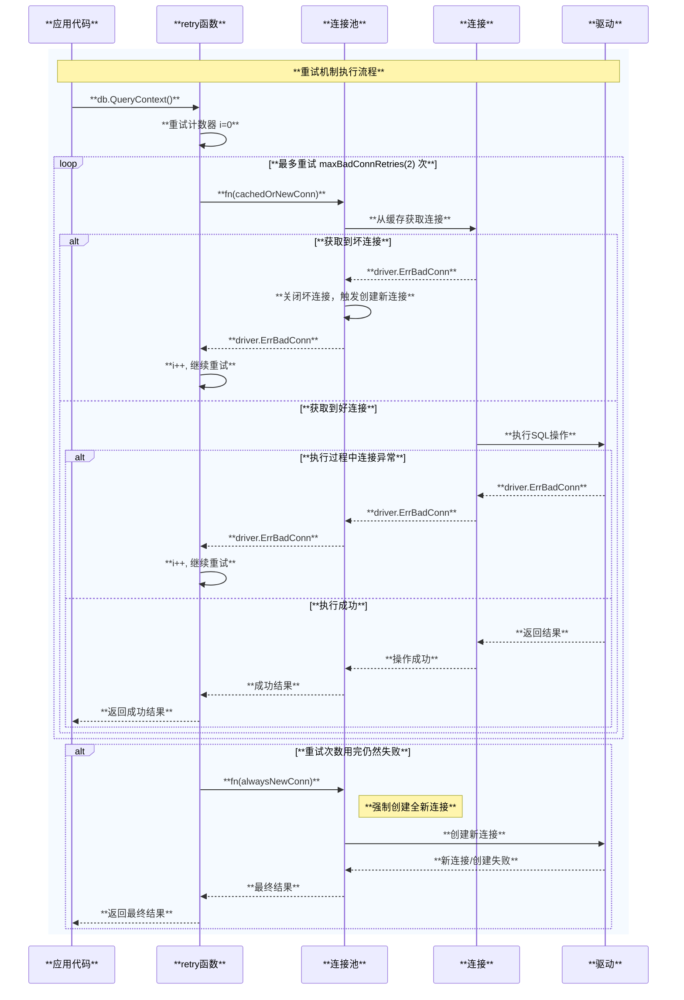
```mermaid
sequenceDiagram
    participant APP as **应用代码**
    participant RETRY as **retry函数**
    participant POOL as **连接池**
    participant CONN as **连接**
    participant DRIVER as **驱动**
    
    rect rgb(245, 250, 255)
        Note over APP,DRIVER: **重试机制执行流程**
        
        APP->>RETRY: **db.QueryContext()**
        RETRY->>RETRY: **重试计数器 i=0**
        
        loop **最多重试 maxBadConnRetries(2) 次**
            RETRY->>POOL: **fn(cachedOrNewConn)**
            POOL->>CONN: **从缓存获取连接**
            
            alt **获取到坏连接**
                CONN-->>POOL: **driver.ErrBadConn**
                POOL->>POOL: **关闭坏连接，触发创建新连接**
                POOL-->>RETRY: **driver.ErrBadConn**
                RETRY->>RETRY: **i++, 继续重试**
            else **获取到好连接**
                CONN->>DRIVER: **执行SQL操作**
                alt **执行过程中连接异常**
                    DRIVER-->>CONN: **driver.ErrBadConn**
                    CONN-->>POOL: **driver.ErrBadConn**
                    POOL-->>RETRY: **driver.ErrBadConn**
                    RETRY->>RETRY: **i++, 继续重试**
                else **执行成功**
                    DRIVER-->>CONN: **返回结果**
                    CONN-->>POOL: **操作成功**
                    POOL-->>RETRY: **成功结果**
                    RETRY-->>APP: **返回成功结果**
                end
            end
        end
        
        alt **重试次数用完仍然失败**
            RETRY->>POOL: **fn(alwaysNewConn)**
            Note right of POOL: **强制创建全新连接**
            POOL->>DRIVER: **创建新连接**
            DRIVER-->>POOL: **新连接/创建失败**
            POOL-->>RETRY: **最终结果**
            RETRY-->>APP: **返回最终结果**
        end
    end
```

### **5. 连接策略详解**

#### **5.1 connReuseStrategy 策略类型**

```go
// 来自 src/database/sql/sql.go:543-553
// connReuseStrategy determines how (*DB).conn returns database connections.
type connReuseStrategy uint8

const (
    // alwaysNewConn forces a new connection to the database.
    alwaysNewConn connReuseStrategy = iota
    // cachedOrNewConn returns a cached connection, if available, else waits
    // for one to become available (if MaxOpenConns has been reached) or
    // creates a new database connection.
    cachedOrNewConn
)
```

#### **5.2 策略使用场景**

| **策略** | **使用场景** | **行为特点** | **适用情况** |
|----------|-------------|-------------|-------------|
| **cachedOrNewConn** | **正常重试阶段** | **优先使用空闲连接池中的连接** | **前两次重试尝试** |
| **alwaysNewConn** | **最后重试** | **强制创建全新的数据库连接** | **重试次数用完后的最后尝试** |

#### **5.3 策略选择逻辑**

```go
// retry 函数中的策略选择逻辑
func (db *DB) retry(fn func(strategy connReuseStrategy) error) error {
    // 阶段1：尝试使用缓存连接（最多2次）
    for i := int64(0); i < maxBadConnRetries; i++ {
        err := fn(cachedOrNewConn)  // 使用 cachedOrNewConn 策略
        if err == nil || !errors.Is(err, driver.ErrBadConn) {
            return err
        }
    }
    
    // 阶段2：强制创建新连接（最后一次机会）
    return fn(alwaysNewConn)  // 使用 alwaysNewConn 策略
}
```

### **6. 错误处理最佳实践**

#### **6.1 驱动开发者指南**

```go
// 正确的 ErrBadConn 使用示例
func (c *myDriverConn) Query(query string, args []driver.Value) (driver.Rows, error) {
    // 发送查询到数据库
    err := c.sendQuery(query, args)
    if err != nil {
        // 检查错误类型
        if isConnectionError(err) {
            // 连接层面错误，可以安全重试
            return nil, driver.ErrBadConn
        }
        if isNetworkError(err) {
            // 网络错误，通常可以重试
            return nil, driver.ErrBadConn
        }
        // 其他错误（SQL语法错误、权限错误等）不应返回 ErrBadConn
        return nil, err
    }
    
    // 接收结果
    rows, err := c.receiveRows()
    if err != nil {
        if isConnectionError(err) {
            return nil, driver.ErrBadConn
        }
        return nil, err
    }
    
    return rows, nil
}

// 错误判断辅助函数
func isConnectionError(err error) bool {
    // 检查是否是连接相关错误
    if err == io.EOF || err == io.ErrUnexpectedEOF {
        return true
    }
    if netErr, ok := err.(net.Error); ok {
        return netErr.Timeout() || netErr.Temporary()
    }
    // 检查特定数据库的连接错误码
    return false
}
```

#### **6.2 应用开发者指南**

```go
// 应用层面的错误处理
func handleDatabaseOperation(db *sql.DB) error {
    ctx, cancel := context.WithTimeout(context.Background(), 30*time.Second)
    defer cancel()
    
    // database/sql 包会自动处理 ErrBadConn，无需应用层干预
    rows, err := db.QueryContext(ctx, "SELECT * FROM users")
    if err != nil {
        // 检查是否是上下文错误
        if errors.Is(err, context.DeadlineExceeded) {
            return fmt.Errorf("查询超时: %w", err)
        }
        
        // 检查是否是连接池相关错误
        if errors.Is(err, sql.ErrConnDone) {
            return fmt.Errorf("连接已关闭: %w", err)
        }
        
        // 其他数据库错误（SQL语法、权限等）
        return fmt.Errorf("数据库查询失败: %w", err)
    }
    defer rows.Close()
    
    // 处理结果
    for rows.Next() {
        // 扫描数据...
    }
    
    return rows.Err()
}
```

#### **6.3 连接池配置建议**

```go
// 针对 ErrBadConn 的连接池优化配置
func configureDBForBadConnResilience(db *sql.DB) {
    // 1. 设置合理的连接生存时间，避免使用过期连接
    db.SetConnMaxLifetime(30 * time.Minute)
    
    // 2. 设置空闲超时，及时清理不活跃连接
    db.SetConnMaxIdleTime(5 * time.Minute)
    
    // 3. 保持适量的空闲连接，减少创建延迟
    db.SetMaxIdleConns(10)
    
    // 4. 限制最大连接数，避免资源耗尽
    db.SetMaxOpenConns(100)
    
    // 5. 定期检查连接池状态
    go monitorConnectionPool(db)
}

func monitorConnectionPool(db *sql.DB) {
    ticker := time.NewTicker(1 * time.Minute)
    defer ticker.Stop()
    
    for range ticker.C {
        stats := db.Stats()
        
        // 检查连接池健康状况
        if stats.OpenConnections == stats.MaxOpenConnections {
            log.Warn("连接池已满", 
                "open", stats.OpenConnections,
                "max", stats.MaxOpenConnections)
        }
        
        // 检查等待时间是否过长
        if stats.WaitCount > 0 {
            avgWait := stats.WaitDuration / time.Duration(stats.WaitCount)
            if avgWait > 100*time.Millisecond {
                log.Warn("连接获取等待时间过长",
                    "avg_wait", avgWait,
                    "wait_count", stats.WaitCount)
            }
        }
    }
}
```

### **7. ErrBadConn 处理总结**

#### **7.1 处理机制特点**

- **自动化**：连接池自动检测、处理和恢复坏连接
- **透明性**：应用层无需感知坏连接的存在
- **重试保障**：最多3次尝试（2次缓存+1次新建）
- **资源清理**：及时释放坏连接占用的资源
- **服务连续性**：通过创建新连接保证服务不中断

#### **7.2 关键处理流程**

1. **检测阶段**：在连接获取、使用、归还时检测坏连接
2. **标记阶段**：将异常连接标记为 `driver.ErrBadConn`
3. **清理阶段**：关闭坏连接，释放资源，更新统计
4. **恢复阶段**：触发 `maybeOpenNewConnections` 创建替代连接
5. **重试阶段**：应用层操作自动重试，最多3次尝试

#### **7.3 最佳实践要点**

- **驱动实现**：仅在连接层问题时返回 `ErrBadConn`
- **连接配置**：设置合理的生存时间和空闲超时
- **监控告警**：定期检查连接池统计信息
- **错误处理**：应用层专注业务逻辑，信任连接池的自动恢复能力

通过这套完整的错误处理机制，Go的数据库连接池能够在面对各种连接异常时自动恢复，确保应用的高可用性和稳定性。

## **数据库连接池重试策略全面解析**

### **1. Go内置重试策略概述**

#### **1.1 内置重试机制配置**

```go
// 来自 src/database/sql/sql.go:1569-1572
// maxBadConnRetries is the number of maximum retries if the driver returns
// driver.ErrBadConn to signal a broken connection before forcing a new
// connection to be opened.
const maxBadConnRetries = 2

// 重试函数实现
func (db *DB) retry(fn func(strategy connReuseStrategy) error) error {
    for i := int64(0); i < maxBadConnRetries; i++ {
        err := fn(cachedOrNewConn)  // 阶段1：使用缓存连接重试
        if err == nil || !errors.Is(err, driver.ErrBadConn) {
            return err
        }
    }
    
    return fn(alwaysNewConn)  // 阶段2：强制创建新连接
}
```

#### **1.2 重试策略类型**

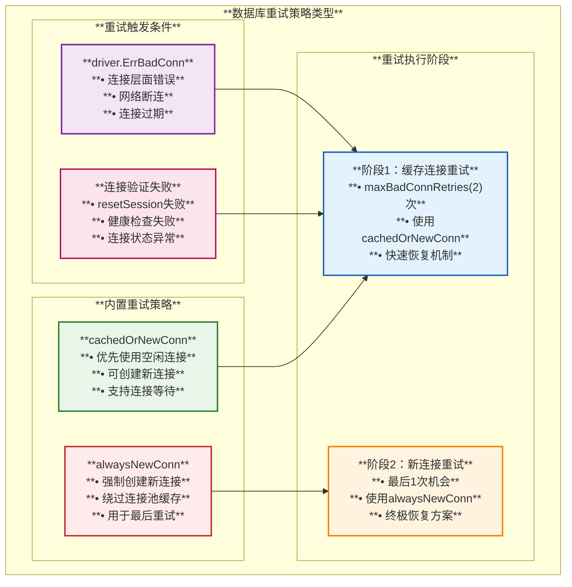
```mermaid
graph TB
    subgraph RETRY_STRATEGIES ["**数据库重试策略类型**"]
        
        subgraph BUILTIN_RETRY ["**内置重试策略**"]
            BR1["**cachedOrNewConn**<br/>**• 优先使用空闲连接**<br/>**• 可创建新连接**<br/>**• 支持连接等待**"]
            BR2["**alwaysNewConn**<br/>**• 强制创建新连接**<br/>**• 绕过连接池缓存**<br/>**• 用于最后重试**"]
            
            style BR1 fill:#E8F5E8,stroke:#2E7D32,stroke-width:2px
            style BR2 fill:#FFEBEE,stroke:#C62828,stroke-width:2px
        end
        
        subgraph RETRY_PHASES ["**重试执行阶段**"]
            RP1["**阶段1：缓存连接重试**<br/>**• maxBadConnRetries(2)次**<br/>**• 使用cachedOrNewConn**<br/>**• 快速恢复机制**"]
            RP2["**阶段2：新连接重试**<br/>**• 最后1次机会**<br/>**• 使用alwaysNewConn**<br/>**• 终极恢复方案**"]
            
            style RP1 fill:#E3F2FD,stroke:#1565C0,stroke-width:2px
            style RP2 fill:#FFF3E0,stroke:#F57C00,stroke-width:2px
        end
        
        subgraph RETRY_CONDITIONS ["**重试触发条件**"]
            RC1["**driver.ErrBadConn**<br/>**• 连接层面错误**<br/>**• 网络断连**<br/>**• 连接过期**"]
            RC2["**连接验证失败**<br/>**• resetSession失败**<br/>**• 健康检查失败**<br/>**• 连接状态异常**"]
            
            style RC1 fill:#F3E5F5,stroke:#7B1FA2,stroke-width:2px
            style RC2 fill:#FCE4EC,stroke:#AD1457,stroke-width:2px
        end
        
        BR1 --> RP1
        BR2 --> RP2
        RC1 --> RP1
        RC2 --> RP1
    end
```

### **2. 支持重试的操作清单**

#### **2.1 完全支持重试的操作**

| **操作类别** | **具体方法** | **重试次数** | **重试策略** | **源码位置** |
|-------------|-------------|-------------|-------------|-------------|
| **查询操作** | **QueryContext()** | **3次总计** | **2次缓存+1次新建** | **sql.go:1741-1744** |
| | **Query()** | **3次总计** | **2次缓存+1次新建** | **调用QueryContext** |
| **执行操作** | **ExecContext()** | **3次总计** | **2次缓存+1次新建** | **sql.go:1671-1674** |
| | **Exec()** | **3次总计** | **2次缓存+1次新建** | **调用ExecContext** |
| **预处理语句** | **PrepareContext()** | **3次总计** | **2次缓存+1次新建** | **sql.go:1598-1601** |
| | **Prepare()** | **3次总计** | **2次缓存+1次新建** | **调用PrepareContext** |
| **事务操作** | **BeginTx()** | **3次总计** | **2次缓存+1次新建** | **sql.go:1873-1876** |
| | **Begin()** | **3次总计** | **2次缓存+1次新建** | **调用BeginTx** |
| **语句操作** | **Stmt.QueryContext()** | **3次总计** | **2次缓存+1次新建** | **sql.go:2792-2796** |
| | **Stmt.ExecContext()** | **3次总计** | **2次缓存+1次新建** | **sql.go:2648-2652** |

#### **2.2 部分支持重试的操作**

| **操作类别** | **具体方法** | **重试范围** | **限制说明** | **源码位置** |
|-------------|-------------|-------------|-------------|-------------|
| **连接检查** | **PingContext()** | **仅连接获取** | **ping操作本身不重试** | **sql.go:899-902** |
| | **Ping()** | **仅连接获取** | **ping操作本身不重试** | **调用PingContext** |

#### **2.3 不支持重试的操作**

| **操作类别** | **具体方法** | **原因说明** | **影响范围** |
|-------------|-------------|-------------|-------------|
| **专用连接操作** | **Conn.ExecContext()** | **绑定特定连接，不走连接池** | **单连接操作** |
| | **Conn.QueryContext()** | **绑定特定连接，不走连接池** | **单连接操作** |
| | **Conn.PrepareContext()** | **绑定特定连接，不走连接池** | **单连接操作** |
| | **Conn.BeginTx()** | **绑定特定连接，不走连接池** | **单连接操作** |
| **底层操作** | **pingDC()** | **直接操作驱动连接** | **内部函数** |
| | **一些内部辅助函数** | **非面向用户的API** | **内部实现** |

### **3. 重试策略深度解析**

#### **3.1 重试执行流程详解**

```mermaid
sequenceDiagram
    participant APP as **应用代码**
    participant RETRY as **retry()函数**
    participant STRATEGY1 as **cachedOrNewConn**
    participant STRATEGY2 as **alwaysNewConn**
    participant POOL as **连接池**
    
    rect rgb(240, 248, 255)
        Note over APP,POOL: **重试策略执行流程**
        
        APP->>RETRY: **调用数据库操作**
        RETRY->>RETRY: **初始化重试计数器 i=0**
        
        loop **阶段1: 缓存连接重试 (最多2次)**
            RETRY->>STRATEGY1: **fn(cachedOrNewConn)**
            STRATEGY1->>POOL: **尝试获取缓存连接**
            
            alt **连接可用**
                POOL-->>STRATEGY1: **返回可用连接**
                STRATEGY1->>STRATEGY1: **执行数据库操作**
                
                alt **操作成功**
                    STRATEGY1-->>RETRY: **返回成功结果**
                    RETRY-->>APP: **操作完成**
                else **遇到ErrBadConn**
                    STRATEGY1-->>RETRY: **driver.ErrBadConn**
                    RETRY->>RETRY: **i++，准备下次重试**
                end
            else **连接不可用**
                POOL-->>STRATEGY1: **driver.ErrBadConn**
                STRATEGY1-->>RETRY: **driver.ErrBadConn**
                RETRY->>RETRY: **i++，准备下次重试**
            end
        end
        
        alt **阶段1重试失败**
            RETRY->>STRATEGY2: **fn(alwaysNewConn)**
            STRATEGY2->>POOL: **强制创建新连接**
            
            alt **新连接创建成功**
                POOL-->>STRATEGY2: **返回新连接**
                STRATEGY2->>STRATEGY2: **执行数据库操作**
                STRATEGY2-->>RETRY: **最终结果**
                RETRY-->>APP: **最终操作结果**
            else **新连接创建失败**
                POOL-->>STRATEGY2: **创建失败错误**
                STRATEGY2-->>RETRY: **最终错误**
                RETRY-->>APP: **返回失败**
            end
        end
    end
```

#### **3.2 重试策略参数配置**

```go
// 重试次数配置（编译时常量，不可修改）
const maxBadConnRetries = 2  // 缓存连接重试次数
const totalRetries = maxBadConnRetries + 1  // 总重试次数（3次）

// 连接获取策略
type connReuseStrategy uint8

const (
    // alwaysNewConn 强制创建新连接
    // - 绕过连接池缓存
    // - 直接调用connector.Connect()
    // - 用于最后一次重试
    alwaysNewConn connReuseStrategy = iota
    
    // cachedOrNewConn 优先使用缓存连接
    // - 首先检查空闲连接池
    // - 可以等待其他连接释放
    // - 必要时创建新连接
    cachedOrNewConn
)
```

#### **3.3 重试策略优化配置**

```go
// 针对重试机制的连接池优化配置
func OptimizePoolForRetry(db *sql.DB) {
    // 1. 增加连接池大小，减少重试概率
    db.SetMaxOpenConns(50)  // 适当增加最大连接数
    db.SetMaxIdleConns(20)  // 保持足够的空闲连接
    
    // 2. 缩短连接生存时间，及时清理坏连接
    db.SetConnMaxLifetime(20 * time.Minute)  // 20分钟最大生存时间
    db.SetConnMaxIdleTime(3 * time.Minute)   // 3分钟最大空闲时间
    
    // 3. 启用连接预热，减少新连接创建延迟
    go func() {
        ctx, cancel := context.WithTimeout(context.Background(), 10*time.Second)
        defer cancel()
        
        // 预热连接池
        for i := 0; i < 10; i++ {
            if err := db.PingContext(ctx); err != nil {
                log.Printf("连接池预热失败: %v", err)
                break
            }
        }
    }()
}
```

### **4. 扩展重试机制实现方案**

#### **4.1 方案1：装饰器模式 - 数据库包装器**

```go
// RetryableDB 装饰器，为所有操作添加重试机制
type RetryableDB struct {
    db         *sql.DB
    maxRetries int
    backoff    BackoffStrategy
    logger     *slog.Logger
}

// BackoffStrategy 退避策略接口
type BackoffStrategy interface {
    NextDelay(attempt int, err error) time.Duration
    Reset()
}

// ExponentialBackoff 指数退避策略
type ExponentialBackoff struct {
    InitialDelay time.Duration
    MaxDelay     time.Duration
    Multiplier   float64
}

func (e *ExponentialBackoff) NextDelay(attempt int, err error) time.Duration {
    if attempt == 0 {
        return 0
    }
    
    delay := time.Duration(float64(e.InitialDelay) * math.Pow(e.Multiplier, float64(attempt-1)))
    if delay > e.MaxDelay {
        delay = e.MaxDelay
    }
    
    // 添加随机抖动，避免雷群效应
    jitter := time.Duration(rand.Float64() * float64(delay) * 0.1)
    return delay + jitter
}

func (e *ExponentialBackoff) Reset() {
    // 重置退避状态
}

// 创建可重试的数据库包装器
func NewRetryableDB(db *sql.DB, options ...RetryOption) *RetryableDB {
    rdb := &RetryableDB{
        db:         db,
        maxRetries: 3,
        backoff:    &ExponentialBackoff{
            InitialDelay: 100 * time.Millisecond,
            MaxDelay:     5 * time.Second,
            Multiplier:   2.0,
        },
        logger: slog.Default(),
    }
    
    for _, option := range options {
        option(rdb)
    }
    
    return rdb
}

// RetryOption 配置选项
type RetryOption func(*RetryableDB)

func WithMaxRetries(maxRetries int) RetryOption {
    return func(rdb *RetryableDB) {
        rdb.maxRetries = maxRetries
    }
}

func WithBackoffStrategy(backoff BackoffStrategy) RetryOption {
    return func(rdb *RetryableDB) {
        rdb.backoff = backoff
    }
}

func WithLogger(logger *slog.Logger) RetryOption {
    return func(rdb *RetryableDB) {
        rdb.logger = logger
    }
}

// 通用重试执行器
func (rdb *RetryableDB) executeWithRetry(ctx context.Context, operation string, fn func() error) error {
    var lastErr error
    
    for attempt := 0; attempt <= rdb.maxRetries; attempt++ {
        if attempt > 0 {
            delay := rdb.backoff.NextDelay(attempt, lastErr)
            rdb.logger.Debug("重试操作", 
                "operation", operation,
                "attempt", attempt,
                "delay", delay,
                "last_error", lastErr)
            
            select {
            case <-ctx.Done():
                return ctx.Err()
            case <-time.After(delay):
                // 继续重试
            }
        }
        
        err := fn()
        if err == nil {
            if attempt > 0 {
                rdb.logger.Info("操作重试成功",
                    "operation", operation,
                    "attempts", attempt+1)
            }
            return nil
        }
        
        lastErr = err
        
        // 检查是否为可重试错误
        if !rdb.isRetryableError(err) {
            rdb.logger.Debug("遇到不可重试错误",
                "operation", operation,
                "error", err)
            return err
        }
        
        if attempt == rdb.maxRetries {
            rdb.logger.Warn("重试次数耗尽",
                "operation", operation,
                "attempts", attempt+1,
                "final_error", err)
        }
    }
    
    return fmt.Errorf("操作在 %d 次重试后仍然失败: %w", rdb.maxRetries+1, lastErr)
}

// 判断错误是否可重试
func (rdb *RetryableDB) isRetryableError(err error) bool {
    // 1. 检查driver.ErrBadConn
    if errors.Is(err, driver.ErrBadConn) {
        return true
    }
    
    // 2. 检查网络错误
    if netErr, ok := err.(net.Error); ok {
        return netErr.Temporary() || netErr.Timeout()
    }
    
    // 3. 检查上下文超时（通常不重试）
    if errors.Is(err, context.DeadlineExceeded) {
        return false
    }
    
    // 4. 检查特定数据库错误码
    errorMessage := err.Error()
    retryablePatterns := []string{
        "connection refused",
        "connection reset",
        "connection lost",
        "server has gone away",
        "broken pipe",
        "no such host",
        "timeout",
    }
    
    for _, pattern := range retryablePatterns {
        if strings.Contains(strings.ToLower(errorMessage), pattern) {
            return true
        }
    }
    
    return false
}

// 包装所有数据库操作
func (rdb *RetryableDB) QueryContext(ctx context.Context, query string, args ...any) (*sql.Rows, error) {
    var rows *sql.Rows
    
    err := rdb.executeWithRetry(ctx, "QueryContext", func() error {
        var err error
        rows, err = rdb.db.QueryContext(ctx, query, args...)
        return err
    })
    
    return rows, err
}

func (rdb *RetryableDB) ExecContext(ctx context.Context, query string, args ...any) (sql.Result, error) {
    var result sql.Result
    
    err := rdb.executeWithRetry(ctx, "ExecContext", func() error {
        var err error
        result, err = rdb.db.ExecContext(ctx, query, args...)
        return err
    })
    
    return result, err
}

// 为Ping操作添加完整重试支持
func (rdb *RetryableDB) PingContext(ctx context.Context) error {
    return rdb.executeWithRetry(ctx, "PingContext", func() error {
        return rdb.db.PingContext(ctx)
    })
}

// 事务操作的特殊处理
func (rdb *RetryableDB) BeginTx(ctx context.Context, opts *sql.TxOptions) (*sql.Tx, error) {
    var tx *sql.Tx
    
    err := rdb.executeWithRetry(ctx, "BeginTx", func() error {
        var err error
        tx, err = rdb.db.BeginTx(ctx, opts)
        return err
    })
    
    return tx, err
}

// 使用示例
func ExampleRetryableDB() {
    // 原始数据库连接
    db, err := sql.Open("mysql", "user:password@tcp(localhost:3306)/dbname")
    if err != nil {
        log.Fatal(err)
    }
    defer db.Close()
    
    // 创建可重试的数据库包装器
    retryableDB := NewRetryableDB(db,
        WithMaxRetries(5),
        WithBackoffStrategy(&ExponentialBackoff{
            InitialDelay: 50 * time.Millisecond,
            MaxDelay:     3 * time.Second,
            Multiplier:   1.5,
        }),
    )
    
    // 使用可重试的数据库操作
    ctx, cancel := context.WithTimeout(context.Background(), 30*time.Second)
    defer cancel()
    
    // 所有操作都自动支持重试
    rows, err := retryableDB.QueryContext(ctx, "SELECT id, name FROM users WHERE active = ?", true)
    if err != nil {
        log.Printf("查询失败: %v", err)
        return
    }
    defer rows.Close()
    
    // 处理结果...
}
```

#### **4.2 方案2：中间件模式 - 拦截器链**

```go
// DBInterceptor 数据库操作拦截器接口
type DBInterceptor interface {
    Intercept(ctx context.Context, operation string, args []any, next func() (any, error)) (any, error)
}

// RetryInterceptor 重试拦截器
type RetryInterceptor struct {
    maxRetries int
    backoff    BackoffStrategy
    matcher    ErrorMatcher
}

// ErrorMatcher 错误匹配器
type ErrorMatcher interface {
    ShouldRetry(err error) bool
}

type DefaultErrorMatcher struct{}

func (m *DefaultErrorMatcher) ShouldRetry(err error) bool {
    // 实现错误匹配逻辑
    return errors.Is(err, driver.ErrBadConn) ||
           isNetworkError(err) ||
           isTemporaryError(err)
}

func (ri *RetryInterceptor) Intercept(ctx context.Context, operation string, args []any, next func() (any, error)) (any, error) {
    var lastErr error
    
    for attempt := 0; attempt <= ri.maxRetries; attempt++ {
        if attempt > 0 {
            delay := ri.backoff.NextDelay(attempt, lastErr)
            
            select {
            case <-ctx.Done():
                return nil, ctx.Err()
            case <-time.After(delay):
                // 继续重试
            }
        }
        
        result, err := next()
        if err == nil {
            return result, nil
        }
        
        lastErr = err
        
        // 检查是否应该重试
        if !ri.matcher.ShouldRetry(err) {
            return result, err
        }
        
        if attempt == ri.maxRetries {
            break
        }
    }
    
    return nil, fmt.Errorf("操作在 %d 次重试后失败: %w", ri.maxRetries+1, lastErr)
}

// LoggingInterceptor 日志拦截器
type LoggingInterceptor struct {
    logger *slog.Logger
}

func (li *LoggingInterceptor) Intercept(ctx context.Context, operation string, args []any, next func() (any, error)) (any, error) {
    start := time.Now()
    
    li.logger.Debug("数据库操作开始",
        "operation", operation,
        "args_count", len(args))
    
    result, err := next()
    
    duration := time.Since(start)
    
    if err != nil {
        li.logger.Error("数据库操作失败",
            "operation", operation,
            "duration", duration,
            "error", err)
    } else {
        li.logger.Debug("数据库操作成功",
            "operation", operation,
            "duration", duration)
    }
    
    return result, err
}

// MetricsInterceptor 指标拦截器
type MetricsInterceptor struct {
    metrics *DatabaseMetrics
}

func (mi *MetricsInterceptor) Intercept(ctx context.Context, operation string, args []any, next func() (any, error)) (any, error) {
    start := time.Now()
    mi.metrics.OperationsTotal.WithLabelValues(operation).Inc()
    
    result, err := next()
    
    duration := time.Since(start)
    mi.metrics.OperationDuration.WithLabelValues(operation).Observe(duration.Seconds())
    
    if err != nil {
        mi.metrics.OperationErrors.WithLabelValues(operation).Inc()
    }
    
    return result, err
}

// InterceptorChain 拦截器链
type InterceptorChain struct {
    interceptors []DBInterceptor
}

func NewInterceptorChain(interceptors ...DBInterceptor) *InterceptorChain {
    return &InterceptorChain{
        interceptors: interceptors,
    }
}

func (ic *InterceptorChain) Execute(ctx context.Context, operation string, args []any, final func() (any, error)) (any, error) {
    if len(ic.interceptors) == 0 {
        return final()
    }
    
    var chain func(int) (any, error)
    chain = func(index int) (any, error) {
        if index >= len(ic.interceptors) {
            return final()
        }
        
        return ic.interceptors[index].Intercept(ctx, operation, args, func() (any, error) {
            return chain(index + 1)
        })
    }
    
    return chain(0)
}

// InterceptableDB 支持拦截器的数据库包装器
type InterceptableDB struct {
    db    *sql.DB
    chain *InterceptorChain
}

func NewInterceptableDB(db *sql.DB, interceptors ...DBInterceptor) *InterceptableDB {
    return &InterceptableDB{
        db:    db,
        chain: NewInterceptorChain(interceptors...),
    }
}

func (idb *InterceptableDB) QueryContext(ctx context.Context, query string, args ...any) (*sql.Rows, error) {
    result, err := idb.chain.Execute(ctx, "QueryContext", args, func() (any, error) {
        return idb.db.QueryContext(ctx, query, args...)
    })
    
    if err != nil {
        return nil, err
    }
    
    return result.(*sql.Rows), nil
}

// 使用示例
func ExampleInterceptableDB() {
    db, _ := sql.Open("mysql", "dsn")
    defer db.Close()
    
    // 构建拦截器链
    interceptableDB := NewInterceptableDB(db,
        &LoggingInterceptor{logger: slog.Default()},
        &RetryInterceptor{
            maxRetries: 3,
            backoff:    &ExponentialBackoff{/*...*/},
            matcher:    &DefaultErrorMatcher{},
        },
        &MetricsInterceptor{metrics: newDatabaseMetrics()},
    )
    
    // 使用拦截器链
    rows, err := interceptableDB.QueryContext(context.Background(), "SELECT * FROM users")
    // ... 处理结果
}
```

#### **4.3 方案3：代理模式 - 数据库代理**

```go
// DatabaseProxy 数据库代理接口
type DatabaseProxy interface {
    // 基本操作
    QueryContext(ctx context.Context, query string, args ...any) (*sql.Rows, error)
    ExecContext(ctx context.Context, query string, args ...any) (sql.Result, error)
    PrepareContext(ctx context.Context, query string) (*sql.Stmt, error)
    BeginTx(ctx context.Context, opts *sql.TxOptions) (*sql.Tx, error)
    PingContext(ctx context.Context) error
    
    // 连接池操作
    SetMaxIdleConns(n int)
    SetMaxOpenConns(n int)
    SetConnMaxLifetime(d time.Duration)
    Stats() sql.DBStats
    Close() error
}

// ReliableDatabaseProxy 可靠性数据库代理
type ReliableDatabaseProxy struct {
    primary   *sql.DB
    fallback  *sql.DB  // 可选的备用数据库
    retryFunc func(operation string, fn func() error) error
    circuitBreaker *CircuitBreaker
    metrics   *ProxyMetrics
}

// CircuitBreaker 熔断器
type CircuitBreaker struct {
    mu              sync.RWMutex
    state          CircuitState
    failures       int
    successCount   int
    failureCount   int
    nextAttemptTime time.Time
    
    // 配置
    maxFailures    int
    timeout        time.Duration
    resetTimeout   time.Duration
}

type CircuitState int

const (
    StateClosed CircuitState = iota
    StateHalfOpen
    StateOpen
)

func (cb *CircuitBreaker) Execute(fn func() error) error {
    cb.mu.RLock()
    state := cb.state
    cb.mu.RUnlock()
    
    switch state {
    case StateOpen:
        if time.Now().Before(cb.nextAttemptTime) {
            return ErrCircuitBreakerOpen
        }
        // 尝试半开状态
        cb.mu.Lock()
        cb.state = StateHalfOpen
        cb.mu.Unlock()
        fallthrough
        
    case StateHalfOpen:
        err := fn()
        if err != nil {
            cb.recordFailure()
            return err
        }
        cb.recordSuccess()
        return nil
        
    case StateClosed:
        err := fn()
        if err != nil {
            cb.recordFailure()
            return err
        }
        cb.recordSuccess()
        return nil
    }
    
    return nil
}

func (cb *CircuitBreaker) recordFailure() {
    cb.mu.Lock()
    defer cb.mu.Unlock()
    
    cb.failures++
    cb.failureCount++
    
    if cb.failures >= cb.maxFailures {
        cb.state = StateOpen
        cb.nextAttemptTime = time.Now().Add(cb.resetTimeout)
    }
}

func (cb *CircuitBreaker) recordSuccess() {
    cb.mu.Lock()
    defer cb.mu.Unlock()
    
    cb.failures = 0
    cb.successCount++
    
    if cb.state == StateHalfOpen {
        cb.state = StateClosed
    }
}

// ProxyMetrics 代理指标
type ProxyMetrics struct {
    PrimaryOperations   prometheus.Counter
    FallbackOperations  prometheus.Counter
    CircuitBreakerTrips prometheus.Counter
    RetryOperations     prometheus.Counter
    OperationDuration   prometheus.Histogram
}

func NewReliableDatabaseProxy(primary, fallback *sql.DB) *ReliableDatabaseProxy {
    proxy := &ReliableDatabaseProxy{
        primary:  primary,
        fallback: fallback,
        circuitBreaker: &CircuitBreaker{
            maxFailures:  5,
            timeout:      30 * time.Second,
            resetTimeout: 60 * time.Second,
        },
        metrics: &ProxyMetrics{}, // 初始化指标
    }
    
    // 设置重试函数
    proxy.retryFunc = func(operation string, fn func() error) error {
        backoff := &ExponentialBackoff{
            InitialDelay: 100 * time.Millisecond,
            MaxDelay:     5 * time.Second,
            Multiplier:   2.0,
        }
        
        var lastErr error
        for attempt := 0; attempt < 3; attempt++ {
            if attempt > 0 {
                time.Sleep(backoff.NextDelay(attempt, lastErr))
            }
            
            err := fn()
            if err == nil {
                return nil
            }
            
            lastErr = err
            if !proxy.isRetryableError(err) {
                break
            }
        }
        
        return lastErr
    }
    
    return proxy
}

func (proxy *ReliableDatabaseProxy) QueryContext(ctx context.Context, query string, args ...any) (*sql.Rows, error) {
    var rows *sql.Rows
    var err error
    
    // 尝试主数据库
    err = proxy.circuitBreaker.Execute(func() error {
        return proxy.retryFunc("QueryContext", func() error {
            rows, err = proxy.primary.QueryContext(ctx, query, args...)
            return err
        })
    })
    
    if err != nil && proxy.fallback != nil {
        // 尝试备用数据库
        proxy.metrics.FallbackOperations.Inc()
        err = proxy.retryFunc("QueryContext", func() error {
            rows, err = proxy.fallback.QueryContext(ctx, query, args...)
            return err
        })
    }
    
    return rows, err
}

func (proxy *ReliableDatabaseProxy) isRetryableError(err error) bool {
    return errors.Is(err, driver.ErrBadConn) ||
           isNetworkError(err) ||
           isTemporaryError(err)
}

// 使用示例
func ExampleReliableDatabaseProxy() {
    primary, _ := sql.Open("mysql", "primary_dsn")
    fallback, _ := sql.Open("mysql", "fallback_dsn")
    
    proxy := NewReliableDatabaseProxy(primary, fallback)
    defer proxy.Close()
    
    // 使用代理进行数据库操作
    rows, err := proxy.QueryContext(context.Background(), 
        "SELECT id, name FROM users WHERE status = ?", "active")
    if err != nil {
        log.Printf("查询失败: %v", err)
        return
    }
    defer rows.Close()
    
    // 处理结果...
}
```

#### **4.4 方案4：驱动层实现 - 自定义驱动包装器**

```go
// RetryDriver 重试驱动包装器
type RetryDriver struct {
    underlying driver.Driver
    maxRetries int
    backoff    BackoffStrategy
}

func NewRetryDriver(underlying driver.Driver, maxRetries int) *RetryDriver {
    return &RetryDriver{
        underlying: underlying,
        maxRetries: maxRetries,
        backoff: &ExponentialBackoff{
            InitialDelay: 50 * time.Millisecond,
            MaxDelay:     2 * time.Second,
            Multiplier:   1.5,
        },
    }
}

func (rd *RetryDriver) Open(name string) (driver.Conn, error) {
    var conn driver.Conn
    var err error
    
    for attempt := 0; attempt <= rd.maxRetries; attempt++ {
        if attempt > 0 {
            time.Sleep(rd.backoff.NextDelay(attempt, err))
        }
        
        conn, err = rd.underlying.Open(name)
        if err == nil {
            return &RetryConn{
                underlying: conn,
                maxRetries: rd.maxRetries,
                backoff:    rd.backoff,
            }, nil
        }
        
        if !rd.isRetryableError(err) {
            break
        }
    }
    
    return nil, err
}

// RetryConn 重试连接包装器
type RetryConn struct {
    underlying driver.Conn
    maxRetries int
    backoff    BackoffStrategy
}

func (rc *RetryConn) Query(query string, args []driver.Value) (driver.Rows, error) {
    var rows driver.Rows
    var err error
    
    for attempt := 0; attempt <= rc.maxRetries; attempt++ {
        if attempt > 0 {
            time.Sleep(rc.backoff.NextDelay(attempt, err))
        }
        
        rows, err = rc.underlying.Query(query, args)
        if err == nil {
            return rows, nil
        }
        
        // 检查是否为坏连接，如果是则直接返回以触发上层重试
        if errors.Is(err, driver.ErrBadConn) {
            return nil, err
        }
        
        if !rc.isRetryableError(err) {
            break
        }
    }
    
    return rows, err
}

func (rc *RetryConn) Exec(query string, args []driver.Value) (driver.Result, error) {
    var result driver.Result
    var err error
    
    for attempt := 0; attempt <= rc.maxRetries; attempt++ {
        if attempt > 0 {
            time.Sleep(rc.backoff.NextDelay(attempt, err))
        }
        
        result, err = rc.underlying.Exec(query, args)
        if err == nil {
            return result, nil
        }
        
        if errors.Is(err, driver.ErrBadConn) {
            return nil, err
        }
        
        if !rc.isRetryableError(err) {
            break
        }
    }
    
    return result, err
}

// 注册重试驱动
func init() {
    // 包装现有的MySQL驱动
    if mysqlDriver := sql.Drivers(); len(mysqlDriver) > 0 {
        retryMysqlDriver := NewRetryDriver(&mysql.MySQLDriver{}, 3)
        sql.Register("mysql-retry", retryMysqlDriver)
    }
}

// 使用重试驱动
func ExampleRetryDriver() {
    // 使用包装了重试功能的驱动
    db, err := sql.Open("mysql-retry", "user:password@tcp(localhost:3306)/dbname")
    if err != nil {
        log.Fatal(err)
    }
    defer db.Close()
    
    // 所有操作都在驱动层面支持重试
    rows, err := db.Query("SELECT * FROM users")
    if err != nil {
        log.Printf("查询失败: %v", err)
        return
    }
    defer rows.Close()
}
```

### **5. 重试方案对比分析**

| **方案** | **实现复杂度** | **性能影响** | **兼容性** | **功能完整性** | **推荐场景** |
|----------|--------------|-------------|-----------|--------------|-------------|
| **装饰器模式** | **中等** | **轻微** | **完全兼容** | **高** | **现有项目快速集成** |
| **中间件模式** | **高** | **轻微** | **完全兼容** | **最高** | **需要多种增强功能** |
| **代理模式** | **高** | **中等** | **完全兼容** | **最高** | **企业级高可用应用** |
| **驱动包装** | **中等** | **最小** | **部分兼容** | **中等** | **底层统一解决方案** |

### **6. 最佳实践建议**

#### **6.1 重试策略选择准则**

1. **简单应用**：使用装饰器模式，实现简单，影响最小
2. **复杂系统**：使用中间件模式，功能最全面，扩展性最好
3. **高可用要求**：使用代理模式，支持多数据源和熔断
4. **底层统一**：使用驱动包装，一次实现，全局生效

#### **6.2 重试配置优化**

```go
// 生产环境重试配置建议
type ProductionRetryConfig struct {
    MaxRetries      int           `default:"3"`      // 最大重试次数
    InitialDelay    time.Duration `default:"100ms"`  // 初始延迟
    MaxDelay        time.Duration `default:"5s"`     // 最大延迟
    BackoffMultiplier float64     `default:"2.0"`    // 退避倍数
    JitterPercent   float64       `default:"0.1"`    // 随机抖动比例
    
    // 错误分类配置
    RetryableErrors []string `default:"connection refused,timeout,bad connection"`
    FatalErrors     []string `default:"access denied,syntax error,table not found"`
}
```

#### **6.3 监控和告警**

```go
// 重试相关指标监控
type RetryMetrics struct {
    // 重试统计
    RetryAttempts    prometheus.Counter   // 总重试次数
    RetrySuccesses   prometheus.Counter   // 重试成功次数  
    RetryFailures    prometheus.Counter   // 重试失败次数
    
    // 延迟统计
    RetryDelay       prometheus.Histogram // 重试延迟分布
    OperationLatency prometheus.Histogram // 操作总延迟
    
    // 错误分类
    RetryByError     *prometheus.CounterVec // 按错误类型分类的重试
    RetryByOperation *prometheus.CounterVec // 按操作类型分类的重试
}

// 设置告警规则
func SetupRetryAlerts() {
    // 重试率过高告警
    // retry_attempts_rate > 0.1 (10%的操作需要重试)
    
    // 重试失败率过高告警  
    // retry_failures_rate / retry_attempts_rate > 0.3
    
    // 重试延迟过长告警
    // histogram_quantile(0.95, retry_delay) > 5s
}
```

通过以上4种方案，可以为Go数据库驱动的所有操作提供全面的重试支持，大大提高应用在面对网络抖动、数据库临时故障等异常情况时的稳定性和可用性。选择哪种方案取决于具体的应用场景、性能要求和团队技术栈。

## **通用池化技术的重试策略集成方案**

基于前面分析的数据库重试策略和通用池化技术框架，我们现在设计一个集成了重试机制的通用池化解决方案，让所有类型的资源池都能受益于智能重试机制。

### **1. 重试增强的通用池化框架**

#### **1.1 重试策略接口设计**

```go
// RetryStrategy 重试策略接口
type RetryStrategy interface {
    // ShouldRetry 判断错误是否应该重试
    ShouldRetry(attempt int, err error) bool
    
    // NextDelay 计算下次重试延迟
    NextDelay(attempt int, err error) time.Duration
    
    // MaxAttempts 最大重试次数
    MaxAttempts() int
    
    // Reset 重置策略状态
    Reset()
    
    // Name 策略名称
    Name() string
}

// ErrorClassifier 错误分类器
type ErrorClassifier interface {
    // ClassifyError 分类错误类型
    ClassifyError(err error) ErrorType
    
    // IsRetryable 判断错误是否可重试
    IsRetryable(err error) bool
    
    // IsFatal 判断错误是否致命
    IsFatal(err error) bool
}

// ErrorType 错误类型
type ErrorType int

const (
    ErrorTypeUnknown ErrorType = iota
    ErrorTypeNetwork          // 网络错误
    ErrorTypeTimeout          // 超时错误
    ErrorTypeResource         // 资源错误
    ErrorTypePermission       // 权限错误
    ErrorTypeValidation       // 验证错误
    ErrorTypeFatal           // 致命错误
)

// RetryContext 重试上下文
type RetryContext struct {
    Operation    string                 // 操作名称
    Attempt      int                   // 当前重试次数
    TotalTime    time.Duration         // 总耗时
    LastError    error                 // 上次错误
    Metadata     map[string]interface{} // 元数据
    StartTime    time.Time             // 开始时间
}
```

#### **1.2 具体重试策略实现**

```go
// ExponentialBackoffStrategy 指数退避策略
type ExponentialBackoffStrategy struct {
    MaxAttempts   int
    InitialDelay  time.Duration
    MaxDelay      time.Duration
    Multiplier    float64
    JitterFactor  float64
    classifier    ErrorClassifier
}

func NewExponentialBackoffStrategy(maxAttempts int, initialDelay, maxDelay time.Duration) *ExponentialBackoffStrategy {
    return &ExponentialBackoffStrategy{
        MaxAttempts:   maxAttempts,
        InitialDelay:  initialDelay,
        MaxDelay:      maxDelay,
        Multiplier:    2.0,
        JitterFactor:  0.1,
        classifier:    &DefaultErrorClassifier{},
    }
}

func (s *ExponentialBackoffStrategy) ShouldRetry(attempt int, err error) bool {
    if attempt >= s.MaxAttempts {
        return false
    }
    
    return s.classifier.IsRetryable(err)
}

func (s *ExponentialBackoffStrategy) NextDelay(attempt int, err error) time.Duration {
    if attempt <= 0 {
        return 0
    }
    
    // 计算指数退避延迟
    delay := time.Duration(float64(s.InitialDelay) * math.Pow(s.Multiplier, float64(attempt-1)))
    
    // 限制最大延迟
    if delay > s.MaxDelay {
        delay = s.MaxDelay
    }
    
    // 添加随机抖动
    if s.JitterFactor > 0 {
        jitter := time.Duration(rand.Float64() * float64(delay) * s.JitterFactor)
        delay += jitter
    }
    
    return delay
}

func (s *ExponentialBackoffStrategy) MaxAttempts() int {
    return s.MaxAttempts
}

func (s *ExponentialBackoffStrategy) Reset() {
    // 指数退避策略无需重置状态
}

func (s *ExponentialBackoffStrategy) Name() string {
    return "ExponentialBackoff"
}

// LinearBackoffStrategy 线性退避策略
type LinearBackoffStrategy struct {
    MaxAttempts  int
    BaseDelay    time.Duration
    Increment    time.Duration
    MaxDelay     time.Duration
    classifier   ErrorClassifier
}

func (s *LinearBackoffStrategy) NextDelay(attempt int, err error) time.Duration {
    if attempt <= 0 {
        return 0
    }
    
    delay := s.BaseDelay + time.Duration(attempt-1)*s.Increment
    if delay > s.MaxDelay {
        delay = s.MaxDelay
    }
    
    return delay
}

// FixedDelayStrategy 固定延迟策略
type FixedDelayStrategy struct {
    MaxAttempts int
    Delay       time.Duration
    classifier  ErrorClassifier
}

func (s *FixedDelayStrategy) NextDelay(attempt int, err error) time.Duration {
    if attempt <= 0 {
        return 0
    }
    return s.Delay
}

// AdaptiveRetryStrategy 自适应重试策略
type AdaptiveRetryStrategy struct {
    MaxAttempts     int
    InitialDelay    time.Duration
    MaxDelay        time.Duration
    SuccessThreshold int
    FailureThreshold int
    
    // 统计信息
    recentSuccesses int
    recentFailures  int
    classifier      ErrorClassifier
}

func (s *AdaptiveRetryStrategy) NextDelay(attempt int, err error) time.Duration {
    if attempt <= 0 {
        return 0
    }
    
    // 根据最近成功/失败率调整延迟
    failureRate := float64(s.recentFailures) / float64(s.recentFailures + s.recentSuccesses + 1)
    
    baseDelay := s.InitialDelay
    if failureRate > 0.5 {
        // 失败率高，增加延迟
        baseDelay = time.Duration(float64(baseDelay) * (1 + failureRate))
    } else {
        // 失败率低，减少延迟
        baseDelay = time.Duration(float64(baseDelay) * (1 - failureRate*0.5))
    }
    
    delay := time.Duration(float64(baseDelay) * math.Pow(1.5, float64(attempt-1)))
    if delay > s.MaxDelay {
        delay = s.MaxDelay
    }
    
    return delay
}

// DefaultErrorClassifier 默认错误分类器
type DefaultErrorClassifier struct{}

func (c *DefaultErrorClassifier) ClassifyError(err error) ErrorType {
    if err == nil {
        return ErrorTypeUnknown
    }
    
    errMsg := strings.ToLower(err.Error())
    
    // 网络错误
    networkPatterns := []string{
        "connection refused", "connection reset", "connection lost",
        "network unreachable", "host unreachable", "no route to host",
        "broken pipe", "connection timeout",
    }
    for _, pattern := range networkPatterns {
        if strings.Contains(errMsg, pattern) {
            return ErrorTypeNetwork
        }
    }
    
    // 超时错误
    timeoutPatterns := []string{"timeout", "deadline exceeded", "context canceled"}
    for _, pattern := range timeoutPatterns {
        if strings.Contains(errMsg, pattern) {
            return ErrorTypeTimeout
        }
    }
    
    // 资源错误
    resourcePatterns := []string{
        "resource temporarily unavailable", "too many connections",
        "pool exhausted", "resource busy",
    }
    for _, pattern := range resourcePatterns {
        if strings.Contains(errMsg, pattern) {
            return ErrorTypeResource
        }
    }
    
    // 权限错误（通常不重试）
    permissionPatterns := []string{
        "access denied", "permission denied", "unauthorized",
        "forbidden", "authentication failed",
    }
    for _, pattern := range permissionPatterns {
        if strings.Contains(errMsg, pattern) {
            return ErrorTypePermission
        }
    }
    
    return ErrorTypeUnknown
}

func (c *DefaultErrorClassifier) IsRetryable(err error) bool {
    errorType := c.ClassifyError(err)
    switch errorType {
    case ErrorTypeNetwork, ErrorTypeTimeout, ErrorTypeResource:
        return true
    case ErrorTypePermission, ErrorTypeFatal:
        return false
    default:
        // 对未知错误保守处理，尝试重试
        return true
    }
}

func (c *DefaultErrorClassifier) IsFatal(err error) bool {
    return c.ClassifyError(err) == ErrorTypeFatal
}
```

#### **1.3 重试增强的资源池实现**

```go
// RetryableGenericPool 支持重试的通用资源池
type RetryableGenericPool[T any] struct {
    *GenericPool[T]
    
    // 重试相关配置
    retryStrategy  RetryStrategy
    retryMetrics   *RetryMetrics
    retryLogger    *slog.Logger
    
    // 重试事件监听器
    retryListeners []RetryEventListener
    
    // 配置
    enableRetry    bool
    retryTimeout   time.Duration
}

// RetryEventListener 重试事件监听器
type RetryEventListener interface {
    OnRetryAttempt(ctx *RetryContext)
    OnRetrySuccess(ctx *RetryContext)
    OnRetryFailure(ctx *RetryContext)
    OnRetryExhausted(ctx *RetryContext)
}

// RetryMetrics 重试指标
type RetryMetrics struct {
    // 基础指标
    TotalAttempts     prometheus.Counter
    SuccessfulRetries prometheus.Counter
    FailedRetries     prometheus.Counter
    ExhaustedRetries  prometheus.Counter
    
    // 延迟指标
    RetryDelay        prometheus.Histogram
    TotalOperationTime prometheus.Histogram
    
    // 按错误类型分类
    RetryByErrorType  *prometheus.CounterVec
    
    // 按操作分类
    RetryByOperation  *prometheus.CounterVec
}

// NewRetryableGenericPool 创建支持重试的资源池
func NewRetryableGenericPool[T any](
    factory ResourceFactory[T],
    config *PoolConfig,
    retryStrategy RetryStrategy,
    options ...RetryPoolOption,
) *RetryableGenericPool[T] {
    basePool := NewGenericPool(factory, config)
    
    pool := &RetryableGenericPool[T]{
        GenericPool:   basePool,
        retryStrategy: retryStrategy,
        retryMetrics:  newRetryMetrics(),
        retryLogger:   slog.Default(),
        enableRetry:   true,
        retryTimeout:  30 * time.Second,
    }
    
    // 应用选项
    for _, option := range options {
        option(pool)
    }
    
    return pool
}

// RetryPoolOption 重试池选项
type RetryPoolOption func(*RetryableGenericPool[any])

func WithRetryLogger[T any](logger *slog.Logger) RetryPoolOption {
    return func(pool *RetryableGenericPool[any]) {
        pool.retryLogger = logger
    }
}

func WithRetryTimeout[T any](timeout time.Duration) RetryPoolOption {
    return func(pool *RetryableGenericPool[any]) {
        pool.retryTimeout = timeout
    }
}

func WithRetryListener[T any](listener RetryEventListener) RetryPoolOption {
    return func(pool *RetryableGenericPool[any]) {
        pool.retryListeners = append(pool.retryListeners, listener)
    }
}

// GetWithRetry 带重试的资源获取
func (p *RetryableGenericPool[T]) GetWithRetry(ctx context.Context) (T, error) {
    if !p.enableRetry {
        return p.GenericPool.Get(ctx)
    }
    
    return p.executeWithRetry(ctx, "Get", func() (T, error) {
        return p.GenericPool.Get(ctx)
    })
}

// executeWithRetry 通用重试执行器
func (p *RetryableGenericPool[T]) executeWithRetry(
    ctx context.Context,
    operation string,
    fn func() (T, error),
) (T, error) {
    var zero T
    
    // 创建重试上下文
    retryCtx := &RetryContext{
        Operation: operation,
        Attempt:   0,
        StartTime: time.Now(),
        Metadata:  make(map[string]interface{}),
    }
    
    // 设置超时上下文
    if p.retryTimeout > 0 {
        var cancel context.CancelFunc
        ctx, cancel = context.WithTimeout(ctx, p.retryTimeout)
        defer cancel()
    }
    
    p.retryStrategy.Reset()
    
    for attempt := 0; attempt <= p.retryStrategy.MaxAttempts(); attempt++ {
        retryCtx.Attempt = attempt
        retryCtx.TotalTime = time.Since(retryCtx.StartTime)
        
        // 检查上下文是否已取消
        select {
        case <-ctx.Done():
            return zero, ctx.Err()
        default:
        }
        
        // 如果不是第一次尝试，等待延迟
        if attempt > 0 {
            delay := p.retryStrategy.NextDelay(attempt, retryCtx.LastError)
            
            p.retryLogger.Debug("开始重试",
                "operation", operation,
                "attempt", attempt,
                "delay", delay,
                "last_error", retryCtx.LastError)
            
            // 通知监听器
            p.notifyRetryAttempt(retryCtx)
            
            // 记录指标
            p.retryMetrics.TotalAttempts.Inc()
            p.retryMetrics.RetryDelay.Observe(delay.Seconds())
            
            select {
            case <-ctx.Done():
                return zero, ctx.Err()
            case <-time.After(delay):
                // 继续执行
            }
        }
        
        // 执行操作
        result, err := fn()
        
        if err == nil {
            // 成功
            if attempt > 0 {
                p.retryLogger.Info("重试成功",
                    "operation", operation,
                    "attempts", attempt+1,
                    "total_time", retryCtx.TotalTime)
                
                p.retryMetrics.SuccessfulRetries.Inc()
                p.notifyRetrySuccess(retryCtx)
            }
            
            p.retryMetrics.TotalOperationTime.Observe(retryCtx.TotalTime.Seconds())
            return result, nil
        }
        
        retryCtx.LastError = err
        
        // 判断是否应该重试
        if !p.retryStrategy.ShouldRetry(attempt, err) {
            p.retryLogger.Debug("错误不可重试",
                "operation", operation,
                "attempt", attempt,
                "error", err)
            
            p.retryMetrics.FailedRetries.Inc()
            p.notifyRetryFailure(retryCtx)
            return zero, err
        }
        
        // 记录错误类型指标
        errorType := p.getErrorType(err)
        p.retryMetrics.RetryByErrorType.WithLabelValues(string(errorType)).Inc()
        p.retryMetrics.RetryByOperation.WithLabelValues(operation).Inc()
        
        if attempt == p.retryStrategy.MaxAttempts() {
            // 重试次数用尽
            p.retryLogger.Warn("重试次数用尽",
                "operation", operation,
                "attempts", attempt+1,
                "total_time", retryCtx.TotalTime,
                "final_error", err)
            
            p.retryMetrics.ExhaustedRetries.Inc()
            p.notifyRetryExhausted(retryCtx)
            return zero, fmt.Errorf("重试次数用尽 (%d 次): %w", attempt+1, err)
        }
    }
    
    return zero, fmt.Errorf("未预期的重试循环退出")
}

// 通知重试事件监听器
func (p *RetryableGenericPool[T]) notifyRetryAttempt(ctx *RetryContext) {
    for _, listener := range p.retryListeners {
        go listener.OnRetryAttempt(ctx)
    }
}

func (p *RetryableGenericPool[T]) notifyRetrySuccess(ctx *RetryContext) {
    for _, listener := range p.retryListeners {
        go listener.OnRetrySuccess(ctx)
    }
}

func (p *RetryableGenericPool[T]) notifyRetryFailure(ctx *RetryContext) {
    for _, listener := range p.retryListeners {
        go listener.OnRetryFailure(ctx)
    }
}

func (p *RetryableGenericPool[T]) notifyRetryExhausted(ctx *RetryContext) {
    for _, listener := range p.retryListeners {
        go listener.OnRetryExhausted(ctx)
    }
}

func (p *RetryableGenericPool[T]) getErrorType(err error) ErrorType {
    if classifier, ok := p.retryStrategy.(*ExponentialBackoffStrategy); ok {
        return classifier.classifier.ClassifyError(err)
    }
    return ErrorTypeUnknown
}
```

#### **1.4 重试增强的资源工厂**

```go
// RetryableResourceFactory 支持重试的资源工厂
type RetryableResourceFactory[T any] struct {
    underlying ResourceFactory[T]
    strategy   RetryStrategy
    logger     *slog.Logger
}

func NewRetryableResourceFactory[T any](
    underlying ResourceFactory[T],
    strategy RetryStrategy,
) *RetryableResourceFactory[T] {
    return &RetryableResourceFactory[T]{
        underlying: underlying,
        strategy:   strategy,
        logger:     slog.Default(),
    }
}

func (f *RetryableResourceFactory[T]) Create(ctx context.Context) (T, error) {
    var zero T
    var lastErr error
    
    f.strategy.Reset()
    
    for attempt := 0; attempt <= f.strategy.MaxAttempts(); attempt++ {
        // 检查上下文
        select {
        case <-ctx.Done():
            return zero, ctx.Err()
        default:
        }
        
        // 延迟处理
        if attempt > 0 {
            delay := f.strategy.NextDelay(attempt, lastErr)
            
            f.logger.Debug("重试创建资源",
                "attempt", attempt,
                "delay", delay,
                "last_error", lastErr)
            
            select {
            case <-ctx.Done():
                return zero, ctx.Err()
            case <-time.After(delay):
            }
        }
        
        // 尝试创建资源
        resource, err := f.underlying.Create(ctx)
        if err == nil {
            if attempt > 0 {
                f.logger.Info("资源创建重试成功", "attempts", attempt+1)
            }
            return resource, nil
        }
        
        lastErr = err
        
        // 判断是否应该重试
        if !f.strategy.ShouldRetry(attempt, err) {
            f.logger.Debug("资源创建错误不可重试", "error", err)
            return zero, err
        }
        
        if attempt == f.strategy.MaxAttempts() {
            f.logger.Warn("资源创建重试次数用尽",
                "attempts", attempt+1,
                "final_error", err)
            return zero, fmt.Errorf("资源创建失败，重试 %d 次: %w", attempt+1, err)
        }
    }
    
    return zero, lastErr
}

func (f *RetryableResourceFactory[T]) Validate(resource T) error {
    // 验证操作通常不需要重试，因为它是快速的本地操作
    return f.underlying.Validate(resource)
}

func (f *RetryableResourceFactory[T]) Destroy(resource T) error {
    // 销毁操作可能需要重试，确保资源被正确释放
    var lastErr error
    
    for attempt := 0; attempt <= f.strategy.MaxAttempts(); attempt++ {
        if attempt > 0 {
            delay := f.strategy.NextDelay(attempt, lastErr)
            time.Sleep(delay)
        }
        
        err := f.underlying.Destroy(resource)
        if err == nil {
            return nil
        }
        
        lastErr = err
        
        if !f.strategy.ShouldRetry(attempt, err) {
            return err
        }
    }
    
    f.logger.Warn("资源销毁重试失败", "final_error", lastErr)
    return lastErr
}

func (f *RetryableResourceFactory[T]) Reset(resource T) error {
    // 重置操作可能需要重试
    var lastErr error
    
    for attempt := 0; attempt <= f.strategy.MaxAttempts(); attempt++ {
        if attempt > 0 {
            delay := f.strategy.NextDelay(attempt, lastErr)
            time.Sleep(delay)
        }
        
        err := f.underlying.Reset(resource)
        if err == nil {
            return nil
        }
        
        lastErr = err
        
        if !f.strategy.ShouldRetry(attempt, err) {
            return err
        }
    }
    
    return lastErr
}
```

### **2. 重试策略组合与配置**

#### **2.1 重试策略链**

```go
// RetryStrategyChain 重试策略链
type RetryStrategyChain struct {
    strategies []RetryStrategy
    current    int
}

func NewRetryStrategyChain(strategies ...RetryStrategy) *RetryStrategyChain {
    return &RetryStrategyChain{
        strategies: strategies,
        current:    0,
    }
}

func (c *RetryStrategyChain) ShouldRetry(attempt int, err error) bool {
    if c.current >= len(c.strategies) {
        return false
    }
    
    currentStrategy := c.strategies[c.current]
    
    // 如果当前策略认为不应该重试，尝试下一个策略
    if !currentStrategy.ShouldRetry(attempt, err) {
        c.current++
        if c.current < len(c.strategies) {
            return c.strategies[c.current].ShouldRetry(0, err)
        }
        return false
    }
    
    return true
}

func (c *RetryStrategyChain) NextDelay(attempt int, err error) time.Duration {
    if c.current >= len(c.strategies) {
        return 0
    }
    
    return c.strategies[c.current].NextDelay(attempt, err)
}

func (c *RetryStrategyChain) MaxAttempts() int {
    totalAttempts := 0
    for _, strategy := range c.strategies {
        totalAttempts += strategy.MaxAttempts()
    }
    return totalAttempts
}

func (c *RetryStrategyChain) Reset() {
    c.current = 0
    for _, strategy := range c.strategies {
        strategy.Reset()
    }
}

func (c *RetryStrategyChain) Name() string {
    names := make([]string, len(c.strategies))
    for i, strategy := range c.strategies {
        names[i] = strategy.Name()
    }
    return "Chain[" + strings.Join(names, ",") + "]"
}
```

#### **2.2 条件重试策略**

```go
// ConditionalRetryStrategy 条件重试策略
type ConditionalRetryStrategy struct {
    conditions map[ErrorType]RetryStrategy
    defaultStrategy RetryStrategy
    classifier ErrorClassifier
}

func NewConditionalRetryStrategy(defaultStrategy RetryStrategy) *ConditionalRetryStrategy {
    return &ConditionalRetryStrategy{
        conditions: make(map[ErrorType]RetryStrategy),
        defaultStrategy: defaultStrategy,
        classifier: &DefaultErrorClassifier{},
    }
}

func (s *ConditionalRetryStrategy) AddCondition(errorType ErrorType, strategy RetryStrategy) {
    s.conditions[errorType] = strategy
}

func (s *ConditionalRetryStrategy) getStrategy(err error) RetryStrategy {
    errorType := s.classifier.ClassifyError(err)
    if strategy, exists := s.conditions[errorType]; exists {
        return strategy
    }
    return s.defaultStrategy
}

func (s *ConditionalRetryStrategy) ShouldRetry(attempt int, err error) bool {
    strategy := s.getStrategy(err)
    return strategy.ShouldRetry(attempt, err)
}

func (s *ConditionalRetryStrategy) NextDelay(attempt int, err error) time.Duration {
    strategy := s.getStrategy(err)
    return strategy.NextDelay(attempt, err)
}

func (s *ConditionalRetryStrategy) MaxAttempts() int {
    maxAttempts := s.defaultStrategy.MaxAttempts()
    for _, strategy := range s.conditions {
        if strategy.MaxAttempts() > maxAttempts {
            maxAttempts = strategy.MaxAttempts()
        }
    }
    return maxAttempts
}

func (s *ConditionalRetryStrategy) Reset() {
    s.defaultStrategy.Reset()
    for _, strategy := range s.conditions {
        strategy.Reset()
    }
}

func (s *ConditionalRetryStrategy) Name() string {
    return "Conditional"
}
```

### **3. 具体应用示例**

#### **3.1 HTTP客户端池与重试**

```go
// HTTPClientPool HTTP客户端池示例
func ExampleHTTPClientPool() {
    // 创建HTTP客户端工厂
    httpFactory := &HTTPClientFactory{
        transport: &http.Transport{
            MaxIdleConns:        100,
            MaxIdleConnsPerHost: 10,
            IdleConnTimeout:     30 * time.Second,
        },
        timeout: 10 * time.Second,
    }
    
    // 为工厂添加重试能力
    retryableFactory := NewRetryableResourceFactory(
        httpFactory,
        NewExponentialBackoffStrategy(3, 100*time.Millisecond, 5*time.Second),
    )
    
    // 创建条件重试策略
    conditionalStrategy := NewConditionalRetryStrategy(
        NewExponentialBackoffStrategy(2, 50*time.Millisecond, 2*time.Second),
    )
    
    // 网络错误使用更激进的重试
    conditionalStrategy.AddCondition(
        ErrorTypeNetwork,
        NewExponentialBackoffStrategy(5, 200*time.Millisecond, 10*time.Second),
    )
    
    // 超时错误使用线性退避
    conditionalStrategy.AddCondition(
        ErrorTypeTimeout,
        &LinearBackoffStrategy{
            MaxAttempts: 3,
            BaseDelay:   100 * time.Millisecond,
            Increment:   100 * time.Millisecond,
            MaxDelay:    1 * time.Second,
        },
    )
    
    // 创建带重试的资源池
    pool := NewRetryableGenericPool(
        retryableFactory,
        &PoolConfig{
            MinSize:     5,
            MaxSize:     50,
            MaxIdleTime: 5 * time.Minute,
            MaxLifetime: 30 * time.Minute,
        },
        conditionalStrategy,
        WithRetryTimeout[*http.Client](30*time.Second),
        WithRetryLogger[*http.Client](slog.Default()),
    )
    
    // 使用资源池
    ctx, cancel := context.WithTimeout(context.Background(), 60*time.Second)
    defer cancel()
    
    client, err := pool.GetWithRetry(ctx)
    if err != nil {
        log.Printf("获取HTTP客户端失败: %v", err)
        return
    }
    defer pool.Put(client)
    
    // 使用HTTP客户端
    resp, err := client.Get("https://api.example.com/data")
    if err != nil {
        log.Printf("HTTP请求失败: %v", err)
        return
    }
    defer resp.Body.Close()
    
    // 处理响应...
}
```

#### **3.2 数据库连接池与重试**

```go
// DatabaseConnectionPool 数据库连接池示例
func ExampleDatabaseConnectionPool() {
    // 创建数据库连接工厂
    dbFactory := &DatabaseConnectionFactory{
        dsn: "user:password@tcp(localhost:3306)/dbname",
        config: &DatabaseConfig{
            MaxOpenConns:    20,
            MaxIdleConns:    10,
            ConnMaxLifetime: time.Hour,
        },
    }
    
    // 创建重试策略链：先快速重试，再慢速重试
    retryChain := NewRetryStrategyChain(
        // 阶段1: 快速重试网络问题
        &FixedDelayStrategy{
            MaxAttempts: 3,
            Delay:       50 * time.Millisecond,
        },
        // 阶段2: 中等延迟重试资源问题
        NewExponentialBackoffStrategy(3, 200*time.Millisecond, 2*time.Second),
        // 阶段3: 长延迟重试持久性问题
        NewExponentialBackoffStrategy(2, 1*time.Second, 10*time.Second),
    )
    
    // 创建自适应重试策略
    adaptiveStrategy := &AdaptiveRetryStrategy{
        MaxAttempts:      5,
        InitialDelay:     100 * time.Millisecond,
        MaxDelay:         5 * time.Second,
        SuccessThreshold: 10,
        FailureThreshold: 5,
        classifier:       &DefaultErrorClassifier{},
    }
    
    // 包装工厂以支持重试
    retryableFactory := NewRetryableResourceFactory(dbFactory, adaptiveStrategy)
    
    // 创建连接池
    pool := NewRetryableGenericPool(
        retryableFactory,
        &PoolConfig{
            MinSize:         5,
            MaxSize:         100,
            IdleTimeout:     5 * time.Minute,
            MaxLifetime:     time.Hour,
            TestOnBorrow:    true,
            TestWhileIdle:   true,
            MetricsEnabled:  true,
            LoggingEnabled:  true,
            AlertingEnabled: true,
        },
        retryChain,
        WithRetryTimeout[*sql.DB](30*time.Second),
    )
    
    // 使用连接池
    ctx := context.Background()
    
    db, err := pool.GetWithRetry(ctx)
    if err != nil {
        log.Printf("获取数据库连接失败: %v", err)
        return
    }
    defer pool.Put(db)
    
    // 执行数据库操作
    rows, err := db.QueryContext(ctx, "SELECT id, name FROM users WHERE active = ?", true)
    if err != nil {
        log.Printf("数据库查询失败: %v", err)
        return
    }
    defer rows.Close()
    
    // 处理结果...
}
```

### **4. 重试策略监控与调优**

#### **4.1 重试监控面板**

```go
// RetryMonitoringDashboard 重试监控面板
type RetryMonitoringDashboard struct {
    pools   map[string]*RetryableGenericPool[any]
    metrics *RetryMetrics
}

func (d *RetryMonitoringDashboard) GenerateReport() *RetryReport {
    report := &RetryReport{
        Timestamp: time.Now(),
        Pools:     make(map[string]*PoolRetryStats),
    }
    
    for poolName, pool := range d.pools {
        stats := &PoolRetryStats{
            PoolName:          poolName,
            TotalAttempts:     d.getCounterValue(pool.retryMetrics.TotalAttempts),
            SuccessfulRetries: d.getCounterValue(pool.retryMetrics.SuccessfulRetries),
            FailedRetries:     d.getCounterValue(pool.retryMetrics.FailedRetries),
            ExhaustedRetries:  d.getCounterValue(pool.retryMetrics.ExhaustedRetries),
        }
        
        // 计算成功率
        if stats.TotalAttempts > 0 {
            stats.SuccessRate = float64(stats.SuccessfulRetries) / float64(stats.TotalAttempts)
        }
        
        // 获取延迟统计
        stats.AvgRetryDelay = d.getHistogramMean(pool.retryMetrics.RetryDelay)
        stats.P95RetryDelay = d.getHistogramQuantile(pool.retryMetrics.RetryDelay, 0.95)
        
        report.Pools[poolName] = stats
    }
    
    return report
}

// RetryReport 重试报告
type RetryReport struct {
    Timestamp time.Time
    Pools     map[string]*PoolRetryStats
}

type PoolRetryStats struct {
    PoolName          string
    TotalAttempts     int64
    SuccessfulRetries int64
    FailedRetries     int64
    ExhaustedRetries  int64
    SuccessRate       float64
    AvgRetryDelay     time.Duration
    P95RetryDelay     time.Duration
}
```

#### **4.2 自动调优系统**

```go
// RetryAutoTuner 重试自动调优器
type RetryAutoTuner struct {
    pool           *RetryableGenericPool[any]
    analysisWindow time.Duration
    adjustmentRate float64
    
    // 调优历史
    adjustmentHistory []AdjustmentRecord
}

type AdjustmentRecord struct {
    Timestamp     time.Time
    OldStrategy   RetryStrategy
    NewStrategy   RetryStrategy
    Reason        string
    SuccessRate   float64
}

func (t *RetryAutoTuner) AnalyzeAndAdjust() {
    stats := t.collectMetrics()
    
    // 分析当前性能
    analysis := t.analyzePerformance(stats)
    
    // 决定是否需要调整
    if adjustment := t.shouldAdjust(analysis); adjustment != nil {
        t.applyAdjustment(adjustment)
    }
}

func (t *RetryAutoTuner) analyzePerformance(stats *PerformanceStats) *PerformanceAnalysis {
    analysis := &PerformanceAnalysis{
        SuccessRate:      stats.SuccessRate,
        AvgRetryDelay:    stats.AvgRetryDelay,
        ResourceWaste:    t.calculateResourceWaste(stats),
        UserExperience:   t.calculateUserExperience(stats),
    }
    
    // 评估各个维度
    if analysis.SuccessRate < 0.95 {
        analysis.Issues = append(analysis.Issues, "低成功率")
    }
    
    if analysis.AvgRetryDelay > 5*time.Second {
        analysis.Issues = append(analysis.Issues, "延迟过高")
    }
    
    if analysis.ResourceWaste > 0.3 {
        analysis.Issues = append(analysis.Issues, "资源浪费严重")
    }
    
    return analysis
}

type PerformanceAnalysis struct {
    SuccessRate    float64
    AvgRetryDelay  time.Duration
    ResourceWaste  float64
    UserExperience float64
    Issues         []string
}
```

通过这套完整的重试增强方案，通用池化技术可以：

1. **智能重试**：根据错误类型选择不同的重试策略
2. **可观测性**：全面的重试指标监控和事件追踪
3. **自适应调优**：根据运行时表现自动调整重试参数
4. **灵活配置**：支持多种重试策略组合和条件重试
5. **高可用性**：通过重试机制显著提高系统的容错能力

这样就实现了一个功能完整、高度可配置的重试增强通用池化技术框架。
