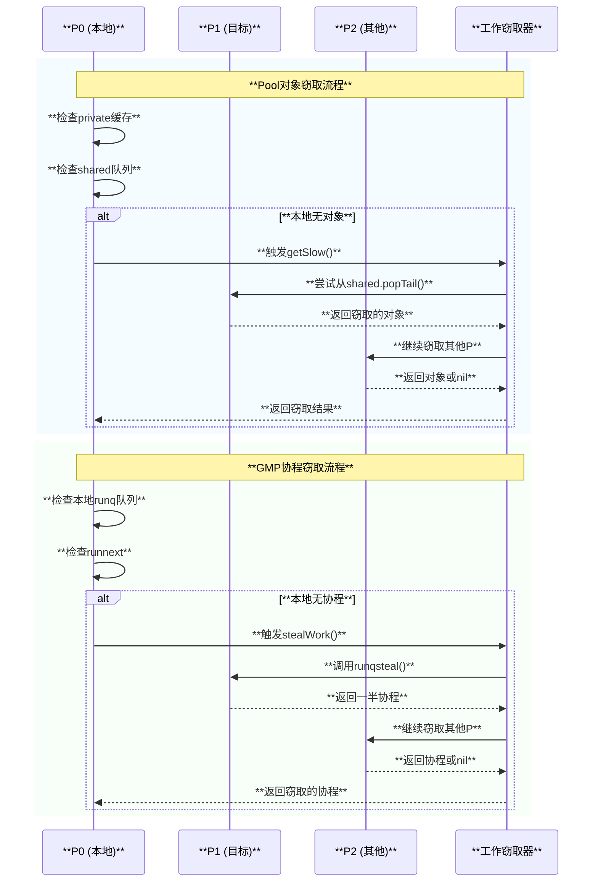

# **Pool Object架构与GMP协程模型对比分析**

## **1. 引言**

Go语言的sync.Pool对象池和GMP协程调度模型在架构设计上展现出了惊人的相似性。两者都采用了基于P(Processor)的分片设计，实现了高效的工作窃取机制。本文将深度剖析这两个核心组件的设计哲学、实现机制以及它们之间的深层关联。

## **2. 核心架构对比**

### **2.1 整体架构相似性**

```mermaid
graph TB
    subgraph POOL_ARCH ["**Pool Object 架构**"]
        P1["**Pool实例**"] --> PL1["**poolLocal[0]**<br/>**私有缓存+共享队列**"]
        P1 --> PL2["**poolLocal[1]**<br/>**私有缓存+共享队列**"] 
        P1 --> PL3["**poolLocal[N]**<br/>**私有缓存+共享队列**"]
        
        PL1 --> PC1["**poolChain**<br/>**工作窃取队列**"]
        PL2 --> PC2["**poolChain**<br/>**工作窃取队列**"]
        PL3 --> PC3["**poolChain**<br/>**工作窃取队列**"]
        
        PC1 -.-> PC2
        PC2 -.-> PC3
        PC3 -.-> PC1
        
        style P1 fill:#E8F4FD,stroke:#2196F3,stroke-width:3px
        style PL1 fill:#F3E5F5,stroke:#9C27B0,stroke-width:2px
        style PL2 fill:#F3E5F5,stroke:#9C27B0,stroke-width:2px
        style PL3 fill:#F3E5F5,stroke:#9C27B0,stroke-width:2px
        style PC1 fill:#E8F5E8,stroke:#4CAF50,stroke-width:2px
        style PC2 fill:#E8F5E8,stroke:#4CAF50,stroke-width:2px
        style PC3 fill:#E8F5E8,stroke:#4CAF50,stroke-width:2px
    end
    
    subgraph GMP_ARCH ["**GMP 调度架构**"]
        GMP["**全局调度器**"] --> P1_GMP["**P[0] 处理器**<br/>**本地队列+缓存**"]
        GMP --> P2_GMP["**P[1] 处理器**<br/>**本地队列+缓存**"]
        GMP --> P3_GMP["**P[N] 处理器**<br/>**本地队列+缓存**"]
        
        P1_GMP --> RQ1["**runq[256]**<br/>**协程运行队列**"]
        P2_GMP --> RQ2["**runq[256]**<br/>**协程运行队列**"]
        P3_GMP --> RQ3["**runq[256]**<br/>**协程运行队列**"]
        
        RQ1 -.-> RQ2
        RQ2 -.-> RQ3
        RQ3 -.-> RQ1
        
        style GMP fill:#E8F4FD,stroke:#2196F3,stroke-width:3px
        style P1_GMP fill:#FFF3E0,stroke:#FF9800,stroke-width:2px
        style P2_GMP fill:#FFF3E0,stroke:#FF9800,stroke-width:2px
        style P3_GMP fill:#FFF3E0,stroke:#FF9800,stroke-width:2px
        style RQ1 fill:#FFEBEE,stroke:#F44336,stroke-width:2px
        style RQ2 fill:#FFEBEE,stroke:#F44336,stroke-width:2px
        style RQ3 fill:#FFEBEE,stroke:#F44336,stroke-width:2px
    end
```



### **2.2 核心设计理念对比**

| **设计维度** | **Pool Object** | **GMP 协程模型** |
|-------------|-----------------|------------------|
| **分片策略** | **基于P的poolLocal数组** | **基于P的本地运行队列** |
| **无锁设计** | **私有缓存+原子操作** | **本地队列+原子操作** |
| **工作窃取** | **poolChain跨P窃取对象** | **runq跨P窃取协程** |
| **负载均衡** | **自动平衡对象分布** | **自动平衡协程分布** |
| **缓存局部性** | **优先本地P访问** | **优先本地P调度** |

## **3. 源码层面的深度关联**

### **3.1 Pool的P绑定机制**

```go
// src/sync/pool.go
type Pool struct {
    local     unsafe.Pointer // 指向 [P]poolLocal 数组
    localSize uintptr        // local数组的大小
    // ...
}

type poolLocal struct {
    poolLocalInternal
    // 防止false sharing的填充
    pad [128 - unsafe.Sizeof(poolLocalInternal{})%128]byte
}

type poolLocalInternal struct {
    private any       // 只能被对应的P使用
    shared  poolChain // 本地P可以pushHead/popHead，任何P可以popTail
}

// 关键的pin操作
func (p *Pool) pin() (*poolLocal, int) {
    pid := runtime_procPin()  // 绑定到当前P，禁用抢占
    s := runtime_LoadAcquintptr(&p.localSize)
    l := p.local
    if uintptr(pid) < s {
        return indexLocal(l, pid), pid
    }
    return p.pinSlow()
}
```

### **3.2 GMP的P结构设计**

```go
// src/runtime/runtime2.go
type p struct {
    id          int32
    status      uint32
    m           muintptr   // 关联的M
    
    // 协程调度相关
    runqhead uint32
    runqtail uint32
    runq     [256]guintptr  // 本地运行队列
    runnext  guintptr       // 下一个要运行的G
    
    // 内存管理相关
    mcache      *mcache     // 内存分配器缓存
    pcache      pageCache   // 页缓存
    
    // 对象池相关
    deferpool    []*_defer  // defer对象池
    deferpoolbuf [32]*_defer
    // ...
}
```

### **3.3 工作窃取机制的共同实现**



## **4. 核心差异分析**

| **对比维度** | **Pool Object** | **GMP 协程模型** |
|-------------|-----------------|------------------|
| **管理对象** | **任意Go对象** | **goroutine (g结构体)** |
| **生命周期** | **GC周期性清理** | **协程执行完毕回收** |
| **窃取粒度** | **单个对象** | **一半队列(最多128个G)** |
| **状态管理** | **简单(存在/不存在)** | **复杂(6种状态)** |
| **优先级** | **private > shared > victim** | **runnext > local > global > steal** |
| **失败处理** | **返回nil，调用New()** | **park M，等待新工作** |

## **5. 设计启示与结论**

Pool Object和GMP协程调度模型的架构相似性表明了**高性能并发系统的优化策略具有通用性**：

### **5.1 共同的设计哲学**
- **基于P的分片设计**，避免全局锁竞争
- **工作窃取机制**，实现自动负载均衡  
- **局部性优先策略**，提高缓存命中率
- **无锁数据结构**，支持高并发访问

### **5.2 实际意义**
这种设计相似性表明，**无论是对象池管理还是协程调度，核心都是如何在多核环境下高效地分配和管理资源**。Go语言通过统一的设计理念，在语言层面实现了这些优化，让开发者能够轻松构建高性能的并发应用。

理解Pool Object与GMP的关联，不仅有助于更好地使用Go语言的并发特性，也为设计其他高性能系统提供了宝贵的参考经验。

## **2. 旧版本内容**

以下为原有的详细技术文档，保留作为参考：

### 2. P-Local 架构详图

```text
                    ┌─────────────────────────────┐
                    │        sync.Pool            │
                    │                             │
                    │ local: unsafe.Pointer       │
                    │ localSize: uintptr          │
                    │ victim: unsafe.Pointer      │
                    │ victimSize: uintptr         │
                    └─────────────┬───────────────┘
                                  │
                                  ▼
                    ┌─────────────────────────────┐
                    │      [P]poolLocal           │
                    │    (每P一个本地池)          │
                    └─────────────┬───────────────┘
                                  │
         ┌────────────────────────┼────────────────────────┐
         │                        │                        │
         ▼                        ▼                        ▼
┌──────────────────┐    ┌──────────────────┐    ┌──────────────────┐
│   poolLocal[0]   │    │   poolLocal[1]   │    │   poolLocal[n]   │
│      P0专用      │    │      P1专用      │    │      Pn专用      │
│                  │    │                  │    │                  │
│ ┌──────────────┐ │    │ ┌──────────────┐ │    │ ┌──────────────┐ │
│ │   private    │ │    │ │   private    │ │    │ │   private    │ │
│ │              │ │    │ │              │ │    │ │              │ │
│ │ 只有P0可访问 │ │    │ │ 只有P1可访问 │ │    │ │ 只有Pn可访问 │ │
│ └──────────────┘ │    │ └──────────────┘ │    │ └──────────────┘ │
│                  │    │                  │    │                  │
│ ┌──────────────┐ │    │ ┌──────────────┐ │    │ ┌──────────────┐ │
│ │   shared     │ │    │ │   shared     │ │    │ │   shared     │ │
│ │  poolChain   │ │    │ │  poolChain   │ │    │ │  poolChain   │ │
│ │              │ │    │ │              │ │    │ │              │ │
│ │ • P0推入     │ │    │ │ • P1推入     │ │    │ │ • Pn推入     │ │
│ │ • 其他P窃取  │ │    │ │ • 其他P窃取  │ │    │ │ • 其他P窃取  │ │
│ └──────────────┘ │    │ └──────────────┘ │    │ └──────────────┘ │
│                  │    │                  │    │                  │
│ ┌──────────────┐ │    │ ┌──────────────┐ │    │ ┌──────────────┐ │
│ │     pad      │ │    │ │     pad      │ │    │ │     pad      │ │
│ │ [128]byte    │ │    │ │ [128]byte    │ │    │ │ [128]byte    │ │
│ │ 防止伪共享   │ │    │ │ 防止伪共享   │ │    │ │ 防止伪共享   │ │
│ └──────────────┘ │    │ └──────────────┘ │    │ └──────────────┘ │
└──────────────────┘    └──────────────────┘    └──────────────────┘
```

### 3. 双端队列结构图

```text
                    ┌─────────────────────────────┐
                    │       poolChain             │
                    │                             │
                    │ head: *poolChainElt ───────┐│
                    │ tail: *poolChainElt ───┐   ││
                    └─────────────────────────┼───┼┘
                                              │   │
                ┌─────────────────────────────┘   │
                │                                 │
                ▼                                 ▼
    ┌─────────────────────┐            ┌─────────────────────┐
    │   poolChainElt      │            │   poolChainElt      │
    │      (head)         │            │      (tail)         │
    │                     │            │                     │
    │ next: *poolChainElt │◄──────────►│ next: *poolChainElt │
    │ prev: *poolChainElt │            │ prev: *poolChainElt │
    │                     │            │                     │
    │ ┌─────────────────┐ │            │ ┌─────────────────┐ │
    │ │  poolDequeue    │ │            │ │  poolDequeue    │ │
    │ │                 │ │            │ │                 │ │
    │ │ headTail:uint64 │ │            │ │ headTail:uint64 │ │
    │ │ ┌─────────────┐ │ │            │ │ ┌─────────────┐ │ │
    │ │ │    vals[]   │ │ │            │ │ │    vals[]   │ │ │
    │ │ │             │ │ │            │ │ │             │ │ │
    │ │ │ [0] eface   │ │ │            │ │ │ [0] eface   │ │ │
    │ │ │ [1] eface   │ │ │            │ │ │ [1] eface   │ │ │
    │ │ │ [2] eface   │ │ │            │ │ │ [2] eface   │ │ │
    │ │ │     ...     │ │ │            │ │ │     ...     │ │ │
    │ │ │ [n] eface   │ │ │            │ │ │ [n] eface   │ │ │
    │ │ └─────────────┘ │ │            │ │ └─────────────┘ │ │
    │ └─────────────────┘ │            │ └─────────────────┘ │
    └─────────────────────┘            └─────────────────────┘
              │                                    │
              ▼                                    ▼
    ┌─────────────────────┐            ┌─────────────────────┐
    │    更新的dequeue    │            │    更老的dequeue    │
    │   (容量: 16-32K)    │            │   (容量: 8-16)      │
    └─────────────────────┘            └─────────────────────┘

    headTail结构 (64位):
    ┌──────────────────────────────┬──────────────────────────────┐
    │           head (32位)        │           tail (32位)        │
    │                              │                              │
    │     指向下一个写入位置       │      指向下一个读取位置      │
    └──────────────────────────────┴──────────────────────────────┘
```

## 数据结构详解

### 1. Pool结构体

```go
// src/sync/pool.go
type Pool struct {
    noCopy noCopy  // 防止拷贝
    
    local     unsafe.Pointer // 指向[P]poolLocal数组
    localSize uintptr        // local数组的大小
    
    victim     unsafe.Pointer // 前一个周期的local
    victimSize uintptr        // victim数组的大小
    
    // 对象创建函数
    New func() interface{}
}

// 每个P对应的本地池
type poolLocal struct {
    poolLocalInternal  // 嵌入内部结构
    
    // 防止false sharing的填充
    pad [128 - unsafe.Sizeof(poolLocalInternal{})%128]byte
}

// 本地池的内部结构
type poolLocalInternal struct {
    private interface{}   // 私有对象，只能被拥有者访问
    shared  poolChain     // 共享队列，支持其他P访问
}
```

### 2. 双端队列(poolChain)

```go
// 双端队列实现
type poolChain struct {
    head *poolChainElt   // 队列头
    tail *poolChainElt   // 队列尾
}

// 队列元素
type poolChainElt struct {
    poolDequeue           // 实际的双端队列
    
    next, prev *poolChainElt  // 双向链表
}

// 双端队列
type poolDequeue struct {
    // 128字节缓存行对齐
    headTail uint64  // 高32位是head索引，低32位是tail索引
    
    vals []eface     // 存储对象的数组
}

// 空接口，减少type assertion开销
type eface struct {
    typ, val unsafe.Pointer
}
```

## 核心实现机制

### 1. 对象获取 (Get)

```go
func (p *Pool) Get() interface{} {
    if race.Enabled {
        race.Disable()
    }
    
    // 获取当前P的本地池
    l, pid := p.pin()
    x := l.private
    l.private = nil
    
    if x == nil {
        // private为空，尝试从shared队列获取
        x, _ = l.shared.popHead()
        if x == nil {
            // 本地池都为空，尝试从其他P偷取
            x = p.getSlow(pid)
        }
    }
    
    runtime_procUnpin()
    
    if race.Enabled {
        race.Enable()
        if x != nil {
            race.Acquire(poolRaceAddr(x))
        }
    }
    
    // 如果都没有获取到，使用New函数创建
    if x == nil && p.New != nil {
        x = p.New()
    }
    
    return x
}

// 慢路径：从其他P或victim中获取
func (p *Pool) getSlow(pid int) interface{} {
    size := runtime_LoadAcquintptr(&p.localSize)
    locals := p.local
    
    // 尝试从其他P的shared队列偷取
    for i := 0; i < int(size); i++ {
        l := indexLocal(locals, (pid+i+1)%int(size))
        if x, _ := l.shared.popTail(); x != nil {
            return x
        }
    }
    
    // 尝试从victim中获取
    size = atomic.LoadUintptr(&p.victimSize)
    if uintptr(pid) >= size {
        return nil
    }
    
    locals = p.victim
    l := indexLocal(locals, pid)
    if x := l.private; x != nil {
        l.private = nil
        return x
    }
    
    // 从victim的shared队列获取
    for i := 0; i < int(size); i++ {
        l := indexLocal(locals, (pid+i)%int(size))
        if x, _ := l.shared.popTail(); x != nil {
            return x
        }
    }
    
    // 标记victim已被清理
    atomic.StoreUintptr(&p.victimSize, 0)
    
    return nil
}
```

### 2. 对象归还 (Put)

```go
func (p *Pool) Put(x interface{}) {
    if x == nil {
        return
    }
    
    if race.Enabled {
        if fastrand()%4 == 0 {
            // 随机丢弃，增加竞争检测的有效性
            return
        }
        race.ReleaseMerge(poolRaceAddr(x))
        race.Disable()
    }
    
    // 获取当前P的本地池
    l, _ := p.pin()
    
    if l.private == nil {
        l.private = x
        x = nil
    }
    
    if x != nil {
        // private已被占用，放入shared队列
        l.shared.pushHead(x)
    }
    
    runtime_procUnpin()
    
    if race.Enabled {
        race.Enable()
    }
}
```

### 3. P绑定机制

```go
// 将当前goroutine绑定到P，防止调度
func (p *Pool) pin() (*poolLocal, int) {
    pid := runtime_procPin()  // 绑定到当前P
    
    // 快速路径：本地池已存在
    s := runtime_LoadAcquintptr(&p.localSize)
    l := p.local
    if uintptr(pid) < s {
        return indexLocal(l, pid), pid
    }
    
    // 慢路径：需要初始化或扩容
    return p.pinSlow()
}

// 慢路径：初始化或扩容本地池数组
func (p *Pool) pinSlow() (*poolLocal, int) {
    runtime_procUnpin()
    
    allPoolsMu.Lock()
    defer allPoolsMu.Unlock()
    
    pid := runtime_procPin()
    
    // 再次检查，可能其他goroutine已经完成了初始化
    s := p.localSize
    l := p.local
    if uintptr(pid) < s {
        return indexLocal(l, pid), pid
    }
    
    // 第一次使用，注册到全局池列表
    if p.local == nil {
        allPools = append(allPools, p)
    }
    
    // 创建或扩容本地池数组
    size := runtime.GOMAXPROCS(0)
    local := make([]poolLocal, size)
    atomic.StorePointer(&p.local, unsafe.Pointer(&local[0]))
    runtime_StoreReluintptr(&p.localSize, uintptr(size))
    
    return &local[pid], pid
}
```

## 双端队列实现

### 1. 队列结构

```go
// poolDequeue实现无锁双端队列
const dequeueBits = 32

func (d *poolDequeue) unpack(ptrs uint64) (head, tail uint32) {
    const mask = 1<<dequeueBits - 1
    head = uint32((ptrs >> dequeueBits) & mask)
    tail = uint32(ptrs & mask)
    return
}

func (d *poolDequeue) pack(head, tail uint32) uint64 {
    const mask = 1<<dequeueBits - 1
    return (uint64(head) << dequeueBits) |
           uint64(tail&mask)
}
```

### 2. Push操作

```go
func (d *poolDequeue) pushHead(val interface{}) bool {
    ptrs := atomic.LoadUint64(&d.headTail)
    head, tail := d.unpack(ptrs)
    
    if (tail+uint32(len(d.vals)))&(1<<dequeueBits-1) == head {
        // 队列满
        return false
    }
    
    slot := &d.vals[head&uint32(len(d.vals)-1)]
    
    // 检查槽位是否为空
    typ := atomic.LoadPointer(&slot.typ)
    if typ != nil {
        return false
    }
    
    // 如果val为nil，直接返回
    if val == nil {
        return true
    }
    
    // 存储值
    *(*interface{})(unsafe.Pointer(slot)) = val
    
    // 更新head指针
    atomic.AddUint64(&d.headTail, 1<<dequeueBits)
    return true
}

// poolChain的pushHead
func (c *poolChain) pushHead(val interface{}) {
    d := c.head
    if d == nil {
        // 初始化第一个dequeue
        const initSize = 8
        d = new(poolChainElt)
        d.vals = make([]eface, initSize)
        c.head = d
        c.tail = d
    }
    
    if d.pushHead(val) {
        return
    }
    
    // 当前dequeue已满，创建新的dequeue
    newSize := len(d.vals) * 2
    if newSize >= dequeueLimit {
        newSize = dequeueLimit
    }
    
    d2 := &poolChainElt{prev: d}
    d2.vals = make([]eface, newSize)
    c.head = d2
    d.next = d2
    
    d2.pushHead(val)
}
```

### 3. Pop操作

```go
func (d *poolDequeue) popHead() (interface{}, bool) {
    var slot *eface
    for {
        ptrs := atomic.LoadUint64(&d.headTail)
        head, tail := d.unpack(ptrs)
        if tail == head {
            // 队列空
            return nil, false
        }
        
        // 计算head位置
        head--
        ptrs2 := d.pack(head, tail)
        
        if atomic.CompareAndSwapUint64(&d.headTail, ptrs, ptrs2) {
            slot = &d.vals[head&uint32(len(d.vals)-1)]
            break
        }
    }
    
    val := *(*interface{})(unsafe.Pointer(slot))
    if val == dequeueNil {
        val = nil
    }
    
    // 清理槽位
    *slot = eface{}
    return val, true
}

func (d *poolDequeue) popTail() (interface{}, bool) {
    var slot *eface
    for {
        ptrs := atomic.LoadUint64(&d.headTail)
        head, tail := d.unpack(ptrs)
        if tail == head {
            return nil, false
        }
        
        ptrs2 := d.pack(head, tail+1)
        if atomic.CompareAndSwapUint64(&d.headTail, ptrs, ptrs2) {
            slot = &d.vals[tail&uint32(len(d.vals)-1)]
            break
        }
    }
    
    val := *(*interface{})(unsafe.Pointer(slot))
    if val == dequeueNil {
        val = nil
    }
    
    slot.val = nil
    atomic.StorePointer(&slot.typ, nil)
    
    return val, true
}
```

## GC集成机制

### 1. GC回调注册

```go
var (
    allPoolsMu sync.Mutex
    allPools   []*Pool      // 所有Pool的列表
)

// 在runtime包中注册GC回调
func init() {
    runtime_registerPoolCleanup(poolCleanup)
}

// GC时清理所有Pool
func poolCleanup() {
    // 这个函数在STW期间调用，所以不需要加锁
    for _, p := range allPools {
        // 将当前周期的数据移到victim
        p.victim = p.local
        p.victimSize = p.localSize
        
        // 清空当前周期
        p.local = nil
        p.localSize = 0
    }
    
    // 清理victim
    for _, p := range allPools {
        p.victim = nil
        p.victimSize = 0
    }
}
```

### 2. 双周期清理策略

```go
// Pool使用双周期策略：
// - local: 当前周期的对象
// - victim: 前一个周期的对象
// 
// 在每次GC时：
// 1. victim -> 清空 (释放前前一周期的对象)
// 2. local -> victim (当前周期变成前一周期)
// 3. 创建新的local (开始新周期)
//
// 这样确保对象至少存活一个GC周期，避免过于频繁的清理
```

## 性能优化技术

### 1. NUMA优化

```go
// 每个P都有独立的poolLocal，减少跨NUMA节点的内存访问
type poolLocal struct {
    poolLocalInternal
    
    // 缓存行对齐，防止false sharing
    pad [128 - unsafe.Sizeof(poolLocalInternal{})%128]byte
}
```

### 2. 无锁数据结构

```go
// 使用原子操作实现的无锁双端队列
// - pushHead: 生产者操作，只有拥有者可以调用
// - popHead:  生产者操作，只有拥有者可以调用  
// - popTail: 消费者操作，其他P可以调用（工作窃取）
```

### 3. 工作窃取

```go
// 当本地池为空时，可以从其他P的池中窃取对象
func (p *Pool) getSlow(pid int) interface{} {
    // 遍历所有其他P
    for i := 0; i < int(size); i++ {
        l := indexLocal(locals, (pid+i+1)%int(size))
        if x, _ := l.shared.popTail(); x != nil {
            return x  // 成功窃取
        }
    }
    return nil
}
```

## 使用模式和最佳实践

### 1. 基本用法

```go
// 创建对象池
var bufferPool = sync.Pool{
    New: func() interface{} {
        // 创建新对象的函数
        return make([]byte, 1024)
    },
}

func processData(data []byte) {
    // 从池中获取对象
    buf := bufferPool.Get().([]byte)
    
    // 使用完毕后归还
    defer func() {
        // 重置对象状态
        buf = buf[:0]
        bufferPool.Put(buf)
    }()
    
    // 使用buf处理数据
    buf = append(buf, data...)
    // ... 处理逻辑
}
```

### 2. 复杂对象池

```go
// 复杂结构体的对象池
type Request struct {
    Headers map[string]string
    Body    []byte
    buffer  []byte // 内部缓冲区
}

var requestPool = sync.Pool{
    New: func() interface{} {
        return &Request{
            Headers: make(map[string]string),
            Body:    make([]byte, 0, 1024),
            buffer:  make([]byte, 4096),
        }
    },
}

func (r *Request) Reset() {
    // 清理map，但保留capacity
    for k := range r.Headers {
        delete(r.Headers, k)
    }
    
    // 重置slice
    r.Body = r.Body[:0]
    r.buffer = r.buffer[:0]
}

func handleRequest(data []byte) {
    req := requestPool.Get().(*Request)
    defer func() {
        req.Reset()
        requestPool.Put(req)
    }()
    
    // 使用req处理请求...
}
```

### 3. 带类型安全的包装

```go
// 类型安全的池包装器
type TypedPool[T any] struct {
    pool sync.Pool
    reset func(T)
}

func NewTypedPool[T any](newFunc func() T, resetFunc func(T)) *TypedPool[T] {
    return &TypedPool[T]{
        pool: sync.Pool{
            New: func() interface{} {
                return newFunc()
            },
        },
        reset: resetFunc,
    }
}

func (tp *TypedPool[T]) Get() T {
    return tp.pool.Get().(T)
}

func (tp *TypedPool[T]) Put(obj T) {
    if tp.reset != nil {
        tp.reset(obj)
    }
    tp.pool.Put(obj)
}

// 使用示例
var stringBuilderPool = NewTypedPool(
    func() *strings.Builder {
        return &strings.Builder{}
    },
    func(sb *strings.Builder) {
        sb.Reset()
    },
)
```

## 常见陷阱和注意事项

### 1. 对象状态清理

```go
// 错误：未清理对象状态
func badExample() {
    buf := bufferPool.Get().([]byte)
    defer bufferPool.Put(buf)  // 错误！buf可能包含上次的数据
    
    // 使用buf...
}

// 正确：清理对象状态
func goodExample() {
    buf := bufferPool.Get().([]byte)
    defer func() {
        buf = buf[:0]  // 重置长度
        bufferPool.Put(buf)
    }()
    
    // 使用buf...
}
```

### 2. 不要存储敏感数据

```go
// 错误：Pool中的对象可能被其他goroutine获取
func badSecurity() {
    type User struct {
        Password string
        Token    string
    }
    
    var userPool = sync.Pool{
        New: func() interface{} {
            return &User{}
        },
    }
    
    user := userPool.Get().(*User)
    user.Password = "secret"
    userPool.Put(user)  // 敏感数据可能泄漏
}
```

### 3. 大小限制

```go
// 避免存储过大的对象
func sizeLimit() {
    var bufferPool = sync.Pool{
        New: func() interface{} {
            return make([]byte, 1024)  // 合适的大小
        },
    }
    
    buf := bufferPool.Get().([]byte)
    defer func() {
        // 如果buf增长过大，不要归还到池中
        if cap(buf) > 64*1024 {
            return  // 让GC回收
        }
        
        buf = buf[:0]
        bufferPool.Put(buf)
    }()
}
```

## 性能分析

### 1. 基准测试

```go
func BenchmarkWithoutPool(b *testing.B) {
    b.RunParallel(func(pb *testing.PB) {
        for pb.Next() {
            buf := make([]byte, 1024)
            // 使用buf...
            _ = buf
        }
    })
}

func BenchmarkWithPool(b *testing.B) {
    var pool = sync.Pool{
        New: func() interface{} {
            return make([]byte, 1024)
        },
    }
    
    b.RunParallel(func(pb *testing.PB) {
        for pb.Next() {
            buf := pool.Get().([]byte)
            // 使用buf...
            buf = buf[:0]
            pool.Put(buf)
        }
    })
}
```

### 2. 内存分配统计

```go
func measureAllocation() {
    var m1, m2 runtime.MemStats
    
    // 不使用Pool
    runtime.GC()
    runtime.ReadMemStats(&m1)
    
    for i := 0; i < 1000000; i++ {
        buf := make([]byte, 1024)
        _ = buf
    }
    
    runtime.GC()
    runtime.ReadMemStats(&m2)
    fmt.Printf("Without Pool: %d allocations, %d bytes\n", 
        m2.Mallocs-m1.Mallocs, m2.TotalAlloc-m1.TotalAlloc)
    
    // 使用Pool
    var pool = sync.Pool{
        New: func() interface{} { return make([]byte, 1024) },
    }
    
    runtime.ReadMemStats(&m1)
    
    for i := 0; i < 1000000; i++ {
        buf := pool.Get().([]byte)
        buf = buf[:0]
        pool.Put(buf)
    }
    
    runtime.GC()
    runtime.ReadMemStats(&m2)
    fmt.Printf("With Pool: %d allocations, %d bytes\n", 
        m2.Mallocs-m1.Mallocs, m2.TotalAlloc-m1.TotalAlloc)
}
```

## 在标准库中的应用

### 1. fmt包

```go
// fmt包使用Pool缓存打印缓冲区
var ppFree = sync.Pool{
    New: func() interface{} { return new(pp) },
}

func (p *pp) free() {
    if cap(p.buf) > 64<<10 {
        return  // 太大的buffer不回收
    }
    
    p.buf = p.buf[:0]
    p.arg = nil
    p.value = reflect.Value{}
    ppFree.Put(p)
}
```

### 2. encoding/json包

```go
// json包使用Pool缓存编码器
var encoderPool = sync.Pool{
    New: func() interface{} {
        return &Encoder{}
    },
}

func (enc *Encoder) encode(v interface{}) error {
    defer func() {
        enc.reset()
        encoderPool.Put(enc)
    }()
    
    return enc.marshal(v)
}
```

## 总结

sync.Pool是Go语言中一个精心设计的对象池实现，它通过以下技术实现了高性能：

1. **P本地化**: 减少锁竞争，提高并发性能
2. **无锁队列**: 使用原子操作实现的双端队列
3. **工作窃取**: 负载均衡，避免某些P过载
4. **GC集成**: 自动清理，防止内存泄漏
5. **双周期策略**: 平衡性能和内存使用

理解Pool的实现原理有助于：

- 正确使用对象池优化程序性能
- 避免常见的使用陷阱
- 设计高效的内存管理策略
- 减少GC压力，提升系统整体性能

合理使用sync.Pool是Go性能优化的重要手段。

## 运行时序图和流程图

### 1. Get操作完整流程图

```text
                        ┌─────────────────┐
                        │   pool.Get()    │
                        └─────────┬───────┘
                                  │
                                  ▼
                        ┌─────────────────┐
                        │   pin() 绑定P   │
                        │  获取poolLocal  │
                        └─────────┬───────┘
                                  │
                                  ▼
                        ┌─────────────────┐      有对象   ┌─────────────────┐
                        │ Check private   │──────────────►│ 取出并返回      │
                        │   l.private     │               │ l.private=nil   │
                        └─────────┬───────┘               └─────────┬───────┘
                                  │ 无对象                          │
                                  ▼                                 │
                        ┌─────────────────┐      有对象   ┌─────────┼───────┐
                        │ popHead() from  │──────────────►│ 从队列头取出    │
                        │   shared队列    │               │ 原子操作        │
                        └─────────┬───────┘               └─────────┬───────┘
                                  │ 无对象                          │
                                  ▼                                 │
                        ┌─────────────────┐                        │
                        │   getSlow()     │                        │
                        │   尝试工作窃取   │                        │
                        └─────────┬───────┘                        │
                                  │                                │
                                  ▼                                │
                        ┌─────────────────┐      找到     ┌─────────┼───────┐
                        │ 遍历其他P的池   │──────────────►│ popTail窃取     │
                        │ for i:=0;i<size │               │ 从尾部取出      │
                        └─────────┬───────┘               └─────────┬───────┘
                                  │ 未找到                          │
                                  ▼                                 │
                        ┌─────────────────┐      找到     ┌─────────┼───────┐
                        │ 检查victim池    │──────────────►│ 从victim取出    │
                        │ 前一个GC周期    │               │ 清理victim      │
                        └─────────┬───────┘               └─────────┬───────┘
                                  │ 未找到                          │
                                  ▼                                 │
                        ┌─────────────────┐               ┌─────────┼───────┐
                        │ 调用 pool.New() │               │  procUnpin()    │
                        │ 创建新对象      │               │  解除P绑定      │
                        └─────────┬───────┘               └─────────┬───────┘
                                  │                                 │
                                  └─────────────┬───────────────────┘
                                                │
                                                ▼
                                  ┌─────────────────┐
                                  │  返回对象给调用方│
                                  └─────────────────┘
```

### 2. Put操作完整流程图

```text
                        ┌─────────────────┐
                        │   pool.Put(x)   │
                        └─────────┬───────┘
                                  │
                                  ▼
                        ┌─────────────────┐      x == nil  ┌─────────────────┐
                        │  检查对象非空   │──────────────►│   直接返回      │
                        │   x != nil?     │                └─────────────────┘
                        └─────────┬───────┘
                                  │ x != nil
                                  ▼
                        ┌─────────────────┐
                        │   pin() 绑定P   │
                        │  获取poolLocal  │
                        └─────────┬───────┘
                                  │
                                  ▼
                        ┌─────────────────┐      private空  ┌─────────────────┐
                        │ Check private   │──────────────►│ 设置private=x   │
                        │ l.private==nil? │               │ x = nil         │
                        └─────────┬───────┘               └─────────┬───────┘
                                  │ private非空                     │
                                  ▼                                 │
                        ┌─────────────────┐               ┌─────────┼───────┐
                        │ x仍有值，需要   │               │  procUnpin()    │
                        │ 放入shared队列  │               │  解除P绑定      │
                        └─────────┬───────┘               └─────────┬───────┘
                                  │                                 │
                                  ▼                                 │
                        ┌─────────────────┐                        │
                        │   pushHead(x)   │                        │
                        │  推入队列头部   │                        │
                        └─────────┬───────┘                        │
                                  │                                │
                                  ▼                                │
                        ┌─────────────────┐      队列满   ┌─────────┼───────┐
                        │ 检查当前dequeue │──────────────►│ 创建新dequeue   │
                        │  是否有空间     │               │ 扩容2倍容量     │
                        └─────────┬───────┘               └─────────┬───────┘
                                  │ 有空间                          │
                                  ▼                                 │
                        ┌─────────────────┐                        │
                        │  CAS原子操作    │                        │
                        │  更新head指针   │                        │
                        │  存储对象       │                        │
                        └─────────┬───────┘                        │
                                  │                                │
                                  └────────────────┬───────────────┘
                                                   │
                                                   ▼
                                     ┌─────────────────┐
                                     │   操作完成      │
                                     └─────────────────┘
```

### 3. GC清理时序图

```text
    GC开始         Pool系统           Runtime        其他P
      │                │                │             │
      │                │                │             │
      ▼                │                │             │
 ┌─────────┐           │                │             │
 │  STW    │           │                │             │
 │ 开始    │           │                │             │
 └────┬────┘           │                │             │
      │                │                │             │
      │  poolCleanup() │                │             │
      ├───────────────►│                │             │
      │                │                │             │
      │                ▼                │             │
      │       ┌─────────────────┐       │             │
      │       │  遍历allPools   │       │             │
      │       │  处理每个Pool   │       │             │
      │       └────────┬────────┘       │             │
      │                │                │             │
      │                ▼                │             │
      │       ┌─────────────────┐       │             │
      │       │ victim清理      │       │             │
      │       │ p.victim = nil  │       │             │
      │       │ p.victimSize=0  │       │             │
      │       └────────┬────────┘       │             │
      │                │                │             │
      │                ▼                │             │
      │       ┌─────────────────┐       │             │
      │       │ local->victim   │       │             │
      │       │ p.victim=local  │       │             │
      │       │ p.victimSize=   │       │             │
      │       │   localSize     │       │             │
      │       └────────┬────────┘       │             │
      │                │                │             │
      │                ▼                │             │
      │       ┌─────────────────┐       │             │
      │       │ 清空local       │       │             │
      │       │ p.local = nil   │       │             │
      │       │ p.localSize = 0 │       │             │
      │       └────────┬────────┘       │             │
      │                │                │             │
      │     完成清理   │                │             │
      │◄───────────────┤                │             │
      │                │                │             │
      ▼                │                │             │
 ┌─────────┐           │                │             │
 │  STW    │           │                │             │
 │ 结束    │           │                │             │
 └────┬────┘           │                │             │
      │                │                │             │
      │                │     继续运行   │             │
      │                │◄───────────────┤             │
      │                │                │             │
      │                │                │  重新创建   │
      │                │                │  local池    │
      │                │                │◄────────────┤
      │                │                │             │
      ▼                ▼                ▼             ▼
    
    第一次Get调用会触发：
    ┌─────────────────┐
    │  pin() 发现     │
    │  local == nil   │
    └────────┬────────┘
             │
             ▼
    ┌─────────────────┐
    │  pinSlow()      │
    │  重新分配local  │
    │  注册到allPools │
    └─────────────────┘
```

### 4. 工作窃取机制图

```text
                    P0              P1              P2              P3
                     │               │               │               │
    ┌────────────────┼───────────────┼───────────────┼───────────────┼──┐
    │ 工作窃取场景   │               │               │               │  │
    └────────────────┼───────────────┼───────────────┼───────────────┼──┘
                     │               │               │               │
                     ▼               ▼               ▼               ▼
             ┌─────────────┐ ┌─────────────┐ ┌─────────────┐ ┌─────────────┐
             │ poolLocal   │ │ poolLocal   │ │ poolLocal   │ │ poolLocal   │
             │             │ │             │ │             │ │             │
             │ private:nil │ │private: obj │ │private: obj │ │private: obj │
             │             │ │             │ │             │ │             │
             │ shared:     │ │ shared:     │ │ shared:     │ │ shared:     │
             │  ┌───────┐  │ │  ┌───────┐  │ │  ┌───────┐  │ │  ┌───────┐  │
             │  │ empty │  │ │  │[obj1] │  │ │  │[obj3] │  │ │  │[obj5] │  │
             │  │       │  │ │  │[obj2] │  │ │  │[obj4] │  │ │  │[obj6] │  │
             │  └───────┘  │ │  └───────┘  │ │  └───────┘  │ │  └───────┘  │
             └─────────────┘ └─────────────┘ └─────────────┘ └─────────────┘
                     │               │               │               │
                     │               │               │               │
              pool.Get()调用          │               │               │
                     │               │               │               │
                     ▼               │               │               │
             ┌─────────────┐         │               │               │
             │ 1.检查private│         │               │               │
             │   -> 空      │         │               │               │
             └──────┬──────┘         │               │               │
                    │                │               │               │
                    ▼                │               │               │
             ┌─────────────┐         │               │               │
             │ 2.检查shared │         │               │               │
             │   -> 空      │         │               │               │
             └──────┬──────┘         │               │               │
                    │                │               │               │
                    ▼                │               │               │
             ┌─────────────┐         │               │               │
             │ 3.getSlow() │         │               │               │
             │  工作窃取    │         │               │               │
             └──────┬──────┘         │               │               │
                    │                │               │               │
                    │ 尝试窃取P1     │               │               │
                    ├───────────────►│               │               │
                    │                ▼               │               │
                    │        ┌─────────────┐         │               │
                    │        │ popTail()   │         │               │
                    │        │ 从尾部取obj2│         │               │
                    │        └──────┬──────┘         │               │
                    │               │               │               │
                    │   成功获取obj2 │               │               │
                    │◄───────────────┘               │               │
                    │                               │               │
                    ▼                               │               │
             ┌─────────────┐                       │               │
             │ 返回 obj2   │                       │               │
             │ 给调用方    │                       │               │
             └─────────────┘                       │               │
                                                   │               │
                                                   ▼               ▼
                                          其他P继续正常工作
                                         使用自己的private和shared
```

### 5. 对象生命周期状态图

```text
                    ┌─────────────────┐
                    │   New()创建     │
                    │   (用户函数)    │
                    └─────────┬───────┘
                              │
                              ▼
                    ┌─────────────────┐
                    │   In Use        │
                    │   (应用使用中)  │
                    └─────────┬───────┘
                              │ Put()
                              ▼
             ┌────────────────────────────────────┐
             │                                    │
             ▼                                    ▼
   ┌─────────────────┐                 ┌─────────────────┐
   │    Private      │                 │     Shared      │
   │   (P专属)       │                 │   (可被窃取)    │
   └─────────┬───────┘                 └─────────┬───────┘
             │                                   │
             │ Get()快速路径                     │ Get()或窃取
             ▼                                   ▼
   ┌─────────────────┐                 ┌─────────────────┐
   │   Reused        │                 │   Work Stolen   │
   │   (快速复用)    │                 │   (被其他P取走) │
   └─────────┬───────┘                 └─────────┬───────┘
             │                                   │
             └─────────────┬─────────────────────┘
                           │
                           ▼
                 ┌─────────────────┐
                 │     In Use      │
                 │   (重新使用)    │
                 └─────────┬───────┘
                           │
                    ┌──────┴──────┐
                    │             │
                    ▼             ▼
          ┌─────────────────┐  ┌─────────────────┐
          │  Continue Cycle │  │   GC Cleanup    │
          │   (继续循环)    │  │   (被GC清理)    │
          └─────────────────┘  └─────────┬───────┘
                                         │
                                         ▼
                                ┌─────────────────┐
                                │    Victim       │
                                │  (前一周期)     │
                                └─────────┬───────┘
                                          │
                                   ┌──────┴──────┐
                                   │             │
                                   ▼             ▼
                         ┌─────────────────┐  ┌─────────────────┐
                         │    Reused       │  │   Collected     │
                         │  (再次复用)     │  │   (最终回收)    │
                         └─────────────────┘  └─────────────────┘
```
