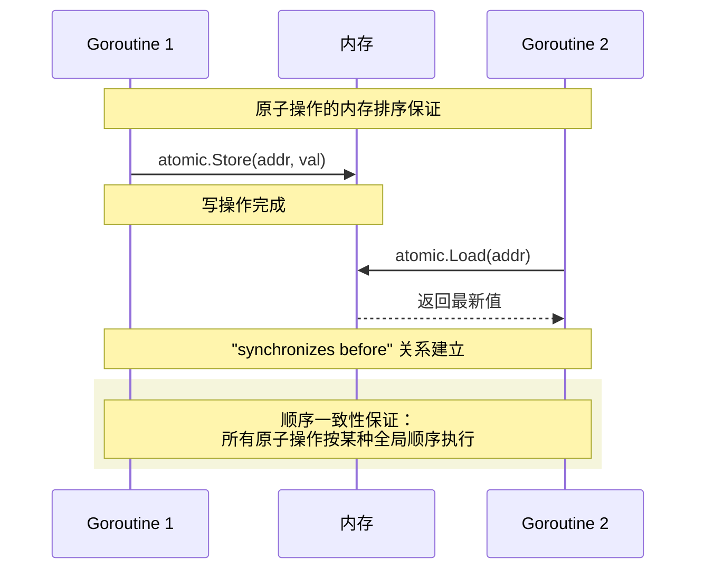
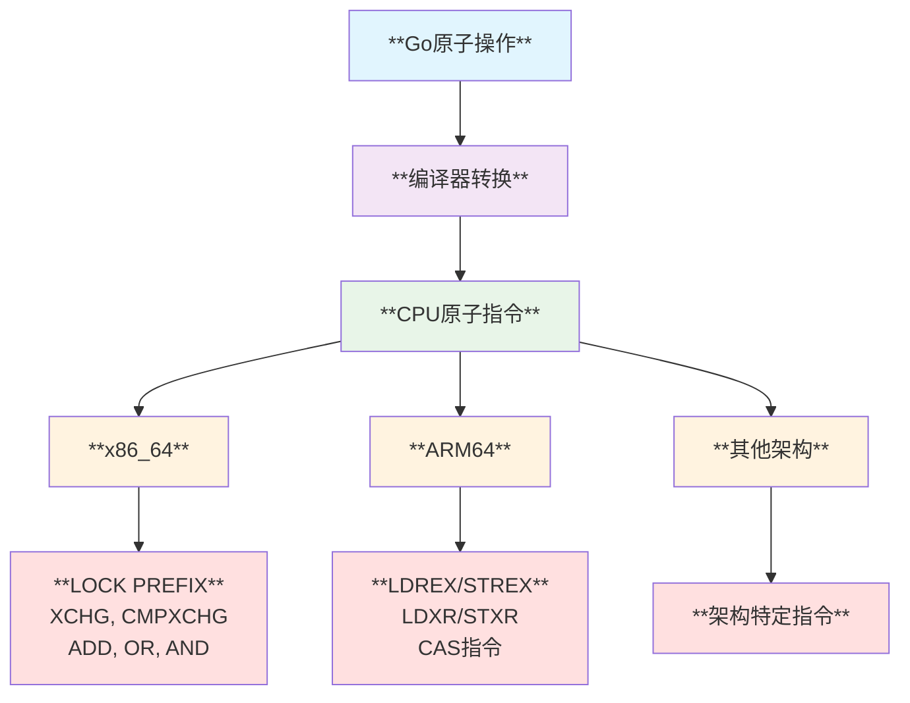
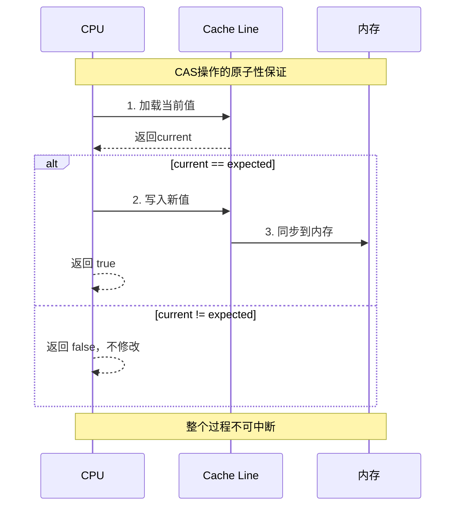
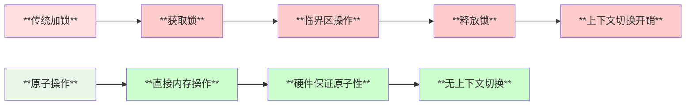
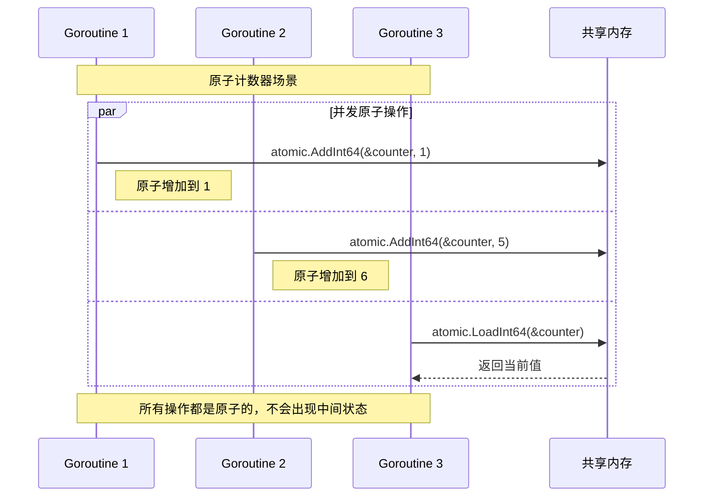
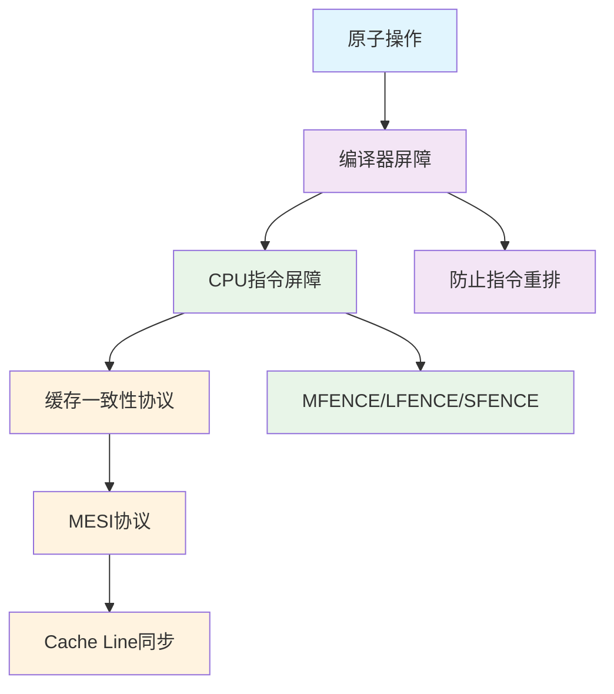
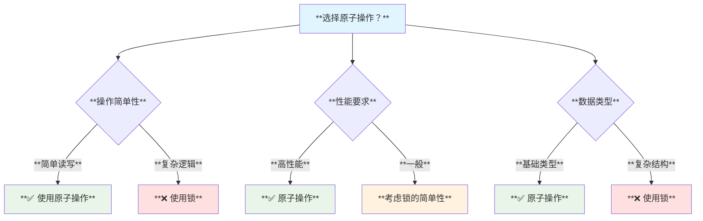

# **Sync Atomic 原子操作模块深度分析**

## **1. 模块概述**

**sync/atomic** 包提供了低级别的原子内存操作原语，是Go语言并发编程的核心基础设施之一。原子操作确保在并发环境中对内存的访问是不可中断的，避免了数据竞争和内存一致性问题。

## **2. 模块结构**

```mermaid
graph TB
    A["sync/atomic 包"] --> B["函数级原子操作"]
    A --> C["类型级原子操作"]
    A --> D["通用Value类型"]
    
    B --> B1["SwapXXX<br/>交换操作"]
    B --> B2["CompareAndSwapXXX<br/>比较并交换"]
    B --> B3["AddXXX<br/>加法操作"]
    B --> B4["LoadXXX<br/>加载操作"]
    B --> B5["StoreXXX<br/>存储操作"]
    B --> B6["AndXXX/OrXXX<br/>位运算操作"]
    
    C --> C1["Bool<br/>原子布尔值"]
    C --> C2["Int32/Int64<br/>原子整数"]
    C --> C3["Uint32/Uint64<br/>原子无符号整数"]
    C --> C4["Uintptr<br/>原子指针大小整数"]
    C --> C5["Pointer[T]<br/>泛型原子指针"]
    
    D --> D1["Load()<br/>原子加载"]
    D --> D2["Store()<br/>原子存储"]
    D --> D3["Swap()<br/>原子交换"]
    D --> D4["CompareAndSwap()<br/>比较并交换"]

    style A fill:#e1f5fe
    style B fill:#f3e5f5
    style C fill:#e8f5e8
    style D fill:#fff3e0
    style B1 fill:#e1f5fe
    style B2 fill:#e1f5fe
    style B3 fill:#e1f5fe
    style B4 fill:#e1f5fe
    style B5 fill:#e1f5fe
    style B6 fill:#e1f5fe
    style C1 fill:#e8f5e8
    style C2 fill:#e8f5e8
    style C3 fill:#e8f5e8
    style C4 fill:#e8f5e8
    style C5 fill:#e8f5e8
    style D1 fill:#fff3e0
    style D2 fill:#fff3e0
    style D3 fill:#fff3e0
    style D4 fill:#fff3e0
```



## **3. 核心架构设计**

### **3.1 双重API设计**

atomic包采用了**双重API设计**：
- **函数级API**：如 `LoadInt32(&x)`, `StoreInt32(&x, val)`
- **类型级API**：如 `var x Int32; x.Load()`, `x.Store(val)`

### **3.2 内存模型保证**



## **4. 核心数据结构**

### **4.1 原子类型结构**

```go
// Bool 原子布尔类型
type Bool struct {
    _ noCopy      // 防止复制
    v uint32      // 实际存储的值
}

// Int32 原子32位整数
type Int32 struct {
    _ noCopy
    v int32
}

// Pointer 泛型原子指针
type Pointer[T any] struct {
    _ [0]*T               // 类型约束
    _ noCopy
    v unsafe.Pointer      // 实际指针值
}
```

### **4.2 Value类型设计**

```go
// Value 通用原子值类型
type Value struct {
    v any    // 存储任意类型
}

// 内部表示结构
type efaceWords struct {
    typ  unsafe.Pointer   // 类型信息
    data unsafe.Pointer   // 数据指针
}
```

## **5. 底层原理分析**

### **5.1 硬件原子指令映射**



### **5.2 比较并交换(CAS)原理**



## **6. 使用场景分析**

### **6.1 适用场景**

| **场景** | **推荐原子操作** | **说明** |
|---------|-----------------|---------|
| **计数器** | `AddInt64`, `Int64.Add()` | **高性能原子计数** |
| **状态标志** | `Bool.Load/Store` | **原子布尔状态切换** |
| **配置更新** | `Value.Store/Load` | **无锁配置热更新** |
| **指针更新** | `Pointer[T]` | **类型安全的指针操作** |
| **简单同步** | `CompareAndSwap` | **无锁算法基础** |

### **6.2 性能优势**



## **7. 时序交互图**

### **7.1 多goroutine原子操作时序**



## **8. Linux底层支持**

### **8.1 系统调用与硬件支持**

| **层级** | **Linux支持** | **说明** |
|---------|---------------|---------|
| **硬件层** | **CPU原子指令** | **x86 LOCK前缀，ARM LDREX/STREX** |
| **内核层** | **内存屏障** | **smp_mb(), smp_rmb(), smp_wmb()** |
| **用户态** | **futex系统调用** | **用于复杂同步原语的构建** |
| **编译器** | **内存排序** | **防止编译器重排序优化** |

### **8.2 内存屏障机制**



## **9. 设计关键点**

### **9.1 类型安全性**

```go
// 防止类型转换错误
type Pointer[T any] struct {
    _ [0]*T  // 编译时类型检查
    _ noCopy
    v unsafe.Pointer
}
```

### **9.2 复制防护**

```go
// noCopy 标记防止意外复制
type noCopy struct{}
func (*noCopy) Lock()   {}  // go vet检查
func (*noCopy) Unlock() {}
```

### **9.3 内存对齐**

```go
// 64位值需要8字节对齐
// 在32位系统上特别重要
type Int64 struct {
    _ noCopy
    v int64  // 编译器确保对齐
}
```

## **10. 局限性分析**

### **10.1 使用限制**

| **限制类型** | **具体说明** | **解决方案** |
|-------------|-------------|-------------|
| **复杂操作** | **只支持简单的原子操作** | **使用锁或其他同步原语** |
| **64位对齐** | **32位平台需要特殊处理** | **使用类型化API** |
| **ABA问题** | **CAS操作可能遇到ABA问题** | **使用版本号或指针标记** |
| **性能陷阱** | **在高竞争场景下性能下降** | **考虑分片或其他策略** |

### **10.2 适用性评估**



## **11. 总结**

sync/atomic包是Go语言并发编程的重要基石，通过提供硬件级别的原子操作支持，实现了：

- **🚀 高性能**：直接映射到CPU原子指令，避免锁开销
- **🔒 类型安全**：泛型指针和强类型检查
- **🛡️ 内存安全**：严格的内存排序保证
- **⚡ 易用性**：双重API设计满足不同场景需求

**适用于简单的原子操作场景，是构建更复杂同步原语的基础。**
