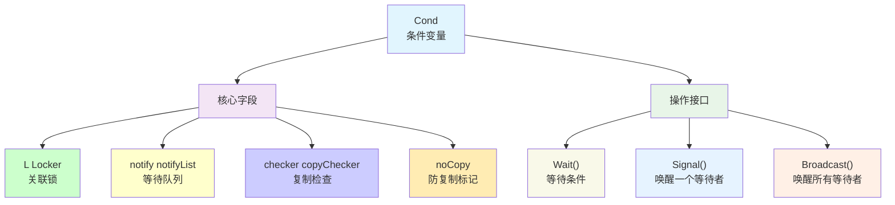
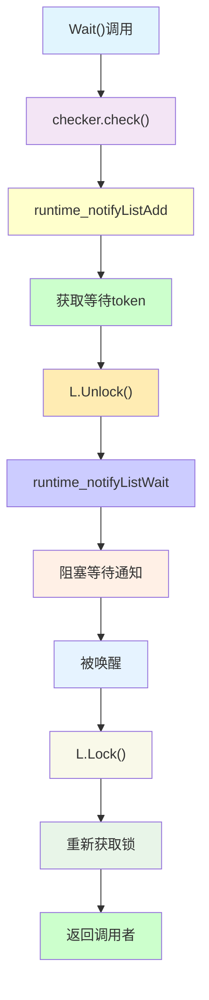
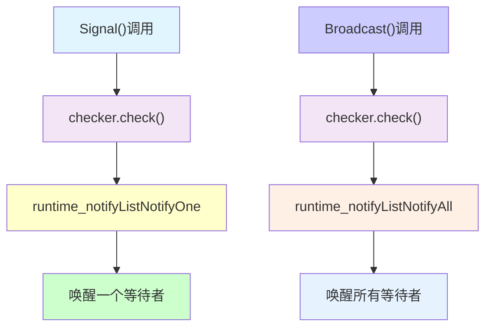
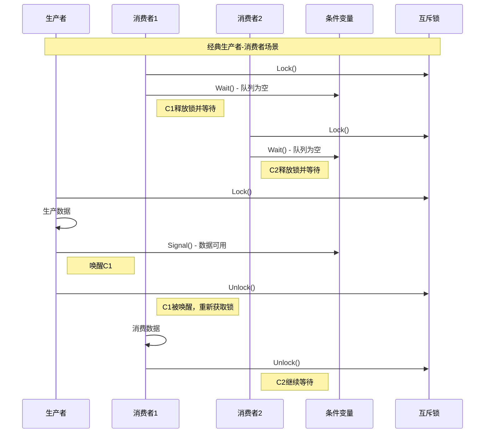
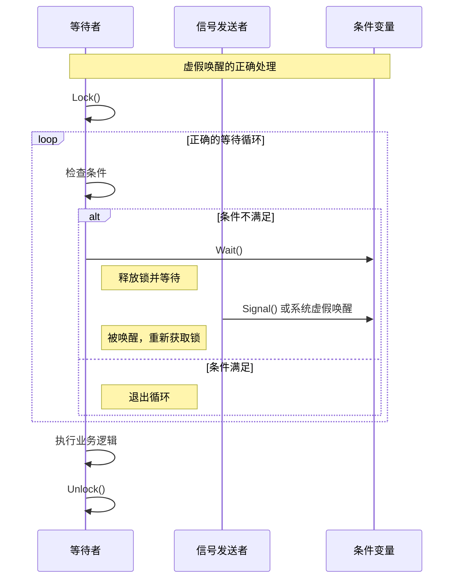
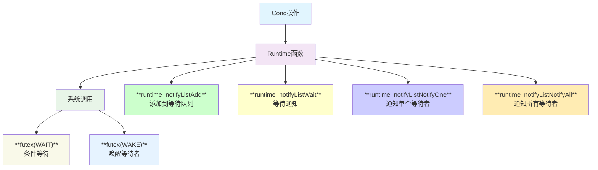
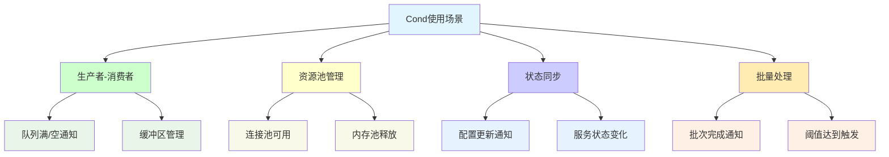
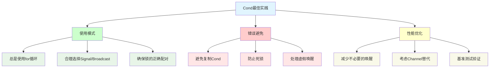
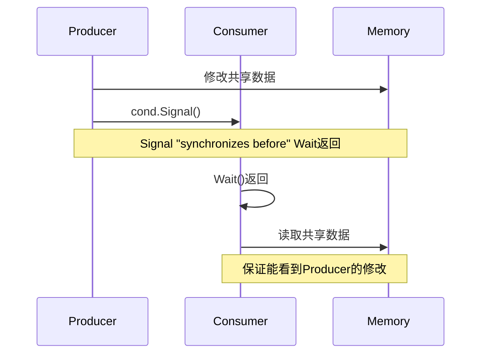
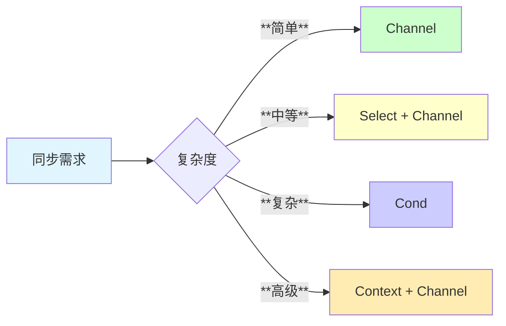

# **Sync Cond 条件变量模块深度分析**

## **1. 模块概述**

**sync.Cond** 是Go语言提供的条件变量实现，用于在特定条件满足时协调goroutine的执行。它实现了经典的"等待-通知"模式，常用于生产者-消费者等同步场景。

## **2. 模块结构与架构**



## **3. 核心数据结构**

### **3.1 Cond结构定义**

```go
type Cond struct {
    noCopy noCopy
    
    L Locker           // 关联的锁(通常是*Mutex或*RWMutex)
    
    notify  notifyList // 等待队列，由runtime管理
    checker copyChecker // 复制检测器
}
```

### **3.2 复制检测机制**

```go
type copyChecker uintptr

func (c *copyChecker) check() {
    if uintptr(*c) != uintptr(unsafe.Pointer(c)) &&
        !atomic.CompareAndSwapUintptr((*uintptr)(c), 0, uintptr(unsafe.Pointer(c))) &&
        uintptr(*c) != uintptr(unsafe.Pointer(c)) {
        panic("sync.Cond is copied")
    }
}
```

## **4. 核心操作流程**

### **4.1 Wait操作详解**



### **4.2 Signal和Broadcast操作**



## **5. 时序交互分析**

### **5.1 生产者-消费者模式**



### **5.2 虚假唤醒处理**



## **6. 设计关键点**

### **6.1 锁的原子性释放与获取**

```go
func (c *Cond) Wait() {
    c.checker.check()
    
    // 原子性操作：获取等待token
    t := runtime_notifyListAdd(&c.notify)
    
    // 释放锁，允许其他goroutine修改条件
    c.L.Unlock()
    
    // 等待通知
    runtime_notifyListWait(&c.notify, t)
    
    // 重新获取锁
    c.L.Lock()
}
```

### **6.2 正确的使用模式**

```go
// ✅ 正确的使用方式
c.L.Lock()
for !condition() {
    c.Wait()
}
// 条件满足时的处理
c.L.Unlock()

// ❌ 错误的使用方式
c.L.Lock()
if !condition() {  // 应该使用for而不是if
    c.Wait()
}
c.L.Unlock()
```

## **7. Linux底层支持机制**

### **7.1 Runtime通知机制**



### **7.2 与其他同步原语的集成**

| **组件** | **作用** | **交互方式** |
|---------|---------|-------------|
| **Mutex/RWMutex** | **保护临界区** | **通过L字段集成** |
| **notifyList** | **等待队列管理** | **Runtime级别实现** |
| **Goroutine调度器** | **阻塞与唤醒** | **G状态转换** |

## **8. 使用场景与模式**

### **8.1 典型应用场景**



### **8.2 实际应用示例**

```go
// 有界缓冲区实现
type BoundedBuffer struct {
    mu       sync.Mutex
    notFull  *sync.Cond  // 缓冲区不满的条件
    notEmpty *sync.Cond  // 缓冲区不空的条件
    buffer   []interface{}
    count    int
    capacity int
}

func NewBoundedBuffer(cap int) *BoundedBuffer {
    bb := &BoundedBuffer{
        buffer:   make([]interface{}, cap),
        capacity: cap,
    }
    bb.notFull = sync.NewCond(&bb.mu)
    bb.notEmpty = sync.NewCond(&bb.mu)
    return bb
}

func (bb *BoundedBuffer) Put(item interface{}) {
    bb.mu.Lock()
    defer bb.mu.Unlock()
    
    // 等待缓冲区不满
    for bb.count == bb.capacity {
        bb.notFull.Wait()
    }
    
    bb.buffer[bb.count] = item
    bb.count++
    bb.notEmpty.Signal() // 通知不空
}
```

## **9. 性能特性分析**

### **9.1 性能特点**

- **阻塞开销**: Wait操作涉及goroutine调度切换
- **通知效率**: Signal/Broadcast是轻量级操作
- **内存占用**: 结构体较小，主要是runtime的notifyList
- **扩展性**: 支持任意数量的等待者

### **9.2 与Channel对比**

| **特性** | **Cond** | **Channel** | **说明** |
|---------|----------|-------------|---------|
| **学习成本** | **高** | **中** | **Cond需要理解锁配合** |
| **易用性** | **复杂** | **简单** | **Channel更符合Go习惯** |
| **性能** | **较高** | **中等** | **Cond避免了数据复制** |
| **灵活性** | **高** | **高** | **都支持多种同步模式** |
| **错误倾向** | **高** | **低** | **Cond容易出现死锁** |

## **10. 常见陷阱与最佳实践**

### **10.1 典型错误模式**

| **错误类型** | **问题描述** | **解决方案** |
|-------------|-------------|-------------|
| **虚假唤醒** | **使用if而不是for** | **总是使用循环检查条件** |
| **死锁** | **Signal前未释放锁** | **确保Signal在锁外调用** |
| **竞态条件** | **条件检查与Wait不原子** | **在同一锁保护下操作** |
| **复制错误** | **Cond被意外复制** | **使用指针传递** |

### **10.2 最佳实践原则**



## **11. 高级用法与扩展**

### **11.1 超时等待实现**

```go
type TimedCond struct {
    *sync.Cond
}

func (tc *TimedCond) WaitTimeout(timeout time.Duration) bool {
    done := make(chan struct{})
    
    go func() {
        tc.Wait()
        close(done)
    }()
    
    select {
    case <-done:
        return true  // 正常唤醒
    case <-time.After(timeout):
        return false // 超时
    }
}
```

### **11.2 条件组合**

```go
// 多条件等待
type MultiCond struct {
    mu    sync.Mutex
    conds []*sync.Cond
}

func (mc *MultiCond) WaitAny() int {
    // 等待任意一个条件满足
    // 实现省略...
}

func (mc *MultiCond) WaitAll() {
    // 等待所有条件满足
    // 实现省略...
}
```

## **12. 内存模型保证**

### **12.1 Happens-Before关系**

- **Signal/Broadcast调用** "synchronizes before" **被唤醒的Wait调用返回**
- **Wait调用中的L.Unlock()** "synchronizes before" **同一Cond上的Signal/Broadcast**

### **12.2 内存可见性**



## **13. 局限性分析**

### **13.1 设计局限**

- **复杂性高**: 需要正确理解锁和条件的配合
- **易出错**: 虚假唤醒、死锁等陷阱多
- **调试困难**: 并发问题难以重现和调试
- **Go风格**: 不如Channel符合Go的设计哲学

### **13.2 替代方案考虑**



## **14. 总结**

sync.Cond是Go语言中实现条件等待的经典同步原语：

- **🔄 灵活同步**: 支持复杂的条件等待逻辑
- **⚡ 高效通知**: 精确控制唤醒策略
- **🔒 锁集成**: 与Mutex/RWMutex无缝配合
- **⚠️ 使用复杂**: 需要仔细处理各种边界情况
- **🛠️ 替代方案**: Channel在大多数场景下更简单

**适用于需要复杂条件同步的场景，但在现代Go编程中，Channel通常是更好的选择。**
