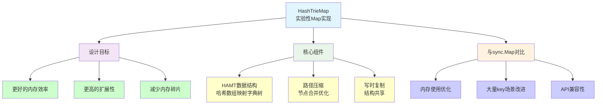
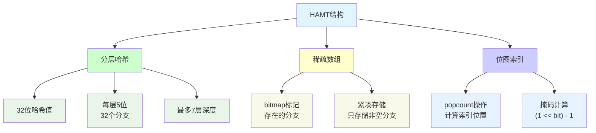
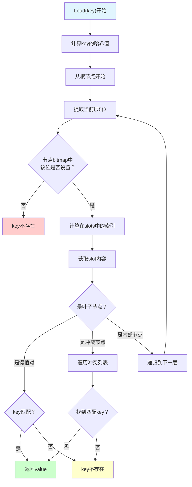
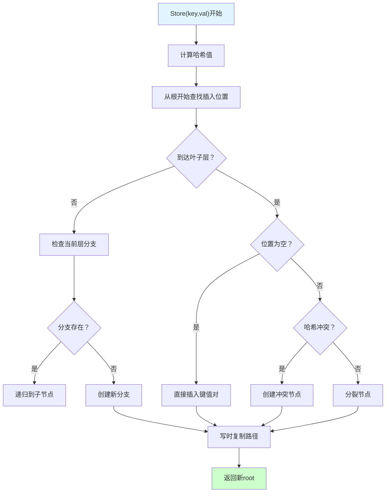
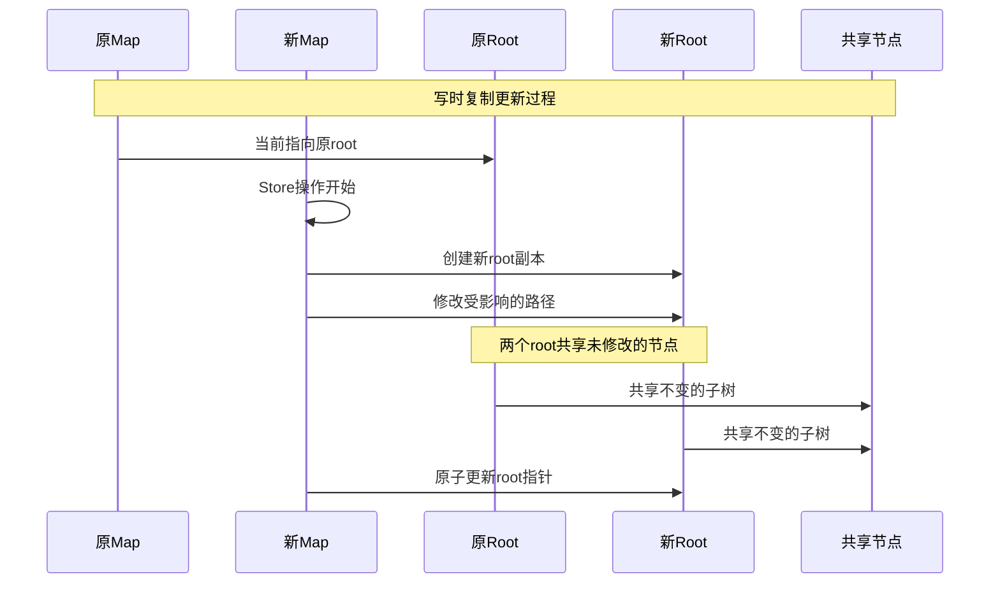
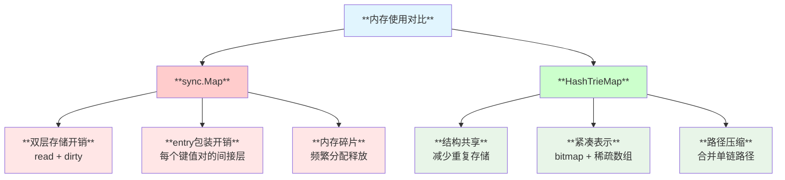
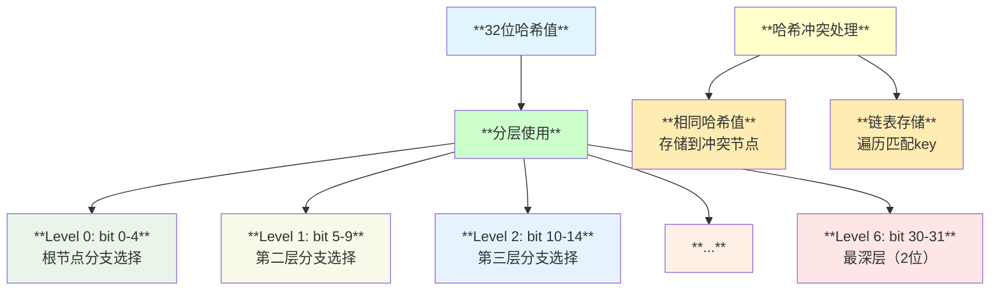
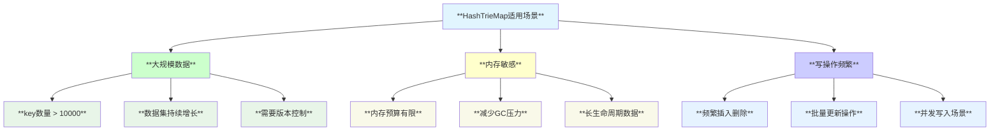
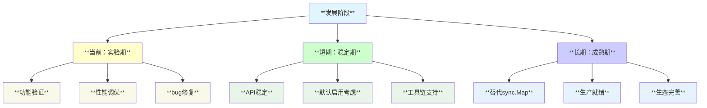
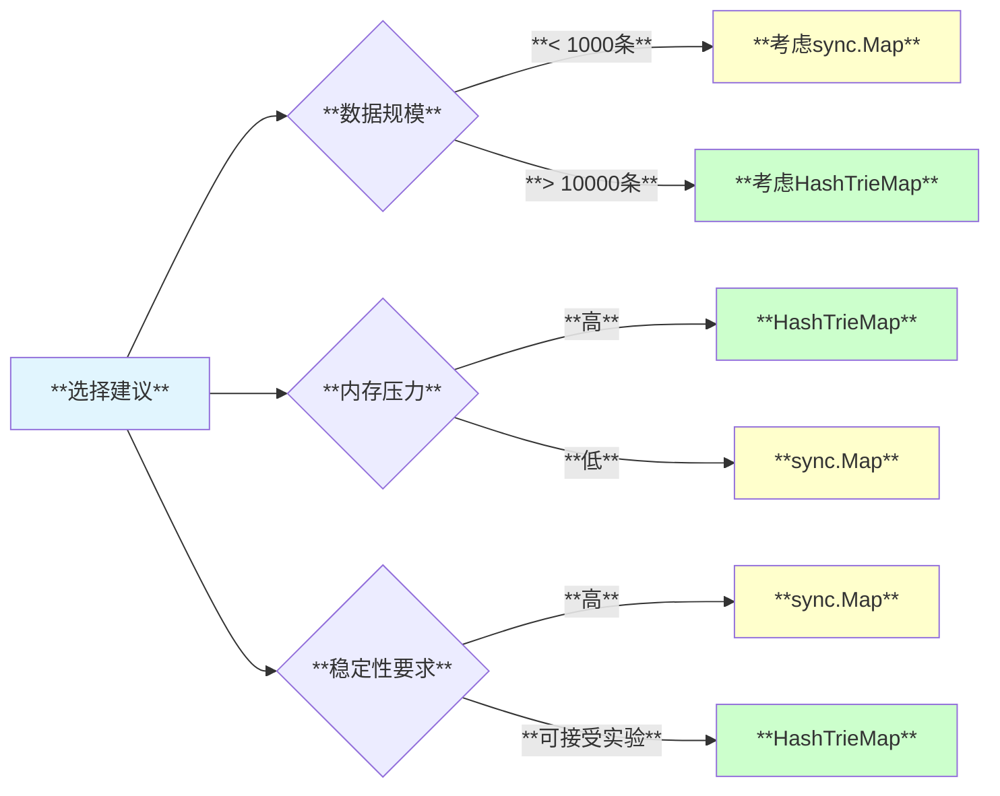

# **Sync HashTrieMap 哈希字典树Map模块深度分析**

## **1. 模块概述**

**HashTrieMap** 是Go 1.23引入的实验性特性（需要`GOEXPERIMENT=synchashtriemap`开启），作为sync.Map的替代实现。它基于哈希字典树（Hash Array Mapped Trie, HAMT）数据结构，提供了更好的内存效率和扩展性。

## **2. 模块结构与架构**



## **3. HAMT数据结构原理**

### **3.1 基础概念**



### **3.2 节点类型设计**

```go
// HAMT节点类型
type hashTrieMapNode struct {
    bitmap uint32           // 位图，标记哪些分支存在
    slots  []interface{}    // 存储子节点或键值对
}

// 键值对存储
type hashTrieMapEntry struct {
    key   interface{}
    value interface{}
}

// 哈希冲突处理
type hashTrieMapCollision struct {
    hash    uint32
    entries []hashTrieMapEntry
}
```

## **4. 核心算法实现**

### **4.1 查找操作**



### **4.2 插入操作**



## **5. 写时复制机制**

### **5.1 结构共享原理**



### **5.2 内存效率优势**

```go
// 传统sync.Map问题
// - 每个key都需要entry包装
// - dirty/read双重存储
// - 内存开销大

// HashTrieMap优势
// - 结构共享，减少内存复制
// - 紧凑的bitmap表示
// - 路径压缩优化
```

## **6. 性能特性分析**

### **6.1 时间复杂度**

| **操作** | **最好情况** | **平均情况** | **最坏情况** |
|---------|-------------|-------------|-------------|
| **Load** | **O(1)** | **O(log₃₂ n)** | **O(log₃₂ n + k)** |
| **Store** | **O(1)** | **O(log₃₂ n)** | **O(log₃₂ n + k)** |
| **Delete** | **O(1)** | **O(log₃₂ n)** | **O(log₃₂ n + k)** |
| **Range** | **O(n)** | **O(n)** | **O(n)** |

*注：k为哈希冲突数量，n为总元素数量*

### **6.2 空间复杂度**



## **7. 与sync.Map的比较**

### **7.1 API兼容性**

```go
// 完全兼容的API
type Map struct {
    _ noCopy
    m isync.HashTrieMap[any, any]  // 内部委托
}

func (m *Map) Load(key any) (value any, ok bool) {
    return m.m.Load(key)
}

func (m *Map) Store(key, value any) {
    m.m.Store(key, value)
}

// 其他方法同样兼容...
```

### **7.2 性能场景对比**

| **场景** | **sync.Map** | **HashTrieMap** | **推荐** |
|---------|-------------|----------------|---------|
| **小量数据** | **优秀** | **良好** | **sync.Map** |
| **大量数据** | **内存压力大** | **内存高效** | **HashTrieMap** |
| **读密集** | **优秀** | **良好** | **sync.Map** |
| **写密集** | **中等** | **优秀** | **HashTrieMap** |
| **内存敏感** | **不适合** | **适合** | **HashTrieMap** |

## **8. 实现关键点**

### **8.1 位操作优化**

```go
// 高效的bitmap操作
func popcount(x uint32) int {
    return bits.OnesCount32(x)  // 硬件加速
}

func indexForBit(bitmap uint32, bit uint32) int {
    mask := (1 << bit) - 1
    return popcount(bitmap & mask)
}

// 设置/清除位
func setBit(bitmap uint32, bit uint32) uint32 {
    return bitmap | (1 << bit)
}

func clearBit(bitmap uint32, bit uint32) uint32 {
    return bitmap &^ (1 << bit)
}
```

### **8.2 哈希分层策略**



## **9. 使用场景建议**

### **9.1 适用场景**



### **9.2 迁移考虑**

```go
// 渐进式迁移策略
func migrateToHashTrieMap() {
    // 1. 开发环境测试
    // export GOEXPERIMENT=synchashtriemap
    
    // 2. 基准测试对比
    // go test -bench=. -benchmem
    
    // 3. 监控内存使用
    // runtime.ReadMemStats()
    
    // 4. 生产环境灰度
    // 逐步替换关键路径
}
```

## **10. 实验特性状态**

### **10.1 当前限制**

| **方面** | **限制** | **影响** |
|---------|---------|---------|
| **实验标志** | **需要GOEXPERIMENT** | **部署复杂性增加** |
| **文档** | **文档较少** | **学习成本高** |
| **生态** | **工具支持有限** | **调试困难** |
| **稳定性** | **API可能变化** | **升级风险** |

### **10.2 发展roadmap**



## **11. 最佳实践**

### **11.1 启用与测试**

```bash
# 开发环境启用
export GOEXPERIMENT=synchashtriemap
go build -a  # 重新构建以启用特性

# 基准测试对比
go test -tags=synchashtriemap -bench=BenchmarkMap -benchmem

# 内存分析
go test -tags=synchashtriemap -bench=. -memprofile=mem.prof
go tool pprof mem.prof
```

### **11.2 性能评估**

```go
// 性能测试模板
func BenchmarkMapOperations(b *testing.B) {
    var m sync.Map  // 使用HashTrieMap或原版
    
    // 预填充数据
    for i := 0; i < 10000; i++ {
        m.Store(i, i)
    }
    
    b.ResetTimer()
    b.RunParallel(func(pb *testing.PB) {
        for pb.Next() {
            // 混合读写测试
            key := rand.Intn(10000)
            if rand.Float32() < 0.8 {
                m.Load(key)  // 80%读
            } else {
                m.Store(key, key)  // 20%写
            }
        }
    })
}
```

## **12. 局限性与注意事项**

### **12.1 使用限制**

- **实验特性**: 需要特殊编译标志，API可能变化
- **调试复杂**: 内部结构复杂，调试工具支持有限
- **小数据集**: 对于少量数据，开销可能不如简单实现
- **学习曲线**: 需要理解HAMT原理才能深度优化

### **12.2 权衡考虑**



## **13. 总结**

HashTrieMap是Go语言sync包的重要实验性改进：

- **🎯 内存优化**: 基于HAMT的结构共享显著减少内存使用
- **📈 扩展性**: 更好地支持大规模数据场景
- **🔄 写时复制**: 高效的不可变数据结构支持
- **⚖️ 性能平衡**: 在内存和时间复杂度间找到更好的平衡
- **🚧 实验阶段**: 目前仍需谨慎评估后使用

**适用于大规模、内存敏感的并发Map使用场景，代表了Go语言在数据结构优化方面的持续探索。**
