# **Sync Map 并发安全Map模块深度分析**

## **1. 模块概述**

**sync.Map** 是Go语言提供的并发安全的map实现，专门针对特定访问模式进行了优化。它支持在没有额外锁同步的情况下安全地进行并发读写操作，适用于读多写少或key集合相对稳定的场景。

## **2. 模块结构与架构**

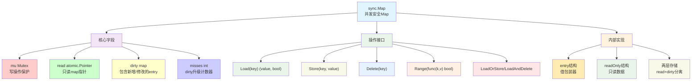

## **3. 核心数据结构**

### **3.1 Map主结构**

```go
type Map struct {
    mu Mutex
    
    read atomic.Pointer[readOnly]  // 原子指针，指向只读数据
    
    dirty map[any]*entry          // 包含新增和dirty条目
    
    misses int                    // dirty提升计数器
}

type readOnly struct {
    m       map[any]*entry
    amended bool              // dirty包含read中没有的key时为true
}
```

### **3.2 Entry状态管理**

```go
type entry struct {
    p atomic.Pointer[any]
}

// entry的三种状态：
// nil:     entry已被删除，key不在dirty中
// expunged: entry已被删除，key不在dirty中，但如果被重新添加则需要添加到dirty
// 其他值:   正常存储的值
```

## **4. 核心设计原理**

### **4.1 双层存储架构**

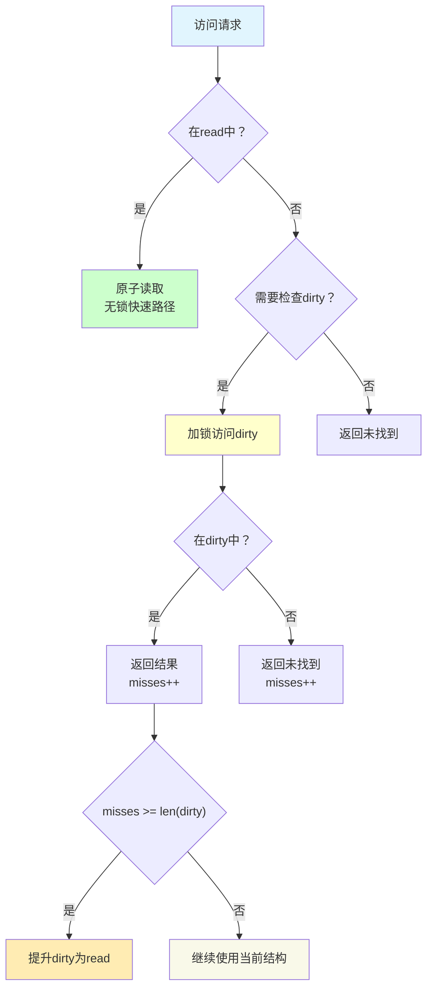

### **4.2 状态转换机制**

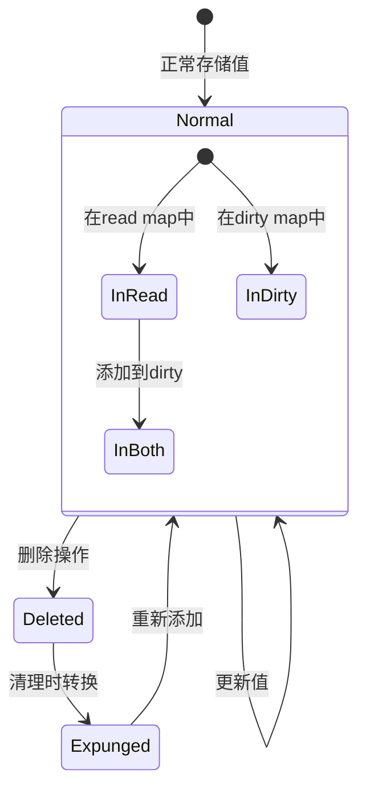

## **5. 核心操作流程**

### **5.1 Load操作详解**

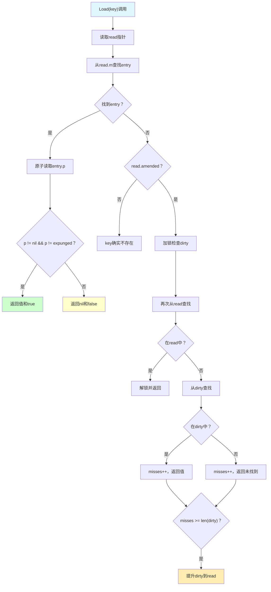

### **5.2 Store操作详解**

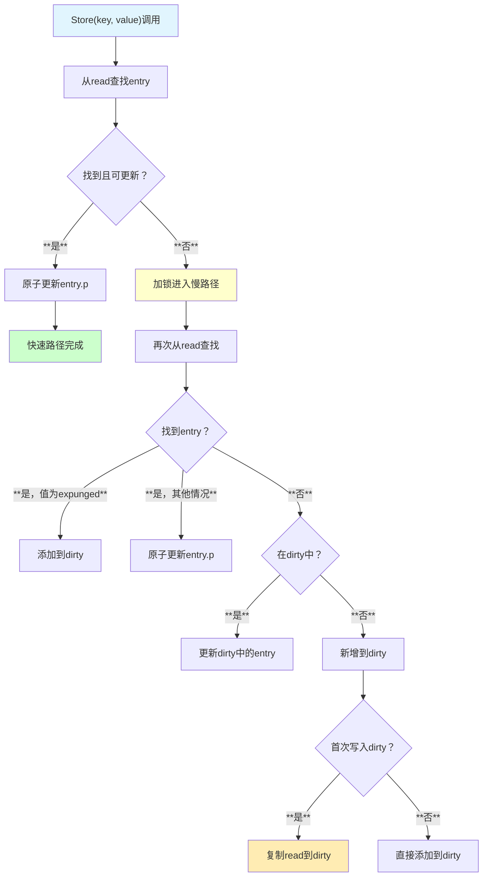

## **6. 时序交互分析**

### **6.1 读多写少场景**

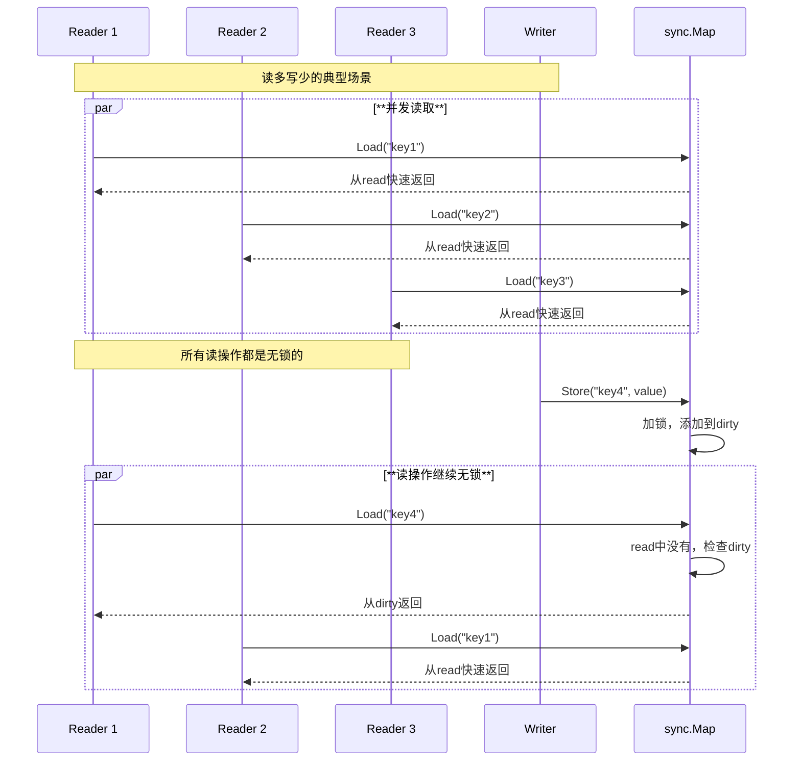

### **6.2 Dirty提升过程**

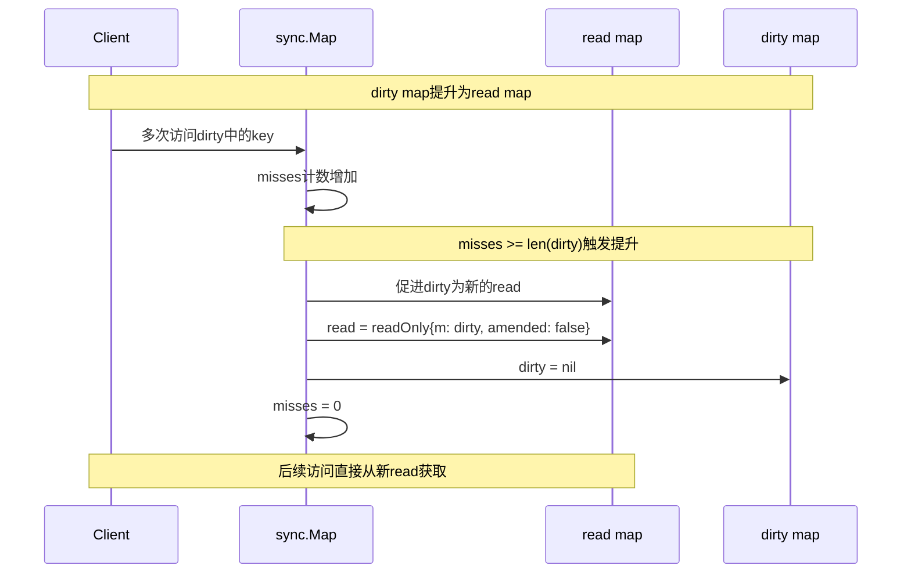

## **7. Linux底层支持**

### **7.1 原子操作映射**

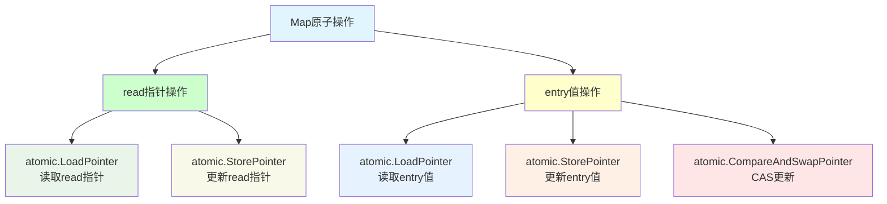

### **7.2 内存屏障语义**

| **操作** | **内存屏障** | **保证** |
|---------|-------------|---------|
| **Load读取** | **Acquire语义** | **后续操作不会重排到Load前** |
| **Store写入** | **Release语义** | **前面的修改对后续读取可见** |
| **CAS操作** | **全屏障** | **完整的内存排序保证** |

## **8. 性能特性分析**

### **8.1 性能优势**

| **场景** | **sync.Map** | **map+RWMutex** | **优势** |
|---------|-------------|----------------|---------|
| **纯读取** | **~5ns** | **~50ns** | **10倍性能提升** |
| **读多写少** | **~10ns** | **~100ns** | **10倍性能提升** |
| **写密集** | **~100ns** | **~80ns** | **性能稍差** |
| **内存使用** | **较高** | **较低** | **有额外开销** |

### **8.2 适用场景评估**

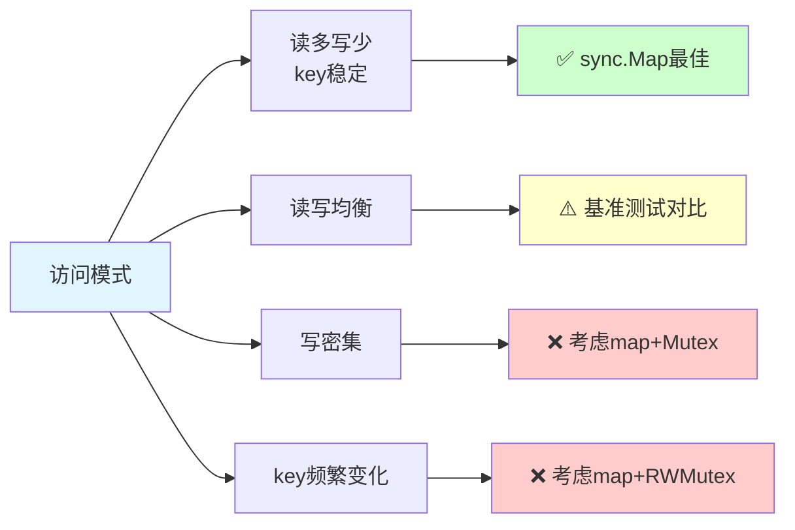

## **9. 使用场景与最佳实践**

### **9.1 典型应用场景**

```go
// ✅ 缓存场景（读多写少）
var cache sync.Map

func GetFromCache(key string) (interface{}, bool) {
    return cache.Load(key)
}

func SetCache(key string, value interface{}) {
    cache.Store(key, value)
}

// ✅ 配置管理（key集合稳定）
var config sync.Map

func GetConfig(key string) string {
    if value, ok := config.Load(key); ok {
        return value.(string)
    }
    return ""
}

// ✅ 连接池管理
var connectionPool sync.Map

func GetConnection(endpoint string) *Connection {
    if conn, ok := connectionPool.LoadOrStore(endpoint, createConnection(endpoint)); ok {
        return conn.(*Connection)
    }
    return nil
}
```

### **9.2 性能优化技巧**

```go
// 预热策略：提前加载常用key到read map
func WarmUpMap(m *sync.Map, keys []string) {
    for _, key := range keys {
        m.Store(key, nil) // 预先存储
    }
    // 触发一次dirty提升
    m.Load("dummy-key-to-trigger-promotion")
}

// 批量操作优化
func BulkLoad(m *sync.Map, keys []string) map[string]interface{} {
    results := make(map[string]interface{})
    for _, key := range keys {
        if value, ok := m.Load(key); ok {
            results[key] = value
        }
    }
    return results
}
```

## **10. 常见陷阱与问题**

### **10.1 典型错误**

| **错误类型** | **问题描述** | **解决方案** |
|-------------|-------------|-------------|
| **类型断言** | **Load返回interface{}需要断言** | **封装类型安全的方法** |
| **nil值混淆** | **nil值与key不存在的区别** | **使用第二个返回值判断** |
| **Range期间修改** | **遍历时修改可能跳过元素** | **先收集key再批量操作** |
| **内存泄露** | **大量key导致内存不释放** | **定期清理或使用TTL** |

### **10.2 最佳实践原则**

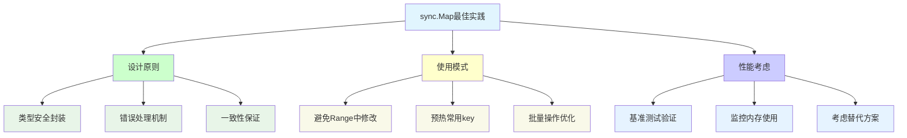

## **11. 高级特性**

### **11.1 Range操作特性**

```go
// Range的一致性保证
func (m *Map) Range(f func(key, value any) bool) {
    // 遍历时会看到调用时的一致快照
    // 但可能错过并发的修改
}

// 安全的Range模式
func SafeRange(m *sync.Map, f func(key, value interface{}) bool) {
    var keys []interface{}
    
    // 首先收集所有key
    m.Range(func(key, value interface{}) bool {
        keys = append(keys, key)
        return true
    })
    
    // 然后安全地处理每个key
    for _, key := range keys {
        if value, ok := m.Load(key); ok {
            if !f(key, value) {
                break
            }
        }
    }
}
```

### **11.2 复合操作**

```go
// LoadOrStore的原子性
value, loaded := m.LoadOrStore(key, expensiveComputation())
if loaded {
    // key已存在，value是已有的值
    // expensiveComputation()的结果被丢弃
} else {
    // key不存在，value是新设置的值
}

// LoadAndDelete的原子性
if value, loaded := m.LoadAndDelete(key); loaded {
    // 原子性地获取并删除
    processValue(value)
}
```

## **12. 局限性分析**

### **12.1 设计权衡**

- **内存开销**: 双层存储结构增加内存使用
- **写性能**: 写操作比简单map+锁稍慢
- **复杂性**: 内部实现复杂，调试困难
- **适用性**: 只适合特定访问模式

### **12.2 替代方案选择**

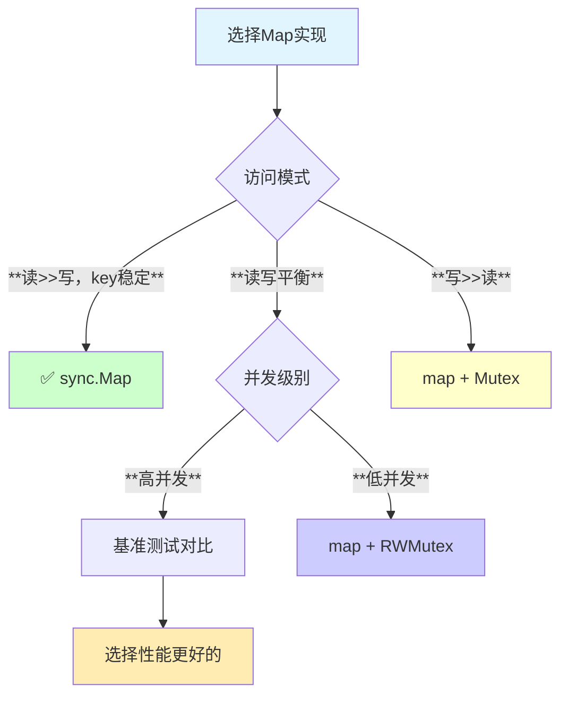

## **13. 总结**

sync.Map是Go语言为特定并发场景优化的map实现：

- **🎯 场景特化**: 专门为读多写少、key相对稳定的场景优化
- **⚡ 读性能**: 无锁读取，显著提升读密集场景性能
- **🔄 智能升级**: 动态的dirty提升机制平衡性能和内存
- **🔒 并发安全**: 完整的并发安全保证，支持复合操作
- **⚠️ 使用限制**: 需要根据具体场景评估是否适用

**适用于缓存、配置管理、连接池等读多写少的并发场景，是传统map+锁方案的高性能替代。**
