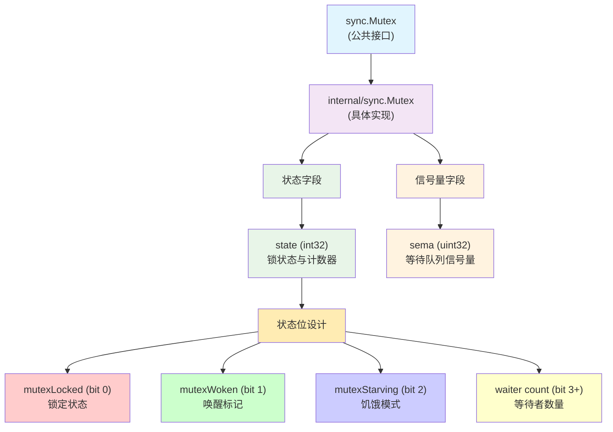
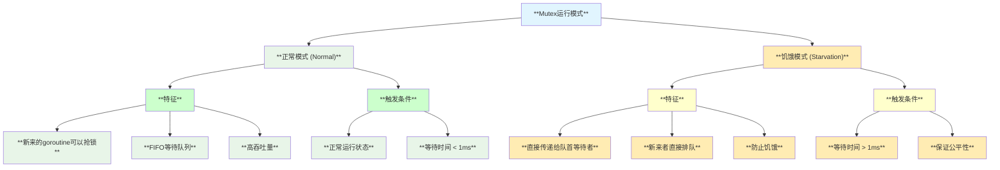
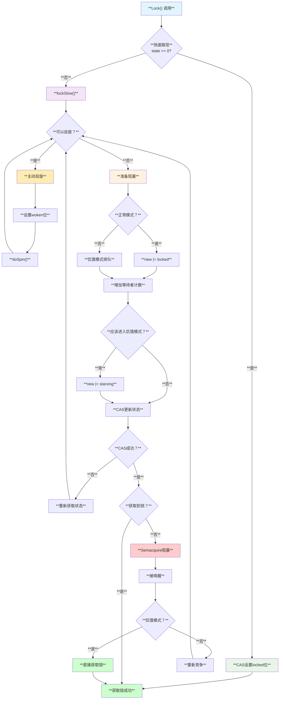
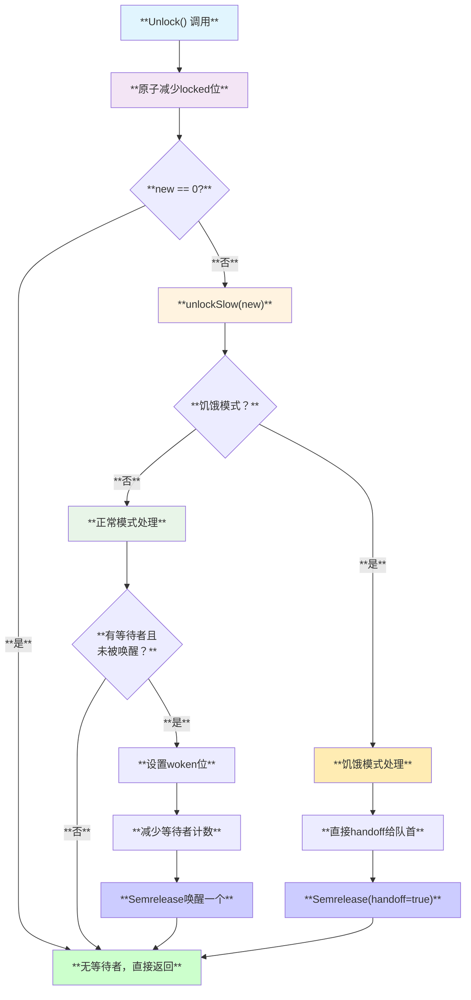
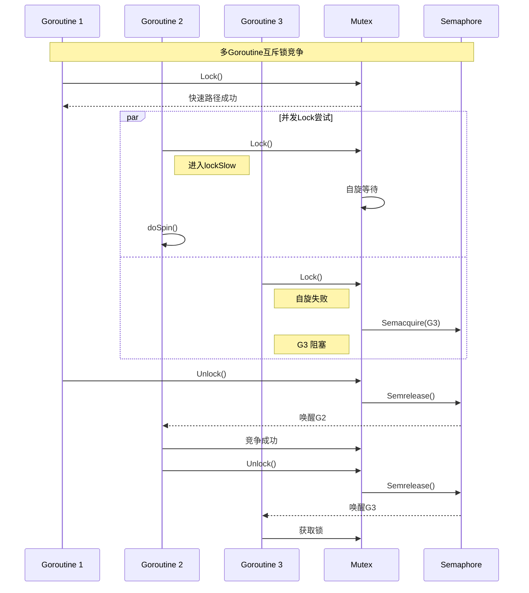
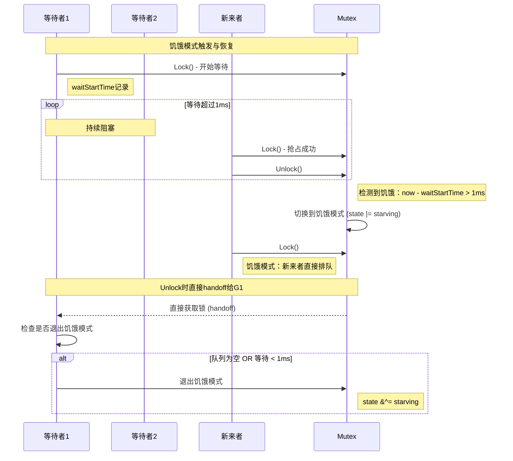
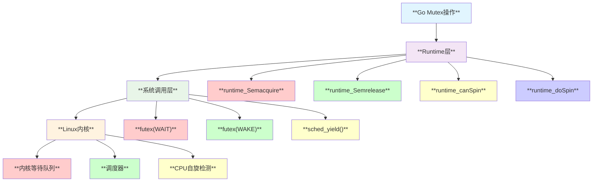
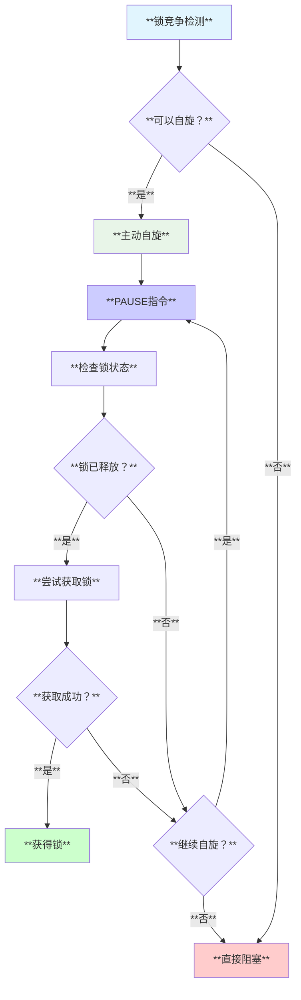
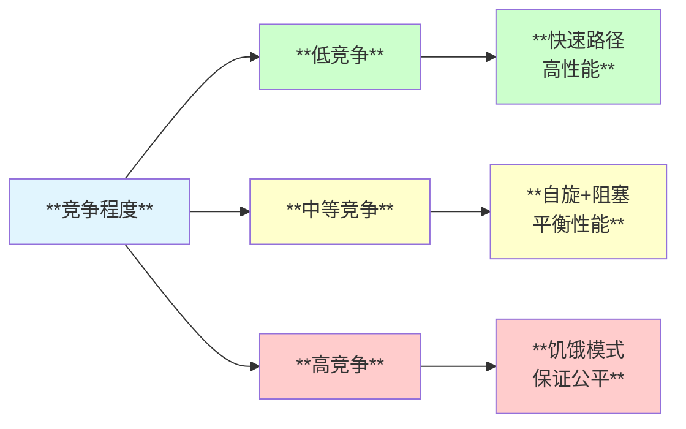

# **Sync Mutex 互斥锁模块深度分析**

## **1. 模块概述**

**sync.Mutex** 是Go语言中最基础也是最重要的同步原语，提供互斥访问共享资源的能力。Go 1.21后，sync.Mutex设计上采用了代理模式，将具体实现委托给 `internal/sync.Mutex`，这种设计提供了更好的内部实现灵活性。

## **2. 模块结构与架构**



## **3. 状态字段详细设计**

### **3.1 状态位布局**

```
state (int32) 位布局:
┌─────────────────────────────────┬───────┬───────┬───────┬───────┐
│        等待者计数 (29 bits)      │ 饥饿  │ 唤醒  │       │ 锁定  │
│         Waiter Count            │Starving│ Woken │  未使用│Locked │
└─────────────────────────────────┴───────┴───────┴───────┴───────┘
 31                            3    2       1       0       0
```

### **3.2 关键常量定义**

```go
const (
    mutexLocked = 1 << iota    // 1: 锁定状态
    mutexWoken                 // 2: 已唤醒状态  
    mutexStarving              // 4: 饥饿模式
    mutexWaiterShift = iota    // 3: 等待者计数位移
    
    starvationThresholdNs = 1e6 // 1ms饥饿阈值
)
```

## **4. 双模式运行机制**

### **4.1 正常模式 vs 饥饿模式**



## **5. 核心算法流程**

### **5.1 Lock操作流程**



### **5.2 Unlock操作流程**



## **6. 时序交互分析**

### **6.1 多Goroutine竞争场景**



### **6.2 饥饿模式转换时序**



## **7. Linux底层支持机制**

### **7.1 系统调用映射**



### **7.2 Futex机制详解**

| **操作** | **Futex调用** | **说明** |
|---------|---------------|---------|
| **阻塞等待** | `futex(addr, FUTEX_WAIT, val, ...)` | **如果*addr==val则阻塞** |
| **唤醒等待者** | `futex(addr, FUTEX_WAKE, n, ...)` | **唤醒最多n个等待者** |
| **优先级继承** | `FUTEX_LOCK_PI` | **防止优先级倒置** |
| **超时等待** | `FUTEX_WAIT_BITSET` | **带超时的等待** |

## **8. 自旋优化机制**

### **8.1 自旋条件判断**

```go
// 自旋条件检查
func runtime_canSpin(iter int) bool {
    return iter < active_spin &&        // 自旋次数限制
           runtime.GOMAXPROCS(0) > 1 && // 多核环境
           runtime.NumGoroutine() > 1 && // 多goroutine环境  
           !runtime_semacquireProfile() // 非Profile模式
}
```

### **8.2 自旋策略**



## **9. 设计关键点**

### **9.1 快速路径优化**

```go
// 无竞争场景的快速路径
func (m *Mutex) Lock() {
    if atomic.CompareAndSwapInt32(&m.state, 0, mutexLocked) {
        return // 直接获取锁，无需进入复杂逻辑
    }
    m.lockSlow() // 竞争场景的慢速路径
}
```

### **9.2 内存布局优化**

```go
type Mutex struct {
    state int32  // 热路径字段，放在前面
    sema  uint32 // 信号量，访问频率较低
}
```

### **9.3 公平性与性能平衡**

- **正常模式**：优先考虑性能，允许新来者抢占
- **饥饿模式**：保证公平性，直接传递给等待最久的goroutine
- **1ms阈值**：经过调优的最佳平衡点

## **10. 适用场景分析**

### **10.1 最佳适用场景**

| **场景** | **特征** | **性能表现** |
|---------|---------|-------------|
| **短临界区** | **持锁时间 < 10μs** | **✅ 优秀** |
| **低竞争** | **并发度 < CPU核心数** | **✅ 优秀** |
| **读写混合** | **读写操作都较短** | **✅ 良好** |
| **保护简单状态** | **计数器、标志位等** | **✅ 优秀** |

### **10.2 性能考虑**



## **11. 局限性分析**

### **11.1 使用限制**

| **限制类型** | **具体说明** | **解决方案** |
|-------------|-------------|-------------|
| **不可重入** | **同一goroutine重复加锁会死锁** | **使用RWMutex或设计避免** |
| **不可复制** | **复制后会产生独立的锁** | **使用指针传递** |
| **goroutine无关** | **可以在不同goroutine间传递** | **注意所有权管理** |
| **无超时支持** | **无法设置加锁超时** | **使用context或channel** |

### **11.2 性能陷阱**

- **高竞争场景**：频繁的模式切换开销
- **长临界区**：阻塞时间过长影响整体性能
- **优先级倒置**：高优先级goroutine被低优先级阻塞

## **12. 总结**

sync.Mutex是Go语言并发编程的核心同步原语，其设计体现了以下特点：

- **🚀 高性能**：快速路径优化、自旋机制、双模式运行
- **⚖️ 公平性**：饥饿模式防止长期等待
- **🔧 易用性**：简洁的API、零值可用
- **🛡️ 安全性**：防拷贝检查、状态一致性保证

**适用于绝大部分互斥访问场景，是构建更复杂同步机制的基础。**
