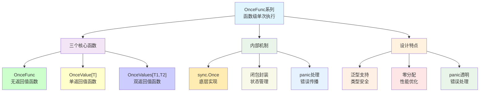
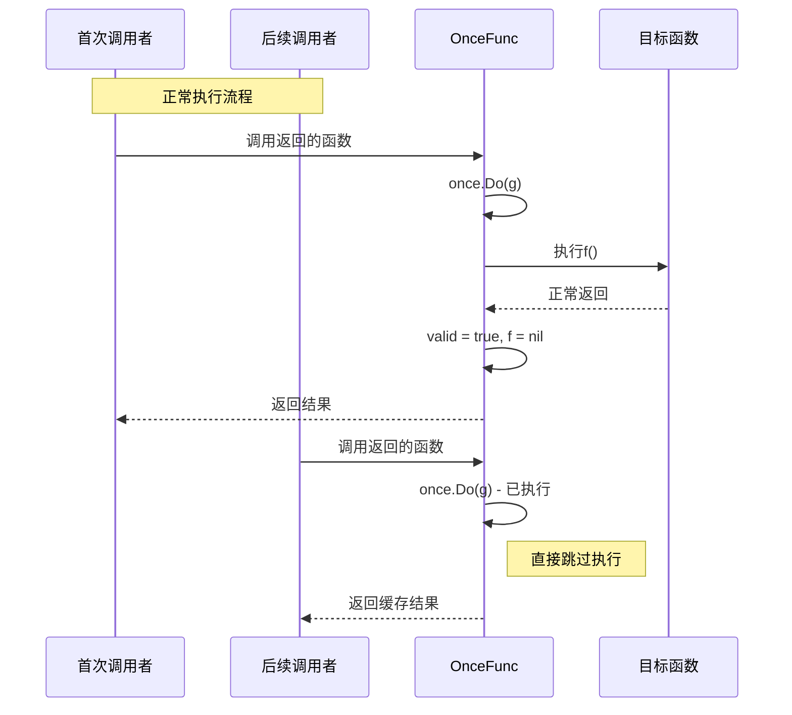
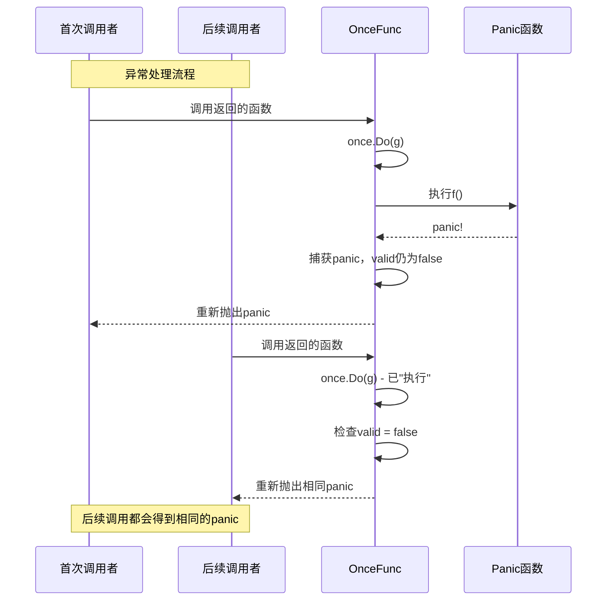
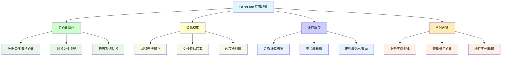
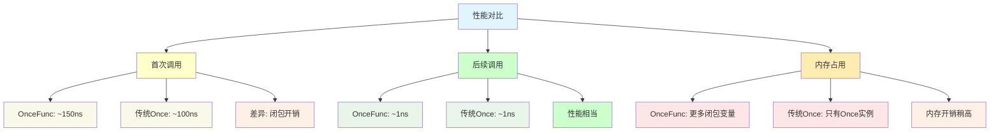
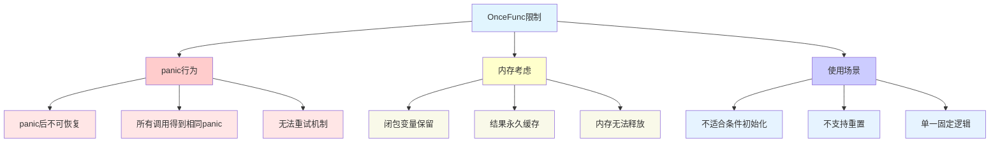
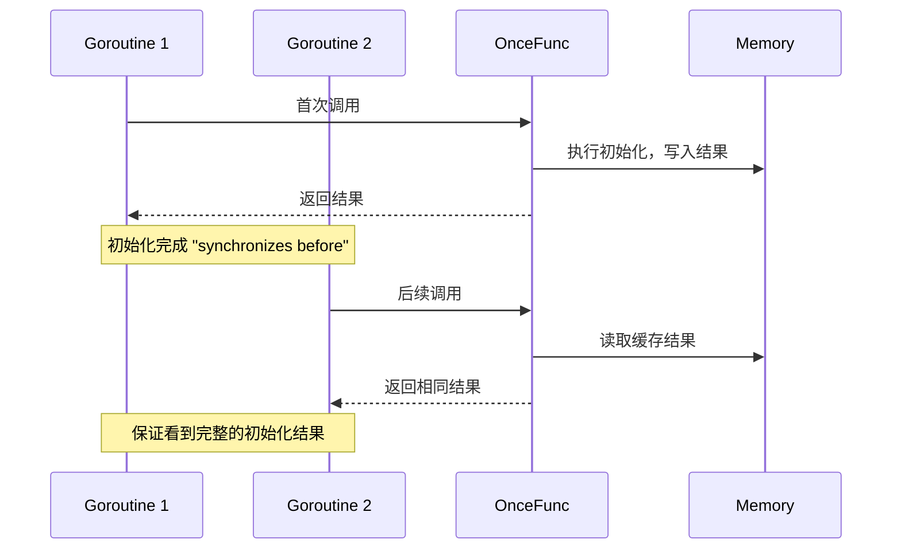

# **Sync OnceFunc 函数级单次执行模块深度分析**

## **1. 模块概述**

**sync包中的OnceFunc系列函数**（OnceFunc、OnceValue、OnceValues）是Go 1.21引入的新功能，提供了函数级别的单次执行封装，是对sync.Once的高级抽象和扩展。

## **2. 模块结构与架构**



## **3. 核心实现分析**

### **3.1 OnceFunc实现**

```go
func OnceFunc(f func()) func() {
    var (
        once  Once
        valid bool
        p     any
    )
    
    g := func() {
        defer func() {
            p = recover()
            if !valid {
                panic(p) // 首次调用时重新抛出panic
            }
        }()
        f()
        f = nil      // 释放f的引用，避免内存泄露
        valid = true // 只有f()成功完成才设置
    }
    
    return func() {
        once.Do(g)
        if !valid {
            panic(p) // 后续调用时重新抛出相同panic
        }
    }
}
```

### **3.2 OnceValue实现**

```go
func OnceValue[T any](f func() T) func() T {
    var (
        once   Once
        valid  bool
        p      any
        result T
    )
    
    g := func() {
        defer func() {
            p = recover()
            if !valid {
                panic(p)
            }
        }()
        result = f()
        f = nil
        valid = true
    }
    
    return func() T {
        once.Do(g)
        if !valid {
            panic(p)
        }
        return result
    }
}
```

## **4. 设计关键点**

### **4.1 Panic处理机制**

```mermaid
flowchart TD
    A["函数调用"] --> B["once.Do(g)"]
    B --> C{首次执行？}
    C -->|"是"| D["执行f()"]
    C -->|"否"| E{valid?}
    
    D --> F{f()成功？}
    F -->|"是"| G["设置valid=true"]
    F -->|"否"| H["panic被捕获"]
    
    H --> I["保存panic值p"]
    I --> J["重新panic (首次)"]
    
    G --> K["返回结果"]
    
    E -->|"true"| L["返回缓存结果"]
    E -->|"false"| M["重新panic (后续)"]

    style A fill:#e1f5fe
    style D fill:#f3e5f5
    style G fill:#ccffcc
    style H fill:#ffcccc
    style J fill:#ffcccc
    style K fill:#ccffcc
    style L fill:#ffffcc
    style M fill:#ffcccc
```

### **4.2 内存管理优化**

```go
// 关键优化点：及时释放函数引用
f()
f = nil  // ✅ 避免闭包长期持有f的引用
valid = true
```

### **4.3 泛型类型安全**

```go
// 类型安全的单次执行
var initConfig = OnceValue(func() *Config {
    return loadConfig() // 返回类型自动推断为*Config
})

config := initConfig() // 无需类型断言
```

## **5. 时序交互分析**

### **5.1 正常执行时序**



### **5.2 异常处理时序**



## **6. 使用场景与模式**

### **6.1 典型应用场景**



### **6.2 实际使用示例**

```go
// ✅ 配置加载
var getConfig = OnceValue(func() *Config {
    config, err := loadConfigFromFile("app.yaml")
    if err != nil {
        panic(fmt.Sprintf("failed to load config: %v", err))
    }
    return config
})

// ✅ 数据库连接
var getDB = OnceValue(func() *sql.DB {
    db, err := sql.Open("postgres", dsn)
    if err != nil {
        panic(err)
    }
    return db
})

// ✅ 复杂计算缓存
var getPrimeNumbers = OnceValue(func() []int {
    return calculatePrimesUpTo(1000000) // 昂贵的计算
})

// ✅ 双返回值场景
var getServerInfo = OnceValues(func() (string, int) {
    hostname, _ := os.Hostname()
    pid := os.Getpid()
    return hostname, pid
})
```

## **7. 性能特性分析**

### **7.1 性能优势**

| **特性** | **OnceFunc系列** | **传统Once+全局变量** | **优势** |
|---------|----------------|--------------------|---------|
| **类型安全** | **✅ 编译时检查** | **❌ 运行时断言** | **避免类型错误** |
| **内存管理** | **✅ 自动清理** | **⚠️ 手动管理** | **防止内存泄露** |
| **易用性** | **✅ 函数式** | **⚠️ 需要状态管理** | **更简洁的API** |
| **错误处理** | **✅ 透明传播** | **⚠️ 需要手动处理** | **一致的错误行为** |

### **7.2 性能基准对比**



## **8. 与传统方式对比**

### **8.1 代码复杂度对比**

```go
// ❌ 传统sync.Once方式
var (
    config     *Config
    configOnce sync.Once
)

func GetConfig() *Config {
    configOnce.Do(func() {
        var err error
        config, err = loadConfig()
        if err != nil {
            // 错误处理复杂
            panic(err)
        }
    })
    return config
}

// ✅ OnceValue方式
var GetConfig = OnceValue(func() *Config {
    config, err := loadConfig()
    if err != nil {
        panic(err)
    }
    return config
})
```

### **8.2 功能特性对比**

| **特性** | **sync.Once** | **OnceFunc系列** |
|---------|---------------|------------------|
| **类型安全** | **❌** | **✅** |
| **返回值** | **❌** | **✅** |
| **内存清理** | **手动** | **自动** |
| **错误处理** | **复杂** | **简单** |
| **代码量** | **较多** | **较少** |
| **学习成本** | **中等** | **低** |

## **9. 设计局限与注意事项**

### **9.1 使用限制**



### **9.2 最佳实践建议**

```go
// ✅ 适合的场景
var getHeavyResource = OnceValue(func() *Resource {
    return createExpensiveResource() // 昂贵操作
})

// ❌ 不适合的场景
var getCurrentTime = OnceValue(func() time.Time {
    return time.Now() // 应该每次返回新值
})

// ⚠️ 需要考虑的场景
var getTemporaryData = OnceValue(func() []byte {
    return loadLargeData() // 大量数据会一直占用内存
})
```

## **10. 高级用法与扩展**

### **10.1 条件式初始化**

```go
// 基于环境的条件初始化
var getLogger = OnceValue(func() Logger {
    if os.Getenv("ENV") == "production" {
        return NewProductionLogger()
    }
    return NewDevelopmentLogger()
})
```

### **10.2 错误处理模式**

```go
// 错误友好的初始化
func CreateInitializer[T any](factory func() (T, error)) func() T {
    return OnceValue(func() T {
        result, err := factory()
        if err != nil {
            panic(err) // 将错误转换为panic
        }
        return result
    })
}

var getService = CreateInitializer(func() (*Service, error) {
    return NewService()
})
```

### **10.3 组合模式**

```go
// 多层依赖初始化
var getDatabase = OnceValue(func() *sql.DB {
    config := getConfig() // 依赖配置
    return connectDB(config.DatabaseURL)
})

var getRepository = OnceValue(func() *Repository {
    db := getDatabase() // 依赖数据库
    return NewRepository(db)
})
```

## **11. 内存模型与并发安全**

### **11.1 线程安全保证**

- 底层使用sync.Once，提供相同的内存排序保证
- 函数执行结果的可见性符合happens-before语义
- 多goroutine并发调用是安全的

### **11.2 内存屏障语义**



## **12. 总结**

OnceFunc系列函数是Go语言同步原语的现代化改进：

- **🎯 专业化**: 针对函数级单次执行的专用工具
- **🔒 类型安全**: 泛型支持避免类型断言错误
- **⚡ 高性能**: 基于sync.Once，保持高性能特性
- **🧹 自动管理**: 自动处理内存清理和错误传播
- **💡 易于使用**: 函数式API，代码更简洁

**适用于需要单次初始化且有返回值的场景，是sync.Once的现代化替代方案。**
