# **Sync Once 单次执行模块深度分析**

## **1. 模块概述**

**sync.Once** 是Go语言中用于确保某个函数只被执行一次的同步原语。它提供了一种线程安全的单例模式实现，常用于初始化操作、资源分配等场景。

## **2. 模块结构与架构**

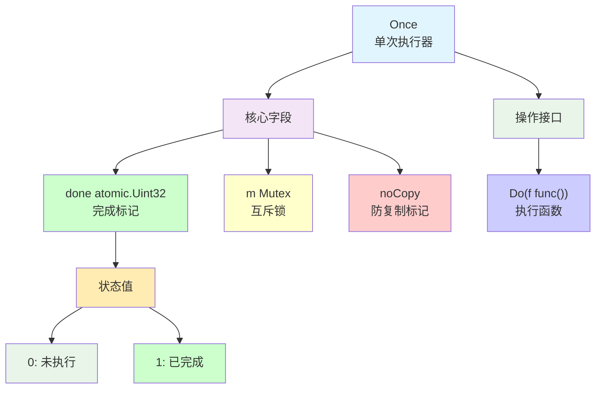

## **3. 核心数据结构**

### **3.1 Once结构定义**

```go
type Once struct {
    _ noCopy
    
    // done字段放在首位以优化热路径
    // 在某些架构上可以获得更紧凑的指令
    done atomic.Uint32
    m    Mutex
}
```

### **3.2 字段布局优化**

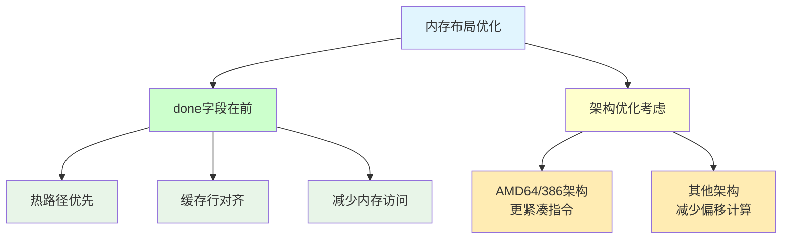

## **4. 核心算法实现**

### **4.1 Do方法实现流程**

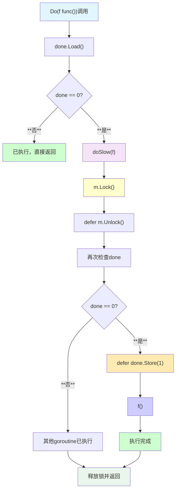

### **4.2 双重检查锁定模式**

```go
func (o *Once) Do(f func()) {
    // 快速路径：检查是否已执行
    if o.done.Load() == 0 {
        // 慢速路径：使用锁确保只执行一次
        o.doSlow(f)
    }
}

func (o *Once) doSlow(f func()) {
    o.m.Lock()
    defer o.m.Unlock()
    
    // 双重检查：可能其他goroutine已经执行了
    if o.done.Load() == 0 {
        defer o.done.Store(1)  // 确保在f()完成后设置
        f()
    }
}
```

## **5. 设计关键点**

### **5.1 为什么需要双重检查**

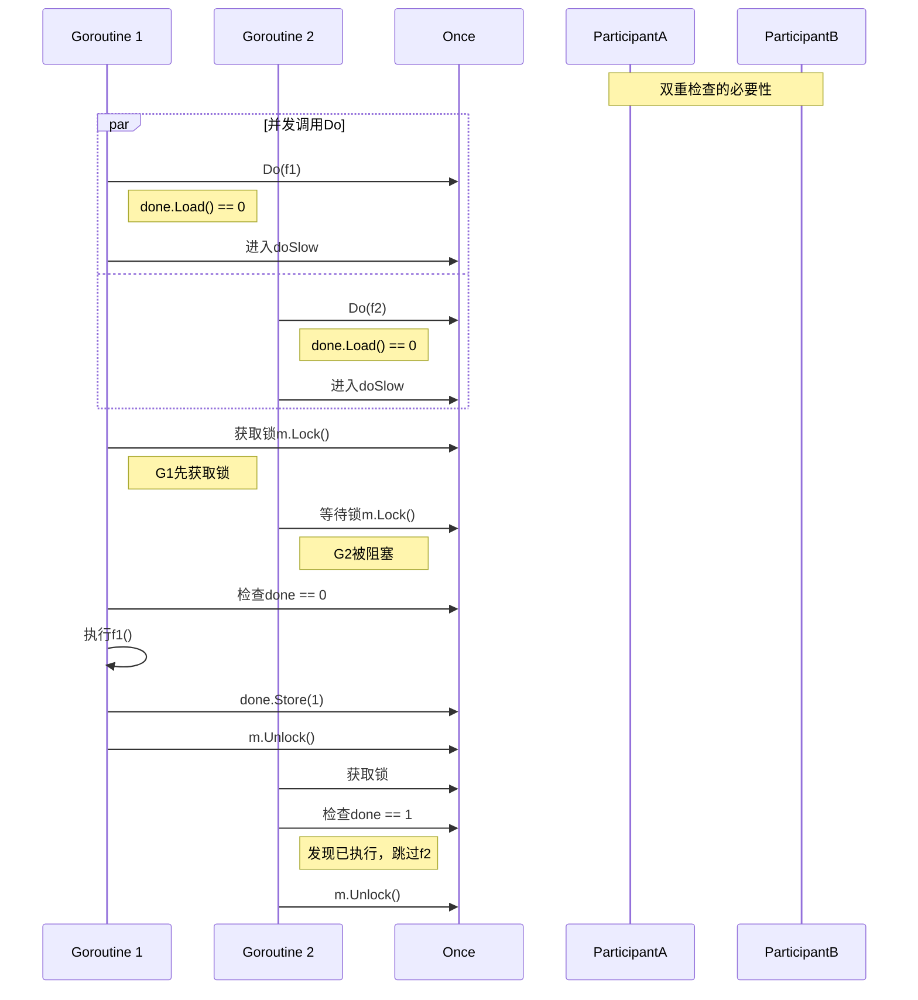

### **5.2 Store操作的延迟执行**

```go
// ❌ 错误的实现
if o.done.CompareAndSwap(0, 1) {
    f()  // 如果f()panic，done已经被设置为1
}

// ✅ 正确的实现
if o.done.Load() == 0 {
    defer o.done.Store(1)  // 确保f()完成后才设置
    f()
}
```

## **6. 时序交互分析**

### **6.1 正常执行时序**

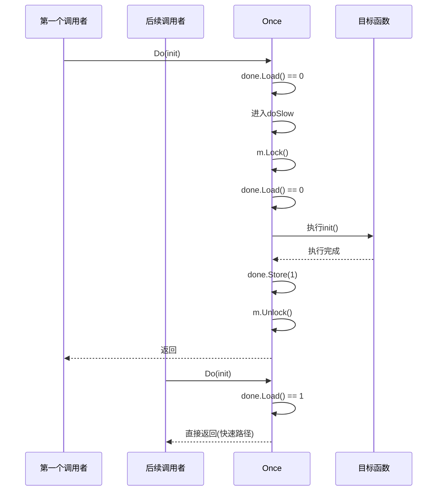

### **6.2 异常处理时序**

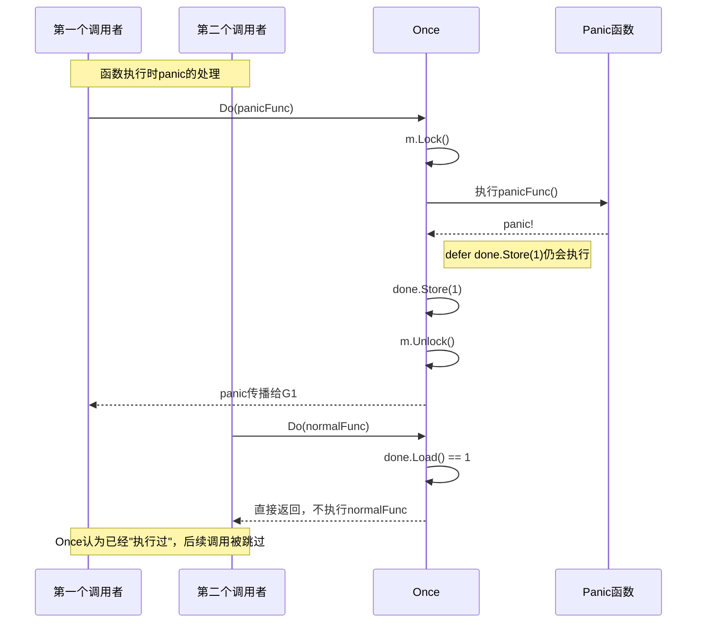

## **7. 使用场景与模式**

### **7.1 典型使用场景**

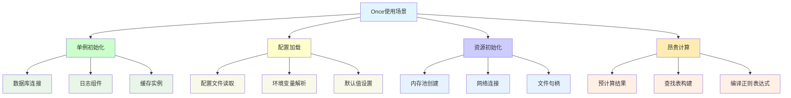

### **7.2 最佳实践模式**

```go
// ✅ 推荐：全局Once + 全局变量
var (
    instance *Singleton
    once     sync.Once
)

func GetInstance() *Singleton {
    once.Do(func() {
        instance = &Singleton{
            // 初始化代码
        }
    })
    return instance
}

// ✅ 推荐：包级初始化
var (
    config *Config
    configOnce sync.Once
)

func GetConfig() *Config {
    configOnce.Do(func() {
        config = loadConfigFromFile()
    })
    return config
}
```

## **8. Linux底层支持机制**

### **8.1 原子操作映射**

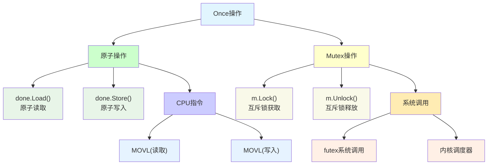

### **8.2 内存屏障保证**

| **操作** | **内存屏障类型** | **保证** |
|---------|----------------|---------|
| **done.Load()** | **Acquire语义** | **后续读写不会重排到Load前** |
| **done.Store()** | **Release语义** | **前面的f()执行对后续可见** |
| **m.Lock()** | **Acquire屏障** | **临界区代码不会重排到锁外** |
| **m.Unlock()** | **Release屏障** | **临界区修改对其他goroutine可见** |

## **9. 性能特性分析**

### **9.1 性能优势**

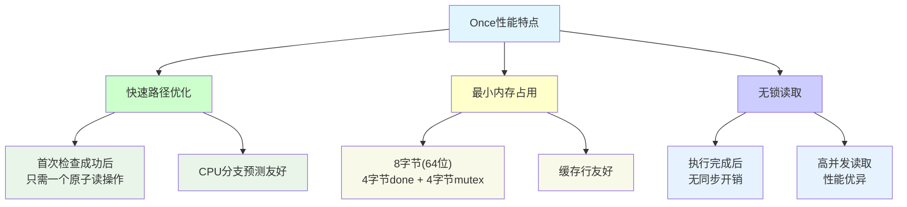

### **9.2 性能基准测试**

| **场景** | **操作耗时** | **内存分配** | **说明** |
|---------|-------------|-------------|---------|
| **首次执行** | **~100ns + f()时间** | **0** | **包含锁获取开销** |
| **后续执行** | **~1-2ns** | **0** | **只需原子读取** |
| **高并发读** | **~1ns/goroutine** | **0** | **无竞争，纯CPU操作** |

## **10. 高级用法与扩展**

### **10.1 条件执行模式**

```go
// 基于条件的Once执行
type ConditionalOnce struct {
    once sync.Once
    cond func() bool
}

func (co *ConditionalOnce) Do(f func()) {
    if co.cond() {
        co.once.Do(f)
    }
}
```

### **10.2 重置功能扩展**

```go
// 可重置的Once（注意：不是标准库功能）
type ResettableOnce struct {
    done int32
    mu   sync.Mutex
}

func (ro *ResettableOnce) Do(f func()) {
    if atomic.LoadInt32(&ro.done) == 0 {
        ro.mu.Lock()
        defer ro.mu.Unlock()
        if ro.done == 0 {
            f()
            atomic.StoreInt32(&ro.done, 1)
        }
    }
}

func (ro *ResettableOnce) Reset() {
    ro.mu.Lock()
    defer ro.mu.Unlock()
    atomic.StoreInt32(&ro.done, 0)
}
```

## **11. 常见陷阱与最佳实践**

### **11.1 典型错误模式**

| **错误类型** | **问题描述** | **解决方案** |
|-------------|-------------|-------------|
| **函数参数变化** | **不同参数调用同一Once** | **每个不同初始化使用不同Once** |
| **递归调用** | **f()内部调用同一Once.Do** | **重新设计避免递归** |
| **panic恢复** | **期望panic后重试** | **Once不支持重试，需要其他方案** |
| **复制Once** | **结构体包含Once被复制** | **使用指针或noCopy检查** |

### **11.2 最佳实践原则**

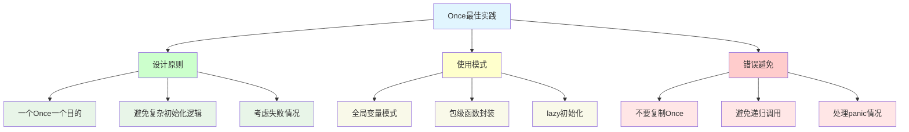

## **12. 内存模型保证**

### **12.1 Happens-Before关系**

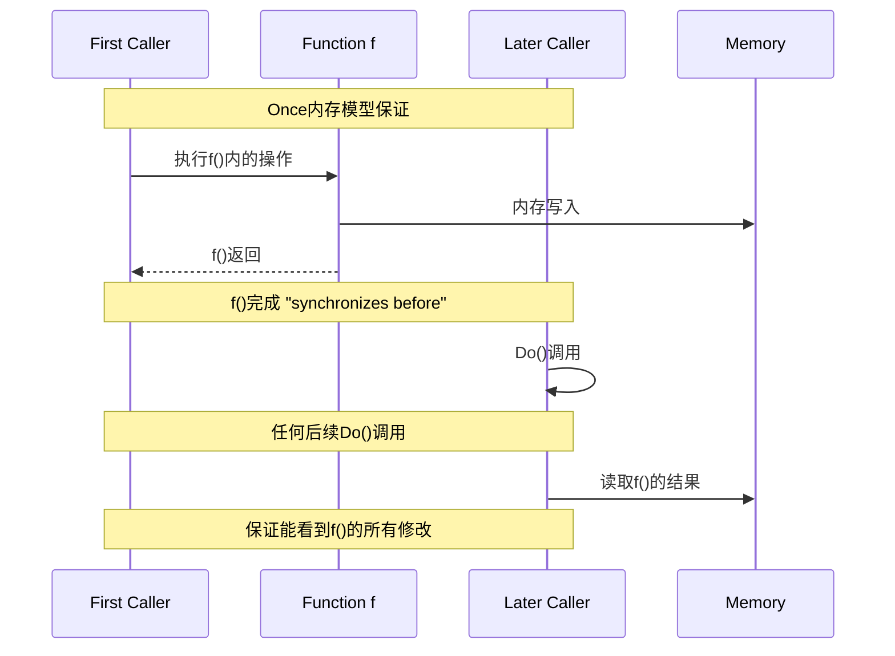

## **13. 与其他同步原语对比**

### **13.1 功能对比**

| **特性** | **Once** | **Mutex** | **Channel** | **atomic** |
|---------|----------|-----------|-------------|------------|
| **单次执行** | **✅ 专用** | **❌ 需要额外逻辑** | **❌ 复杂** | **❌ 需要额外逻辑** |
| **性能** | **✅ 优秀** | **⚠️ 中等** | **⚠️ 中等** | **✅ 优秀** |
| **易用性** | **✅ 简单** | **⚠️ 需要设计** | **⚠️ 复杂** | **❌ 复杂** |
| **灵活性** | **❌ 单一目的** | **✅ 通用** | **✅ 通用** | **✅ 灵活** |

## **14. 局限性分析**

### **14.1 设计局限**

- **不可重置**: 一旦执行完成，无法重新触发
- **不支持条件**: 无法基于运行时条件决定是否执行
- **panic后无法恢复**: 函数panic后，Once仍认为已执行
- **单一函数**: 只能执行一个函数，不支持多个不同函数

### **14.2 适用性边界**

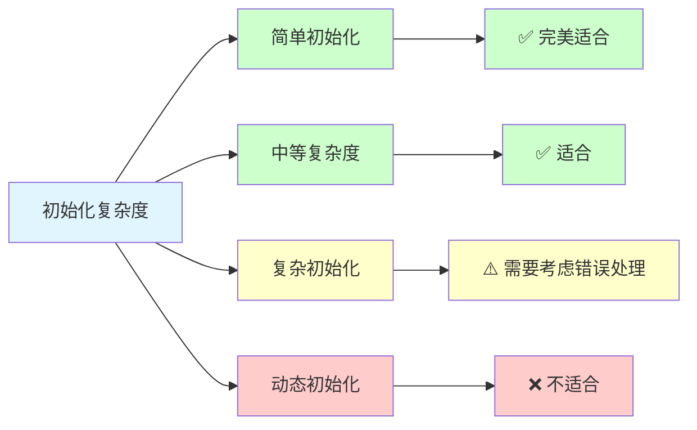

## **15. 总结**

sync.Once是Go语言中实现单次执行语义的精巧同步原语：

- **🎯 专用设计**: 专门为单次执行场景优化
- **⚡ 高性能**: 快速路径优化，执行后无开销
- **🔒 线程安全**: 基于双重检查锁定模式
- **💡 简单易用**: API简洁，零值可用
- **🛡️ 内存安全**: 严格的happens-before保证

**适用于初始化、单例创建等需要确保只执行一次的场景，是Go并发编程工具箱中的重要组件。**
