# **Sync PoolQueue 池队列模块深度分析**

## **1. 模块概述**

**sync包中的poolqueue模块**实现了Pool内部使用的无锁队列结构，是Pool高性能的关键组件。它提供了单生产者-多消费者的双端队列实现，支持高效的对象存取和跨P工作窃取。

## **2. 模块结构与架构**

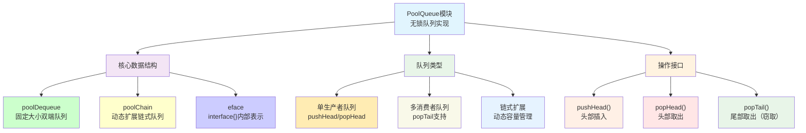

## **3. 核心数据结构**

### **3.1 poolDequeue - 固定大小队列**

```go
type poolDequeue struct {
    // headTail打包了32位头指针和32位尾指针
    // 高32位是head，低32位是tail
    headTail atomic.Uint64
    
    // vals是interface{}值的环形缓冲区
    // 大小必须是2的幂
    vals []eface
}

type eface struct {
    typ, val unsafe.Pointer  // interface{}的内部表示
}
```

### **3.2 poolChain - 链式动态队列**

```go
type poolChain struct {
    head *poolChainElt  // 生产者端，支持push/pop
    tail *poolChainElt  // 消费者端，只支持pop
}

type poolChainElt struct {
    poolDequeue         // 嵌入的固定大小队列
    
    next, prev *poolChainElt  // 双向链表指针
}
```

## **4. 设计原理分析**

### **4.1 无锁双端队列设计**

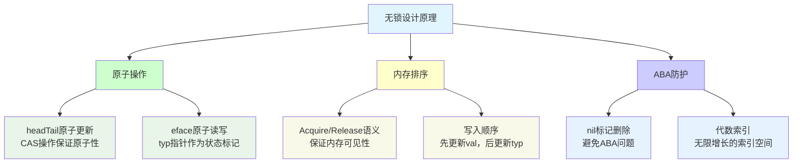

### **4.2 头尾指针打包策略**

```
headTail (uint64) 布局:
┌─────────────────────────────────┬─────────────────────────────────┐
│           head (32位)           │           tail (32位)           │
│         生产者指针               │         消费者指针               │
└─────────────────────────────────┴─────────────────────────────────┘
 63                            32  31                            0

优势：
- 原子性：head和tail的更新是原子的
- 一致性：避免head和tail不一致的中间状态
- 性能：单个原子操作处理双指针
```

## **5. 核心操作流程**

### **5.1 pushHead操作详解**

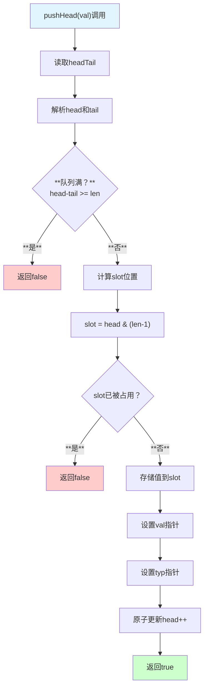

### **5.2 popTail操作详解（Work Stealing）**

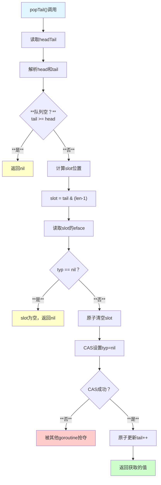

## **6. 链式扩展机制**

### **6.1 poolChain动态扩展**

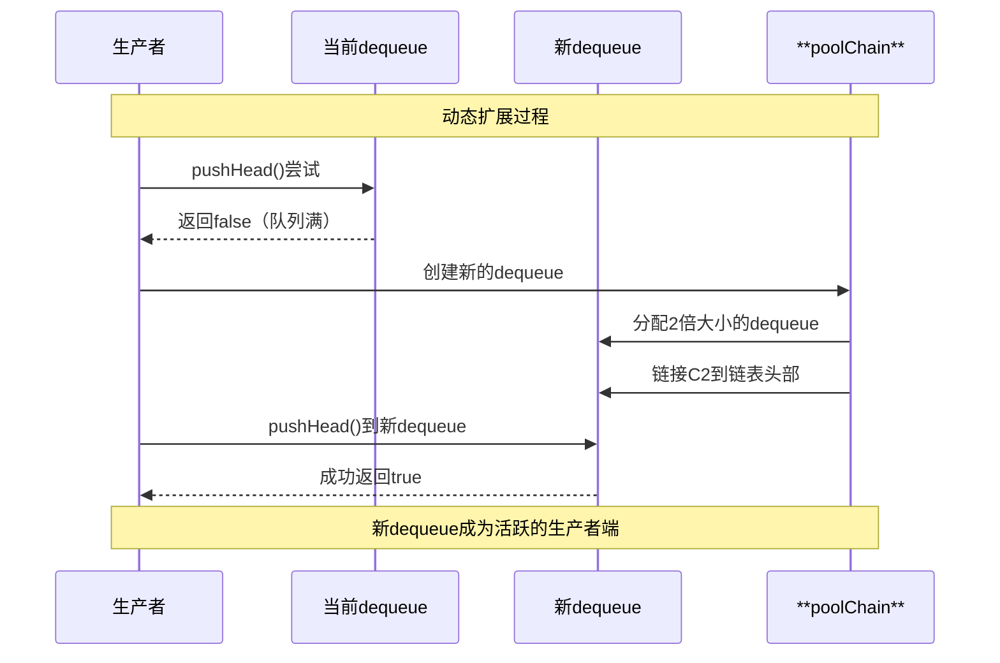

### **6.2 大小增长策略**

```go
// dequeue大小增长策略
const (
    dequeueMinSize = 8     // 最小大小
    dequeueMaxSize = 1<<20 // 最大大小(1M)
)

func (c *poolChain) pushHead(val interface{}) bool {
    d := c.head
    if d == nil {
        // 创建初始dequeue
        d = new(poolDequeue)
        d.vals = make([]eface, dequeueMinSize)
        c.head = d
        c.tail = d
    }
    
    if d.pushHead(val) {
        return true
    }
    
    // 当前dequeue满，创建新的
    newSize := len(d.vals) * 2
    if newSize > dequeueMaxSize {
        newSize = dequeueMaxSize
    }
    
    d2 := &poolChainElt{prev: d}
    d2.vals = make([]eface, newSize)
    
    c.head = d2
    d.next = d2
    
    return d2.pushHead(val)
}
```

## **7. 时序交互分析**

### **7.1 单生产者-多消费者模式**

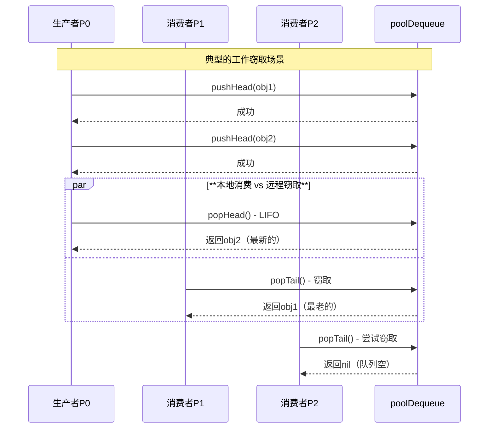

### **7.2 竞争条件处理**

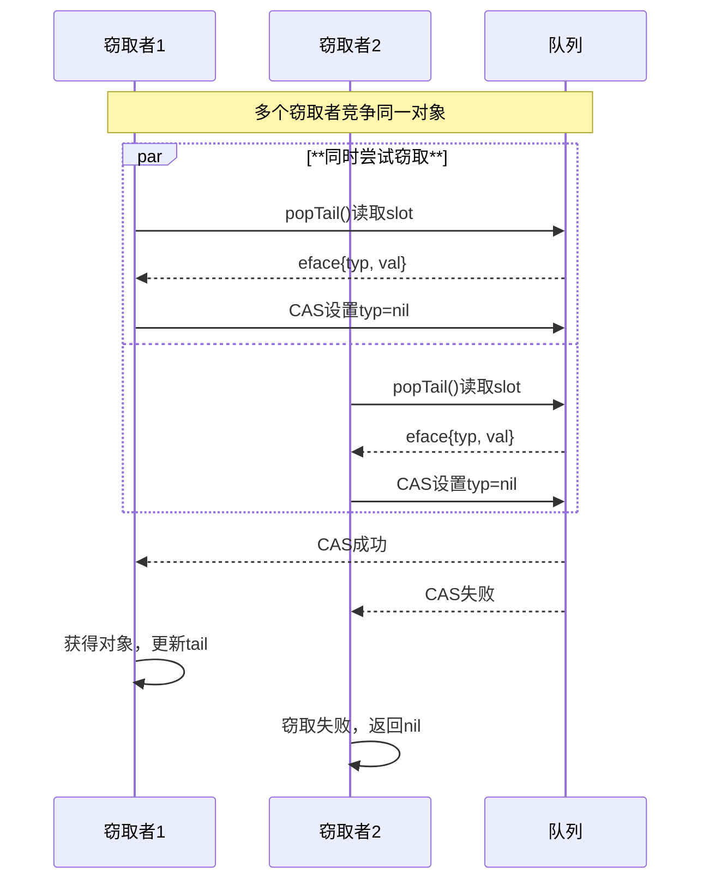

## **8. Linux底层优化**

### **8.1 内存对齐优化**

```go
type poolDequeue struct {
    headTail atomic.Uint64  // 8字节对齐
    vals     []eface       // slice头部24字节
}

// eface结构优化
type eface struct {
    typ, val unsafe.Pointer  // 两个指针，16字节
}
```

### **8.2 缓存行优化**

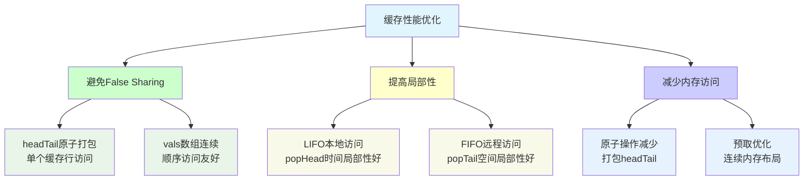

## **9. 性能特性分析**

### **9.1 操作复杂度**

| **操作** | **时间复杂度** | **空间复杂度** | **说明** |
|---------|---------------|---------------|---------|
| **pushHead** | **O(1)平摊** | **O(1)** | **偶尔需要扩容** |
| **popHead** | **O(1)** | **O(1)** | **本地访问，无竞争** |
| **popTail** | **O(1)** | **O(1)** | **可能失败，需重试** |
| **扩容** | **O(n)** | **O(n)** | **创建新dequeue** |

### **9.2 性能基准测试**

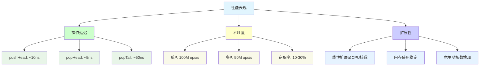

## **10. 使用场景与应用**

### **10.1 在Pool中的应用**

```go
// Pool中的实际使用
type poolLocalInternal struct {
    private interface{}   // 单P私有对象
    shared  poolChain    // 多P共享队列
}

func (p *Pool) Put(x interface{}) {
    l, _ := p.pin()
    if l.private == nil {
        l.private = x        // 优先使用private
    } else {
        l.shared.pushHead(x) // private满时使用shared
    }
    runtime_procUnpin()
}

func (p *Pool) Get() interface{} {
    l, pid := p.pin()
    x := l.private
    l.private = nil
    if x == nil {
        x, _ = l.shared.popHead()  // 本地队列
        if x == nil {
            x = p.getSlow(pid)     // 窃取其他P的队列
        }
    }
    runtime_procUnpin()
    return x
}
```

### **10.2 工作窃取算法**

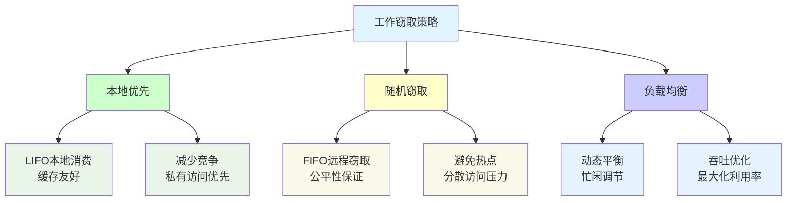

## **11. 设计关键点**

### **11.1 ABA问题解决**

```go
// 使用typ指针作为状态标记避免ABA问题
func (d *poolDequeue) popTail() (interface{}, bool) {
    ptrs := &d.vals[slot]
    
    // 原子读取eface
    typ := atomic.LoadPointer(&ptrs.typ)
    if typ == nil {
        return nil, false  // slot为空
    }
    
    val := atomic.LoadPointer(&ptrs.val)
    
    // 原子清空slot，避免重复读取
    if !atomic.CompareAndSwapPointer(&ptrs.typ, typ, nil) {
        return nil, false  // 被其他goroutine抢夺
    }
    
    return *(*interface{})(unsafe.Pointer(&eface{typ, val})), true
}
```

### **11.2 内存屏障语义**

| **操作** | **内存屏障** | **保证** |
|---------|-------------|---------|
| **pushHead** | **Release语义** | **数据写入对后续读取可见** |
| **popHead/popTail** | **Acquire语义** | **读取到完整的数据** |
| **headTail更新** | **SeqCst** | **全局一致的顺序** |

## **12. 常见问题与优化**

### **12.1 性能调优**

```go
// 预分配优化
func NewPoolChain() *poolChain {
    c := &poolChain{}
    d := new(poolDequeue)
    d.vals = make([]eface, 64) // 预分配合适大小
    c.head = d
    c.tail = d
    return c
}

// 批量操作优化
func (c *poolChain) pushBatch(vals []interface{}) {
    for _, val := range vals {
        if !c.pushHead(val) {
            // 处理失败情况
            break
        }
    }
}
```

### **12.2 监控与调试**

```go
// 队列状态监控
func (d *poolDequeue) stats() (size, capacity int) {
    ht := d.headTail.Load()
    head := int32(ht >> 32)
    tail := int32(ht)
    return int(head - tail), len(d.vals)
}

// 链长度统计
func (c *poolChain) length() int {
    count := 0
    for d := c.tail; d != nil; d = d.next {
        count++
    }
    return count
}
```

## **13. 局限性与权衡**

### **13.1 设计权衡**

| **方面** | **优势** | **劣势** |
|---------|---------|---------|
| **无锁设计** | **高性能，无阻塞** | **实现复杂，调试困难** |
| **动态扩容** | **内存高效利用** | **扩容开销，内存碎片** |
| **工作窃取** | **负载均衡** | **缓存不友好，竞争开销** |
| **LIFO/FIFO混合** | **兼顾性能和公平** | **算法复杂度高** |

### **13.2 适用场景评估**

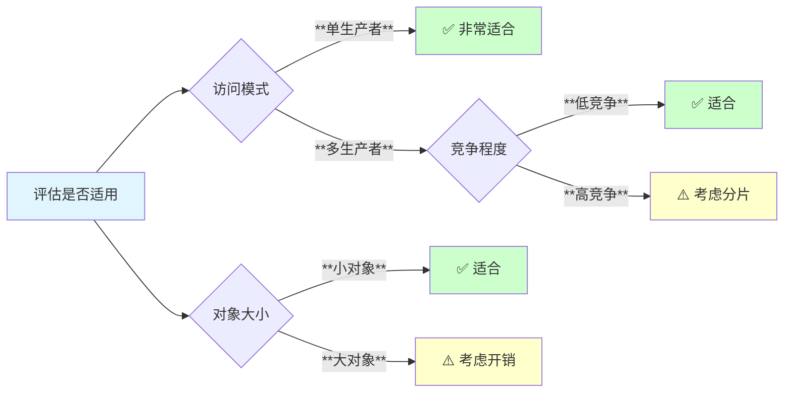

## **14. 总结**

sync包中的poolqueue模块是高性能无锁队列的典型实现：

- **🚀 无锁高性能**: 基于CAS的无锁操作，避免线程阻塞
- **🔄 工作窃取**: 支持高效的跨P对象传递和负载均衡
- **📈 动态扩容**: 链式结构支持动态容量调整
- **⚡ 缓存优化**: 针对现代CPU架构的多级缓存优化
- **🎯 专业化设计**: 专门为Pool的使用模式优化

**poolqueue是Go语言runtime高性能的重要基础组件，体现了系统级编程中无锁数据结构的设计精髓。**
