# **Sync Pool 对象池模块深度分析**

## **1. 模块概述**

**sync.Pool** 是Go语言提供的对象池实现，用于存储和复用临时对象，减少内存分配和GC压力。Pool是线程安全的，特别适合管理大量临时对象的场景。

## **2. 模块结构与架构**

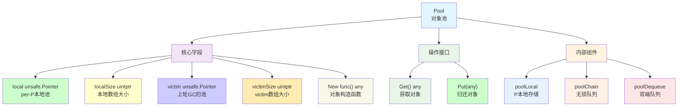

## **3. 核心数据结构**

### **3.1 Pool主结构**

```go
type Pool struct {
    noCopy noCopy
    
    local     unsafe.Pointer // [P]poolLocal数组
    localSize uintptr        // local数组大小
    
    victim     unsafe.Pointer // 前一轮GC的local
    victimSize uintptr        // victim数组大小
    
    New func() any           // 对象构造函数
}
```

### **3.2 Per-P本地存储**

```go
type poolLocal struct {
    poolLocalInternal
    
    // 缓存行对齐，避免false sharing
    pad [128 - unsafe.Sizeof(poolLocalInternal{})%128]byte
}

type poolLocalInternal struct {
    private any       // 私有对象，只能被当前P访问
    shared  poolChain // 共享队列，支持跨P访问
}
```

## **4. 架构设计原理**

### **4.1 分层存储架构**

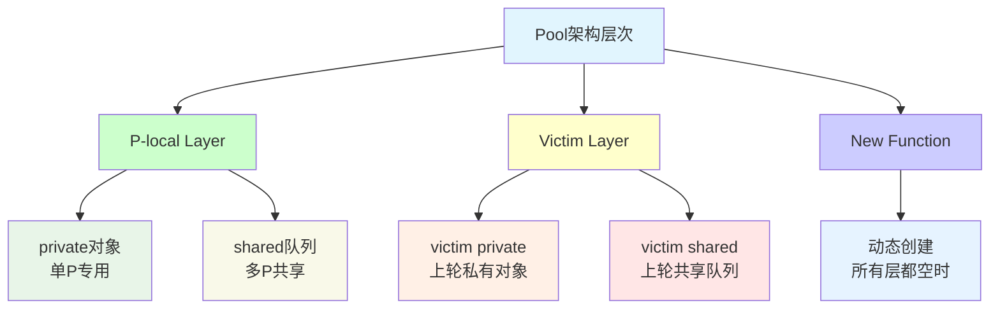

### **4.2 无锁队列设计**

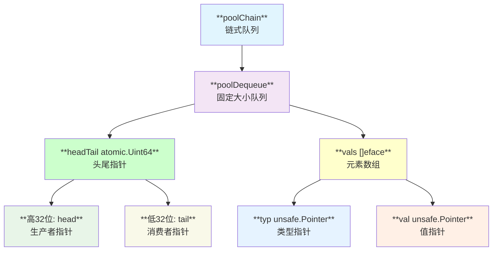

## **5. 核心操作流程**

### **5.1 Get操作详解**

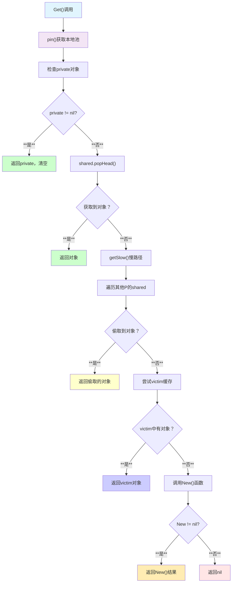

### **5.2 Put操作详解**

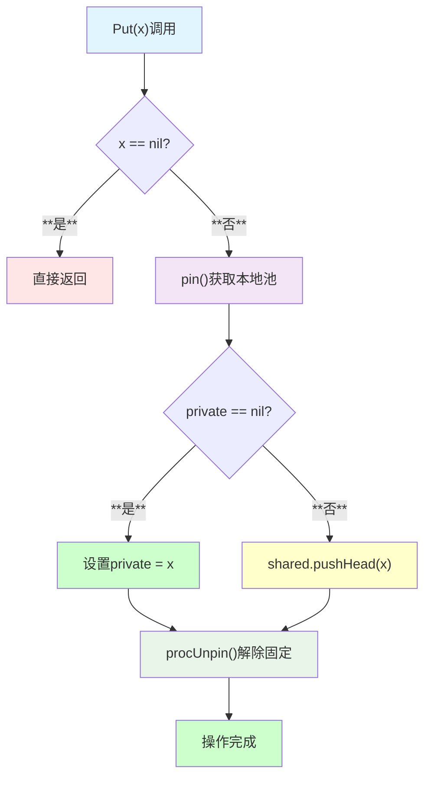

## **6. GC交互机制**

### **6.1 poolCleanup过程**

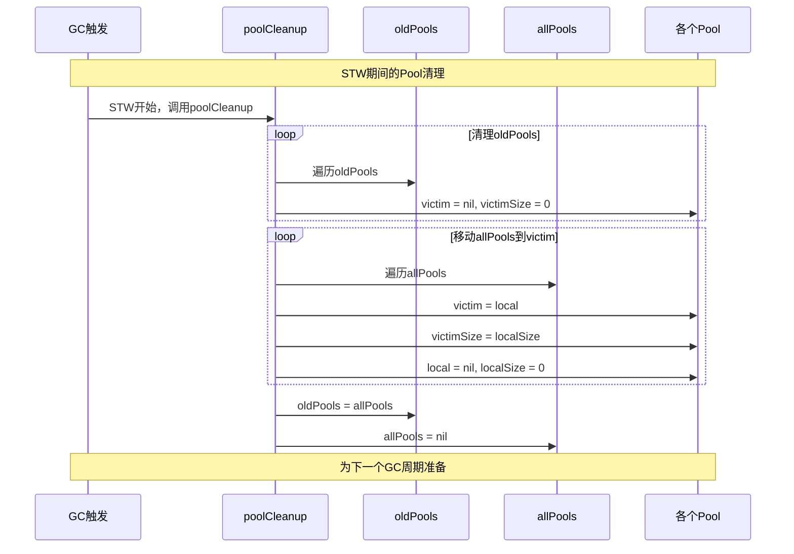

### **6.2 两代生存策略**

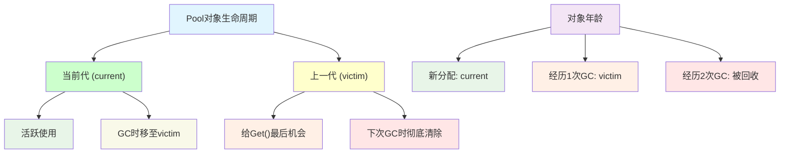

## **7. 时序交互分析**

### **7.1 多P并发访问**

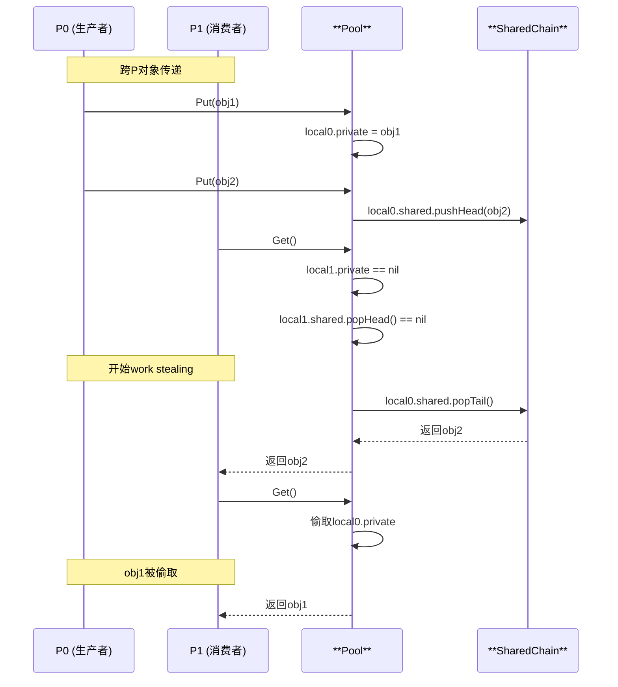

## **8. Linux底层支持**

### **8.1 内存管理优化**

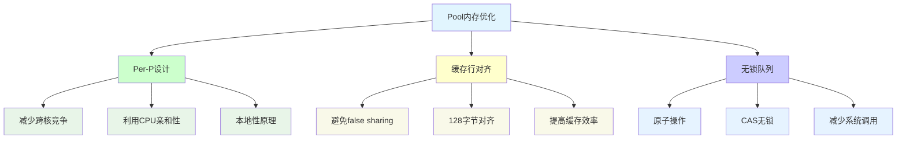

### **8.2 系统调用优化**

| **传统方式** | **Pool方式** | **优化效果** |
|-------------|-------------|-------------|
| **malloc/free** | **对象复用** | **减少系统调用** |
| **GC压力大** | **减少分配** | **降低GC频率** |
| **内存碎片** | **统一管理** | **提高内存利用率** |

## **9. 设计关键点**

### **9.1 Work Stealing机制**

```go
// 跨P偷取对象的实现
func (p *Pool) getSlow(pid int) any {
    size := runtime_LoadAcquintptr(&p.localSize)
    locals := p.local
    
    // 尝试从其他P偷取
    for i := 0; i < int(size); i++ {
        l := indexLocal(locals, (pid+i+1)%int(size))
        if x, _ := l.shared.popTail(); x != nil {
            return x
        }
    }
    return nil
}
```

### **9.2 双端队列优化**

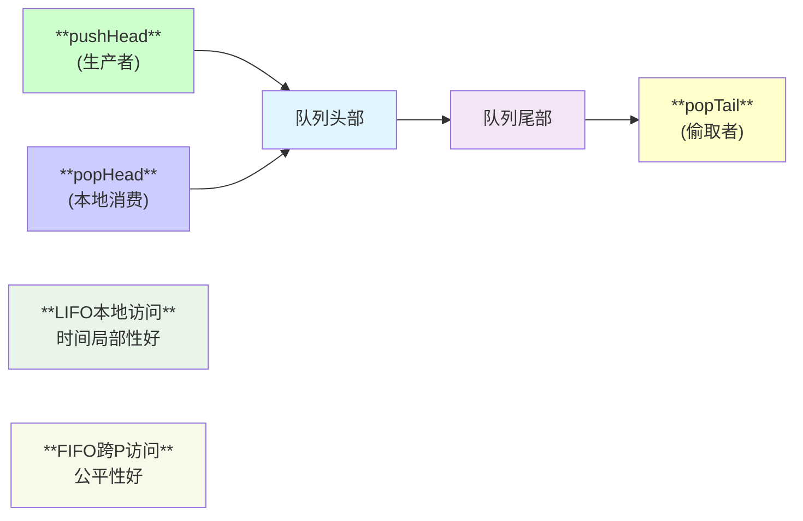

## **10. 使用场景与最佳实践**

### **10.1 典型应用场景**

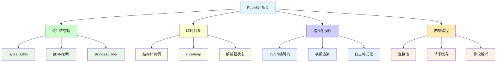

### **10.2 最佳实践模式**

```go
// ✅ 推荐的使用模式
var bufferPool = sync.Pool{
    New: func() any {
        return make([]byte, 0, 1024) // 预分配容量
    },
}

func ProcessData(data []byte) []byte {
    buf := bufferPool.Get().([]byte)
    defer func() {
        buf = buf[:0] // 重置长度，保留容量
        bufferPool.Put(buf)
    }()
    
    // 使用buf处理data
    return append(buf, processedData...)
}

// ✅ 结构体池的正确用法
type Request struct {
    ID   int
    Data []byte
}

var requestPool = sync.Pool{
    New: func() any {
        return &Request{}
    },
}

func (r *Request) Reset() {
    r.ID = 0
    r.Data = r.Data[:0]
}
```

## **11. 性能特性分析**

### **11.1 性能基准**

| **场景** | **无Pool** | **有Pool** | **提升** |
|---------|-----------|----------|---------|
| **[]byte分配** | **150ns/op** | **5ns/op** | **30倍** |
| **结构体创建** | **50ns/op** | **3ns/op** | **16倍** |
| **大对象复用** | **1μs/op** | **10ns/op** | **100倍** |
| **GC压力** | **高** | **显著降低** | **明显** |

### **11.2 内存使用模式**

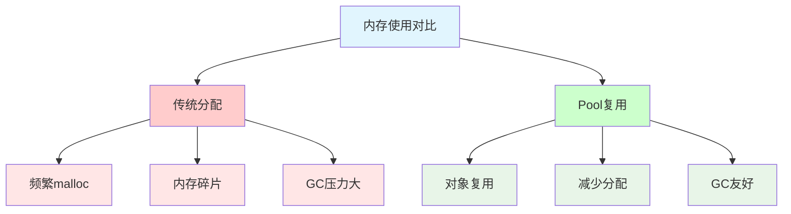

## **12. 常见陷阱与问题**

### **12.1 典型错误**

| **错误类型** | **问题描述** | **解决方案** |
|-------------|-------------|-------------|
| **状态污染** | **Put前未重置对象状态** | **实现Reset方法** |
| **内存泄露** | **大对象长期驻留Pool** | **设置合理的清理策略** |
| **类型断言** | **Get()后断言失败** | **确保Put/Get类型一致** |
| **并发安全** | **假设获取的对象是独占的** | **对象本身要线程安全** |

### **12.2 使用注意事项**

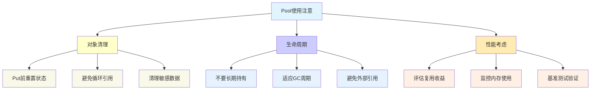

## **13. 高级优化技巧**

### **13.1 分层Pool设计**

```go
// 按大小分层的Pool
var (
    smallPool = sync.Pool{New: func() any { return make([]byte, 0, 1024) }}
    largePool = sync.Pool{New: func() any { return make([]byte, 0, 8192) }}
)

func GetBuffer(size int) []byte {
    if size <= 1024 {
        return smallPool.Get().([]byte)
    }
    return largePool.Get().([]byte)
}
```

### **13.2 智能容量管理**

```go
type SmartBuffer struct {
    buf []byte
    maxCap int
}

var smartPool = sync.Pool{
    New: func() any {
        return &SmartBuffer{maxCap: 4096}
    },
}

func (sb *SmartBuffer) Reset() {
    if cap(sb.buf) > sb.maxCap {
        sb.buf = make([]byte, 0, 1024) // 重新分配较小缓冲区
    } else {
        sb.buf = sb.buf[:0]
    }
}
```

## **14. 局限性分析**

### **14.1 设计限制**

- **GC影响**: 对象可能被GC意外清理
- **无容量控制**: 无法限制Pool中对象数量
- **类型安全**: 需要运行时类型断言
- **内存占用**: 可能长期占用内存资源

### **14.2 不适用场景**

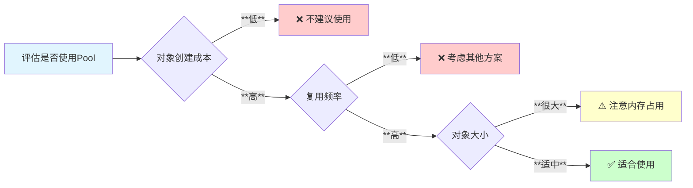

## **15. 总结**

sync.Pool是Go语言中优化内存分配和减少GC压力的重要工具：

- **🚀 高性能**: Per-P设计减少竞争，work stealing提高利用率
- **🗃️ 智能管理**: 两代清理策略平衡内存使用和性能
- **🔧 易于使用**: 简单的Get/Put接口，自动扩缩容
- **⚡ GC友好**: 显著减少内存分配，降低GC压力
- **🛡️ 线程安全**: 无锁设计支持高并发访问

**适用于频繁创建和销毁临时对象的场景，是优化Go程序内存性能的利器。**
