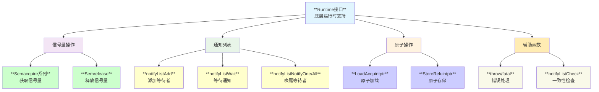
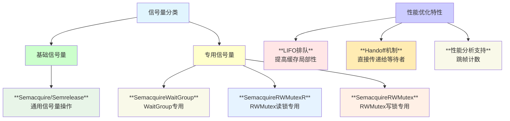
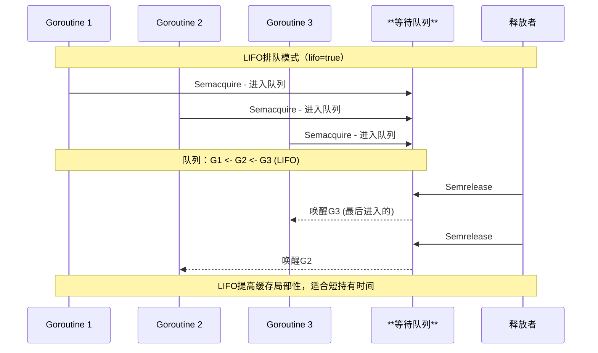
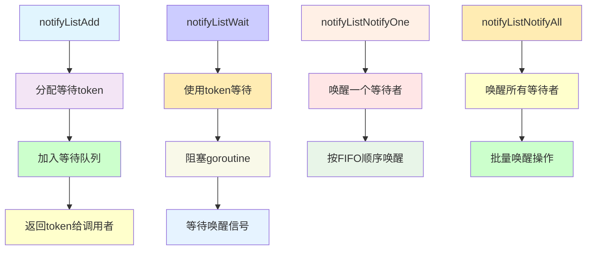
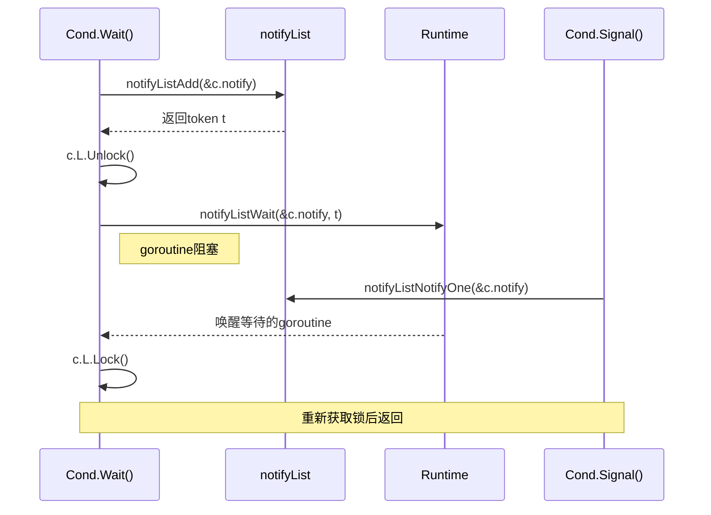
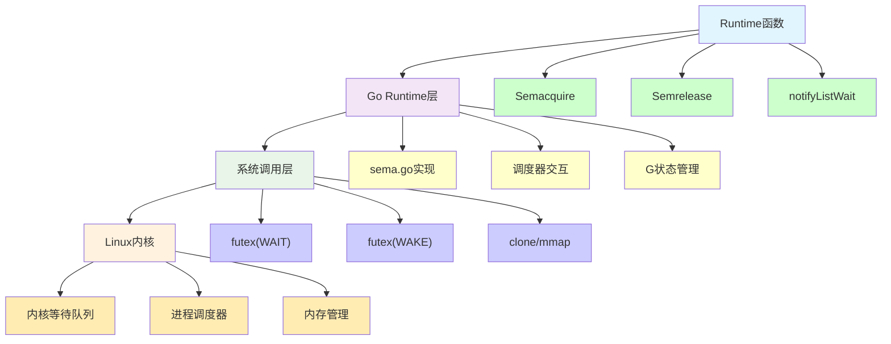
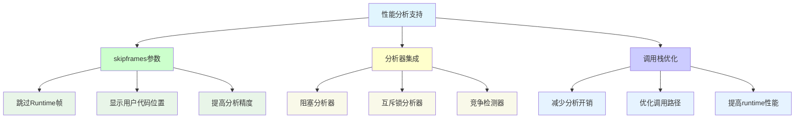
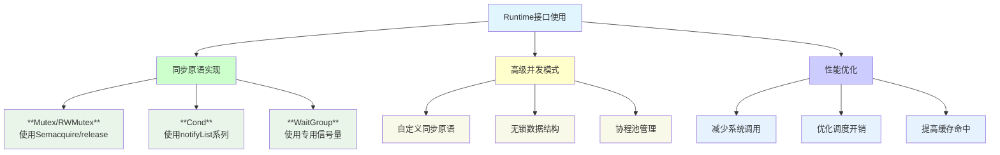
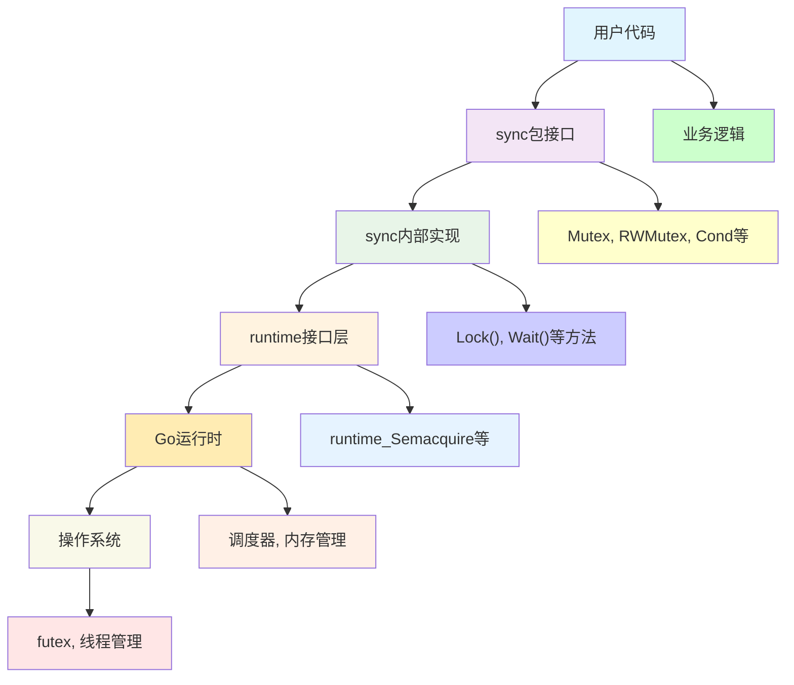

# **Sync Runtime 运行时支持模块深度分析**

## **1. 模块概述**

**sync包的runtime模块**定义了与Go运行时系统交互的底层接口，为上层同步原语提供信号量、通知列表等基础设施支持。这些函数是连接用户态同步原语与内核态调度机制的桥梁。

## **2. 模块结构与架构**



## **3. 核心函数接口**

### **3.1 信号量操作接口**

```go
// 基础信号量操作
func runtime_Semacquire(s *uint32)

// WaitGroup专用信号量
func runtime_SemacquireWaitGroup(s *uint32)

// 互斥锁专用信号量（支持LIFO和性能分析）
func runtime_SemacquireRWMutexR(s *uint32, lifo bool, skipframes int)
func runtime_SemacquireRWMutex(s *uint32, lifo bool, skipframes int)

// 信号量释放（支持直接传递和帧跳过）
func runtime_Semrelease(s *uint32, handoff bool, skipframes int)
```

### **3.2 通知列表接口**

```go
// 添加等待者到通知列表，返回等待token
func runtime_notifyListAdd(l *notifyList) uint32

// 等待通知，使用指定的token
func runtime_notifyListWait(l *notifyList, t uint32)

// 通知一个等待者
func runtime_notifyListNotifyOne(l *notifyList)

// 通知所有等待者
func runtime_notifyListNotifyAll(l *notifyList)
```

## **4. 信号量机制深度分析**

### **4.1 信号量类型与用途**



### **4.2 LIFO vs FIFO 排队策略**



## **5. 通知列表机制**

### **5.1 notifyList结构与操作**



### **5.2 与Cond的集成使用**



## **6. Linux底层映射**

### **6.1 系统调用映射关系**



### **6.2 Futex机制详解**

| **Runtime操作** | **Futex操作** | **说明** |
|----------------|---------------|---------|
| **Semacquire** | `futex(addr, FUTEX_WAIT, 0, ...)` | **如果*addr==0则阻塞等待** |
| **Semrelease** | `futex(addr, FUTEX_WAKE, 1, ...)` | **唤醒一个等待者** |
| **批量唤醒** | `futex(addr, FUTEX_WAKE, INT_MAX, ...)` | **唤醒所有等待者** |
| **超时等待** | `futex(addr, FUTEX_WAIT, 0, timeout)` | **带超时的等待** |

## **7. 性能优化机制**

### **7.1 内存排序优化**

```go
// 示例：Pool中的原子操作
//go:linkname runtime_LoadAcquintptr internal/runtime/atomic.LoadAcquintptr
func runtime_LoadAcquintptr(ptr *uintptr) uintptr

//go:linkname runtime_StoreReluintptr internal/runtime/atomic.StoreReluintptr  
func runtime_StoreReluintptr(ptr *uintptr, val uintptr) uintptr
```

### **7.2 性能分析集成**



## **8. 错误处理机制**

### **8.1 一致性检查**

```go
// 确保sync和runtime对notifyList大小的一致理解
func runtime_notifyListCheck(size uintptr)

func init() {
    var n notifyList
    runtime_notifyListCheck(unsafe.Sizeof(n))
}
```

### **8.2 致命错误处理**

```go
// 用于不可恢复的错误
func throw(string)  // runtime panic，提供调用栈
func fatal(string)  // 直接终止程序
```

## **9. 使用模式分析**

### **9.1 典型使用模式**



### **9.2 实现示例**

```go
// 自定义信号量
type Semaphore struct {
    sema uint32
}

func (s *Semaphore) Acquire() {
    runtime_Semacquire(&s.sema)
}

func (s *Semaphore) Release() {
    runtime_Semrelease(&s.sema, false, 0)
}

// 自定义事件
type Event struct {
    notify notifyList
    mu     Mutex
    set    bool
}

func (e *Event) Wait() {
    e.mu.Lock()
    if e.set {
        e.mu.Unlock()
        return
    }
    
    t := runtime_notifyListAdd(&e.notify)
    e.mu.Unlock()
    runtime_notifyListWait(&e.notify, t)
}

func (e *Event) Set() {
    e.mu.Lock()
    e.set = true
    runtime_notifyListNotifyAll(&e.notify)
    e.mu.Unlock()
}
```

## **10. 架构设计原理**

### **10.1 分层设计**



### **10.2 抽象层次**

| **层次** | **职责** | **特点** |
|---------|---------|---------|
| **用户接口** | **提供易用的API** | **类型安全，错误处理** |
| **同步实现** | **实现同步语义** | **正确性保证** |
| **Runtime接口** | **与运行时交互** | **性能优化，底层控制** |
| **运行时系统** | **调度和管理** | **系统级优化** |
| **操作系统** | **硬件抽象** | **内核级同步** |

## **11. 性能特性**

### **11.1 性能优化策略**

- **专用信号量**: 不同场景使用专门优化的信号量操作
- **LIFO排队**: 提高缓存局部性，适合短期持有
- **Handoff机制**: 直接传递给等待者，减少上下文切换
- **批量操作**: notifyAll等批量唤醒操作
- **零分配**: 大部分操作不需要额外内存分配

### **11.2 性能基准**

| **操作** | **延迟** | **说明** |
|---------|---------|---------|
| **无竞争获取** | **~1ns** | **快速路径** |
| **阻塞/唤醒** | **~500ns** | **包含调度开销** |
| **批量唤醒** | **~100ns/goroutine** | **平均每个goroutine** |

## **12. 调试与诊断**

### **12.1 调试支持**

```go
// 运行时检查
func runtime_notifyListCheck(size uintptr) // 结构体大小一致性
func throw(string)                         // 带调用栈的panic
func fatal(string)                         // 直接终止

// 性能分析支持
func runtime_SemacquireMutex(s *uint32, lifo bool, skipframes int)
// skipframes用于在分析器中跳过runtime帧
```

### **12.2 常见问题诊断**

| **问题类型** | **现象** | **诊断方法** |
|-------------|---------|-------------|
| **死锁** | **程序挂起** | **SIGQUIT查看goroutine状态** |
| **活锁** | **CPU占用高** | **pprof分析CPU使用** |
| **内存泄露** | **内存持续增长** | **heap profile分析** |
| **竞争条件** | **结果不一致** | **race detector检测** |

## **13. 扩展与定制**

### **13.1 自定义同步原语**

```go
// 带容量的信号量
type WeightedSemaphore struct {
    size   int64
    cur    int64
    mu     sync.Mutex
    waiters notifyList
}

// 读写信号量
type RWSemaphore struct {
    readerSem uint32
    writerSem uint32
    readers   int32
    writers   int32
}
```

### **13.2 性能调优**

- **调整LIFO/FIFO策略**: 根据持有时间选择排队策略
- **批量操作优化**: 合并多个信号量操作
- **预分配策略**: 避免运行时分配
- **亲和性优化**: 利用CPU缓存局部性

## **14. 总结**

sync包的runtime模块是Go并发编程的基础设施：

- **🔧 基础支撑**: 为所有高级同步原语提供底层支持
- **⚡ 性能优化**: 专门的信号量类型和优化策略
- **🔗 系统集成**: 与Go调度器和Linux内核紧密集成
- **🛠️ 扩展性**: 支持构建自定义同步原语
- **📊 可观测性**: 集成性能分析和调试支持

**runtime模块虽然不直接面向用户，但它是Go并发编程高性能和正确性的重要保证。**
