# **Sync RWMutex 读写锁模块深度分析**

## **1. 模块概述**

**sync.RWMutex** 是Go语言提供的读写互斥锁，允许多个reader同时访问共享资源，但writer独占访问。它在读多写少的场景下能显著提升性能，是对传统互斥锁的重要补充。

## **2. 模块结构与架构**

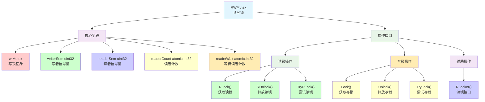

## **3. 核心数据结构**

### **3.1 RWMutex结构定义**

```go
type RWMutex struct {
    w           Mutex        // 写者互斥锁
    writerSem   uint32       // 写者等待信号量
    readerSem   uint32       // 读者等待信号量  
    readerCount atomic.Int32 // 活跃读者数量
    readerWait  atomic.Int32 // 需要等待的读者数量
}

const rwmutexMaxReaders = 1 << 30 // 最大读者数量
```

### **3.2 状态表示机制**

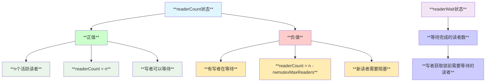

## **4. 读锁操作流程**

### **4.1 RLock实现分析**

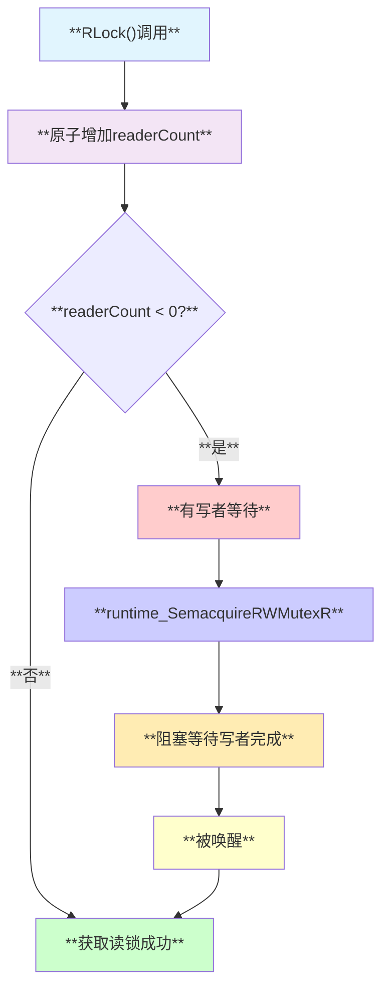

### **4.2 RUnlock实现分析**

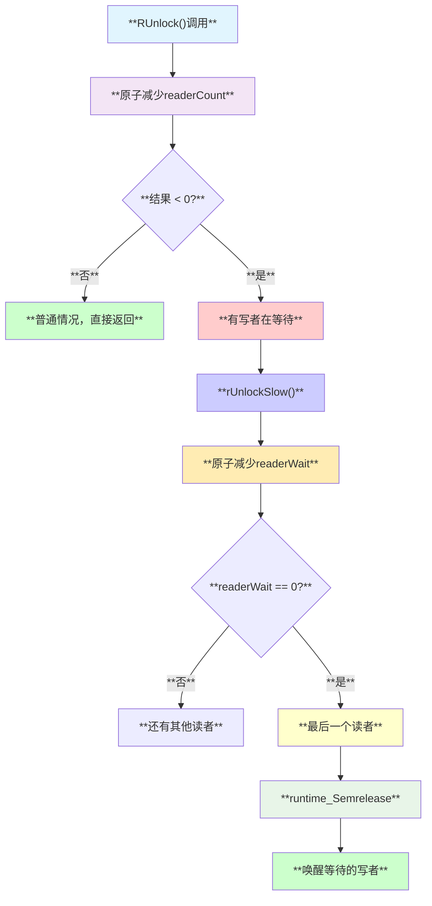

## **5. 写锁操作流程**

### **5.1 Lock实现分析**

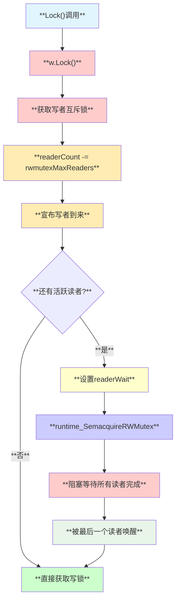

### **5.2 Unlock实现分析**

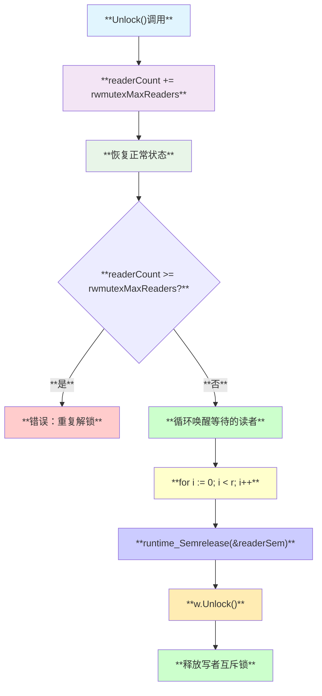

## **6. 时序交互分析**

### **6.1 读者优先场景**

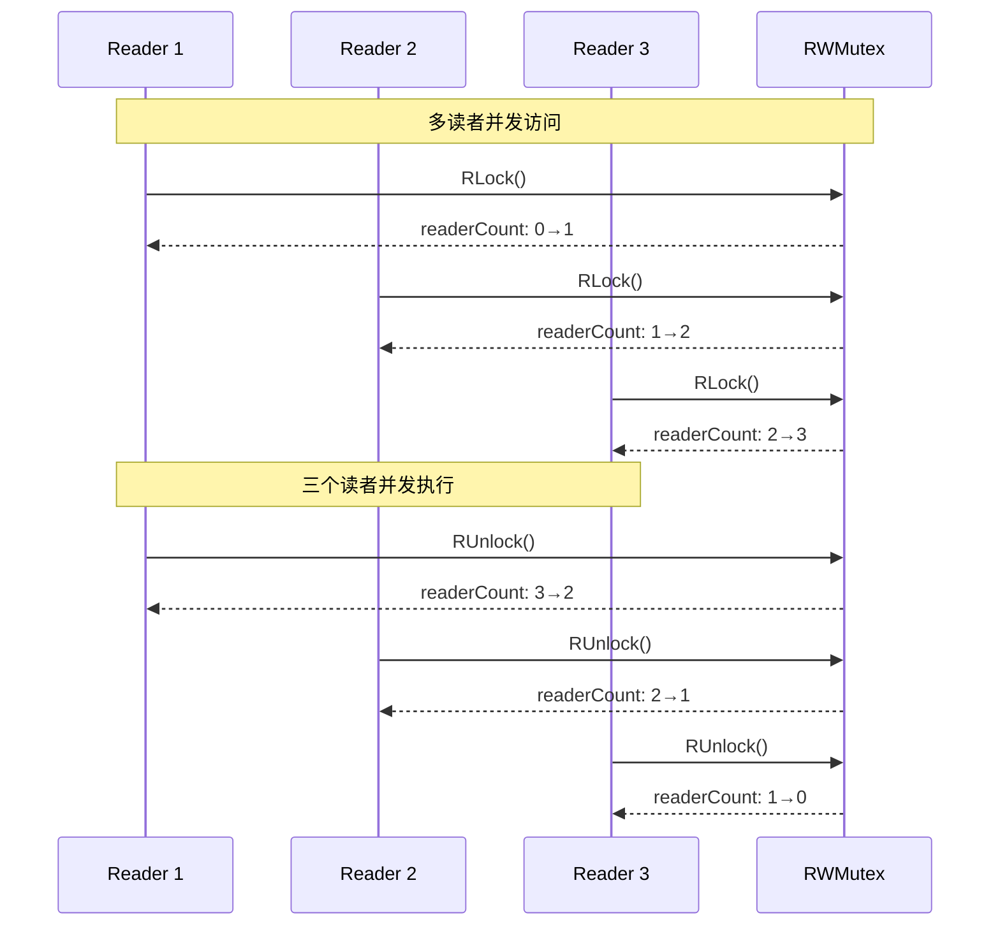

### **6.2 写者等待场景**

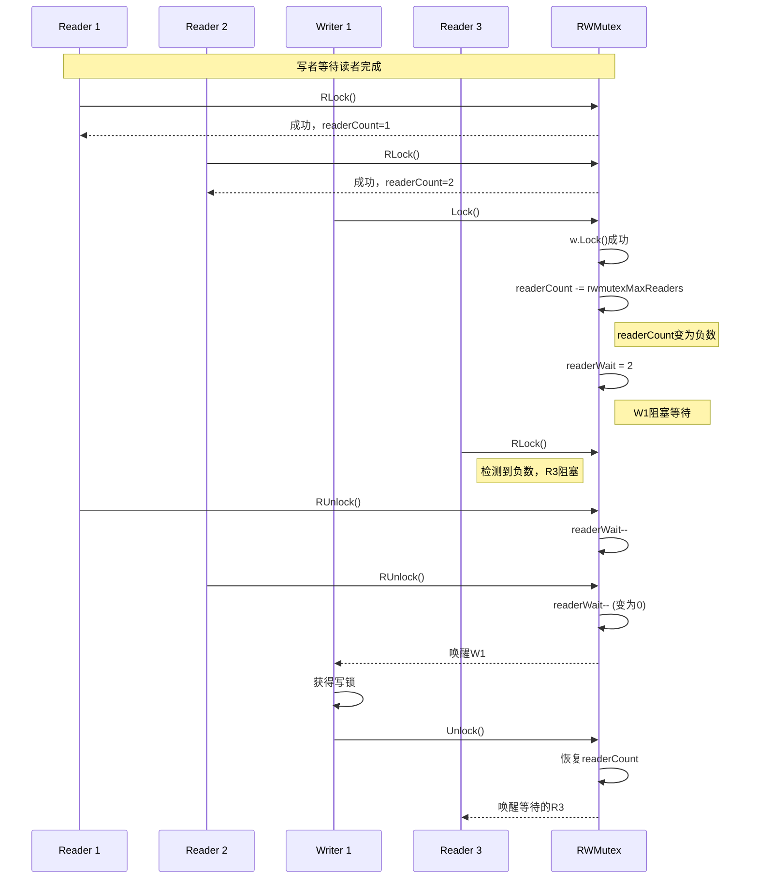

## **7. Linux底层支持机制**

### **7.1 信号量机制映射**

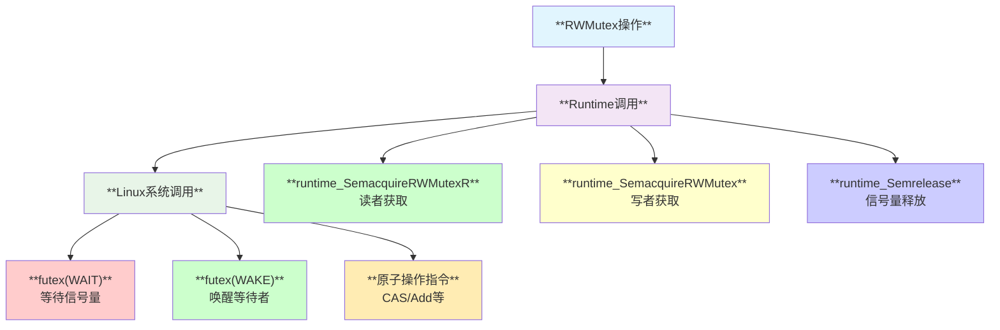

### **7.2 内存屏障保证**

| **操作** | **内存屏障** | **作用** |
|---------|-------------|----------|
| **RLock** | **Acquire语义** | **读操作不会被重排到加锁前** |
| **RUnlock** | **Release语义** | **读操作不会被重排到解锁后** |
| **Lock** | **Acquire语义** | **写操作不会被重排到加锁前** |
| **Unlock** | **Release语义** | **写操作不会被重排到解锁后** |

## **8. 设计关键点**

### **8.1 写者饥饿防护**

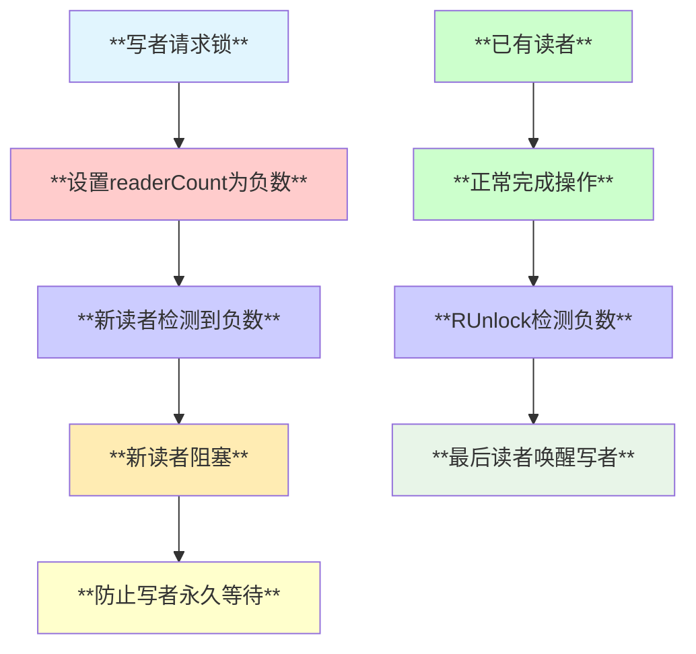

### **8.2 性能优化策略**

- **快速路径**: 无写者时读锁只需一次原子操作
- **批量唤醒**: 写者释放时一次性唤醒所有等待读者
- **分离信号量**: 读者和写者使用不同信号量，减少竞争

### **8.3 竞态条件处理**

```go
// 关键的原子操作序列
func (rw *RWMutex) RLock() {
    if rw.readerCount.Add(1) < 0 {
        // 写者在等待，当前读者需要阻塞
        runtime_SemacquireRWMutexR(&rw.readerSem, false, 0)
    }
}
```

## **9. 适用场景分析**

### **9.1 最佳使用场景**

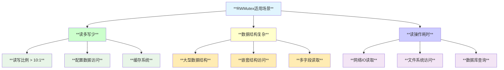

### **9.2 性能对比**

| **场景** | **Mutex** | **RWMutex** | **性能提升** |
|---------|----------|------------|-------------|
| **纯读操作** | **串行化** | **并行化** | **N倍(N=读者数)** |
| **读写混合(10:1)** | **全部串行** | **读并行** | **5-8倍** |
| **纯写操作** | **高性能** | **额外开销** | **略降低** |
| **写密集(1:1)** | **更简单** | **复杂度高** | **可能降低** |

## **10. 高级特性**

### **10.1 TryLock系列**

```go
// 非阻塞尝试获取读锁
func (rw *RWMutex) TryRLock() bool {
    for {
        c := rw.readerCount.Load()
        if c < 0 { // 有写者等待
            return false
        }
        if rw.readerCount.CompareAndSwap(c, c+1) {
            return true
        }
    }
}
```

### **10.2 RLocker接口**

```go
// 返回读锁的Locker接口
func (rw *RWMutex) RLocker() Locker {
    return (*rlocker)(rw)
}

type rlocker RWMutex
func (r *rlocker) Lock()   { (*RWMutex)(r).RLock() }
func (r *rlocker) Unlock() { (*RWMutex)(r).RUnlock() }
```

## **11. 常见陷阱与最佳实践**

### **11.1 常见陷阱**

| **陷阱类型** | **具体表现** | **解决方案** |
|-------------|-------------|-------------|
| **嵌套读锁** | **递归调用RLock导致死锁** | **重构代码避免嵌套** |
| **升级锁** | **读锁升级为写锁死锁** | **先释放读锁再获取写锁** |
| **长时间持有** | **读锁持有时间过长** | **缩小临界区范围** |
| **错误配对** | **RLock配RUnlock错误** | **严格配对使用** |

### **11.2 最佳实践**

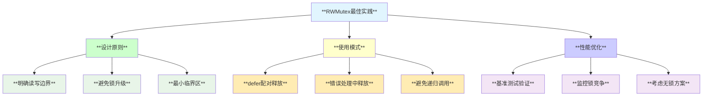

## **12. 局限性分析**

### **12.1 设计局限**

- **写者优先**: 一旦有写者等待，新读者被阻塞
- **不可重入**: 同goroutine内不能重复获取同类型锁
- **复制敏感**: 包含Mutex，复制后会产生独立实例
- **内存开销**: 相比Mutex有额外的字段开销

### **12.2 性能边界**

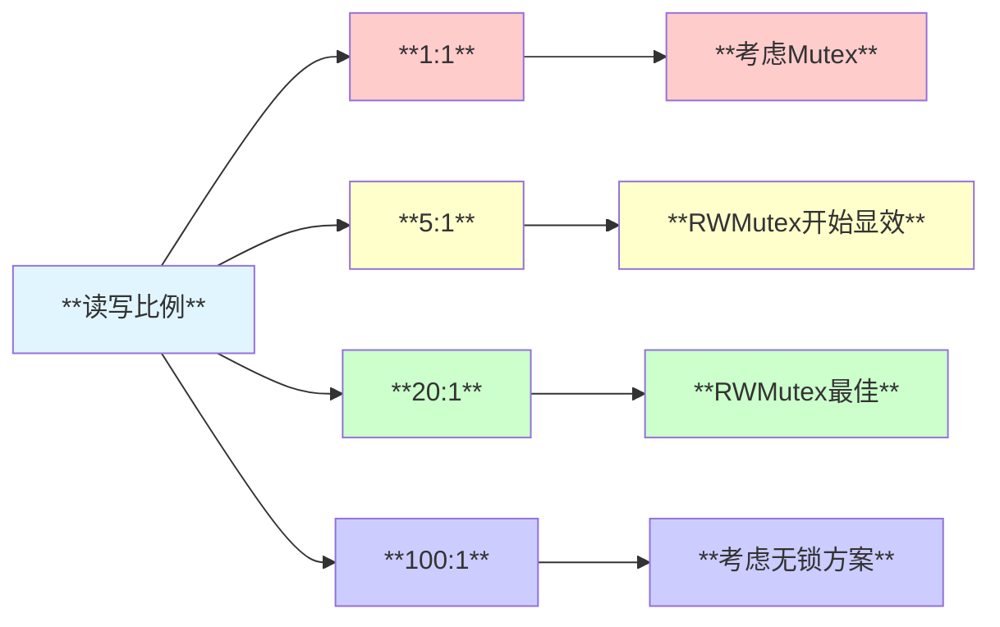

## **13. 总结**

sync.RWMutex是Go语言中专门为读多写少场景设计的高效同步原语：

- **🔄 并发读取**: 多个goroutine可同时获取读锁
- **🔒 独占写入**: 写锁与所有锁互斥
- **⚖️ 写者保护**: 防止写者被大量读者饥饿
- **⚡ 性能优化**: 读多场景下显著提升并发性能
- **🛡️ 安全保证**: 严格的内存屏障和竞态保护

**适用于读操作远多于写操作的场景，能够显著提升系统整体并发性能。**
