# **Sync WaitGroup 等待组模块深度分析**

## **1. 模块概述**

**sync.WaitGroup** 是Go语言中用于等待一组goroutine完成执行的同步原语。它提供了一种简单而强大的机制来协调多个并发任务的完成，常用于fork-join并发模式。

## **2. 模块结构与架构**

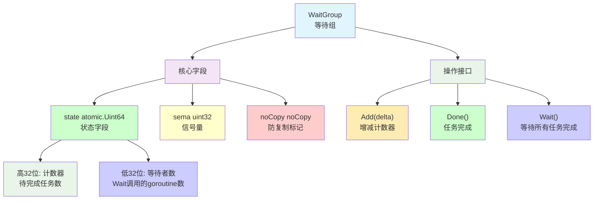

## **3. 核心数据结构**

### **3.1 WaitGroup结构定义**

```go
type WaitGroup struct {
    noCopy noCopy
    
    // 64位状态字段：高32位为计数器，低32位为等待者数量
    state atomic.Uint64
    sema  uint32          // 信号量，用于阻塞Wait调用
}
```

### **3.2 状态字段布局**

```
state (uint64) 位布局:
┌─────────────────────────────────┬─────────────────────────────────┐
│        计数器 (32 bits)          │        等待者数 (32 bits)        │
│         Counter                │         Waiters               │
└─────────────────────────────────┴─────────────────────────────────┘
 63                            32  31                            0
```

## **4. 核心操作流程**

### **4.1 Add操作详解**

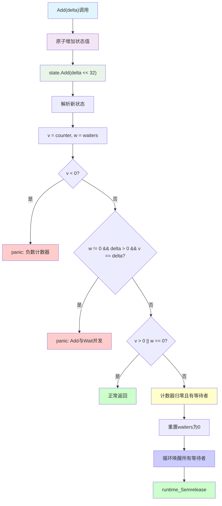

### **4.2 Wait操作详解**

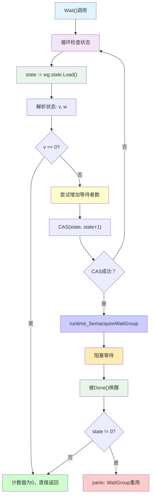

### **4.3 Done操作实现**

```go
func (wg *WaitGroup) Done() {
    wg.Add(-1)  // 简单委托给Add(-1)
}
```

## **5. 时序交互分析**

### **5.1 典型使用时序**

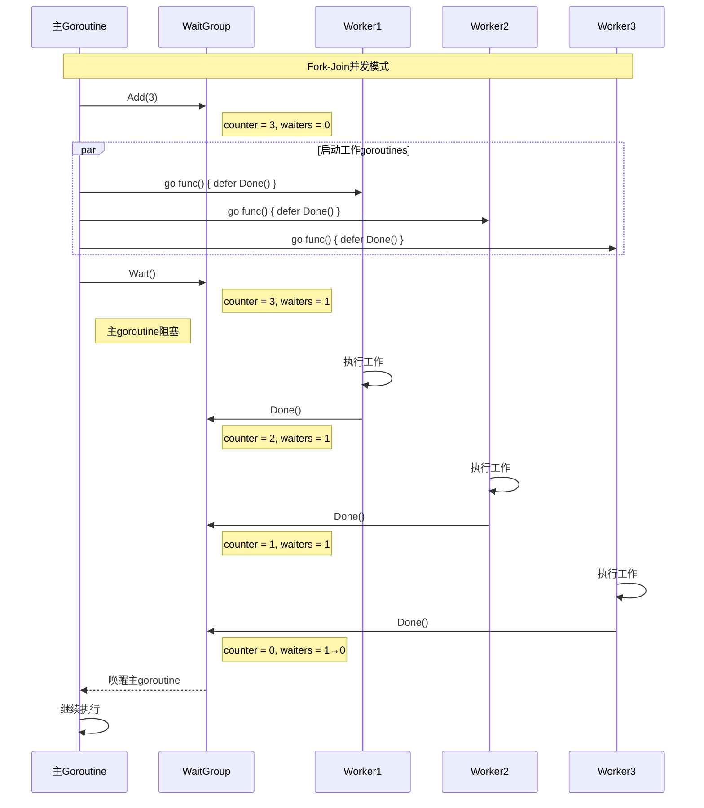

### **5.2 多等待者场景**

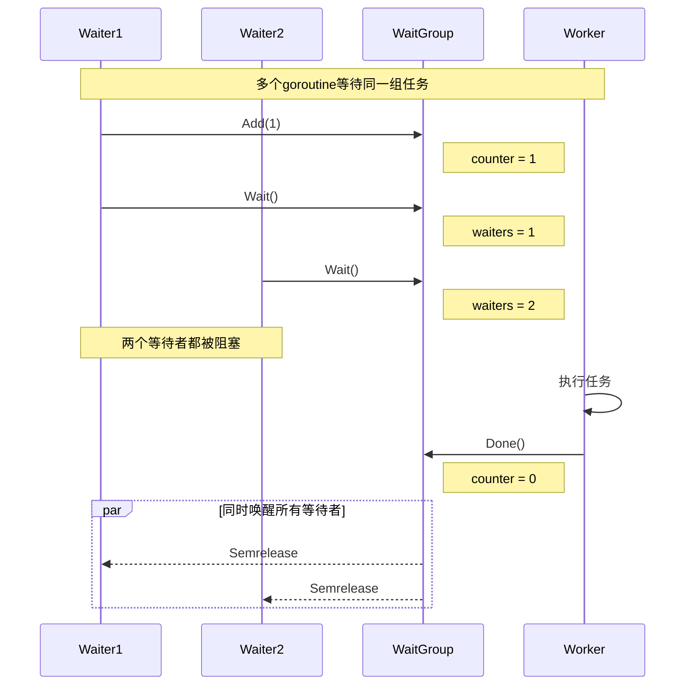

## **6. Linux底层支持机制**

### **6.1 系统调用映射**

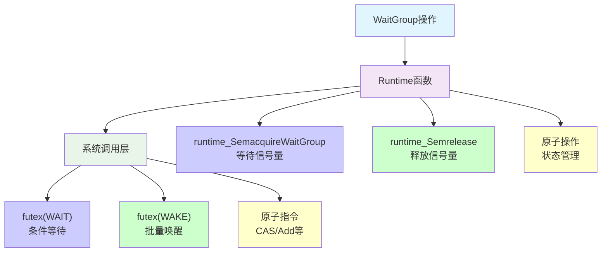

### **6.2 内存屏障保证**

| **操作** | **内存屏障** | **保证** |
|---------|-------------|----------|
| **Add** | **Release屏障** | **工作完成对Wait可见** |
| **Wait** | **Acquire屏障** | **看到所有Done操作** |
| **Done** | **Release屏障** | **工作结果对后续代码可见** |

## **7. 设计关键点**

### **7.1 原子状态管理**

```go
// 巧妙的64位状态字段设计
type WaitGroup struct {
    state atomic.Uint64  // 高32位计数器 + 低32位等待者数
    sema  uint32        // 信号量
}

// 状态解析
state := wg.state.Load()
v := int32(state >> 32)  // 计数器
w := uint32(state)       // 等待者数量
```

### **7.2 竞态条件处理**

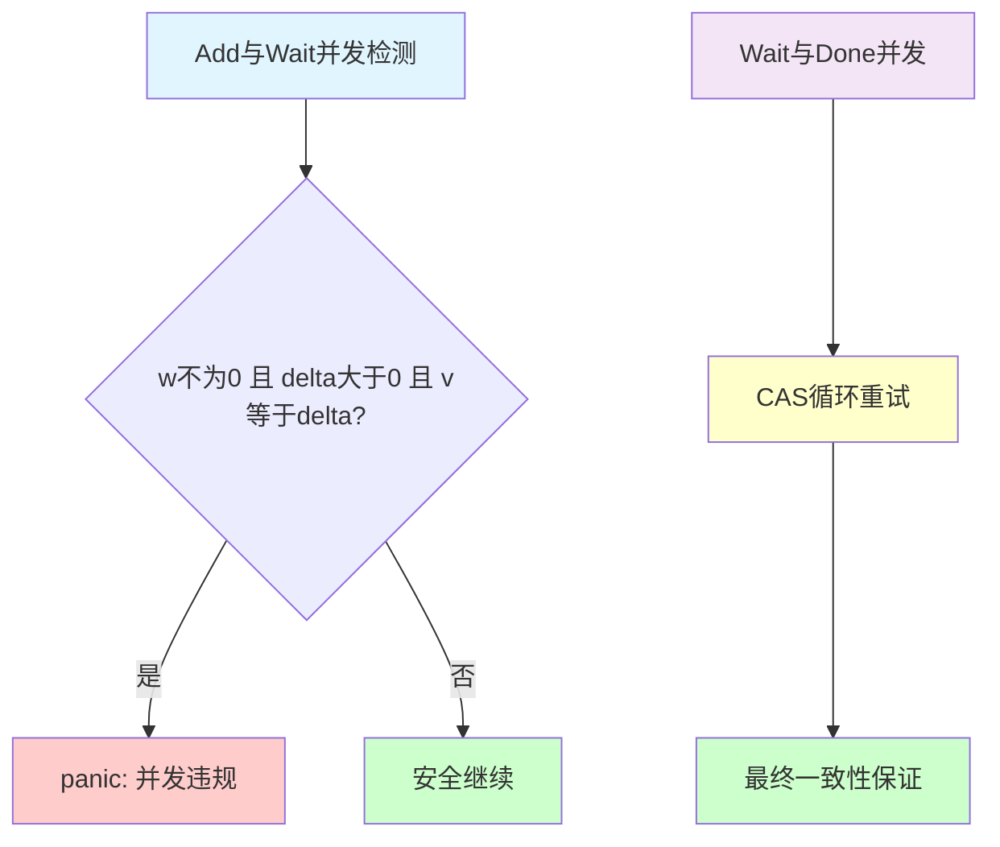

### **7.3 重用检测机制**

```go
func (wg *WaitGroup) Wait() {
    // ...等待被唤醒后...
    if wg.state.Load() != 0 {
        panic("sync: WaitGroup is reused before previous Wait has returned")
    }
}
```

## **8. 使用模式与最佳实践**

### **8.1 标准使用模式**

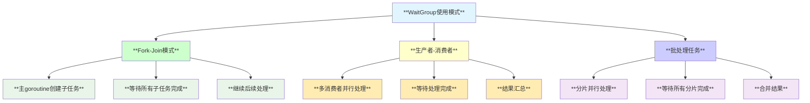

### **8.2 最佳实践原则**

```go
// ✅ 正确的使用方式
wg := sync.WaitGroup{}
for i := 0; i < n; i++ {
    wg.Add(1)
    go func() {
        defer wg.Done()  // 使用defer确保调用
        // 工作代码
    }()
}
wg.Wait()

// ❌ 错误的使用方式
wg := sync.WaitGroup{}
for i := 0; i < n; i++ {
    go func() {
        wg.Add(1)     // 在goroutine内Add
        defer wg.Done()
        // 工作代码  
    }()
}
wg.Wait()  // 可能在Add之前执行
```

## **9. 常见陷阱与错误模式**

### **9.1 典型错误场景**

| **错误类型** | **现象** | **原因** | **解决方案** |
|-------------|---------|---------|-------------|
| **Add/Wait竞态** | **panic** | **Wait前Add未完成** | **主goroutine中完成所有Add** |
| **计数器不匹配** | **永久阻塞** | **Add与Done不对应** | **确保每个Add对应一个Done** |
| **重复使用** | **panic** | **Wait返回前再次使用** | **创建新的WaitGroup实例** |
| **负数计数器** | **panic** | **Done多于Add** | **检查Done调用次数** |

### **9.2 错误检测机制**

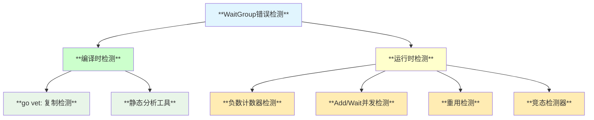

## **10. 性能特性分析**

### **10.1 性能优势**

- **低开销**: 只需要两个原子操作字段
- **可扩展**: 支持任意数量的goroutine
- **高效唤醒**: 批量唤醒所有等待者
- **无锁设计**: 基于原子操作，避免锁竞争

### **10.2 性能边界**

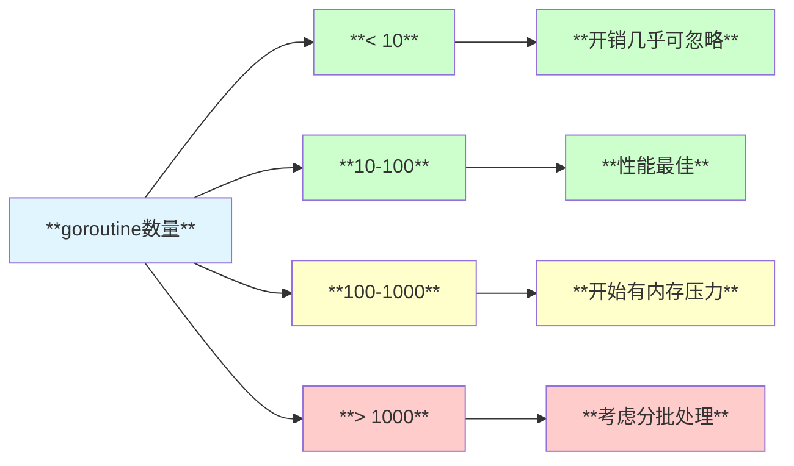

## **11. 高级用法与扩展**

### **11.1 动态任务管理**

```go
// 动态添加任务的模式
type TaskManager struct {
    wg    sync.WaitGroup
    tasks chan func()
}

func (tm *TaskManager) AddTask(task func()) {
    tm.wg.Add(1)
    tm.tasks <- task
}

func (tm *TaskManager) worker() {
    for task := range tm.tasks {
        task()
        tm.wg.Done()
    }
}
```

### **11.2 超时等待模式**

```go
// 带超时的Wait实现
func WaitWithTimeout(wg *sync.WaitGroup, timeout time.Duration) bool {
    done := make(chan struct{})
    go func() {
        wg.Wait()
        close(done)
    }()
    
    select {
    case <-done:
        return true  // 正常完成
    case <-time.After(timeout):
        return false // 超时
    }
}
```

## **12. 内存模型保证**

### **12.1 Happens-Before关系**

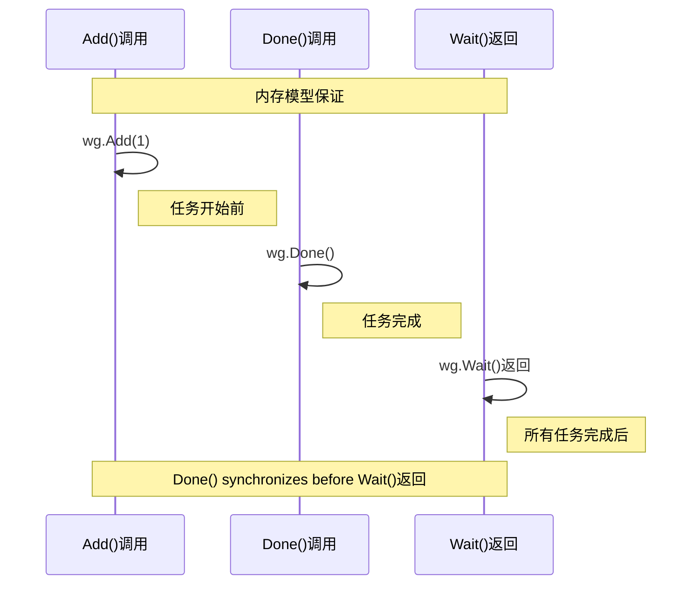

## **13. 局限性分析**

### **13.1 设计限制**

- **一次性使用**: 不能在Wait返回前重用
- **不支持超时**: 没有内置超时机制
- **不支持取消**: 无法中途取消等待
- **计数器限制**: int32范围限制

### **13.2 替代方案对比**

| **场景** | **WaitGroup** | **Channel** | **Context** |
|---------|---------------|-------------|-------------|
| **简单等待** | **✅ 最佳** | **复杂** | **过度设计** |
| **带超时** | **❌ 不支持** | **✅ 支持** | **✅ 最佳** |
| **可取消** | **❌ 不支持** | **✅ 支持** | **✅ 最佳** |
| **结果收集** | **❌ 不支持** | **✅ 最佳** | **❌ 不适合** |

## **14. 总结**

sync.WaitGroup是Go语言中实现fork-join并发模式的经典工具：

- **🚀 简单高效**: 零值可用，API简洁明了
- **🔒 线程安全**: 基于原子操作，支持高并发
- **⚡ 性能优秀**: 低开销，高效的批量唤醒
- **🛡️ 错误检测**: 完善的运行时检查机制
- **📊 内存保证**: 严格的happens-before语义

**适用于需要等待一组goroutine完成的场景，是Go并发编程的基础工具之一。**
